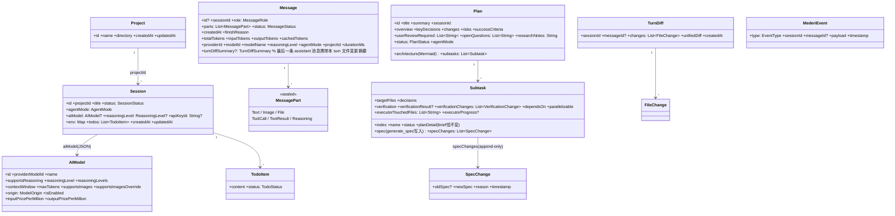
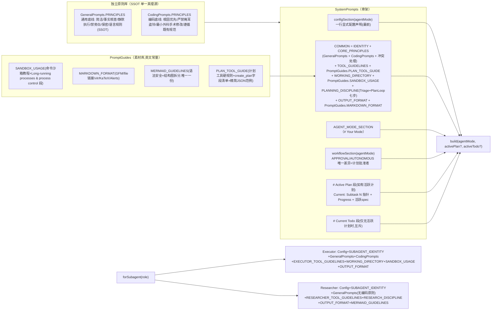
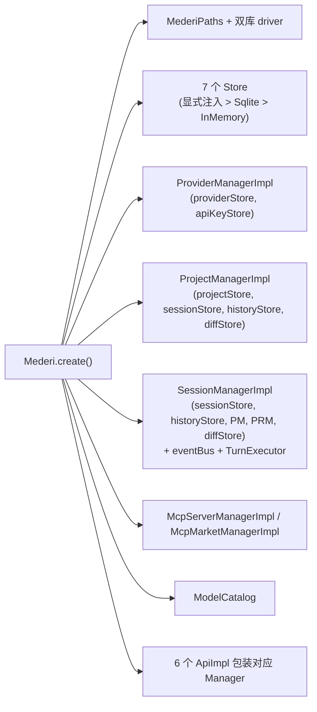

# 01 · core 模块（领域核心，:core，当前仅 JVM 目标）

> 路径约定：`…/` = `core/src/commonMain/kotlin/xyz/mederi/`。
> 注意：`model/`、`koog/` 等目录下文件的 `package` 声明可能是 `xyz.mederi.domain.model`、`xyz.mederi.infrastructure.koog` 等，与目录名不完全一致——以文件内 package 为准。

## 1. DI 装配（`…/Mederi.kt`）

`Mederi` 私有构造，3 个工厂入口：`local(config: String)`、`backend(historyStore, sessionStore, apiKeyStore, providerStore, projectStore)`、`create(block: MederiConfig.() -> Unit)`（前两者最终都调 create）。

**create() 装配顺序**：

1. `MederiConfig().apply(block)` → configDir 展开 `~` → `MederiPaths(dirPath).ensureDirectories()`；`MederiHttpClientFactory.userAgent = config.userAgent`（出站 HTTP 身份头统一注入）。
2. `handleLegacyFiles(paths, config.configMigrationRequester)`——检测 JSON 时代遗留文件（`config/providers/`、`config/projects.json`、`config/mcp-servers.json`、`config/providers.json`、`data/mederi.db(-wal/-shm)`），**必须经用户批准才删**；无审批器只打日志保留。
3. 双库 driver：`createDriver(dbPath)` = `JdbcSqliteDriver`（WAL + foreign_keys），分别对 config.db（`MederiConfigDatabase.Schema.create`）与 data.db（`MederiDataDatabase.Schema.create`）建表（.sq 全部 IF NOT EXISTS）。
4. Store 选择（优先级：**显式注入 > Sqlite > InMemory**）：
   - config.db 侧：`apiKeyStore` / `providerStore` / `projectStore` / `mcpServerStore` / `settingsStore`
   - data.db 侧：`historyStore` / `sessionStore` / `diffStore`
5. `ModelCatalog()`（内存索引，需外部调 `start()`）。
6. Manager 装配：`ProviderManagerImpl(providerStore, apiKeyStore)`；`ProjectManagerImpl(projectStore, sessionStore, historyStore, diffStore)`；`McpServerManagerImpl(mcpServerStore, mcpConnector)`；`McpMarketManagerImpl(OfficialRegistrySource())`；`SkillManagerImpl(settingsStore, defaultSkillsRoot=paths.skillsDir)`（须先于 SessionManager 构造就绪——系统提示词注入依赖它）；`SubagentConfigManager(settingsStore, providerManager)`（见 §3.5）；`SessionManagerImpl(sessionStore, historyStore, projectManager, providerManager, diffStore, mcpConnector, skills=skillManager, subagentConfigManager)`；`McpConnector(mcpServerStore)`（引擎，manager 与 TurnExecutor 共享）。
7. API 装配：`ProviderApiImpl(providerManager, modelCatalog)`、`ModelApiImpl(providerManager)`、`ProjectApiImpl(projectManager)`、`SessionApiImpl(sessionManager)`、`McpServerApiImpl(mcpServerManager)`、`McpMarketApiImpl(mcpMarketManager)`、`SkillApiImpl(skillManager)`、`SubagentConfigApiImpl(subagentConfigManager)`。

`Mederi` 公开成员：`historyStore: HistoryStore?`、`providers: ProviderApi`、`projects: ProjectApi`、`providerManager`、`projectManager`、`sessionManager`、`sessions: SessionApi`、`models: ModelApi`、`mcpMarket: McpMarketApi`、`mcpServers: McpServerApi`、`skills: SkillApi`、`subagentConfigs: SubagentConfigApi`、`modelCatalog: ModelCatalog`。

### config 包

- `MederiConfig`（`…/config/MederiConfig.kt`）：可注入容器。`configDir: String?`、`configMigrationRequester: ConfigMigrationRequester?`、`providerStore/projectStore/historyStore/apiKeyStore/sessionStore/diffStore/mcpServerStore/settingsStore`（全部可空 = 默认推导链生效）、`userAgent: String`（出站 HTTP User-Agent，装配层注入，默认 `Mederi/dev`）。**浏览器设置不经过 MederiConfig**——`Mederi` 门面新增 `settingsStore: SettingsStore` 构造字段，Camoufox 设置经 `BrowserSettingsManager` 持久化（key `browser.camoufox.settings`，见 §7.3）；浏览器选择走全局 `BrowserRegistry`。
- `MederiPaths`（`…/config/MederiPaths.kt`）：`root: File`、`dataDir = root/data`、`configDatabaseFile = root/config.db`、`dataDatabaseFile = dataDir/data.db`、`ensureDirectories()`。
- `ConfigMigrationRequester`（接口，`…/config/ConfigMigrationRequester.kt`）：`suspend fun requestDeletion(legacyFiles: List<String>): Boolean`。
- 根目录杂项：`GreetingUtil.kt`（`…/GreetingUtil.kt`）：`sayHello(to): String` 问候示例工具（无任何业务依赖）。

## 2. 领域模型（`…/model/`，package 实为 `xyz.mederi.domain.model`）

### 2.1 类图（模型关系）



### 2.2 枚举一览

| 枚举 | 值 | 语义 |
|---|---|---|
| `SessionStatus` | `IDLE, RUNNING, ERROR` | 会话运行状态 |
| `MessageRole` | `SYSTEM, USER, ASSISTANT, SUMMARY` | SUMMARY=压缩标记消息（UI 可见，prompt 压缩节点） |
| `MessageStatus` | `PROCESSING, COMPLETED, ERROR` | 消息状态 |
| `AgentMode` | `APPROVAL, AUTONOMOUS` | 工具集完全一致，唯一区别=计划批准者 |
| `SubagentRole` | `EXECUTOR, RESEARCHER, BROWSER_OPERATOR, BROWSER_BRAIN` | EXECUTOR=全工具（无 plan/spawn/verify/ask_user/todo）；RESEARCHER=只读 read_file/list_directory；**BROWSER_OPERATOR/BROWSER_BRAIN=浏览器操作配置专属角色（2026-09-23）**：仅用于设置页为其配独立模型/推理档（AgentConfigCard 图标 Globe），BrowserTaskManager 后台派发时按角色解析（operator/brain 各建 llmCaller）；实际执行走 BrowserTaskManager 后台，不经 turn 子代理路径（SystemPrompts.forSubagent/SubagentRunnerImpl 对这两角色抛 IllegalStateException） |
| `AgentCapabilities` | `MAIN, EXECUTOR, RESEARCHER, BROWSER`（每值含 `inheritMcp` / `inheritSkills`） | **中心化继承策略唯一表**：MAIN(true,true) / EXECUTOR(true,true) / RESEARCHER(true,false) / **BROWSER(true,true)**（2026-09-23：浏览器操作角色，of() 映射 BROWSER_OPERATOR/BROWSER_BRAIN，实际不经 turn 执行）。`of(subagentRole?)` 映射；TurnExecutor 开 MCP 会话与注入 skills 提示词都只读此表。**新增子代理=SubagentRole 加值 + 本表加一行 + of 加一个分支** |
| `ModelOrigin` | `FETCHED, MANUAL` | FETCHED=端点/目录权威（唯一写路径 ModelMerge）；MANUAL=用户权威 |
| `TodoStatus` | `PENDING, IN_PROGRESS, COMPLETED, CANCELLED, FAILED`（wire 小写；FAILED 预留给 Plan 验证结果语义——verify_subtask 产生于 `Subtask.status`，不投影进 todos） | |
| `PlanStatus` | `PENDING_APPROVAL, APPROVED, IN_PROGRESS, COMPLETED, VOIDED` | VOIDED = 作废（voidActivePlans，双文件移入 plans-voided/）；终态 = COMPLETED 或 VOIDED |
| `SubtaskStatus` | `PENDING, IN_PROGRESS, COMPLETED, FAILED` | |
| `VerifyStatus` | `PASS, PARTIAL, FAIL` | |
| `RootCause` | `IMPLEMENTATION, PLAN` | verify 根因轴（2026-09-24，替代旧现象轴）：IMPLEMENTATION = spec 说得清楚、执行没做到 → `converge_plan` 追加补救子任务；PLAN = 实现照 spec 做到、计划本身（逻辑/验证方法/预期）站不住 → append-only 修订（`update_verification` 改验证契约 / `generate_spec` reason= 改 spec）。判定顺序硬性：先核实现、实现无误再核计划 |
| `ProjectContextType` | `GREENFIELD, BROWNFIELD` | |
| `FileChangeStatus` | `ADDED, MODIFIED, DELETED` | diff 用 |
| `ProviderType` | `OPENAI_CHAT, OPENAI_RESPONSES, GOOGLE` | |
| `ReasoningLevel` | `NONE, MINIMAL, LOW, MEDIUM, HIGH, XHIGH, MAX` | |

### 2.3 关键 data class 字段（穷尽）

- **`MessagePart`（sealed，`…/model/Message.kt`）**：
  - `Text(text)`；`Image(url, mimeType?)`；`File(path)`
  - `ToolCall(id?, tool, args)`；`ToolResult(id?, tool, output, isError=false, status?, durationMs?, error?)`
  - `Reasoning(content: List<String>, summary?, encrypted?, id?)`
  - `const val UI_HIDDEN_MARKER = "<<<NOT_FOR_UI>>>"`（消息文本中该标记后 UI 不渲染、AI 可见——系统环境注入块）
- **`Message`**：见类图。诊断字段 totalTokens/inputTokens/outputTokens/cachedTokens/durationMs 等写入时抽取进 message_history 列。`turnDiffSummary: TurnDiffSummary?`（`…/tools/diff/TurnDiff.kt`：`files: List<FileDiffSummary>` + totalAdditions/totalDeletions）——一个 turn 的**最后一条 assistant 消息**携带本 turn 的文件变更摘要（runTurn 收尾经 historyStore.replace 回写该消息，其余消息为 null；MESSAGE_COMPLETED payload 同步带出，见 §11）。
- **`Provider`（`…/provider/domain/model/Provider.kt`）**：`id, name, type: ProviderType, baseUrl, reasoningParameter: ReasoningParameter?, models: List<AIModel>, responseSanitization: Boolean=false, modelsDevKey: String?, @Transient apiKeys: List<ProviderApiKey>`（apiKeys 读时合并、写时剥离）；派生 `defaultApiKey`、`supportsReasoning`。
- **`ProviderApiKey`**：`id, name, @Contextual maskedValue, isDefault`；companion `mask()`（前3+"..."+后4，≤7 返回 "***"）。
- **`ReasoningParameter`**：`levels: Map<ReasoningLevel, String?>, parameterName: String="", customRequestBody: Map<String,String>`。核心思想：**不对供应商参数做语义解释**，每档对应用户编写的请求体 JSON 片段，发送时根级合并。方法 `resolve(level)` / `supportsLevel` / `availableLevels` / `validate()`；companion `forOpenAIChat()/forOpenAIResponses()/forGoogle()/forType(type)`。
- **`RemoteModelInfo`（`…/provider/domain/model/RemoteModelInfo.kt`）**：`providerModelId, name, contextWindow?, maxTokens?, supportsReasoning?, inputPricePerMillion?, outputPricePerMillion?, supportsImages?, reasoningLevels`（不落库的远端中间结构，可空=远端未提供）。
- **`TodoItem`（`…/model/Todo.kt`）**：`content, status`；扩展 `List<TodoItem>.encodeTodos(): String` / `decodeTodos(raw): List<TodoItem>?`（唯一 Json 配置，失败安全降级 null）。
- **`FileDiff`（`…/model/FileDiff.kt`）**：`filePath, before, after, additions, deletions`（UI DTO）。
- **`MederiEvent`（`…/model/MederiEvent.kt`）**：`type: EventType, sessionId, messageId?, payload: Map<String,String>, timestamp`。

## 3. Manager 层（唯一真理源）

### 3.1 SessionManager（`…/session/SessionManager.kt` / `SessionManagerImpl.kt`）

```kotlin
suspend fun list(): List<Session>
suspend fun listByProject(projectId: String): List<Session>
suspend fun get(id: String): Session?
suspend fun require(id: String): Session
suspend fun create(agentConfig: AgentConfig, projectId: String, title: String, env: Map<String,String>): Session
suspend fun rename(id: String, title: String): Session
suspend fun delete(id: String)          // turnExecutor.abortAndJoin → 级联删 session/history/diff
suspend fun abort(id: String)
% turnExecutor.abort：cancel turn job → stopAllForSession 级联收割本会话 RUNNING 子代理 → 取消
% question/planApproval requesters → 异步写 IDLE + MESSAGE_ERROR(用户中止)；无活跃 turn 整体 no-op
suspend fun abortAndJoin(id: String)    // turnExecutor.abortAndJoin：cancel+join + stopAllForSession + 对残留 RUNNING 兜底复位 IDLE（cleanupStaleRunningSessions 启动清理用）
suspend fun sendMessage(id: String, request: SendMessageRequest)
suspend fun steerMessage(id: String, request: SendMessageRequest)   // Steering（turn 运行时插话引导，见 §6.2）：
% RUNNING → 排队 pendingSteerings 等工具边界注入 + STATUS(steering_queued)；非 RUNNING → 降级走 sendMessage
suspend fun rollbackToMessage(id: String, messageId: String)   // abortAndJoin 后 historyStore.replace(截断)
suspend fun resolveQuestion(id: String, questionId: String, answers: List<List<String>>)
suspend fun resolvePlanApproval(id: String, planId: String, approved: Boolean, aiModel: AIModel? = null, reasoningLevel: ReasoningLevel? = null)
% 批准 + aiModel 非 null 时先 updateAgentConfig 写 session（"最后一次选择"语义）再 resolve requester——
% create_plan 挂起等批准期间用户切模型，同 turn 后续 spawn 动态读到新模型；拒绝/null 不写
% 跨 turn 批准路径（requester 已随旧 turn 消亡/进程重启，见 §6.2）：批准且计划仍 PENDING_APPROVAL 非终态时
% 落盘 APPROVED + PLAN_APPROVAL_RESOLVED + 一条 UI 隐藏内部消息（UI_HIDDEN_MARKER 开头）启动新 turn，
% AI 读到 Active Plan=APPROVED 自行走执行链；拒绝 → 直接 false，计划保持 PENDING_APPROVAL
fun getSubagentReport(agentId: String): SubagentReportData?   // 子代理汇报直读（优先落盘文件，供 Server/UI）
suspend fun compressHistory(id: String)
suspend fun contextUsedTokens(id: String): Int   // 当前上下文占用唯一入口 = aiViewContextUsedTokens(historyStore, id, session.aiModel?.supportsImages ?: true)
% UI 概览 / getSnapshot / listMessagesPage / GetContextRemainingTool 取「当前上下文占用」统一走这里；SessionApi 同名方法转发（SessionApiImpl → sessionManager.contextUsedTokens）
suspend fun listMessages(id: String): List<Message>
suspend fun getMessage(id: String, messageId: String): Message
suspend fun listRawMessages(id: String): List<RawMessageRecord>  // payload 原文直读，调试用
suspend fun getFileDiffs(id: String, messageId: String? = null): List<FileDiff>
fun events(sessionId: String): Flow<MederiEvent>
fun events(): Flow<MederiEvent>          // 全局事件总线（MutableSharedFlow replay=0, buffer=256, DROP_OLDEST）
```

Impl 构造参数 = `(sessionStore, historyStore, projectManager, providerManager, diffStore?, eventBus?, mcpConnector?, skills?, subagentConfigManager?)`，内部据此创建 `TurnExecutor`（完整 ctor：`..., diffStore?, mcpConnector?, skills?, scope, onFileTouched?, onTurnDiff?, subagentConfigManager?`——`onFileTouched`/`onTurnDiff` 两个回调主路径不挂、由 `SubagentRunnerImpl` 派子代理 turn 时挂上以收集子代理文件改动并合并进父 turn）。`create` 生成 `sess_xxxxxxxx` 并发 SESSION_CREATED。

### 3.2 ProjectManager（`…/project/`）

```kotlin
suspend fun list(): List<Project>
suspend fun get(id: String): Project?;  suspend fun require(id: String): Project
suspend fun create(name: String, directory: String): Project   // ensureMederiDir 建 .mederi/{plans,plans-done,notebook.md}
suspend fun delete(id: String)          // 级联删 Session+History+Diff
suspend fun rename(id, name): Project
```

**项目目录模型（单目录）**：项目恰好绑定一个目录 `directory`（绝对路径，非空），承载 `.mederi/`、shell cwd、相对路径解析。引擎内部工具/沙箱仍以 `List<String>`（containment 白名单）接收，调用侧统一 `listOf(project.directory)`。
**旧数据迁移**：`SqliteProjectStore` 读取旧版 `directories: List<String>` payload 时取第一个目录迁移为单目录（内存态生效，下次保存回写新形状）。

### 3.3 ProviderManager（`…/provider/`）

Provider 组：`list()`（读时合并 keys）/ `listWithoutKeys()` / `get/require` / `create(name,type,baseUrl,reasoningParameter?,responseSanitization,modelsDevKey?)` / `update` / `delete`（级联删 keys）。
Key 组：`listKeys` / `addKey(providerId,name,value,isDefault)` / `deleteKey` / `setDefaultKey` / `getDefaultKeyValue(providerId): String?`（明文）/ `getKeyValue(providerId, keyId): String?`（按 id 取明文，keyId 不属于该 provider 返回 null，key 选择器/选定项取值用）。
Model 组：

```kotlin
suspend fun listModels(providerId): List<AIModel>
suspend fun addModel(providerId, ..., ): AIModel          // MANUAL 模型，用户权威
suspend fun addFetchedModel(providerId, merged: AIModel, isEnabled): AIModel  // FETCHED 落库通道
suspend fun applyRemoteMetadata(providerId, modelId, endpoint: RemoteModelInfo?, catalog: ModelMetadata?): AIModel
        // FETCHED 元数据唯一写路径；endpoint!=null=refresh 全量权威，==null=目录回填只补空
suspend fun updateUserModel(providerId, modelId, ...全可空): AIModel
        // FETCHED 模型只许改 isEnabled/图片覆盖，传其他字段抛错
suspend fun deleteModel(providerId, modelId)
suspend fun getModel(modelId): AIModel?;  suspend fun listAllModels(): List<AIModel>   // 跨供应商
suspend fun fetchRemoteModels(providerId): List<RemoteModelInfo>  // OPENAI_* Bearer / GOOGLE x-goog-api-key，Google 分页 pageSize=1000
suspend fun fetchRemoteModelIds(providerId): List<String>
```

Impl 规则：写前 `validateReasoningParameter`（`{` 开头必须是合法 JSON 对象）；HTTP 解析抽在 `RemoteModelParsing.kt`（`parseOpenAIModelsResponse` 带 vLLM 别名 / `parseGoogleModelsResponse` 分页）。

### 3.4 SkillManager（`…/skills/SkillManager.kt` / `SkillManagerImpl.kt`）

Skill 管理（UI 薄触发，文件操作全在 core）。**发现/解析兼容层（2026-09）**：Koog `discoverSkills` 的 frontmatter 解析是简化行解析，不支持 YAML 块标量（`description: >` 解析成字面 ">"）与空值+缩进块（整个 skill 被忽略）——Mederi 侧自研超集解析器兼容，不改 Koog、不改第三方 skill：

- `SkillFrontmatterParser`（`…/skills/SkillFrontmatterParser.kt`，纯 Kotlin）：状态机解析 `---` frontmatter，支持块标量 `>`/`|` 及 chomping（`>-`/`|+`）、空值+缩进块、引号、`metadata:` 子键、注释/空行；输出 `ParsedFrontmatter(name, description, license, compatibility, metadata, allowedTools, isValid)`
- `SkillDiscovery`（`…/skills/SkillDiscovery.kt`）：BFS 扫描根目录找 SKILL.md（maxDepth=4、maxDirectories=2000、跳过 `.git`/`node_modules`、按 name LAST_FOUND 去重），`SkillFrontmatterParser.parse` 解析，仅 name+description 非空产出 `SkillInfo`
- `SkillManagerImpl.list()`：`SkillDiscovery.discover(root)` 为主 + Koog `discoverSkills` union 兜底（`linkedMapOf` + `putIfAbsent`，Mederi 优先覆盖同名字段、保持发现顺序）
- `SkillManagerImpl.install()`：zip 解压后同样用 `SkillDiscovery.discover(tempDir)` 验证内容

```kotlin
suspend fun list(): List<SkillInfo>                    // SkillDiscovery 扫根目录 SKILL.md + Koog discoverSkills union 兜底（发现即安装）
suspend fun getRootDirectory(): String                 // settings 表 key=`skills.root`，默认 paths.skillsDir（~/.mederi/skills）
suspend fun setRootDirectory(path: String)             // 展开 ~ + mkdirs + 持久化
suspend fun install(url: String): SkillInfo            // Ktor 下载 zip → ZipInputStream 解压到临时目录 → SkillDiscovery 验证 → 移入根目录（同名先删再装）
suspend fun uninstall(name: String)                    // 删除根目录下对应目录（名称需匹配 ^[a-zA-Z0-9_-]+$）
```

`SkillInfo`（`…/skills/domain/SkillInfo.kt`）：`name, description, location, license?, compatibility?, allowedTools?`——与 Koog `ai.koog.skills.model.Skill` 同构（SkillFrontmatterParser 解析 SKILL.md frontmatter 产出）。zip slip 防护：解压路径必须落在临时目录内。已存在同名 skill → 先删再装（install 幂等）。

**统一异常（`…/api/exception/MederiException.kt`）**：抽象基类 `MederiException`，子类 `MederiNotFoundException / MederiValidationException / MederiStateException / MederiInternalException`；`mederiCall(block)` 映射 `NoSuchElementException→NotFound`、`IllegalArgumentException→Validation`、`IllegalStateException→State`、其他→Internal。

| API | 方法（Impl 全部薄转调 + mederiCall） | 特别逻辑 |
|---|---|---|
| `SessionApi` | list / create(CreateSessionRequest) / get / rename / delete / abort / abortAndJoin / sendMessage(SendMessageRequest) / steerMessage(SendMessageRequest) / getSubagentReport(agentId)(→SubagentReportData?) / stopSubagent(agentId) / rollbackToMessage / resolveQuestion / resolvePlanApproval / compressHistory / listMessages / getMessage / listRawMessages(→RawMessageDto) / getFileDiffs / events | RawMessageRecord→Dto 转换 |
| `ProjectApi` | list / create / get / delete / rename / addDirectory / removeDirectory | |
| `ProviderApi` | list / create / get / update / delete / addKey / listKeys / deleteKey / setDefaultKey / listModels / addModel / updateModel / deleteModel / **refreshModels** / **autoSetupModels** | refresh 只新增远端新模型（DEFAULT_VISIBLE_MODEL_LIMIT=10 补足启用）不碰存量元数据；autoSetupModels=目录元数据进存量 FETCHED 模型唯一通道；type 字符串解析失败抛 Validation |
| `ModelApi` | list / get（跨供应商聚合） | |
| `McpServerApi` | install(mcpServersJson) / list / getJson / update / setEnabled / delete / **discover(name)** / verify / **verifyAll** / verifyConfig | 无 DTO 转换；list 返回带缓存 status 的 McpServerInfo |
| `McpMarketApi` | search(query,cursor,pageSize) / detail(id) / installOptions(detail) / installConfig(detail,...) / installConfig(id,...) | |
| `SkillApi` | list / getRootDirectory / setRootDirectory(path) / install(url) / uninstall(name) | UI 薄触发；下载/解压/删除全在 core（`SkillManagerImpl`） |
| `SubagentConfigApi` | list / get(role) → SubagentRoleConfigDto / update(role, UpdateSubagentConfigRequest{modelId?, reasoningLevel?}) / getGlobalSettings() → SubagentGlobalSettingsDto{maxConcurrentAgents} / updateGlobalSettings(UpdateSubagentGlobalSettingsRequest{maxConcurrentAgents}) | 子代理角色独立模型/推理档配置与全局设置（设置页 Agents 面板）；`SubagentRoleConfigDto{role, displayName, description, modelId?, modelName?, reasoningLevel?, isInheriting}`（解析后的模型名供 UI 展示）；`UpdateSubagentConfigRequest` 两字段均 null = 恢复继承；`SubagentGlobalSettingsDto` 与 `UpdateSubagentGlobalSettingsRequest` 携带单会话并发上限（>= 1）；`SubagentConfigManager`（`…/tools/subagent/SubagentConfigManager.kt`，见 §3.5）读 SettingsStore（key=`subagent.config.<role>`、`subagent.maxConcurrent`）+ ProviderManager 解析模型 |

SessionApi 同文件 DTO：`AgentConfig(agentMode, aiModel=null, reasoningLevel=null)`、`CreateSessionRequest(agentConfig, projectId, title="", env)`、`RenameSessionRequest(title)`、`SendMessageRequest(agentConfig, parts: List<MessagePart>, apiKeyId: String?=null)`——`apiKeyId` 为本次消息携带的选定 key ID（null=未指定）；user/steer/rollback 轮显式携带并写入 `ApiKeyResolver` 进程级记忆，内部消息轮（计划批准执行/事件唤醒续轮）经 `apiKeyResolver.currentKeyId(providerId)` 从记忆取回；统一由 `ApiKeyResolver.resolve(providerId, apiKeyId)` 解析（显式归属通过→记忆→默认 key），消费端拿 `ResolvedApiKey.value`（详见本节 ApiKeyResolver 段）；`RawMessageRecord(seq, messageId?, role, payload, createdAt, modelId?, durationMs?, finishReason?, status?)`、`MessageSummary(seq, messageId?, role, content, createdAt)`（HistoryStore.kt 内）。

### 3.5 SubagentConfigManager（`…/tools/subagent/SubagentConfigManager.kt` / `…/model/SubagentModelConfig.kt`）

**`SubagentModelConfig`**（`…/model/SubagentModelConfig.kt`，package 实为 `xyz.mederi.domain.model`）：`modelId: String?`（null=继承父会话模型）、`reasoningLevel: ReasoningLevel?`（null=继承父档位）、派生值 `isInheriting`（两者均 null）。

**`SubagentConfigManager(settingsStore, providerManager)`**：
- `get(role)` / `list()`（全角色 map；未配置或解析失败 = 默认配置即完全继承）
- `set(role, config)`（`isInheriting` 时**删除** settings key——配置零残留；否则写序列化 JSON）/ `clear(role)`（恢复继承）
- `resolve(role, fallbackModel, fallbackReasoning): (AIModel, ReasoningLevel)`——解析优先级：配置 modelId 且 ProviderManager 中能查到（模型被删自动回落 fallbackModel）> fallback；配置 reasoningLevel > fallbackReasoning。运行时以 ProviderManager 为唯一真理源。
- `getMaxConcurrentSubagents(): Int` / `setMaxConcurrentSubagents(count: Int)`（要求 >= 1；未配置或值非法时返回默认值 2，见下述并发门禁）
- 常量 `KEY_PREFIX = "subagent.config."`、`KEY_MAX_CONCURRENT = "subagent.maxConcurrent"`、`DEFAULT_MAX_CONCURRENT = 2`（settings 表 keys，见 §5）

**SubagentManager 并发门禁（2026-09 代码级硬限制）**：
- 构造参数注入 `maxConcurrentProvider: (suspend () -> Int)?`（TurnExecutor 装配时闭包读 `SubagentConfigManager.getMaxConcurrentSubagents()`，改配置即时生效）；
- `spawn()` 入口处通过 `spawnLock` 互斥原子检查：统计同父会话当前 `status == RUNNING` 的子代理数。达上限时抛出 `SubagentLimitReachedException(running, limit)`；
- `SpawnAgentTool` 与 `SpawnResearcherTool` 捕获该异常，直接将 `modelGuidance` 作为工具 Error 返回给模型（指导模型停止派发并结束 turn，等后台运行完成自动唤醒后再派发剩余任务）；
- **与子代理类型无关**（EXECUTOR 与 RESEARCHER 共享同一限额池）；
- **浏览器任务排除在外**：浏览器任务由 `BrowserTaskManager` 驱动，天然不走 `SubagentManager`；`SubagentRole.BROWSER_OPERATOR` / `BROWSER_BRAIN` 即使经 `spawn()` 也显式豁免不设限。

消费方：`SpawnAgentTool`/`SpawnResearcherTool` 的 spawn 模型解析（独立配置优先于父会话现值，未配置=继承）、`BrowserTaskManager` 按 BROWSER_OPERATOR/BROWSER_BRAIN 解析浏览器双角色模型（§7.3）。

## 5. Store 层（`…/store/`）

| Store 接口 | 方法 | Sqlite 实现 → 表（库） |
|---|---|---|
| `SessionStore` | list / get / insert / update(id, status?, title?) / updateAgentConfig(id, agentMode?, aiModel?, reasoningLevel?, apiKeyId?) / updateTodos / delete | `SqliteSessionStore` → **sessions**（data.db） |
| `HistoryStore` | load(sessionId) / append / replace(sessionId, messages) / delete(sessionId) / rollbackTo(sessionId, seq) / listSummary / listRaw | `SqliteHistoryStore` → **message_history**（data.db） |
| `ProjectStore` | list / get / save(upsert) / delete | `SqliteProjectStore` → **projects**（config.db） |
| `ProviderStore` | list（不含 keys）/ get / save / delete | `SqliteProviderStore` → **providers**（config.db） |
| `ApiKeyStore` | listByProvider（脱敏）/ add / delete / setDefault / getDefaultValue（明文）/ getValue(providerId,keyId)（按 id 取明文，归属校验） | `SqliteApiKeyStore` → **api_keys**（config.db） |
| `DiffStore` | save(TurnDiff) / list(sessionId) / get(sessionId, messageId?)(null=最近) / delete | `SqliteDiffStore` → **diffs**（data.db） |
| `McpServersStore` | list / get(name) / save / saveAll（单次写盘）/ delete(name) | `SqliteMcpServersStore` → **mcp_servers**（config.db） |
| `SettingsStore` | get(key) / set(key,value) / delete(key) | `SqliteSettingsStore` → **settings**（config.db）；通用 key-value（当前 keys：`skills.root`、`subagent.config.<role>`、`subagent.maxConcurrent`） |

每接口都有 `InMemory*Store` 实现（测试/兜底）。统一模式：**payload 列存领域对象完整 JSON（存储即真相），常用查询字段提升独立列**。

### 数据库表结构（`core/src/commonMain/sqldelight/`）

**config.db**（`config/xyz/mederi/db/config/ConfigDatabase.sq`）：

```sql
providers(id PK, name, type, payload)                       -- Provider 聚合根整行 JSON，apiKeys @Transient 不入 payload
api_keys(id PK, provider_id IDX, name, key_value, is_default, created_at)
projects(id PK, name, payload, created_at)                  -- 按 created_at DESC, name ASC 排序（最新项目在最前）
mcp_servers(name PK, enabled, payload)                      -- McpServerConfig 整行 JSON
settings(key PK, value)                                     -- 通用 key-value（skills.root 等零散配置项）
```

**data.db**（`data/xyz/mederi/db/data/DataDatabase.sq`）：

```sql
sessions(id PK, project_id IDX, title, status DEFAULT 'IDLE',
         agent_mode DEFAULT 'AUTONOMOUS',
         ai_model(JSON), reasoning_level, api_key_id, env DEFAULT '{}', todos DEFAULT '[]',
         created_at, updated_at)                            -- 按 updated_at DESC 排序；api_key_id 由 Mederi.kt 幂等 ALTER 给存量库补列
message_history(session_id+seq 复合PK, message_id, role, content,
         payload(消息 JSON 真相), created_at,
         model_id, duration_ms, finish_reason, status)      -- 诊断列直查；按 seq ASC
diffs(id AUTOINCREMENT PK, session_id IDX, message_id IDX, changes_json, unified_diff, created_at)
```

## 6. Koog 执行引擎（`…/koog/`，package 实为 `xyz.mederi.infrastructure.koog`）

### 6.1 类图

```mermaid
classDiagram
    class SessionManagerImpl {
        -eventBus: MutableSharedFlow~MederiEvent~
        -turnExecutor: TurnExecutor
        +sendMessage(id, request)
        +resolveQuestion(id, qid, answers)
        +resolvePlanApproval(id, planId, approved)
        +compressHistory(id)
        +contextUsedTokens(id) Int   % 当前上下文占用唯一入口(aiViewContextUsedTokens,与压缩判定同源)
        +events() Flow
    }
    class TurnExecutor {
        -activeJobs: ConcurrentHashMap
        -questionRequesters / planApprovalRequesters
        -subagentRunner: SubagentRunnerImpl
        -subagentManager: SubagentManager   % 异步子代理生命周期管理（spawn 返回 agentId 不阻塞）
        -apiKeyResolver: ApiKeyResolver     % API Key 统一真理源解析器（进程级共享记忆）
        -browserTaskManager: BrowserTaskService?  % 浏览器任务管理（持有 BrowserRegistry）
        -onTurnDiff: ((TurnDiff) -> Unit)?  % turn 结束 diff 回调（子代理用此把改动合并进父 turn）
        -pendingEventMessages / pendingSteerings  % 子代理终态 <event_message> 队列 / Steering 插话队列（按会话）
        +sendMessage(sessionId, request, subagentRole?)
        +steerMessage(sessionId, request) +pollSteering(sessionId) SteeringItem?  % Steering 工具边界注入（见 §6.2）
        +getSubagentReport(agentId) SubagentReportData?
        -sendMessageInternal()   % durable-first: 用户消息先落库
        -runTurn()               % preflight 压缩 → ToolFactory → buildTurnAgent → agent.run
        -buildTurnAgent()        % KoogClientFactory/ModelBuilder/ParamsBuilder + Strategy + ChatMemory
        -buildUserMessage()      % 注入 <<<NOT_FOR_UI>>> 环境块
        -launchStreamConsumer()  % StreamFrame → MESSAGE_DELTA
        -preflightCompressionIfNeeded()  % >70% 窗口先压缩
        +abort(id) +abortAndJoin(id)
        +resolveQuestion(...) +resolvePlanApproval(...)
        +compressHistory(id) -compressOnce()
        -retryWrapped(client)
    }
    class HistoryStoreChatHistoryProvider {
        +ctor(historyStore, diagnostics, toolTimings, includeImages=true)
        % includeImages=false = AI 视图剔除用户图片（按模型图片能力过滤）
        +load(conversationId) List~KoogMessage~    % aiViewWindow 窗口 → toKoogMessages(window, includeImages)
        +store(conversationId, messages)           % 按 id 过滤回显 → 指纹 reconcile + SUMMARY 插入
        {static} +aiViewWindow(historyStore, sessionId)
        {static} +insertMarker(historyStore, sessionId, note)
        {static} TLDR_PREFIX = "TLDR:"
    }
    class KoogMessageMapper {
        <<object>>
        +toKoogMessages/toKoogMessage(Mederi→Koog, includeImages=true)
        % includeImages=false 剔除用户 Image part（AI 视图层按模型图片能力过滤，历史存储不受影响）
        +fromKoogMessage/fromKoogUserMessage(Koog→Mederi)
        +createUserMessage(parts)
    }
    class MederiAgentStrategies {
        {static} MEDERI_INPUT_PERSISTED 哨兵输入
        +mederiSingleRunStrategy(persister?)
        +mederiSingleRunStrategyWithCompression(config, persister?)
        +compressOnlyStrategy(strategy)
    }
    class MederiCompressionStrategy(contextWindow, keepLastMessages?) {
        +compress(llmSession, memoryMessages)
        % token 预算驱动：保留段<=窗口×0.3、旧消息按窗口×0.5 分批压缩、单条超窗口×0.9 最旧优先 head-trim、多批合并单条 TLDR
        % keepLastMessages 非 null = 手动模式（recent = 最后 K 条，其余全压）；null = 自动模式（预算切分）
    }
    class CompressionPlanner {
        +planCompression(messages, contextWindow, keepLastMessages?) CompressionPlan
        +compactionSkipReason(messages, contextWindow) String?
        +manualCompactionSkipReason(messages, contextWindow) String?
        +combineBatchSummaries(summaries) String
        % 常量 COMPRESS_BATCH_BUDGET_RATIO=0.5 / RECENT_KEEP_BUDGET_RATIO=0.3 / COMPRESS_HARD_CAP_RATIO=0.9 / MIN_COMPRESSIBLE_TOKENS=16_000 / MANUAL_KEEP_LAST_MESSAGES=3
    }
    class TurnIncrementalPersister {
        +persistAssistant(response)   % turn 内增量落库防崩丢；带 MessageDiagnostics(withDiagnostics)
        +persistToolResults(results)  % + withAssistantDuration（durationMs = API 有回应→落库，footer 耗时）
    }
    class SubagentRunnerImpl {
        +run(task, briefing, plan?, role, directories, aiModel, reasoningLevel, projectId, parentSessionId, apiKeyId?, planId?, executorSubtaskIndex?, planStore?) String
        % 内存 InMemory store + 独立 TurnExecutor，等终态事件取最后 ASSISTANT
        % 注入 mcpConnector + skills（父 TurnExecutor 透传）；继承开关=AgentCapabilities 表
        % 子代理 TurnExecutor 构造时设 onTurnDiff 回调：结束时把 TurnDiff 经 ParentDiffRegistry.mergeInto 合并进父 turn 的 diffTracker
        % executorPlanId/subtaskIndex 非 null 时把 touched files flush 到 Subtask.executorTouchedFiles
        % 传入 scope=继承调用方协程上下文（CoroutineScope(coroutineContext + SupervisorJob())）——
        % 外部取消能级联取消内部 turn；CancellationException 重新抛出不吞
    }
    class SubagentManager {
        +spawn(...) String agentId   % 后台协程跑 SubagentRunner.run，立即返回 agentId
        +status(agentId) String      % RUNNING/COMPLETED/ERROR/STOPPED/NOT_FOUND + modelName/reasoningLevel 元数据
        +stop(agentId) String        % cancel job + 部分结果
        +getReport(agentId) SubagentReportData?  % 汇报直读（已落盘读文件，未落盘回内存完整 result；NOT_FOUND 经 retired 恢复记录）
        +stopAllForSession(parentSessionId) Int  % abort/abortAndJoin 级联收割本会话 RUNNING 子代理（幂等，返回取消数）
        +runningCountForSession(parentSessionId) Int  % 查询父会话 RUNNING 子代理数（纯读；STATUS 拦截/SPAWN runningCount/事件冲刷延后共用）
        % agents: ConcurrentHashMap<agentId, BackgroundAgent>；全状态收敛在此表
        % BackgroundAgent 记录 parentSessionId/aiModel/reasoningLevel/task/briefing（元数据）
        % eventBus 可选注入：spawn 发 SUBAGENT_STARTED（全量元数据），终态发 COMPLETED/ERROR/STOPPED
        % （NonCancellable 包裹 emit——STOPPED 处于取消路径，裸 emit 会被吞）；sessionId=父会话
    }
    class SubagentAsyncTools {
        % agent_status / stop_agent 两个工具，仅主代理可调（wait_agent 已删 2026-09-25）
    }
    class RetryableLLMClient {
        +execute/executeStreaming/executeMultipleChoices
        % 只重试临时故障；首帧后不重试；CancellationException 永不
        {static} +isTransientError(e)
    }
    TurnExecutor --> HistoryStoreChatHistoryProvider : ChatMemory 桥
    TurnExecutor --> MederiAgentStrategies : graphStrategy
    TurnExecutor --> TurnIncrementalPersister
    TurnExecutor --> SubagentRunnerImpl
    TurnExecutor --> SubagentManager
    SubagentManager --> SubagentRunnerImpl
    TurnExecutor --> RetryableLLMClient : retryWrapped
    TurnExecutor --> ToolFactory
    MederiAgentStrategies --> MederiCompressionStrategy
    HistoryStoreChatHistoryProvider --> KoogMessageMapper
    TurnIncrementalPersister --> KoogMessageMapper
    SessionManagerImpl --> TurnExecutor
```

### 6.2 TurnExecutor 关键语义（`…/koog/TurnExecutor.kt`）

- **sendMessage 流程**：`sendMessage` → 失败置 ERROR + 经 `ErrorCollector.collect` 收集（分类/堆栈/cause 链/诊断报告入内存历史 + DebugLog）→ 发 MESSAGE_ERROR（rich payload）再上抛 → `sendMessageInternal`：
  1. RUNNING 校验 → 读 project → `PlanStore(listOf(project.directory))` / `Notebook(listOf(project.directory))` → `planStore.loadBySession(sessionId)` 组装 activePlanContent（`Current: Subtask N` 指针 + Progress；**spec 只挂活跃子任务**：IN_PROGRESS 优先否则 nextPending）
  2. activeTodoContent（仅无活跃 Plan 时，互斥防两份进度真理源）
   3. `SystemPrompts.build(...)` 或 `SystemPrompts.forSubagent(...)`；`AgentCapabilities.of(subagentRole).inheritSkills` 为真时经 `SystemPrompts.withSkills(basePrompt, skills.list())` 追加已安装 skills 清单段（主代理 + EXECUTOR；RESEARCHER 不注入）；随后**一律**经 `SystemPrompts.withProjectRules(prompt, agentsFileLoader.loadInstructionChain(project.directory))` 追加 AGENTS.md 指令链段（所有角色；读取失败不阻塞 turn，见 §7.4）
  4. 解析 effectiveModel/effectiveReasoningLevel + activeApiKeyId（= `request.apiKeyId`）→ 回写 `sessionStore.updateAgentConfig`（含会话级 apiKeyId，null = 该供应商默认 key）
  5. **durable-first**：`buildUserMessage`（在最后 Text part 追加 `<<<NOT_FOR_UI>>>` + UTC/Local 时间 + CommandSandbox.environmentNote + 项目目录 + 白名单 + `.mederi` 路径）→ `historyStore.append`（用户消息先落库）
  6. 置 RUNNING → PlanApprovalRequester 入 map → `scope.launch { runTurn(...) }`
- **runTurn**：`ParentDiffRegistry.register(sessionId, diffTracker)`（主 turn 注册 tracker，供子代理 turn 结束时把改动合并进来）→ `preflightCompressionIfNeeded`（`aiViewContextUsedTokens` > 70% 窗口先 compressOnce，与 UI 显示同源；失败不阻塞但原因回灌 streamWarning → MESSAGE_COMPLETED/MESSAGE_ERROR 的 warning 字段对用户可见）→ 建 QuestionRequester → 组装 `AgentsSubtreeDiscovery`（AgentsFileLoader.discoverSubtree + 会话级去重 registry `agentsDiscovered[sessionId]`，v1 内存态）→ `ToolFactory.build`（透传 agentsDiscovery 给 FileSystemTools 做 AGENTS.md 子树懒发现，见 §7.4）→ `buildTurnAgent` → `agent.run(MEDERI_INPUT_PERSISTED, sessionId)`（哨兵输入：用户消息已落库，LLM 节点不再追加）→ newContextFlag 消费（insertMarker）→ 置 IDLE + MESSAGE_COMPLETED（断流时带 ErrorRecord payload：`error/errorId/fullDiagnostic/errorSeverity=WARNING` → 客户端 ErrorBoard 展示+可展开详细报告，另带 `warning` 人类提示文本；HTTP 状态码/网络异常/提前关闭+已收帧数字符数）→ diffTracker.captureSnapshot + diffStore.save（finally 里 `ParentDiffRegistry.unregister(sessionId)`；若构造时传入 `onTurnDiff` 回调，则把最终 TurnDiff 经回调上交——子代理 turn 用此机制把改动合并进父 turn 的 diffTracker，修复"turn 改动摘要不含子代理改动"）。错误分类：`RetryableLLMClient.isTransientError` 或 `record.severity == ErrorSeverity.RECOVERABLE`（含限流/网络中断/HTTP2流重置） → IDLE + MESSAGE_ERROR（环境态可恢复，不标 ERROR）；否则 ERROR + MESSAGE_ERROR。所有错误路径统一经 `ErrorCollector.collect` 生成 MESSAGE_ERROR 的 rich payload（见 §11 事件表）。
- **buildTurnAgent**：`KoogClientFactory.create`（可包 RetryableLLMClient）→ `KoogModelBuilder.build` → `KoogParamsBuilder.build` → `prompt(sessionId, params){ system(...) }` → AIAgentConfig（maxAgentIterations=3000 + KotlinxSerializer ignoreUnknownKeys/coerceInputValues/explicitNulls=false）→ 安装 ChatMemory.Feature（HistoryStoreChatHistoryProvider + system 前置 PreProcessor 保缓存）与 EventHandler.Feature（onLLMStreamingFrameReceived→frameChannel，End 帧经 extractUsagePayload→LLM_REQUEST_COMPLETED；onLLMCallCompleted→非流式 execute 路径 extractUsagePayload→LLM_REQUEST_COMPLETED；onToolCallStarting/Completed/Failed→TOOL_CALLED/TOOL_RESULT + toolTimings）→ graphStrategy：有 contextWindow 时 `mederiSingleRunStrategyWithCompression(HistoryCompressionConfig(isHistoryTooBig = used>70%, MederiCompressionStrategy(contextWindow)), incrementalPersister, pollSteering)`，否则 `mederiSingleRunStrategy(incrementalPersister, pollSteering)`（pollSteering = 工具边界 Steering 注入钩子，传 `{ pollSteering(sessionId) }`，见下）。
- **abort**：cancel job、cancelAll requester、置 IDLE、经 `ErrorCollector.collect(CancellationException)` 发 MESSAGE_ERROR（分类 CANCELLED / 严重级 WARNING）。**abortAndJoin**：cancelAndJoin 等旧 turn 死透（rollback 必须用，防收尾落库复活已删消息）；同时 `stopAllForSession` 级联收割子代理 + 清掉本会话的 `pendingEventMessages` / `pendingSteerings` 队列。
- **Steering（引导消息 / turn 运行时插话）**：`steerMessage(sessionId, request)`——会话 RUNNING（或有活跃 job）时把 Text parts 拼成 `SteeringItem{text, request, timestamp}` 排队进 `pendingSteerings[sessionId]`（ConcurrentLinkedQueue）并发 STATUS（`status=steering_queued` + `message`=插话文本）供 UI 提示；非 RUNNING 则降级走普通 `sendMessage`。两个消费点：①**工具边界**——graph 策略 `nodeSendToolResult`（send_tool_results 节点）在每次工具结果发送后调 `pollSteering(sessionId)`，有队列项即分配确定性 ID 并把插话文本包成 `<user_intervention>` user 消息注入同一步 prompt（while 循环连注入多条）并经 `persistSteeringUserMessage(text, id)` 落库，ChatMemory store 按 id 去重防重复写入；②**父 turn 收尾 finally 冲刷残留**——未被工具边界消费的队列项降级 `sendMessage` 启新 turn（撞 RUNNING 时放回队列等下次冲刷，不丢消息）。
- **跨 turn 计划批准**（`resolvePlanApproval`）：同 turn 批准经内存 CompletableDeferred 唤醒挂起的 create_plan 协程（不落内部消息）；requester 已消亡（旧 turn 结束/进程重启）时只有"批准"有意义——校验计划仍 PENDING_APPROVAL 且会话匹配、非终态 → `updatePlan` 落盘 APPROVED + 发 PLAN_APPROVAL_RESOLVED → 经 `sendMessageInternal` 发一条以 `UI_HIDDEN_MARKER` 开头的**内部消息**（UI 不渲染、AI 可见的完整执行指令）启动新 turn，AI 读到 Active Plan=APPROVED 后自行走 execute 链（generate_spec → spawn → verify）；拒绝（approved=false）→ 直接返回 false，计划保持 PENDING_APPROVAL（由用户继续对话或下个 create_plan 作废）。
- **`injectNeutralPlanToolResult`**：计划待批准时用户直接继续对话（sendMessageInternal 检测到 hasPendingPlanApproval）——abortAndJoin 旧 turn 前，主动给悬空的 create_plan 工具调用补写一条**中性 ToolResult** 落库（`PlanTools.USER_REPLIED_NEUTRAL` 语料：非批准/非拒绝/非作废）——下一轮 AI 视图无悬空 tool call，且语义中立，绝不会被误读成"拒绝"（abort 取消的 plan 协程其真实返回不落盘，此主动落库是中性结果的唯一权威写入）。
- **launchStreamConsumer**：StreamFrame → MESSAGE_DELTA（text/reasoning/tool_call 帧；空名续片过滤；**End 无 finishReason 置断流警告——经 `ErrorCollector.collectWarning`（phase=streaming）生成 WARNING 级 ErrorRecord**（`服务器关闭连接但未发送结束标记（已收 N 帧/N 字符）`），**ErrorContext 含 providerId/providerName/modelId/modelName**（由 runTurn 传入），`failureMode=PREMATURE_CLOSE`（责任方=服务端/代理），`detail` 拼入 `StreamCloseDiagnostics.summary()`（流关闭模式/责任方判定/已收行数字节数/持续时间/最大间隔/最后 5 条原始 SSE 行/非 data: 错误信号行）——诊断来自 `MederiOpenAILLMClient.lastStreamDiagnostics`（onCompletion 写入），记录同时随 MESSAGE_COMPLETED 的 ErrorRecord payload 传给 UI 统一错误出口（ErrorBoard）；流消费异常经 `ErrorCollector.collect`（phase=streaming，含 provider/model 上下文）统一提取 HTTP 状态码/网络异常类型后置警告，警告文案 = `流式中断：<ErrorRecord.formatShortMessage()>（已收 N 帧/N 字符）`，ErrorCollector 内部完成日志+入历史）。
- 内部 `TrackingHistoryProvider`：包装 HistoryStoreChatHistoryProvider 记录 storeCalled 观测回写时机。

### 6.3 HistoryStoreChatHistoryProvider 核心设计

**对话历史只有一套（全量保存 UI 可见），AI 视图是它的窗口**：
- `load` = `aiViewWindow(historyStore, sessionId)`（最后一条 SUMMARY 及其后的消息）→ `KoogMessageMapper.toKoogMessages(window, includeImages)`。`includeImages` 为构造参数（默认 true）；`false` 时剔除用户 Image part——AI 视图按当前模型图片能力过滤，历史存储不受影响。
- `store` = Koog 消息映射回 Mederi Message（withDiagnostics/withAssistantDuration/withToolTimings 补诊断）→ **先按 id 过滤**：已在库中的消息（AI 视图回显）直接剔除——库是含图片等全量字段的真理源，无图 AI 视图回显不得覆盖带图历史；id 过滤后 freshIncoming 与 existing 无交集，兜底 replace 用 `existing + freshIncoming` 无重复 → **reconcile 回写**：压缩场景（首条 TLDR 未落库）按内容指纹 `signature(message)` 对齐、**插入** SUMMARY 标记（不删已有消息）；常规场景对齐后只 append 新消息；对齐失败退回整体 `replace(existing + freshIncoming)`。
- `insertMarker(historyStore, sessionId, note)`：new_context 标记。

### 6.4 MederiAgentStrategies（graph 节点）

- 哨兵 `MEDERI_INPUT_PERSISTED = "\u0000mederi_input_persisted\u0000"`。
- `mederiSingleRunStrategy(persister?, pollSteering?)`：节点 `call_llm_streaming`（requestLLMStreaming → `toAssistantMessageSafe`（ToolCallComplete args 解析失败降级 `"{}"`，turn 不中断；无 Text 且无 Tool.Call 时注入空 `Text("")` 兜底防图边卡死 `AIAgentStuckInTheNodeException`）→ 手动 appendPrompt → persistAssistant）+ `nodeExecuteTools()` + `send_tool_results`（先 persistToolResults 再 requestLLMStreaming；**工具边界 Steering 检查**——`pollSteering()` 有插话队列项时包 `<user_intervention>` user 消息注入并落库）；**边注册 onToolCalls 先于 onTextMessage**（防 Text+Call 混排丢工具调用）。私有 `mergeFragmentedToolCalls` 合并 deepseek 型分片工具调用续片。`SteeringItem(sessionId, text, request, timestamp)` 为同文件顶层 data class。
- `mederiSingleRunStrategyWithCompression(config, persister?, pollSteering?)`：同上 + `nodeCompressHistory`（Koog 原版，条件 isHistoryTooBig）+ `send_compressed`。
- `compressOnlyStrategy`：单节点压缩（手动压缩 mini agent 用，maxAgentIterations=10）；`compressOnce` 构造策略时同样传入 `model.contextWindow`。

### 6.5 压缩（MederiCompressionStrategy，`…/koog/MederiCompressionStrategy.kt`）

`compress(llmSession, memoryMessages)`：压缩源 = `llmSession.prompt.messages`（ChatMemory preprocessor 在 compress 节点前已把 load 的历史装进 prompt；`memoryMessages` 参数在该 Koog 版本实测为空，不可用作压缩源）。构造函数接收 `contextWindow` 与 `keepLastMessages`——token 预算的唯一真理源，与 UI 上下文概览同源；`contextWindow` 为 null 时由规划器用防御性默认窗口兜底；`keepLastMessages` 为 null 是自动压缩模式（预算切分），非 null 是手动压缩模式（按条数切分，见下段），两者都直接透传给 `planCompression`。压缩由 `CompressionPlanner`（`…/koog/CompressionPlanner.kt`）规划：`planCompression(messages, contextWindow)` 按预算切分——保留最近原文 ≤ 窗口×0.3（至少 1 条）、更早消息按窗口×0.5 的批预算分批、单条超窗口×0.9 最旧优先丢弃（head-trim，仅影响 AI 视图，HistoryStore 全量历史不删）。逐批 `requestLLMWithoutTools()` 生成小结（批内 prompt 换为该批 + SUMMARY_PROMPT），`combineBatchSummaries(summaries)` 合并为一条以 `TLDR:` 开头的总结（多条用 `---` 分隔并剥掉重复前缀，维持单 SUMMARY 标记语义）；结果 = `system + TLDR + recent`。SUMMARY_PROMPT 要求首行 `TLDR:`，五节：关键决策/用户讨论情况/未完成讨论/当前阶段/关键记忆。预算判定与 UI 显示共用的 token 口径由 §6.6 `aiViewContextUsedTokens` 给出（内部按窗口首条是否 SUMMARY 在 `estimateTokens` / `contextUsedTokens` 间二选一）。

`planCompression(messages, contextWindow, keepLastMessages = null)` 两种切分模式：`keepLastMessages == null`（自动压缩）按 token 预算从尾部累积保留段 ≤ 窗口×0.3；非 null（手动压缩）**按条数**切分——recent = 最后 K 条原文、其余全压，不再看窗口×0.3 预算。两种模式共用工具配对守卫（recent 首条不得是孤立 tool result）、older 按窗口×0.5 分批、单条超窗口×0.9 head-trim。

两个预检纯函数（供调用方在发起压缩前判定是否空转）：`compactionSkipReason(messages, contextWindow)`（自动路径，older 为空 → `low_tokens`、older < 2 条 → `too_few`）；`manualCompactionSkipReason(messages, contextWindow)`（手动路径，额外先过与窗口无关的**绝对门槛** `MIN_COMPRESSIBLE_TOKENS=16_000`：总量低于它一律 `low_tokens`，"高于 16k 即可压"；再以 `MANUAL_KEEP_LAST_MESSAGES=3` 跑 keepLast 模式规划，`low_tokens` / `too_few` 判定同自动路径——`too_few` 防止可压缩旧内容仅剩 1 条时压完反而变大）。

### 6.6 TokenEstimator（`…/tools/TokenEstimator.kt`）

token 估算统一入口（真实值优先，估算兜底）：`estimateTokens/contextUsedTokens`（domain 消息与 Koog 消息双重载）；`weightedTokens`：ASCII 4 字符/token、CJK 1.1 字/token、图 2000、其他 50。

**`aiViewContextUsedTokens`（`…/koog/ContextUsage.kt`，package `xyz.mederi.infrastructure.koog`）=「当前上下文占用」唯一真理源**：读 `HistoryStoreChatHistoryProvider.aiViewWindow`（最后一条 SUMMARY 及其后）→ 窗口首条是 SUMMARY（已压缩）时走 `estimateTokens` 按窗口实际内容加权估算（压缩后 Assistant 消息的 inputTokens 反映的是压缩前的大上下文，拿它当基线会严重高估占用）；否则走 `contextUsedTokens`（最近一条 Assistant 的 API 报告真值）；空窗口返回 0。**压缩判定（`preflightCompressionIfNeeded`）与 UI 上下文显示（`SessionManager.contextUsedTokens`）共用这一个函数，不得另写一份**——这正是本次修复的根因（原先显示侧取全量历史最后一条 Assistant 的旧 inputTokens，压缩后不更新）。

## 7. 工具系统（`…/tools/`）

### 7.1 ToolFactory（object，`…/tools/ToolFactory.kt`）

```text
FS_TOOL_NAMES      = [read_file, write_file, edit_file, list_directory, execute_command]   # apply_patch 已注销（实现保留，2026-09：模型不用，单文件场景 edit_file+replace_all 覆盖）
AGENT_TOOL_NAMES   = [update_todo, ask_user]          # get_context_remaining / new_context 已实现未开放
PLAN_TOOL_NAMES    = [create_plan, generate_spec, write_log, converge_plan, update_verification]
SUBAGENT_TOOL_NAMES= [subagent]   # 6→1 单一入口（2026-09），action 分流封装原 spawn_agent/spawn_researcher/agent_status/stop_agent（wait_agent 已删 2026-09-25，子代理完成自动唤醒），仅主代理
BROWSER_TASK_TOOL_NAMES= [browser]   # 4→1 单一入口（2026-09），action 分流封装原 run_browser_task/browser_task_status/stop_browser_task/browser_info，仅主代理
OFFICE_TOOL_NAMES      = [office_read, office_write]  # Office 文档读写，主代理 + EXECUTOR
VERIFY_TOOL_NAMES  = [verify_subtask]
PROCESS_TOOL_NAMES = [list_processes, stop_process]   # 宿主侧进程管理，主代理 + EXECUTOR
RESEARCHER_TOOL_NAMES= [web_search]   # 仅 RESEARCHER 子代理（curl HTTP GET 只读网络搜索，isResearcher 时注册），主代理/EXECUTOR 不注册
ALL_TOOL_NAMES     = FS + AGENT + PLAN + VERIFY + SUBAGENT + BROWSER_TASK + OFFICE + PROCESS + RESEARCHER_TOOL_NAMES   # 无 SUBAGENT_MGMT（已并入 subagent）
```

`build(toolNames, directories, sessionId, historyStore, eventBus, modelContextWindow, newContextWindowFlag, diffTracker?, subagentManager?, browserTaskService?, aiModel?, reasoningLevel?, projectId?, questionRequester?, agentMode=AUTONOMOUS, subagentRole?, planApprovalRequester?, planStore?, notebook?, commandSandbox?, sessionStore?, mcpTools, agentsDiscovery?, apiKeyId?, onFileTouched?, subagentConfigManager?, customTools): ToolRegistry`（`apiKeyId` 继承父会话选定 key；`onFileTouched` 由 SubagentRunnerImpl 挂起收集执行器文件改动；`subagentConfigManager` 供 spawn 时按角色解析独立模型）

**裁剪规则**：RESEARCHER 只给 read_file/list_directory/web_search（只读网络搜索，`isResearcher` 时注册）；子代理（isSubagent）无 plan/spawn/verify/ask_user/todo 工具；主代理 canPlan/canSpawn/canAskUser/canTodo 依赖相应依赖项非空。浏览器任务工具（`browser`，action=RUN/STATUS/STOP/INFO）**仅主代理**，且 `browserTaskService != null` 才注册——子代理（含 BROWSER agent）不派发浏览器任务。

**CustomToolRegistry（全局注册表，`…/tools/CustomToolRegistry.kt`）**：全局 object 注册表（仿 `BrowserRegistry` 模式，见 §7.3），UI 层进程内自定义工具注入点。
- API：`register(name, factory: () -> ToolBase<*,*>)`（同名幂等覆盖，重连时刷新实例）/ `unregister(name)` / `buildAll(): List<ToolBase<*,*>>`（每个注册名调用工厂、每轮产出新实例）/ `clear()`（测试用）/ `names()`（排序，调试/UI 展示用）/ `isEmpty()`；实现 = `ConcurrentHashMap<String, () -> ToolBase<*,*>>`
- 语义：UI 层在启动装配阶段（`MederiAiCore.initialize` / server 启动）register 工厂闭包，闭包捕获自身服务；TurnExecutor **每轮 turn** 调 `buildAll()` 收集（`runTurn` 内，经 `ToolFactory.build(customTools=…)` 传入）；在 `ToolFactory.build` 中与 `mcpTools` **并列旁路合并**（`customTools + mcpTools` → `externalTools`，非空时 `built + ToolRegistry{...}` 包一层）——**不参与 toolNames 角色裁剪**，工具描述由 Koog 自动发给 LLM
- 用途：不改 core 代码、从 UI 层进程内注入原生工具（区别于 MCP server 的跨进程注入）

### 7.2 各工具与安全模型

| 文件 | 工具/类 | 要点 |
|---|---|---|
| `FileSystemTools.kt` | read_file(path, offset=0, max_lines=2000) / write_file / edit_file(original 唯一匹配，多处报错；replace_all 全量替换) / list_directory / apply_patch(patch)（**已注销，不注册给 AI**） | `resolveForRead` **全盘可读**（相对路径在项目目录解析）；`resolveForWrite` **必须在项目目录内**（containment 白名单，代码强制）；write/edit→diffTracker.recordWrite；**write/edit 落盘前经 `FileWriteRegistry` try-lock**（同文件并发写硬拒绝，见 §7.2 FileWriteRegistry 行）；**read_file 支持 offset（0-based 分页）**：返回区间 `[start, end)` 前闭后开，end 即续读的下一 offset，超界/空文件有明确返回；apply_patch 三阶段=PatchParser.parse → verifyHunks（dry-run 全部校验，失败磁盘零改动）→ applyHunks（产出 A/M/D + `List<PatchChange>` → diffTracker.trackPatch）；**read/list 成功后触发 `AgentsSubtreeDiscovery` 回调**（构造参数，AGENTS.md 子树懒发现，见 §7.4） |
| `ShellTools.kt` | execute_command(command, cwd="", timeout_seconds=120) → `CommandResult(output, exitCode)`；**web_search(url, max_chars=8000, timeout_seconds=30)**（inner class `WebSearchTool`，仅 RESEARCHER 子代理注册）→ 页面内容 | `runCommand`：sandbox.wrap 包装、**cwd 可指定**（空=项目主目录，底层 runCommand 本就支持、2026-09 工具层补暴露）、**启动即注册 ProcessRegistry**（进程组回收）、超时 destroyForcibly **+ 整组 SIGKILL**、警告前缀。**WebSearchTool 只读网络搜索（2026-10 新增）**：底层 `curl -sL --max-time N -- 'url'` HTTP GET（复用 `runCommand`——**沙箱包装/进程注册/超时处理全一致**）；安全约束：URL 必须 http/https（拒绝 file://、ftp:// 等）、拒绝含单引号的 URL（防 shell 注入）、`--` 终止选项解析、不传 `-o`（不写文件）/`-d`/`-X`（不发送数据、不改方法）；结果截断到 maxChars（下限 100） |
| `ProcessTools.kt` | list_processes(filter?) / stop_process(pid, force=false) | **宿主侧进程回收**（沙箱外）：list 惰性剔除已死组、输出 pid/命令/工作目录/启动时间；stop 只按 ProcessRegistry 定向 kill -- -pgid（TERM→轮询→force 时 SIGKILL），**查不到 pid 即拒绝**，只杀 mederi 自己启动的进程 |
| `AgentTools.kt` | update_todo / ask_user（+未开放 get_context_remaining / new_context） | update_todo：校验 content 非空、禁 FAILED、至多 1 个 IN_PROGRESS；落库 sessions.todos + TODO_UPDATED（与 Plan 解耦，plan 期间也可记录 plan 之外事项）。ask_user → QuestionRequester.request 挂起，拒绝返回 "User declined..." |
| `PlanTools.kt` | create_plan / generate_spec / write_log / converge_plan / update_verification | 含宽松反序列化器（LenientStringList/LenientSubtaskArg/LenientCreatePlanArgs/coerceObjectListField 容错模型错形 JSON）；create_plan：先 `voidActivePlans` 作废该会话全部非终态旧计划（逐一发 PLAN_PROGRESS(action=voided)）→ validatePlan 聚合校验 → PlanStore.save → APPROVAL 经 PlanApprovalRequester 挂起（subtasksJson 全量 Subtask JSON 随事件）（superseded/approved/rejected）→ notebook.append → emitPlanProgress（PLAN_PROGRESS：planId/action/subtasks，不携带 todos）；AUTONOMOUS 自动 APPROVED。generate_spec：**updatePlan 原子写** Subtask.spec（brief 不动）；覆盖既有 spec 必须给 reason——完整旧 spec 文本追加进 Subtask.specChanges（append-only 审计，零销毁）；发 PLAN_PROGRESS("spec-generated", subtasks)。converge_plan：append-only 追加补救子任务（同 SubtaskArg 结构，含验证契约 6 字段）；update_verification：对非 COMPLETED 子任务原子编辑**全契约**（command/cwd/timeoutSeconds/expected/expectStdoutContains/expectStdoutNotContains，null 字段=保留现值，reason 必填）+ 追加 VerificationChange（完整旧/新契约）到 Subtask.verificationChanges（审计留痕）；发 PLAN_PROGRESS("verification-updated", oldCommand/newCommand/reason）。**验证硬门禁（companion internal helper，2026-10）**：`checkLiteralRequired(st)` = 规则 1（每子任务 `verificationExpectStdoutContains` 必须 ≥1 字面量，validatePlan per-subtask 块调用，LLMDescription 已改 REQUIRED）；`checkParallelizableModuleOverlap(subtasks)` + `moduleOf(path)`（`substringBefore("/src/")` 缺省取第一级目录）= 规则 4（两 parallelizable 子任务共享 gradle 模块 → 验证编译竞争，validatePlan 末尾逐对 reject）；`isVerificationDowngrade(old, new)` + `reasonIndicatesDecisionChange(reason)` = 规则 3（update_verification 写前降级检测：新契约丢命令段 `./gradlew`/`assert`/` test ` 或字面量数量减少，且 reason 无 `decision|disposition|restated|changed`（大小写不敏感）关键词 → 拒写，append-only 审计与 updatePlan 原子性不受影响）。**Args 数据类**：`CreatePlanArgs`：`userReviewRequired` / `openQuestions` / `researchNotes`；`SubtaskArg`（create_plan 与 converge_plan 共用）：`name/planDetail/targetFiles/decisions/verification(命令)` + 验证契约 5 个扩展参数 `verificationCwd` / `verificationTimeoutSeconds` / `verificationExpected`（人类可读预期，必填，审批卡片可见）/ `verificationExpectStdoutContains`（**必填 ≥1 字面量**，规则 1 代码强制）/ `verificationExpectStdoutNotContains`（机器硬校验字面量，LenientStringList 容错）；`GenerateSpecArgs`：`spec` + `reason`（修正既有 spec 时必填） |
| `VerifyTools.kt` | verify_subtask(planId, subtaskIndex, status: PASS/PARTIAL/FAIL, evidence, rootCause?: IMPLEMENTATION/PLAN, remediation?) | **机器硬校验（2026-09-24）**：子任务存了 verification 命令即**无条件执行**（shellTools.runCommand，timeoutSeconds 默认 30、cwd 可配）——exit 0 且 `expectStdoutContains` 全部命中、`expectStdoutNotContains` 全未命中 = 机器 PASS；exit 非零 / 必须字面量缺失 / 命中禁止字面量 = 机器 FAIL（声明 PASS 时**拒绝存储**，把真实输出摆到桌面要求重判）；超时 = inconclusive（不存 PASS 也不硬拒，暖缓存重验）。PARTIAL/FAIL 必须给 rootCause（判定顺序硬性：先核实现再核计划）——IMPLEMENTATION → `converge_plan` 追加补救；PLAN → append-only 修订（update_verification / generate_spec reason=，见 §8）。机器 PASS 而模型坚持未通过 → 记非 PASS + `machineMismatch=true`（异常态，返回文本强制主代理如实告知用户）。真实证据落盘：`commandOutput`（截断 4000 字符）/ `commandExitCode`（超时 null）与模型自述 evidence 分开存。同时读 Subtask.executorTouchedFiles vs targetFiles 报告 scope 越界（追加 evidence，非硬拒）；PASS→COMPLETED、PARTIAL/FAIL→FAILED；**updatePlan 原子写入**验证结果+状态；全部 COMPLETED → plan 置 COMPLETED + `writeWalkthrough` + `planStore.archive`；发 PLAN_PROGRESS("verified", subtasks/lastSubtaskIndex/lastSubtaskStatus/lastSubtaskRootCause) |
| `subagent/SubagentTool.kt` | subagent(action: SPAWN/SPAWN_RESEARCHER/STATUS/STOP, task?, briefing?, planId?, subtaskIndex?, agentId?) → JSON | **6→1 单一入口（2026-09）**，action 分流：SPAWN=委托 `SpawnAgentTool`——**planId 可选**：带 planId+subtaskIndex = 计划路径（硬校验 spec 存在性→`updatePlan` 原子置计划与子任务 IN_PROGRESS→PLAN_PROGRESS("subtask-started", subtasks 投影)→派 executor 执行存储的 spec，返回 `{agentId,status,modelName}`）；**无 planId = ad-hoc 执行路径**（task+briefing 直接派 executor，无 spec 门禁、不要求 subtaskIndex，用于小改动/自包含任务）；模型/推理档位动态读 session（批准时用户可能切了模型），角色独立配置时 SubagentConfigManager 优先（§3.5）；SPAWN_RESEARCHER=委托 `SpawnResearcherTool`（只读，无计划门禁）；STATUS/STOP=委托 `SubagentManager.status/stop`（agentId 空返回 Error 文本；STOP 传 `operator = "MAIN_AGENT"` 标记为 `"已被主agent关闭"`，区别于用户手动关闭的 `"被用户关闭"`）。**返回值增强 + STATUS 轮询拦截（2026-10）**：构造函数接收 `parentSessionId`；SPAWN/SPAWN_RESEARCHER 成功（非 Error）时在 JSON 后追加 `\nSubagent dispatched. N subagent(s) running. End your turn... Do NOT call subagent(STATUS) to poll.`（N = `manager.runningCountForSession(parentSessionId)`，spawn 已注册故含刚派出的这个；Error 含并发上限拒绝原样透传不追加）；STATUS 先查 `manager.runningCountForSession(parentSessionId) > 0`——本会话仍有 RUNNING 子代理时返回合成引导文案 `"Subagents are still running. Do NOT poll — end your turn now. You will be automatically woken when all results are in."` 而非实际状态，全部终态后才返回真实 status（NOT_FOUND + AgentRecoveryInfo 逻辑不变）。无 WAIT——子代理完成经事件链自动唤醒父 turn（§13）。仅主代理注册（canSpawn） |
| `subagent/SubagentManager.kt` | spawn / status / stop(agentId, operator?=null, reason=...) / stopAllForSession / rollbackSubagents(parentSessionId, keptAgentIds) / runningCountForSession(parentSessionId) / getReport | 子代理生命周期管理：spawn 把 `SubagentRunnerImpl.run` 包进后台协程返回 agentId；`agents: ConcurrentHashMap<agentId, BackgroundAgent>` 收敛全部状态（含 parentSessionId/aiModel/reasoningLevel/task/briefing/planId/executorSubtaskIndex/planStore/stopReason/isDiscarded 元数据）；stop = cancel job（`operator` 非空如 `"MAIN_AGENT"` 时默认 `reason="已被主agent关闭"`，未传 `operator` 时默认 `reason="被用户关闭"`，在协程捕获时写入 result，发 SUBAGENT_STOPPED 汇报给主 AI）；**rollbackSubagents(parentSessionId, keptAgentIds)** = 回退历史时静默丢弃在目标回滚点时尚未创立的子代理（标记 isDiscarded 并 cancel，发 SUBAGENT_DISCARDED 通知前端移除，**坚决不发** SUBAGENT_STOPPED，不进 pendingEventMessages，不告知 AI）；**stopAllForSession(parentSessionId)** = abort/abortAndJoin 级联收割本会话 RUNNING 子代理（幂等）；**runningCountForSession(parentSessionId)** = 查询父会话当前 RUNNING 子代理数（纯读 ConcurrentHashMap 无需加锁；STATUS 轮询拦截 / SPAWN 返回值 runningCount / TurnExecutor 事件冲刷延后判断共用）；`getReport(agentId)` = SubagentReportData{agentId, role, status, reportPath?, content}；agent 已不在内存表时 status/getReport 经 `retired` 恢复部分认知；**生命周期事件**（可选注入 eventBus）：spawn 发 SUBAGENT_STARTED → 终态发 SUBAGENT_COMPLETED/ERROR/STOPPED（驱动父 turn 自动唤醒）/ SUBAGENT_DISCARDED（无感丢弃） |
| `subagent/SpawnAgentTool.kt / SubagentAsyncTools.kt` | spawn_agent/spawn_researcher/agent_status/stop_agent | 内部实现类（被 `subagent` 工具委托），不再单独对外注册；`SubagentAsyncTools` 的 AgentStatusTool/StopAgentTool 类保留未删除（工程内部引用，wait 类 2026-09-25 已删）。**SpawnAgentTool briefing 注入**：调用方 `briefing` + `Brief: ${planDetail}`（子任务意图）；调研结论/静态详情**不**注入——executor 需要时 `read_file .mederi/plans/{planId}/research.md` / `plan.md`（方案A，§8.1）；spec 作为 `plan` 参数单独传递（执行零漂移），不拼进 briefing。计划路径（planId+subtaskIndex）与 ad-hoc 路径（无 planId）的分流见本表 `subagent/SubagentTool.kt` 行 |
| `subagent/SubagentRunner(Impl).kt` | 接口 + 实现 | Impl 依赖 ProviderManager+ProjectManager+**mcpConnector+skills（由父 TurnExecutor 注入，仅透传；实际开关在 runTurn 的 AgentCapabilities 表）**；内存 InMemorySessionStore/HistoryStore + 独立 eventBus(replay=64) + 临时 Session(`sub_xxxxxxxx`, AUTONOMOUS) → 独立 TurnExecutor（**scope 继承调用方协程上下文**，取消可级联）→ 按角色拼 inputText（EXECUTOR: spec 清单自顶向下 + SPEC_FEEDBACK 回报机制；RESEARCHER: 只读调研）→ sendMessage(subagentRole=role) → 等 MESSAGE_COMPLETED/ERROR 终态 → 取最后 ASSISTANT 文本；**CancellationException 重新抛出**（标记 STOPPED）；异常转 "[subagent error] ..." |
| `sandbox/CommandSandbox.kt` | `CommandSandbox(projectDirs)` + `SandboxStatus` | **永远开、无开关**；读全盘放行、写锁白名单（项目目录 + SandboxConfig.extraWritablePaths + 临时目录 + 构建缓存 ~/.gradle ~/.m2 ~/.cache ~/.konan ~/Library/Caches ~/Library/Java + /dev）；shell 探测链 bash→sh（Windows bash.exe→cmd）；`wrap(command)` → `WrappedCommand(argv, warning, processGroupLeader)`：macOS Seatbelt（sandbox-exec -f，SBPL profile 按白名单 hash 缓存）+ **进程组长包装**（macOS perl `setpgrp(0,0)`+exec / Linux setsid，使整条命令树共享 PGID=直接子进程 pid）/ Linux bwrap 功能烟测（只检测不代装）/ Windows 降级警告（无进程组）；companion `environmentNote()` 注入环境块（含 Process control 行） |
| `sandbox/ProcessRegistry.kt` | object（全局单例） | **进程组注册表**：`register(pid, pgid, command, workDir)` 只在 runCommand 启动点写入；`list()` 惰性剔除已死组；`killGroup(pid, pgid, force)` 宿主侧 kill -- -pgid / Windows taskkill /T；`isAlive` = kill -0 组探测。安全边界：只杀 mederi spawn 的进程，沙箱内命令无法写注册表 |
| `FileWriteRegistry.kt` | object（进程级单例） | **同文件并发写注册表**（2026-09）：`tryAcquire(paths): File?` 在 synchronized 块内整体检查+登记（任一冲突则一个都不登记，返回冲突文件）；`release(paths)` 幂等释放。键 = canonical absolute path；语义 = try-lock + 拒绝（不排队）——占用中的文件直接返回 Error，AI 下轮自行重排。write_file/edit_file 落盘全程持锁（try/finally，异常必释放）；跨 turn/跨子代理/跨 session 生效（实例级锁防不住并行子代理）。execute_command 与 MCP 工具是外部进程，不在管辖内 |
| `sandbox/SandboxConfig.kt` | object | `@Volatile extraWritablePaths` 进程级全局白名单（UI 写穿、下个 turn 生效） |
| `diff/TurnDiffTracker.kt` | trackPatch / recordWrite / recordDelete / captureSnapshot / buildDiff / **mergeChanges** | MAX_FILE_SIZE=512KB + skipDirs(.git/.gradle/build/node_modules…)；captureSnapshot 刷新已追踪文件磁盘内容兜底；**全部公开方法加 @Synchronized**；`mergeChanges(changes)` 合并外部 FileChange 列表进 tracker（子代理 turn 改动合并入口） |
| `diff/TurnDiffTracker.kt`（含 `ParentDiffRegistry`） | `ParentDiffRegistry`（object，进程级注册表）：register(sessionId, tracker) / unregister(sessionId) / mergeInto(parentSessionId, changes)；主 turn runTurn 开头 register、finally 里 unregister；子代理 turn 结束时经此把文件改动合并进父 turn 的 diffTracker，修复"turn 改动摘要不含子代理改动"的 bug |
| `diff/DiffRenderer.kt` | unifiedDiff / countChanges | 行级 LCS（MAX_LCS_CELLS=5,000,000 超限 fallback replace-all），contextRadius=3 |
| `diff/`模型 | `TurnDiff(sessionId, messageId?, changes: List<FileChange>, unifiedDiff, createdAt)`；`FileChange(path, status, before?, after?)`；`PatchChange(path, status, before?, after?)` | |
| `patch/PatchParser.kt` | parse(patch): List<PatchHunk> | Codex 风格补丁状态机（`*** Begin Patch / Add File / Delete File / Update File / Move to / @@ / End of File / End Patch`），heredoc 剥离兜底；`PatchHunk = AddFile / DeleteFile / UpdateFile(path, movePath?, chunks)`；`UpdateChunk(changeContext?, oldLines, newLines, isEndOfFile)`；异常 `PatchParseException{InvalidPatch; InvalidHunk}` |
| `patch/PatchApplier.kt` | seekSequence / computeReplacements / applyReplacements / deriveNewContents | seekSequence 四级放宽匹配（精确→trimEnd→trim→Unicode 标点归一化）；Replacement 游标只增不减；applyReplacements 倒序应用 |
| `office/OfficeTools.kt` | office_read(path) / office_write(path, content) | Office 文档读写（ToolFactory `OFFICE_TOOL_NAMES`，主代理 + EXECUTOR 可用、RESEARCHER 只读裁剪下不注册）：`office_read` = .docx/.xlsx/.pptx → markdown 文本（`OfficeConverter.toMarkdown`，AI 可读可改）；`office_write` = markdown → .docx/.xlsx（docx：#/##/### 标题、列表、\| 表格；xlsx：## SheetName + \| 行；**整文件覆盖**）。路径校验与 FileSystemTools 同逻辑（`OfficeTools` 内私有 `resolveForRead/resolveForWrite`）：读全盘放行（相对路径在允许目录解析），**写必须在项目目录内**（containment）；转换核心 = `office/OfficeConverter.kt`（isSupported/toMarkdown/writeDocx/writeXlsx） |

## 7.3 浏览器自动化模块（`…/browser/`，2026-09-14 新增）

**架构**：从 BrowserPilot 取架构经验（4-phase 循环 / AI 自总结记忆 / drill / skill），适配 mederi 的 Koog + 项目体系。浏览器控制抽象在 core，Camoufox（BiDi）是 core 默认且当前唯一注册源；内置 JCEF 浏览器宿主类已整体移除（`BrowserKind.JCEF` 枚举保留但无注册方）。

**分层**（commonMain = 核心能力，jvmMain = 平台实现）：

| 层 | 位置 | 内容 |
|---|---|---|
| commonMain | `…/browser/BrowserControl.kt` | 浏览器控制抽象接口（navigate/click/type/scroll/press/snapshot/screenshot）+ `PageSnapshot(yaml, rawTree)`。**refid 定位**（KBrowser 与 BiDi 同为 refid，API 对齐）；start/close 语义：Camoufox 真拉起/关闭；JCEF 实现已移除，接口方法保留 |
| commonMain | `…/browser/BrowserRegistry.kt` | **浏览器注册中心**：core 注册 Camoufox（当前唯一注册源）；`BrowserKind(JCEF/CAMOUFOX)` 枚举保留但 JCEF 无注册方；resolve/default/list/availableNames；**默认策略：defaultName 优先 → 第一个注册的**；**工厂 suspend**（Camoufox 工厂仅构造对象，进程启动在 start()） |
| commonMain | `…/browser/BrowserOperator.kt` | 浏览器操作员（BrowserOperator，手和眼）：4-phase 循环（perceive→decide→execute→postprocess），**不用 Koog ChatMemory**，每步重建 prompt，AI 自总结 memory + 紧凑 step history（10 条），支持 judge action 联动 BrowserBrain、execute_drill 委托 DrillExecutor（ask_ai 判定回 Brain），挂载 BrowserRecipe（operatorContent 注入提示词），页面快照用完即丢；**2026-09-22（ST2）**：构造改为依赖抽象 `(control, aiModel, llmCaller: BrowserLLMCaller, brain?, drillExecutor?, recipe?, maxSteps, onStep?)`，不再持有 provider/client；perceive 加截图（runCatching 尽力而为），decide 经 llmCaller.call(..., image=screenshot)（vision 门控在 caller 内部） |
| commonMain | `…/browser/BrowserBrain.kt` | 浏览器判定脑（BrowserBrain，大脑）：内容分析、规则判定（judge）、终态一句话简报与详细报告生成（generateFinalReport），支持一次性与持续记忆灵活切换；**2026-09-22（ST2）**：构造改为 `(llmCaller: BrowserLLMCaller, workingDir: File?, continuousMemory=false)`，不再持有 provider/client（无 close）；workingDir 非 null 时 generateFinalReport 真写 `workingDir/reports/task_<ts>.md`（filesWritten 回填） |
| commonMain | `…/browser/BrowserRecipe.kt` | 自动化配方（Recipe，对应 BrowserPilot Skill）：包含任务目标说明、判定准则（judgeRules）与确定性自动化脚本（drillScript） |
| commonMain | `…/browser/BrowserLLMHelper.kt` | 浏览器模块统一 LLM 调用抽象：`BrowserLLMCaller` 接口（`call(systemPrompt, userPrompt, image: ByteArray? = null): String`，供注入/Fake）；默认实现 `BrowserLLMHelper : BrowserLLMCaller`（Koog client，client 懒缓存，解析失败返回 "Failed to resolve LLM client" 不抛）；**vision 门控**：`image != null && aiModel.supportsImages` 时 user 消息拼 data URL 图片 part（koog `image(url: String)` 只收 http(s)://，data URL 须直构 `AttachmentSource.Image`），否则纯文本；companion `extractText` |
| commonMain | `…/browser/BrowserActions.kt` | action 模型（navigate/click/type/scroll/judge/done/execute_drill/wait_for/tabs/screenshot/navigate_back/close/sleep/noop）+ `BrowserDecisionParser`（容错解析 LLM JSON；`BrowserActionArg.script: JsonElement`/selector/tabAction/tabId/sleepMs） |
| commonMain | `…/browser/BrowserTaskManager.kt` | 浏览器任务管理（唯一入口）：异步派发/查状态/停止，装配 Operator 与 Brain 协同（**2026-09-23 双角色接线**：构造 `(providerManager, scope, eventBus, workingDir: File? = null, recipeStore: RecipeStore? = null, llmCallerProvider: ((AIModel, ReasoningLevel, String?) -> BrowserLLMCaller)? = null, subagentConfigManager: SubagentConfigManager? = null)`——runTask 内按角色解析独立模型：`subagentConfigManager.resolve(BROWSER_OPERATOR, aiModel, reasoningLevel)` / `resolve(BROWSER_BRAIN, …)`（null 或未配置=继承父会话），operator/brain 各建独立 llmCaller（llmCallerProvider 非 null 时走注入 caller，测试/自定义路径不触达 providerManager；null 时各走 BrowserLLMHelper 真路径），Operator.aiModel=operatorModel、Brain.llmCaller=brainLlmCaller；`resolveRecipe` 按 recipeStore 解析非 inline recipe（recipe.drillScript==null → `recipeStore.load(recipe.name)` 增强，失败安全回退原值）；Brain 真传 workingDir（报告落盘 reports/）、Operator 真传 drillExecutor（`DrillExecutor(control, workingDir)`）+ maxSteps=50；getTaskDetails/BrowserTaskDetails 暴露 `brainResult: BrainResult?`），浏览器选择走 BrowserRegistry，状态收敛在 `tasks` 表，事件发全局 eventBus（BROWSER_TASK_*） |
| commonMain | `…/browser/BrowserTaskService.kt` | 主代理工具依赖的服务接口（runTask(task,aiModel,reasoning,project,parent,browser?,apiKeyId?,recipe?)/taskStatus/stopTask/availableBrowsers/defaultBrowser） |
| commonMain | `…/browser/BrowserTaskTools.kt` | **主代理单一入口 `browser`（2026-09 合并 4→1）**：BrowserTaskAction=RUN/STATUS/STOP/INFO 分流，委托原工具类（`run_browser_task`/`browser_task_status`/`stop_browser_task`/`browser_info`，保留为内部实现）；支持 recipe 挂载；动态描述列出已注册浏览器；**模型解析（2026-09-23）**：RunBrowserTaskTool 直传父会话模型/推理档（`aiModel=aiModel`/`reasoningLevel=reasoningLevel`，不再注入 subagentConfigManager、无 browserRoleForName）——独立模型解析下沉到 BrowserTaskManager.runTask 按 BROWSER_OPERATOR/BROWSER_BRAIN 角色进行 |
| commonMain | `…/browser/BrowserStatus.kt` | 浏览器状态数据模型：`BrowserStatusInfo` / `BrowserStatusEntry` / `BrowserInstanceInfo` + `BrowserStatusSource`（fun interface，实例状态来源） |
| commonMain | `…/browser/BrainResult.kt` | `BrainResult`（BrowserBrain 判定/终态简报结果，经 getTaskDetails/BrowserTaskDetails 暴露） |
| commonMain | `…/browser/BrowserPrompt.kt` / `BrowserBrainPrompt.kt` | `BrowserPrompt` / `BrowserBrainPrompt`（object）——operator/brain 每步重建的 prompt 组装 |
| commonMain | `…/browser/drill/{DrillScriptExtractor,DrillExecutor}.kt` + `drill/models/DrillModels.kt` | **确定性自动化脚本（Drill）层**：`DrillScript/DrillStep/DrillBranch/DrillResult/ImageAsset` 数据模型（`DrillModels` 实际在 `browser/drill/models/`，含 LooseMapStringSerializer/ContentFromSerializer 容错反序列化）；`DrillScriptExtractor` 从技能 markdown 抠 `## Drill` 的 ```json 代码块；`DrillExecutor(control: BrowserControl, workingDir: File?)` 执行器——**只依赖 BrowserControl 抽象（无 BiDiPage/BrowserSession/owner）**，两阶段（page 级 steps + item_steps，AbortItemException/MAX_CONSECUTIVE_ITEM_FAILURES）/legacy loop（loop_count + nth + record_result）/repeat 轮询；action：navigate/click/fill/hover/press/scroll/extract_list/infinite_scroll/fetch_content/ask_ai（onJudgeContent 回调→BrainResult，字段 filesWritten）/abort_item/branch/write_file/append_file（相对 workingDir，null 跳过）/open_tab/click_new_tab/close_tab/wait_for/wait/type_slowly（fill 近似）；extract_chat_history/upload_file 为 stub；playwright_api getBy* 退化为 locator |
| commonMain | `…/browser/RecipeStore.kt` | 配方存取：Recipe 加载/保存（drillScript 的 skill 文件系统加载在此层，DrillExecutor 不查文件系统） |
| commonMain | `…/browser/bidi/{BiDiModels,OperationResult,BiDiException}.kt` | BiDi 数据模型（AxTreeData/SnapshotMode/KeyboardKey 等，纯 Kotlin） |
| jvmMain | `…/browser/BiDiBrowserControl.kt` | BrowserControl 的 Camoufox 实现（包装 BiDiBrowser） |
| commonMain | `…/browser/BrowserSettings.kt` | **Camoufox 设置模型**（纯数据）：`CamoufoxSettings`（browserHome/binaryPath/autoCheckUpdate/headless/humanize/blockImages/blockWebgl/blockWebrtc/disableCoop + 指纹覆盖全可空 + 代理/高级组）+ `ProxyConfig`（type=`none`\|`http`\|`socks`，host/port/bypass/username/password）；持久化 SettingsStore key `browser.camoufox.settings`（JSON blob）。**默认值 = Camoufox 官方推荐实践（2026-09 核对，KDoc 写有依据：headless=true/humanize=true/disableCoop=true/blockWebrtc=true/blockImages=false/blockWebgl=false、指纹全 null 自动生成、不固定窗口尺寸、enable_cache 关——不照抄 python 库交互默认）**；**路径组不设默认**：browserHome/binaryPath 必须手动配置至少其一（二进制体积大不自动下载） |
| commonMain | `…/browser/BrowserSettingsManager.kt` | **浏览器设置管理器**：`get()/save()` 读写 SettingsStore（JSON blob），`current()` 返回内存缓存（启动 `get()` 预热，供工厂即时读）；`validate()` 保存前校验——**路径必填（browserHome 与 binaryPath 均 null/blank → 拒绝，必须至少设置一个）** + proxy 端口 1..65535 |
| commonMain | `…/api/BrowserSettingsApi.kt` + `…/api/impl/BrowserSettingsApiImpl.kt`(jvmMain) | **浏览器设置 API**：getSettings/updateSettings/getStatus/checkUpdate/install/listInstalledVersions；install/checkUpdate 经 `installerProvider` 注入（默认 `BrowserHome.of(current().browserHome)` + `CamoufoxInstaller`），core 实现落 `api/impl/`（jvmMain） |
| jvmMain | `…/browser/CamoufoxSettingsMapping.kt` | **设置→引擎映射**：`CamoufoxSettings.toCamoufoxConfig()`（core 设置逐字段映射到 `CamoufoxConfig`）+ `ProxyConfig.toFirefoxPrefs()`（代理展开为 Firefox user_pref 键值对，供 `BiDiBrowser.writeUserJs()`）+ **`resolveProfileDir()`**（profile 保存目录跟随 camoufox 路径：browserHome 非空 → `{browserHome}/profiles`；否则 binaryPath 非空 → `{binaryPath 父目录}/profiles`；都空 → null。**永不落系统临时目录**，返回前 mkdirs） |
| jvmMain | `…/browser/bidi/{BiDiBrowser,BiDiPage,BiDiTransport,BiDiSnapshot,BiDiLocator,BiDiJsScripts,HumanMouse,BiDiLog}.kt` | BiDi 协议层（从 BrowserPilot 直接 copy 改造：包名 + AILogger→BiDiLog）。**`CamoufoxConfig`（BiDiBrowser.kt，@Serializable）**：指纹覆盖字段**全可空**（null = 不注入，交 Camoufox 自动生成；已删 `os` 字段、不再无条件注入 navigator.platform/locale——写死的 platform 会与自动 UA 冲突致泄漏）；新增 `humanize`(+humanizeMaxSeconds) / `blockImages` / `proxyPrefs: Map<String,Any>`（BiDiBrowserControl 透传，`writeUserJs()` 写 Firefox prefs）/ `advancedConfig` 原样透传；BiDiPage 人类化接线（performHumanClick/Hover 分支） |
| jvmMain | `…/browser/install/BrowserHome.kt` | 浏览器工作目录（**强制设置**）：camoufox/version.json/skills/drills/reports/records/profiles/config |
| jvmMain | `…/browser/install/CamoufoxPlatform.kt` | 平台检测：os(mac/lin/win) + arch(arm64/x86_64/i686)；win.arm64 等官方无 asset → supported=false |
| jvmMain | `…/browser/install/CamoufoxInstaller.kt` | 下载/安装/更新：GitHub 官方 releases，命名 `camoufox-{ver}-{os}.{arch}.zip`；`findLatestForPlatform` 从最新往回找本平台 asset（跨平台发布不同步）；下载→解压→找二进制→写 version.json |
| jvmMain | `…/browser/install/CamoufoxModels.kt` | release/version.json 数据模型 + 更新检查结果 |

**关键设计决策**：
- **主代理只派发/看状态，不看细节**：`browser`(RUN) 立即返回 taskId；`browser`(STATUS) 只给 RUNNING/COMPLETED/ERROR/STOPPED 及一句话简报；详细步骤细节通过 `BROWSER_TASK_*` 事件给 UI，详细报告由 Brain 落盘至 reports/，用户自己看。
- **BrowserOperator + BrowserBrain 双子协同，全自治黑盒**：内部手眼分离。BrowserOperator 负责操作与感知，通过 `judge` action 向 BrowserBrain 索取内容判断与分支决策；任务终态由 BrowserBrain 输出一句话简报与总结文件。
- **工具隔离**：浏览器操作不是 Koog Tool，是 BROWSER agent 内部的 action 类型（`BrowserAction`），不经过 ToolFactory，不污染主代理工具集。主代理只看到 `browser` 一个编排工具（RUN/STATUS/STOP/INFO）。
- **LLM 调用**：Operator/Brain 只依赖 `BrowserLLMCaller` 接口（2026-09-22 ST2 起），默认实现 `BrowserLLMHelper` 内部 `KoogClientFactory.create(provider, apiKey)` + `client.execute(prompt, model)` 单次调用，每步重建 prompt。不用 ChatMemory / mederiSingleRunStrategy（tool-calling loop 会累积 page snapshot）。vision：perceive 截图 → decide 传 image，helper 按 `aiModel.supportsImages` 门控决定是否拼图片 part。
- **记忆**：`decision.memory` 是 AI 自总结（无独立总结 LLM 调用）；`StepHistory` 系统维护紧凑文本（最后 10 步）；snapshot 每步新鲜取，rawTree 仅供同批 refid 重映射，用完即丢。
- **装配与浏览器选择**：全局 `BrowserRegistry`——MederiAiCore（jvmMain）启动注册 `camoufox`（BiDiBrowserControl，**工厂读 `browserSettingsManager.current()`**：二进制 = browserHome 已下载版本 > `settings.binaryPath`，config 由 `CamoufoxSettingsMapping` 组装——`toCamoufoxConfig()` + proxy 展开 `toFirefoxPrefs()`），是当前唯一注册源。desktopApp 不再注册 JCEF 浏览器宿主（内置 JCEF 浏览器宿主类已整体移除，含 tab 容器 / control / locator 三件套）；desktopApp 仅保留 `DesktopBrowserRuntime`（KBrowser 全局单例，`useOsr=true`，专供 inkcompose mermaid 渲染 / Markdown 导出，非浏览器自动化宿主）。`BrowserKind.JCEF` 枚举值保留但无注册方，默认策略同下。注册表默认策略：defaultName 优先 → 第一个注册的（headless server 只有 camoufox 时即用 camoufox）。TurnExecutor 直接引用注册中心创建 BrowserTaskManager（注册表为空时 browser 工具返回引导错误）。**ST3 注入口（workingDir=reportsDir / recipeStore=skillsDir / llmCallerProvider）**：BrowserTaskManager 构造已提供，真实 browserHome 接线属 app 层装配职责——在 MederiAiCore 装配处从 browserSettingsManager.current()/settings 解析后传参；TurnExecutor 当前保持默认 null（= BrowserLLMHelper 真路径、无 recipe/drill 面板装配），见 TODO 注释。AI 通过 `browser(action=RUN, browser=name)` 选择，工具描述动态列出可用浏览器。工厂 suspend：Camoufox 工厂仅构造对象，进程启动在 start()。
- **Camoufox 设置与下载**：设置页 **BROWSER** tab 配置（经 `BrowserSettingsManager` 持久化 `browser.camoufox.settings`）——**路径不设默认、必须手动配置至少其一**：`browserHome`（工作目录，浏览器体积大）或 `binaryPath`（手动指定二进制）；`CamoufoxInstaller` 从 GitHub 官方拉取当前平台版本（跨平台不同步→往回找）；安装信息写 version.json；**启动时 MederiAiCore 静默 `checkForUpdate` 比对最新（尊重 `autoCheckUpdate` 设置；未配置 browserHome 或平台不支持则跳过）**，结果打日志，设置页可手动触发检查/安装（`checkCamoufoxUpdate`/`installCamoufox`）。**profile 保存目录跟随 camoufox 路径（`CamoufoxSettingsMapping.resolveProfileDir()`，永不落系统临时目录）**：`browserHome/profiles`；binaryPath 模式 → `{二进制父目录}/profiles`（缓存/登录态归置受管目录，跨重启存活）。

## 7.4 AGENTS.md 能力（读取/注入/懒发现/生成，2026-09-17 新增）

**代码级自动读取注入**（不是给 AI 写读 AGENTS.md 的工具）：对照 opencode v2 路径链模型——不读平级、不全读，平级/深层子目录的 AGENTS.md 靠懒发现。

| 组件 | 位置 | 职责 |
|---|---|---|
| `AgentsFileLoader` | `…/project/AgentsFileLoader.kt` | ①指令链（向上 + 向下）：**向上**——项目目录探测 `.git` 得 git 根（无 .git 则项目目录自身），读取链上（git 根→项目目录，含两端）全部 AGENTS.md；**向下**——再扫项目目录的**直接子目录（一层）**里的 AGENTS.md（AGENTS.md 不保证在项目根/git 根，可能在下一级子目录如 `mederi/AGENTS.md`、或平级多目录如 `A/{B,C}/AGENTS.md`），跳过隐藏目录（`.git/.gradle/.idea/.mederi` 等，按 `.` 前缀）与生成/依赖目录（`build/node_modules/dist/out/coverage`，常量 `GENERATED_DIR_NAMES`）——防第三方依赖海量 AGENTS.md 爆上下文；更深子树交给懒发现。整体浅→深排列（深层细化覆盖浅层）；②子树发现：从工具访问路径向上到项目目录（不含）最近优先；③读取带大小上限（默认 64KB，超限截断；对标 Codex `project_doc_max_bytes` 但按**每文件**计，不做链共享预算）。读取失败静默跳过（增强项非硬依赖）。`AgentsFile(path, relativePath, content)` |
| `AgentsSubtreeDiscovery` | `…/tools/FileSystemTools.kt` 顶层 fun interface | 懒发现回调：`onAccessed(accessedPath) → AgentsFile?`（只返回"本次新发现"的）。TurnExecutor 组合 loader + 会话级去重 registry 提供 |
| 注入 | `SystemPrompts.withProjectRules(prompt, files)` + TurnExecutor.sendMessageInternal | 每轮 turn 读指令链 → 系统提示词追加 `# Project Instructions (AGENTS.md)` 段（每文件带 relativePath 标题）；所有角色（主代理/EXECUTOR/RESEARCHER）都注入；读取失败不阻塞 turn |
| 懒发现 | ReadFileTool/ListDirectoryTool.execute 成功后 | `appendDiscoveredAgents`：新发现的 AGENTS.md 以 `--- AGENTS.md (relativePath) ---` 块追加到工具返回文本末尾；会话级 registry 去重（v1 内存态，重启后首次访问会重复注入一次，可接受） |
| `AgentsFileGenerator` | `…/koog/AgentsFileGenerator.kt` | **生成服务**（API 形态，暂无命令/UI 入口）：mini agent 模式（对照 compressOnce）——read_file/list_directory 限定项目目录扫仓库 + `mederiSingleRunStrategy`（maxAgentIterations=100），最终回复即完整 markdown（`stripCodeFence` 防御剥围栏）→ 代码写盘项目根 AGENTS.md；已存在则原地改进（现有内容喂模型）。模型解析：显式 modelId → 项目最近会话的 aiModel，都没有 failure。经 AiCore 契约 `generateAgentsFile(projectId, modelId?)` 暴露（见 02-app-shared.md） |

**注入链路**（TurnExecutor 字段）：`agentsFileLoader`（复用实例）+ `agentsDiscovered: ConcurrentHashMap<sessionId, MutableSet<String>>`（懒发现去重 registry）。

## 8. Plan 系统（`…/plan/`）

### 8.1 类图

```mermaid
classDiagram
    class Plan {
        +id +title +summary +sessionId
        +projectContext: ProjectContextType
        +languageStack +businessLogic +overview
        +inScope +outScope +keyDecisions: List~Decision~
        +changes: List~PlannedChange~ +dataAndParams +risks +successCriteria
        +userReviewRequired: List~String~ +openQuestions: List~String~ +researchNotes: String
        +architecture: String?  % Mermaid 代码，InkCompose 渲染
        +subtasks: List~Subtask~ +status: PlanStatus
        +createdAt +agentMode
        +isAllCompleted +needsConvergence +currentSubtask +nextPending
    }
    class Subtask {
        +index +name +status +planDetail
        +spec: String? +specChanges: List~SpecChange~  % append-only spec 修正审计（完整旧 spec 保存，信息零销毁）
        +targetFiles +decisions
        +verification: VerificationSpec +verificationResult: VerificationResult?
        +verificationChanges: List~VerificationChange~  % append-only 验证契约修正审计（完整旧/新契约）
        +executorTouchedFiles +executorProgress? +dependsOn +parallelizable
    }
    class SpecChange {
        +oldSpec? +newSpec +reason +timestamp
        % 覆盖既有 spec（修正）时 reason 必填
    }
    class VerificationSpec {
        +command +cwd? +timeoutSeconds?
        +expected  % 人类可读预期（批准时用户可见）
        +expectStdoutContains +expectStdoutNotContains  % 机器硬校验字面量
    }
    class VerificationResult {
        +status +evidence +rootCause?: RootCause +remediation?
        +commandOutput? +commandExitCode?  % 机器即写即真（截断存储，不经模型转述）
        +machineMismatch  % 机器判定与模型判定矛盾 = 异常态
    }
    class VerificationChange { +oldSpec: VerificationSpec +newSpec: VerificationSpec +reason +timestamp }
    class PlanStore {
        +save(plan)  % .mederi/plans/{id}/ 目录：plan.json + plan.md
        +load(planId) +loadBySession(sessionId) +loadActive()
        +listBySession(sessionId) List~Plan~  % plans/ + plans-done/ + plans-voided/ 全量（createdAt 降序）
        +voidActivePlans(sessionId) List~String~  % 作废该会话全部非终态计划（置 VOIDED 落盘 + 整目录移入 plans-voided/），调用方逐一发 PLAN_PROGRESS(action=voided)
        +archive(planId)  % 复制整个 {planId}/ 目录到 plans-done/{planId}/，删原目录
        +getPlanRelativePath(planId) String?  % 如 ".mederi/plans/{id}/plan.md"（主代理静态详情路径指针）
        +getPlanAbsolutePath(planId) String?  % 事件 payload / 事件消费方直读（跨 plans/plans-done/plans-voided 三段查找）
        +getPlanDirAbsolutePath(planId) String?  % 计划目录（不存在则创建，写语义）
        +update(plan)
        +updatePlan(planId, transform)  % 原子读改写(进程级锁)：并行工具下的 IN_PROGRESS/spec/验证结果写入必须走它
        +writeWalkthrough(plan)  % 装配 → plans/{planId}/walkthrough.md（archive 随之移到 plans-done/{planId}/walkthrough.md）
        +writeResearchReport(planId, text)  % researcher 报告（有活跃 plan 时）→ plans/{planId}/research.md
        +writeStandaloneResearchReport(text)  % 无活跃 plan 的 researcher 报告 → .mederi/research/{timestamp}.md（研究报告一律落盘）
        +writeExecutorReport(planId, subtaskIndex, text)  % executor 报告 → plans/{planId}/reports/NN-executor.md（per-subtask）
        +buildWalkthrough(plan)  % 组装 walkthrough 内容（聚合 plan/subtask/spec/verification/changes）
    }
    class PlanApprovalRequester {
        -pendingId + CompletableDeferred
        +request(planId, planPath, title, summary, planContent, subtaskCount, subtasksJson) PlanApprovalResult
        % subtasksJson = 全量 Subtask JSON 数组（PLAN_APPROVAL_REQUESTED payload 的 subtasks key，UI 审批卡片子任务视图）
        % planContent = 发射侧确保在 payload：调用方未传则 java.io.File(planPath).readText() 盘读（读失败空串，UI 降级显示 summary）
        +resolve(planId, approved) Boolean
        +hasPending() Boolean
        +cancelAll()
    }
    class Notebook {
        +append(entry): Boolean  % .mederi/notebook.md，写路径自愈；false=无可写目录
    }
    Plan "1" --> "*" Subtask
    Subtask --> SpecChange : specChanges
    Subtask --> VerificationSpec : verification
    Subtask --> VerificationResult : verificationResult
    Subtask --> VerificationChange : verificationChanges
    PlanStore --> Plan
    PlanApprovalRequester --> Plan : 审批事件桥
```

- **PlanStore 存储**（`…/plan/PlanStore.kt`，2026-09-24 目录重组）：项目主目录 `.mederi/plans/{planId}/` 一个计划一个目录，下挂 `plan.json`（机器真理源）+ `plan.md`（人读 Markdown，`buildMarkdown` 渲染含 `#### Verification` 段——验证标准在批准时即对用户可见）+ 可选 `research.md`（researcher 报告）+ 可选 `reports/NN-executor.md`（executor 报告 per-subtask）+ 完成时 `walkthrough.md`。归档到 `.mederi/plans-done/{planId}/`（整目录复制），作废到 `.mederi/plans-voided/{planId}/`（整目录移动，`copyRecursively`+`deleteRecursively`）。模块级函数 `findMederiDir`（只读）/`ensureMederiDir`（自愈建 plans/plans-done/notebook.md）。**`buildMarkdown` 渲染段名改中文+英文括注**（如 `## 概览（Overview）`、`## 关键决策（Key Decisions）`），置顶两个可选段：`## 需要你确认（User Review Required）`（渲染 Plan.userReviewRequired）与 `## 默认决策（Open Questions）`（渲染 Plan.openQuestions），非空才输出。**`writeWalkthrough(plan)`**：计划完成（全子任务 COMPLETED）时自动装配 Walkthrough 文档 → 写 `plans/{planId}/walkthrough.md`（archive 随之移动）；`buildWalkthrough(plan)` 负责组装内容（聚合 plan/subtask/spec/verification/changes 等）。
- **方案A 落盘策略（2026-09-24）**：主↔子代理交互只传简介+路径，全量内容落盘到 `.mederi/plans/{planId}/` 下，谁需要谁 `read_file` 全。
  - `researcher` 报告**一律落盘**：有活跃 plan → `{planId}/research.md`（`writeResearchReport`）；无活跃 plan（分诊阶段）→ `.mederi/research/{timestamp}.md`（`writeStandaloneResearchReport`）——父上下文两种情况都只收**头部 800 字符 + 路径**，全量报告不再进父上下文（需要详情时 `read_file`）
  - `executor` 报告 → `{planId}/reports/NN-executor.md`；父上下文只收尾部 1500 字符 + 路径（捕获 SPEC_FEEDBACK）；无 plan 上下文/写盘失败时兜底全文回灌
  - 主代理 activePlan 段只挂**动态状态**（status/进度计数/指针行/状态速览/活跃子任务 spec/验证结果）；静态详情（brief/targetFiles/verification 命令/decisions）落 `plan.md`，按需 `read_file`
  - **删除** Subtask 摘录列表字段（及 `AppendixEntry` / `AppendixEntryArg` 数据类、GenerateSpecArgs 对应参数）——executor 自己 `read_file` 原文件，不再要求 generate_spec 手工转录文件摘录
- **分层规则**：create_plan = WHAT（中层技术方案，用户批准对象）；批准后 generate_spec 逐子任务派生 HOW（行级规范，写 Subtask.spec，**brief 恒不覆盖**）；subagent(SPAWN, planId, subtaskIndex) 硬绑定执行存储的 spec（无 planId 的 ad-hoc 执行路径不受本条约束，§7.2）。
- **verify 两分支（根因轴，先验实现、实现无误再验计划）**：PASS（机器判定——验证命令无条件执行，exit 0 + `expectStdoutContains` 全命中 + `expectStdoutNotContains` 未命中）→ 下一个子任务；PARTIAL/FAIL → 必须给 rootCause：**IMPLEMENTATION**（spec 说得清楚、执行没做到）→ `converge_plan` 追加补救子任务后重执行；**PLAN**（实现照 spec 做到、计划本身错）→ append-only 修订——验证契约错用 `update_verification`（reason 必填，完整旧/新契约进 verificationChanges）、spec 错用 `generate_spec` reason=（完整旧 spec 进 specChanges）→ 重执行。机器 PASS 而模型坚持未通过 → 记非 PASS + `machineMismatch=true`（异常态，主代理必须如实告知用户，见 §7.2 VerifyTools 行）。
- **并行与原子写（2026-09）**：工具执行节点 `parallel=true`——同消息多工具并行、无并发上限（信任 AI 调度）。约束：create_plan 单独发；禁止同消息混发 generate_spec 与 spawn_agent（并行无序）；独立子任务先全量生成 spec 再同消息并行 spawn。plan 状态写入一律走 `PlanStore.updatePlan`（原子读改写，进程级锁），裸 load→copy→save 在并行下会互相覆盖。
- **Decision**：`question, choice, rationale, alternatives`；**PlannedChange**：`module, action(MODIFY/NEW/DELETE), filePath, description, rationale`；**VerificationSpec**（验证契约，`@Serializable(with = VerificationSpecSerializer)` 双形态序列化器——序列化恒输出 Object 且新增字段非空才输出，反序列化遇 JsonPrimitive 纯字符串兼容旧形态 = `VerificationSpec(command=string)`）：`command`（单条可执行命令，机器主判据 exit 0）、`cwd?`、`timeoutSeconds?`、`expected`（人类可读预期，批准时可见）、`expectStdoutContains` / `expectStdoutNotContains`（机器硬校验字面量——exit 0 但必须项缺失或命中禁止项 = 机器 FAIL）；**VerificationResult**：`status, evidence（模型人工解读）, rootCause?, remediation?, commandOutput?（真实输出截断 4000 字符）, commandExitCode?（超时 null）, machineMismatch（默认 false，机器/模型判定矛盾 = 异常态）`——机器证据与模型解读分开存，审计不经模型转述；**VerificationChange**：`oldSpec: VerificationSpec, newSpec: VerificationSpec, reason, timestamp`（完整旧/新契约，信息零销毁，update_verification 每次修订追加一条）；**SpecChange**：`oldSpec?, newSpec, reason, timestamp`（spec 修正审计，generate_spec 覆盖既有 spec 时追加一条，首次生成 oldSpec=null）。

## 9. Provider / Koog 适配（`…/provider/`）

### 9.1 Koog 适配类图

```mermaid
classDiagram
    class KoogClientFactory {
        <<object>>
        +create(provider, apiKey) LLMClient
        -createOpenAIClient(provider, apiKey)
        % 始终 MederiOpenAILLMClient（超集：解析 reasoning_content/reasoning）
        % 标准 Koog OpenAILLMClient 无 reasoningContent 字段会静默丢弃推理内容
        -createGoogleClient(provider, apiKey) GoogleLLMClient
    }
    class KoogModelBuilder {
        <<object>>
        +build(model: AIModel, type): LLModel
        -buildCapabilities(model, type)
        % OPENAI_CHAT→Completions, RESPONSES→Responses
        % supportsReasoning→Thinking, supportsImages→Vision.Image(能力必须传导到引擎)
    }
    class KoogParamsBuilder {
        <<object>>
        +build(type, reasoningLevel, reasoningParameter?, temperature?, maxTokens?): LLMParams
        % 级别 JSON 片段根级合并 additionalProperties（用户填什么发什么）
        % Google: thinkingConfig 数字→thinkingBudget, low/high→thinkingLevel, includeThoughts=true
    }
    class MederiOpenAILLMClient {
        % 覆盖 Koog 默认 client 的兼容性修复
        % reasoning_content + vLLM `reasoning` 别名; Ktor SSE 自建解析
        % Responses API 全套自实现(delta 事件→StreamFrame)
        % SSE 自计空闲超时: SSE_IDLE_TIMEOUT=10min 无任何行(含 keep-alive)才判死连接
    }
    class RetryableLLMClient {
        +maxRetries=10, minDelayMs=1s, maxDelayMs=10s
        % STATUS 事件(scope=provider, code=RETRYING)推 UI
    }
    class LlmRetryConfig {
        <<object>> @Volatile maxRetries/minDelayMs/maxDelayMs
        % server 可用环境变量 MEDERI_LLM_RETRY_* 配置
    }
    class OneShotCompletion {
        <<object>>
        +execute(provider, model, apiKey, tag, prompt, maxTokens) String?
        % 轻量一次性补全（会话自动命名等）
        % 不注入任何推理参数(reasoningParameter=null, 服务器默认) — 推理型模型关思考普遍报错
    }
    class UrlNormalizer {
        <<object>> +normalize(url): NormalizedUrl(base, versionPath)
        % 拆 https://host/v1 → base + versionPath，不纠错
    }
    class ModelMerge {
        <<object>>
        +mergeFetched(existing, endpoint?, catalog?): AIModel  % FETCHED 唯一合并实现(表驱动)
        +createFetched(providerModelId, endpoint, catalog): AIModel
        % endpoint!=null=refresh 全量权威; null=回填只补空
        % 用户权威恒保留: isEnabled/reasoningLevel/origin/id
        % supportsImagesOverride 存在时压过一切
    }
    class ModelCatalog {
        % models.dev 目录 api.json 内存索引, 每小时刷新
        +start()(幂等) +refresh() +get(baseUrl, modelId) +getFor(...)
        +version: StateFlow~Int~
    }
    class MederiHttpClientFactory {
        <<object, KoogHttpClient.Factory>>
        +create(clientName, baseUrl, headers, ...) KoogHttpClient
        +userAgent: String  % @Volatile, 装配层注入(MederiConfig.userAgent)
        % 出站 HTTP 唯一工厂: 统一注入 User-Agent 身份头(权威覆盖同名头)
        % 禁用 Koog/Ktor requestTimeout+socketTimeout(0): 超长推理不被总时限切断
        % 连接死亡超时由 MederiOpenAILLMClient.SSE_IDLE_TIMEOUT 自计
        % 禁止在其他位置直接 HttpClientFactoryResolver.resolve()
    }
    class ApiKeyResolver {
        -sharedCurrentKeyByProvider: ConcurrentHashMap  % 静态共享记忆（按 ProviderManager 分组）
        +resolve(providerId, requestedKeyId?): ResolvedApiKey
        +currentKeyId(providerId): String?
        % 兜底链: 显式归属通过(并写记忆) → 记忆中有效key → 供应商默认key → 抛IllegalStateException
        % 负载均衡单一变化点: 未来仅改 resolve 内部(记忆单值→key池选择器), 消费端零改动
    }
    class ResolvedApiKey {
        +providerId: String
        +keyId: String?
        +name: String
        +value: String  % 明文密钥，消费端直接用于 LLMClient 构造
    }
    ApiKeyResolver --> ResolvedApiKey
    ApiKeyResolver --> ProviderManager
    KoogClientFactory --> MederiHttpClientFactory
    KoogClientFactory --> MederiOpenAILLMClient
    KoogClientFactory --> UrlNormalizer
    RetryableLLMClient --> LlmRetryConfig
    MederiHttpClientFactory --> KoogHttpClient
    ProviderManagerImpl --> MederiHttpClientFactory
    ModelCatalog --> MederiHttpClientFactory
    OfficialRegistrySource --> MederiHttpClientFactory
```



**API Key 唯一真理源（`…/provider/ApiKeyResolver.kt`，2026-09）**：
- **`ResolvedApiKey` 实体化**：携带明文密钥（`.value`）、`providerId`、`keyId` 与 `name`，消费端拿到即可直接用于构建 LLM 客户端，绝不回传 UI。
- **进程级静态共享记忆**：`ApiKeyResolver` companion object 维护按 `ProviderManager` 分组的 `sharedCurrentKeyByProvider` 映射，确保主 `TurnExecutor`、子代理 `TurnExecutor`、`BrowserLLMHelper`、`AgentsFileGenerator` 共享同一份选定 key 记忆。
- **四级兜底解析链**：
  1. 显式请求且归属校验通过 → 用它，并写入记忆；
  2. 否则回落记忆中的 key（校验依然有效，若被删则清除记忆继续往下）；
  3. 否则回落供应商默认 key；
  4. 均无可用 key 时抛 `IllegalStateException`（不静默伪装成功）。
- **内部消息轮去硬编码**：计划批准自动执行轮与事件唤醒续轮构造 `SendMessageRequest` 时，通过 `effectiveModel` 查询 `ProviderManager` 获取所属 `providerId`，再取 `apiKeyResolver.currentKeyId(providerId)` 携带记忆 key，消灭了 `apiKeyId = null` 硬编码导致误用默认 key（进而 token 耗尽）的 bug。
- **负载均衡预留**：`resolve(providerId, requestedKeyId?)` 为未来 key 池负载均衡的单一变化点，未来仅需在 resolver 内部将单值记忆改为 key 池调度器，所有消费端（Turn/Browser/Agents）零改动。

**sanitize 包**（`…/provider/infrastructure/koog/sanitize/`）：`MederiOpenAILLMClient`（非流式/流式 Chat Completions 用 SanitizedModels 解析；`executeResponsesAPI/buildResponsesRequestJson/executeStreamingResponsesAPI/processResponsesStreamingFlow` 自实现 Responses；`processStreamingFlow` Chat 流式帧 toolCall index 归一化）、`SanitizeJson`（Json: ignoreUnknownKeys+isLenient+explicitNulls=false+SnakeCase）、`SanitizedModels`（`SanitizedChatCompletionResponse/.../SanitizedResponsesAPI*`，`effectiveReasoning = reasoningContent ?: reasoningAlias`）。

**出站 HTTP 唯一工厂**（`…/http/MederiHttpClientFactory.kt`）：`MederiHttpClientFactory`（object，实现 `KoogHttpClient.Factory`）是所有 Koog 链路出站请求（LLM 对话 / models.dev 目录 / MCP registry / 模型列表拉取）的唯一创建入口，`create()` 统一注入 `User-Agent` 身份头（`Mederi/<version> (<os> <os-version>; <arch>)`，值来自 `MederiConfig.userAgent`，由装配层注入）。**硬性规则：禁止在其他位置直接 `HttpClientFactoryResolver.resolve()`**——KoogClientFactory（LLM 三客户端）、ProviderManagerImpl.fetchRemoteModels、ModelCatalog.fetch、OfficialRegistrySource.withClient 均已切换。**超时策略（2026-09）**：Koog/Ktor 默认 requestTimeout=15min / socketTimeout=15min 是"从发请求/首帧起算的总时限"，超长推理（30min+）会被切断（本质在约束 AI 处理时长）。本工厂将两者置 0（禁用），连接"死亡"判定完全交由 `MederiOpenAILLMClient` 自计：SSE 只要还在收到任何一行（含 keep-alive 注释行）就不超时，连续 `SSE_IDLE_TIMEOUT`（10 分钟）无数据才抛超时。

**硬性规则**：
- 推理机制不对供应商参数做语义解释：用户填什么发什么，机制不纠错；内置供应商参数按官方文档预填且 UI 不可编辑，仅自定义供应商可配。
- 任何路径不允许假流式（禁止"非流式拿全量再转帧"）。
- 系统永不自动写存量模型元数据（refresh 只同步列表）；两处同步（refresh 与 autoSetup）只能喂不同输入（endpoint 有无），合并规则改 ModelMerge 一处 + ModelMergeTest 穷举组合。

**跨包相关类**：`…/http/SseIdleTimeoutException`（SSE 空闲超时异常类型，`MederiOpenAILLMClient` 自计 10 分钟无数据时抛出）；`…/metadata/ModelCatalogParser.kt`（models.dev 目录解析：`parseModelsDevResponse` → CatalogIndex、`toModelMetadata` / `toReasoningLevelOrNull` 等，供 ModelCatalog 刷新）；`…/provider/domain/model/ReasoningEffort`（常量对象 NONE/MINIMAL/LOW/MEDIUM/HIGH/XHIGH/MAX——推理档位 wire 值字符串常量）。

## 10. MCP（`…/mcp/`）

```mermaid
classDiagram
    subgraph servers["mcp/servers/ 配置管理"]
        class McpServerManager {
            +install(mcpServersJson) +list() +getJson(name) +update(name, json)
            +setEnabled(name, enabled) +delete(name)
            +discover(name) McpDiscoveryResult +verify(name) +verifyAll() +verifyConfig(json)
            % statusCache: name→(status, toolCount, lastError, lastCheckedAt)
            % install/update/enable 后自动 verify 写缓存
        }
        class McpServerConfig {
            +name +enabled +raw: JsonElement
            +connection: McpConnection
        }
        class McpConnection {
            <<sealed>>
            Stdio(command, args, env)
            Remote(url, headers, transportType?)
        }
        class McpServersParser {
            <<object>> +parse(json): Result
            % 接受 {"mcpServers":{...}} 标准形态与裸条目兼容
        }
        class McpServersStore
    end
    subgraph engine["mcp/engine/ 内核引擎（Koog agents-mcp）"]
        class McpConnector {
            +discover(config) McpDiscoveryResult
            +verify(connection) McpVerifyResult
            +openSession() McpSession
            % transport 映射: stdio→jvmMain起进程+defaultStdioTransport
            % remote sse→SseClientTransport / 默认→mcpStreamableHttpTransport
            % 工具名加 server 前缀(serverName_toolName)防撞名
        }
        class McpSession {
            +tools: List~ToolBase~
            +close()
        }
        class PrefixedMcpToolDescriptorParser
        class MederiMcpTool {
            % 定制 McpTool：LLM 侧带前缀名，server 调用回落原始名(ToolId)
        }
        class McpStdioTransport {
            <<expect/actual>>
        }
    end
    subgraph market["mcp/market/ 市场"]
        class McpMarketManager {
            +search(query, cursor, pageSize) +detail(id)
            +installOptions(detail) +buildInstallConfig(detail, optionId?, inputs)
            +installConfig(id, optionId?, inputs)
        }
        class OfficialRegistrySource {
            % registry.modelcontextprotocol.io v0.1
            % 即用即毁 KoogHttpClient, cursor 翻页
        }
        class McpClientConfigBuilder {
            <<object>> % 变量替换编译器
            % runtime 推导: npm→npx -y, pypi→uvx, oci→docker, nuget→dnx, cargo→二进制
            % {token} 代入链: 预填→用户输入→default→空串
            % 发射 {"mcpServers": {短名: 条目}}
        }
        class McpMarketSource
    end
    McpServerManagerImpl --> McpServersStore
    McpServerManagerImpl --> McpConnector
    McpServerManagerImpl --> McpServersParser
    McpServerConfig --> McpConnection
    McpConnector --> McpServersStore
    McpConnector --> McpSession
    McpConnector --> PrefixedMcpToolDescriptorParser
    McpConnector --> McpStdioTransport
    McpMarketManagerImpl --> McpMarketSource
    McpMarketManagerImpl --> McpClientConfigBuilder
    McpMarketManagerImpl --> OfficialRegistrySource
```

**关系**：市场产出标准 mcpServers JSON → `McpServerApi.install` 消费入库 McpServersStore；两者零耦合。`McpConnector`（引擎）读 McpServersStore 的已启用配置 → 经 Koog `agents-mcp` + MCP Kotlin SDK 连 server、listTools、把工具转成 Koog `Tool`（`PrefixedMcpToolDescriptorParser` 加 `serverName_` 前缀防撞名；Koog 原版 `McpTool` 用 `descriptor.name` 调 server，前缀后 server 找不到工具——故用 `MederiMcpTool` 定制，server 调用回落 metadata[ToolId] 的原始名）。可用性 = 真连接（initialize + listTools 计数），替代了早期手写握手 `McpVerifier`（已删）。

**状态缓存**（`McpServerManagerImpl.statusCache`，内存，非配置）：install/update/setEnabled(true)/verify/verifyAll 时更新；`list()` 合并进 `McpServerInfo`。core 重启归零为 UNCHECKED。

domain 模型（market）：`McpSearchResult/McpServerSummary/McpServerDetail/McpPackage/McpRemote/McpTransport/McpKeyValue/McpArgument/McpInputSpec/McpInstallOption(kind: LOCAL/REMOTE, id="package-N"/"remote-N")/McpInputField`；servers：`McpInstallResult(installed, errors)`、`McpServerInfo(name, enabled, kind, summary, status=UNCHECKED, toolCount?, lastError?, lastCheckedAt?)`、`McpVerifyResult(ok, latencyMs, serverInfo?, toolCount?, error?)`、`McpToolInfo(name, description?)`、`McpDiscoveryResult(ok, tools, error?)`、`McpServerStatus(UNCHECKED/OK/FAILED)`。

**接线**：`McpConnector` 由 `Mederi.create` 装配 → `McpServerManagerImpl`（verify/discover）+ `SessionManagerImpl → TurnExecutor`（每个 turn 按 `AgentCapabilities.of(role).inheritMcp` 决定是否 `openSession()` 合并 MCP tools 进 `ToolFactory.build(mcpTools=...)`——主代理 + 两种子代理都继承 MCP（每子代理 turn 独立现连现断），turn 结束 `McpSession.close()`；无 MCP 工具时旁路合并省略）。依赖：`ai.koog:agents-mcp:1.2.0-beta` + `ktor-client-core/cio` + `ktor-sse`（core 新增）。

## 11. 事件系统（`…/model/MederiEvent.kt`）

总线 = `SessionManagerImpl` 内 `MutableSharedFlow<MederiEvent>`（replay=0、extraBufferCapacity=256、DROP_OLDEST）。TurnExecutor/工具/RetryableLLMClient/Requester 均 emit。

| EventType（全部 24 个） | payload 约定 |
|---|---|
| `SESSION_CREATED` / `SESSION_UPDATED` | 无 / 状态变化 |
| `MESSAGE_DELTA` | `type`(text/reasoning/tool_call)、`content`；tool_call 另有 `name`、`state`(running/completed) |
| `MESSAGE_COMPLETED` | 本 turn 有 diffTracker 时携带 `turnDiffSummary`（TurnDiffSummary JSON = 本 turn 文件变更摘要，同时经 historyStore.replace 写进最后一条 assistant 消息的 Message.turnDiffSummary 字段）+ `diffMessageId`（摘要挂靠的 assistant 消息 id）；**断流时携带 ErrorRecord payload**（`error`=formatShortMessage、`errorId`、`fullDiagnostic`、`errorCategory`=NETWORK、`errorSeverity`=WARNING、`failureMode`=PREMATURE_CLOSE、`providerName`/`modelName`，另带 `warning` 人类提示文本）。两类来源——① End 帧无 finishReason（`collectWarning`，无异常）：`流式连接提前中断：服务器关闭连接但未发送结束标记（已接收 N 帧 / N 字符）`② 流消费异常（`collect`）：`流式中断：<ErrorRecord.formatShortMessage()>（已接收 N 帧 / N 字符）`。客户端 MESSAGE_COMPLETED 分支把 `error/errorId/fullDiagnostic` 写入快照 errorMessage/errorId/errorDiagnostic（severity=WARNING 不进 Error 状态，会话保持 Idle），`failureMode==PREMATURE_CLOSE` 时置 `errorIsStreamInterrupted=true` → ErrorBoard 显示"继续"按钮（重发 Continue 走正常 send 流程，历史里的半截回复让模型自然续写）→ ErrorBoard 展示 |
| `MESSAGE_ERROR` | rich payload（由 `ErrorRecord.toPayload()` 生成）：`error`(简报。**有 `serverMessage` 时 = `[分类] 供应商真实报错(HTTP xxx)`**（如 `[RATE_LIMIT] Insufficient Balance (HTTP 429)`，从 errorBody JSON 提取）；否则 `[分类] 异常类型: 消息(HTTP xxx)`，向后兼容)、`errorId`、`errorCategory`、`errorSeverity`、`errorType`(完整类名)、`errorPhase`、`httpStatus`、`errorBody`、`serverMessage`(errorBody 解析出的真实报错)、`networkErrorType`、`providerName`、`modelName`、`toolName`、`recoverySuggestion`、`fullDiagnostic`(完整分层诊断报告)、`causeChain` |
| `TOOL_CALLED` | `tool`、`toolCallId`、`args` |
| `TOOL_RESULT` | `tool`、`toolCallId`、`output`、`isError` |
| `LLM_REQUEST_COMPLETED` | 单次 LLM HTTP 请求完成的用量事件（`TurnExecutor` 在流式 End 帧 / 非流式 `onLLMCallCompleted` 时经 `extractUsagePayload(ResponseMetaInfo)` 发射；门禁 = `inputTokensCount` 为 null 即不发射）：`inputTokens`、`outputTokens?`、`cachedTokens?`（均字符串化，缺省即省略 key）。**快照层（SnapshotReducer）实时累加 `requestCount`、更新 `lastRequestUsage`，不走 refreshPage**；历史会话经 `MederiModelMapper.toUsageBackfill`（assistant 消息数 / 最后一条带 usage 的 assistant）在 getSnapshot / 初始快照 / refreshPage 回填对齐 |
| `QUESTION_REQUESTED` | `questionId`、`questions`(JSON) |
| `QUESTION_RESOLVED` | `questionId`、`answers`(JSON) |
| `PLAN_APPROVAL_REQUESTED` | `planId`、`planPath`、`title`、`summary`、`subtaskCount`、`planContent`、`subtasks?`（全量 Subtask JSON 数组，subtasksJson 非空才发——UI 审批卡片子任务视图） |
| `PLAN_APPROVAL_RESOLVED` | `planId`、`approved` |
| `PLAN_PROGRESS` | `planId`、`action`(created/approved/subtask-started/spec-generated/verified/converged/completed/**voided**/verification-updated；voided = 新 create_plan 作废旧非终态计划时逐计划发，verification-updated = update_verification 修订契约)、计数（passed/failed/pending）、`subtasks`（全量 Subtask JSON 数组；verify 时另带 `lastSubtaskIndex`/`lastSubtaskStatus`/`lastSubtaskRootCause`）。**不再携带 `todos`**——todo 唯一来源 = session.todos（TODO_UPDATED） |
| `TODO_UPDATED` | `todos`(JSON)、可选 `explanation` |
| `STATUS` | 环境态（不落库不改状态机）：①LLM 重试——`scope=provider`、`code=RETRYING`、`message`、`attempt`、`maxAttempts`、`delayMs?`(重试延迟毫秒，可选)；②Steering 插话排队——`status=steering_queued` + `message`（插话文本，无 scope/attempt，`TurnExecutor.steerMessage` 入队 pendingSteerings 时发，见 §6.2） |
| `BROWSER_TASK_STARTED/STEP/COMPLETED/ERROR/STOPPED` | 浏览器任务生命周期（异步，UI 浏览器任务面板消费；主代理只经 `browser`(STATUS) 查 status）：`taskId`、`status`(STARTED/RUNNING/COMPLETED/ERROR/STOPPED)、`step?`、`thought?`、`results?`、`message?`。sessionId 为空字符串（任务不属于某 session 对话，UI 用 taskId 过滤） |
| `SUBAGENT_STARTED` | 子代理启动（SubagentManager 发，UI 子代理面板消费）：`agentId`、`role`(EXECUTOR/RESEARCHER)、`modelId`、`modelName`、`reasoningLevel`、`task`(主代理派发的命令)、`briefing?`。sessionId = 父会话 ID |
| `SUBAGENT_PROGRESS` | 子代理流式动态（SubagentManager 转发，UI 详情流式消费；SubagentRunnerImpl 侧按 120ms 窗口聚合，正文/推理增量合并、工具参数分片不携带）：`agentId`、`role`、`activity`(THINKING/TOOL_CALL/OUTPUT，词表 = core `SubagentActivity`，契约层有镜像 + 契约测试锁死)、`tool?`(工具名，工具活动时)、`delta?`(窗口内累积文本，流式视窗用)、`isMessage?`(是否正文帧，驱动 lastMessage 提取)。驱动 UI 实时蹦字与最后一句话提取。sessionId = 父会话 ID |
| `SUBAGENT_COMPLETED/ERROR/STOPPED` | 子代理终态：`agentId`、`role`、`status`、`reportPath?`（报告落盘路径）、`result?`（摘要/部分结果）、`planId?`、`subtaskIndex?`、`completedAt?`（终态时间戳，用于耗时统计）。STOPPED 覆盖 stop（用户主动关闭带 reason="被用户关闭"）与 abort 级联收割两条路径。汇报全文不进事件。**终态事件驱动父 turn 自动唤醒**：TurnExecutor init 订阅这三个终态事件 → `handleSubagentTerminalEvent` 组装 `<event_message>` 内部消息（含 Note 提示验证真实完成性）入 `pendingEventMessages` → 在父会话空闲时启新 turn 向 AI 汇报 |
| `SUBAGENT_DISCARDED` | 子代理无感丢弃（回滚到某句对话时，丢弃该句时尚未创立的子代理）：`agentId`、`role?`。**坚决不进** `pendingEventMessages`、不通知 AI、不触发新 turn；仅通知前端 `SubagentTracker` 将其从状态缓存中移除（`states - agentId`） |

## 12. QuestionRequester（`…/question/QuestionRequester.kt`）

挂起-恢复机制：`Question(id, prompt, options=[], multiSelect=false)`；`QuestionResult(answers: List<List<String>>, rejected=false)`（answers 与 questions 顺序一致，多选内层多个）。
- `request(questions)`：生成 `q_xxxxxxxx` → 注册 CompletableDeferred → 发 QUESTION_REQUESTED → await。
- `resolve(questionId, answers)`：complete → 发 QUESTION_RESOLVED。`reject(questionId)`（rejected=true）。`cancelAll()`（turn 中止时 TurnExecutor 调，全部以 rejected 完成）。

## 13. 提示词组装（`…/prompt/`）

> **压缩原则（2026-09）**：只保留 mederi 特有事实，删重复与铺陈——通用常识不教（模型本来
> 就懂），模型不会天然知道的（工具语义、Plan 流程、沙箱规则、InkCompose 渲染特性、artifact
> 导出）一个不丢，措辞压到信息密度最高。主代理静态提示词 ≈ 3.8k tokens（无活跃
> 计划），子代理 EXECUTOR ≈ 1.3k tokens。子代理不重复注入主代理 IDENTITY（内容已被
> CORE_PRINCIPLES 覆盖），Mermaid 规范只留 MERMAID_GUIDELINES 一份。



**提示词分层拼装与强化（2026-10-02）**：
- **原则分层与 SSOT**：抽取 `GeneralPrompts.kt`（通用纪律）与 `CodingPrompts.kt`（编码纪律），消除主代理与子代理（Executor/Researcher）之间的提示词文字重复与漂移。
- **编码硬纪律强化**：
  - **根因优先，严禁掩耳盗铃**：`Fix root causes, never suppress symptoms`，明确禁止吞异常（swallow exceptions）、盲加空检查/降级兜底、压制警告、弱化断言或修改测试来虚假通过（fake pass）。
  - **最小化修改**：`Minimal surgical edits`，强制最小 blast radius，严禁无关重构与格式化干扰。
- **角色差异化挂载**：主代理挂载通用 + 编码 + 需求冲突处理；Executor 挂载通用 + 编码；Researcher 仅挂载通用原则（只读探查，不注入编码规则）。

**提示词变更（2026-09-23）**：
- **工具描述**：`create_plan` / `generate_spec` 工具描述更新——`create_plan` 描述 `userReviewRequired` / `openQuestions` / `researchNotes` 字段语义；`generate_spec` 描述过摘录列表参数与 `AppendixEntryArg` 结构（后续 2026-09-24 方案A 重构删除，见下）。
- **Plan Loop 七步指引**：第 2/4/7 步新增指引——第 2 步（create_plan）要求填 `userReviewRequired`/`openQuestions`/`researchNotes`；第 4 步（generate_spec）历史要求带关键文件摘录（2026-09-24 起删除：executor 自己 `read_file`，spec 只写路径引用）；第 7 步（计划完成）提示自动生成 walkthrough（`writeWalkthrough`）。
- **计划内容语言规范**：语言规则 SSOT 统一在 `GeneralPrompts.PRINCIPLES` #6（用用户 input 语言、技术术语括注英文、代码/命令/路径保持 ASCII），`IDENTITY`/`PLANNING_DISCIPLINE`/`MARKDOWN_FORMAT` 中的重复叮嘱已清除。`PlanStore.buildMarkdown` 渲染段名保持中英双语括注（如"概览（Overview）"）。

**方案A 重构（2026-09-24，减 token / 主↔子代理交互只传简介+路径）**：
- **删除** Subtask 摘录列表字段（`AppendixEntry` 类、`PlanTools.AppendixEntryArg` 类、`GenerateSpecArgs` 对应参数一并删除）。executor 直接 `read_file` 原文件，不再要求模型在 generate_spec 时手工转录文件摘录（消除输出 token 浪费）。
- **SpawnAgentTool briefing 简化**：只挂 `task`（来自调用方）+ `Brief: ${planDetail}`；不再注入 `plan.researchNotes` 全文、不再注入旧文件摘录列表。executor 需要调研结论时 `read_file .mederi/plans/{planId}/research.md`。
- **SubagentRunnerImpl 落盘报告**：executor 完成时写 `{planId}/reports/NN-executor.md`，父上下文只收尾部 1500 字符 + 路径（捕获 SPEC_FEEDBACK）；researcher 报告**一律落盘**——有活跃 plan 时（planStore.loadBySession 返回非空）写 `{planId}/research.md`，无活跃 plan（分诊阶段）写 `.mederi/research/{timestamp}.md`（`PlanStore.writeStandaloneResearchReport`），父上下文都只收头部 800 字符 + 路径；executor 无 plan 上下文 / 写盘失败时兜底全文回灌。
- **SubagentRunner.run / SubagentManager.spawn / BackgroundAgent 参数重命名**：`executorPlanId` → `planId`（语义泛化：EXECUTOR 由 SpawnAgentTool 传、RESEARCHER 由 SpawnResearcherTool 在有活跃 plan 时传）。`SpawnResearcherTool` 新增 `planStore` 构造参数。
- **TurnExecutor activePlan 段瘦身**：只挂动态状态（status/进度计数/指针行/状态速览/活跃子任务 spec/最近一次验证结果）；静态详情（brief/targetFiles/verification 命令/decisions）落 `plan.md`，段尾给两个路径指针（`plan.md` + `research.md`）供主代理按需 `read_file`。
- **PlanStore 目录重组**：`plans/{planId}.json + {planId}.md`（单文件双产物）→ `plans/{planId}/`（一个计划一个目录，下挂 `plan.json` / `plan.md` / `research.md` / `reports/NN-executor.md` / `walkthrough.md`）；archive/voided 改整目录复制/移动（`copyRecursively`+`deleteRecursively`，旧 `copyTo` 对目录只创建空壳）。
- **已解决（2026-09-25）**：WAIT 阻塞+超时空转往返（#1）、子代理主动上报通道（#10）——WAIT 枚举值已删，子代理自动唤醒 = **eventBus 事件链**（无回调、无轮询）：`SubagentManager` 后台协程 finally 发 SUBAGENT_COMPLETED/ERROR/STOPPED 到主 eventBus（payload 带 reportPath/result/planId/subtaskIndex，见 §11）→ `TurnExecutor` init 订阅三个终态事件 → `handleSubagentTerminalEvent` 组装 `<event_message>` 内部消息入 `pendingEventMessages` 队列（按父会话分组）→ `dispatchPendingEventMessages`：父会话空闲时把队列**批量合并成一条消息**启新 turn；RUNNING 冲突（用户消息恰好进来）→ requeue 放回队列，等父 turn 收尾 finally 冲刷（同批冲刷 steering 残留）——父代理无需 WAIT 拉取，STOPPED 也通知（被 stop 的子任务不会让父代理等不到音讯）。

## 14. debug 包（`…/debug/`）

- `DebugLog`（object）：`Level{DEBUG,INFO,ERROR}`；`@Volatile enabled`（JVM 属性 `mederi.debug`，缺省 true）、`minLevel`、`layers: Set<String>?`；inline 展开零开销关闭、调用点位置 `(类.方法 文件:行号)`。
- `ErrorCollector`（object）：**全项目错误唯一收集点**。`collect(throwable, ErrorContext(phase/sessionId/providerId/providerName/modelId/modelName/toolName))` → `ErrorRecord`（id/timestamp/category[NETWORK,API,AUTH,RATE_LIMIT,TOOL,CONFIG,SERIALIZATION,STATE,CANCELLED,INTERNAL]/severity[FATAL,RECOVERABLE,WARNING]/exceptionType/exceptionMessage/causeChain/stackTrace/httpStatusCode/errorBody/serverMessage/networkErrorType/failureMode/fullDiagnostic/上下文/recoverySuggestion）。内部自动完成：诊断提取（HTTP 状态码来自 `KoogHttpClientException`、网络类型超时/重置/TLS/DNS，原 `SseDiagnostics` 逻辑已吸收）+ 分类 + 严重级别 + 恢复建议 + `DebugLog.error` 全量日志 + 写入内存 ring 历史（MAX_HISTORY=50）。**`extractServerMessage(errorBody/throwable)`**：宽容解析错误体 JSON（`error.message`/`message`/`detail`，支持 OpenAI/Anthropic/Gemini/FastAPI 形状，非 JSON 回退首行文本），提取供应商真实报错；`collect()` 存入 `serverMessage`，`formatShortMessage()` 优先展示（429 时区分欠费 vs 限流，不再只有干瘪异常名）。查询：`recent()` / `recentForSession(sessionId)` / `get(errorId)`。事件载体 `ErrorRecord.toPayload()` = MESSAGE_ERROR rich payload（含 `failureMode`/`serverMessage`）。**`collectWarning(message, detail?, ErrorContext)`**：无异常上下文（断流静默失败）生成 WARNING 级 ErrorRecord（category=NETWORK、exceptionType=StreamInterrupted、**failureMode=PREMATURE_CLOSE**、`detail` 拼入 fullDiagnostic），随 MESSAGE_COMPLETED 走统一错误出口。
- `StreamCloseDiagnostics`（debug）：SSE 流关闭的结构化诊断。`MederiOpenAILLMClient.executeStreaming/executeStreamingResponsesAPI` 的 `onCompletion` 块写入 `lastStreamDiagnostics` 字段（mode=done/premature-close/exception、lines/bytes/durationMs/maxGapMs/ttfbMs/lastRawLines[最后 5 条原始 SSE 行、data: 过滤前]、errorSseLines[非 data: 疑似错误行]、errorType/errorMessage）；`TurnExecutor` 断流时经 `diagnosticsProvider`（穿 clientRef→RetryableLLMClient.delegate()→MederiOpenAILLMClient.lastStreamDiagnostics）读取并拼入 `collectWarning` 的 detail。**核心判读：premature-close 无异常 = 服务端/代理关闭连接（客户端网络问题会抛异常）→ 责任方 SERVER/PROXY**。
- `ProcessStatsMonitor`（object，JVM）：`snapshot(): ProcessStats`——CPU（OperatingSystemMXBean）/堆/RSS（Linux /proc/self/statm、macOS `ps -o rss=`、Windows null 不造假值）；无后台线程，调用方 ≥500ms 轮询。
- `StreamTimingLog`：流式速率统计（ttfb/duration/maxGap/avgGap + 每秒 progress）；每次 flow 收集须新建实例。
- `StreamTrace`（object）：结构化内存 ring（CAPACITY=2048/layer、MAX_SESSIONS=8）；`StreamSession`（deltaCount/charCount/minDeltaLen/maxGapMs + type-interleave/tiny-delta 判定）；`exportJson()/summary()`。

## 15. 一页速查：core 对象创建链


