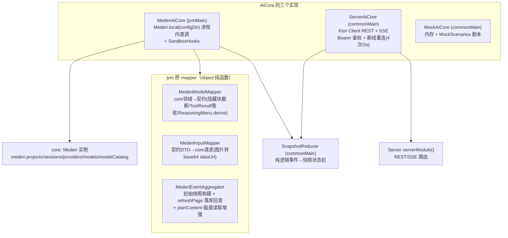
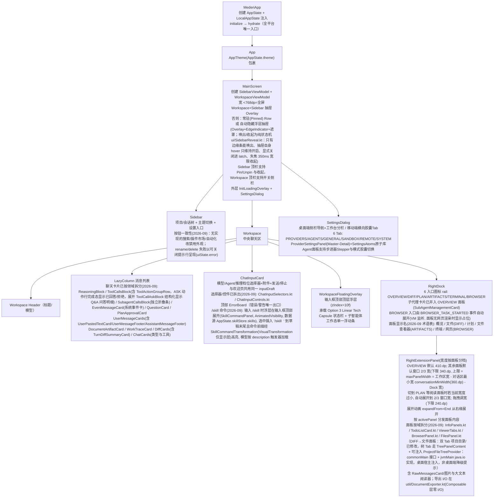
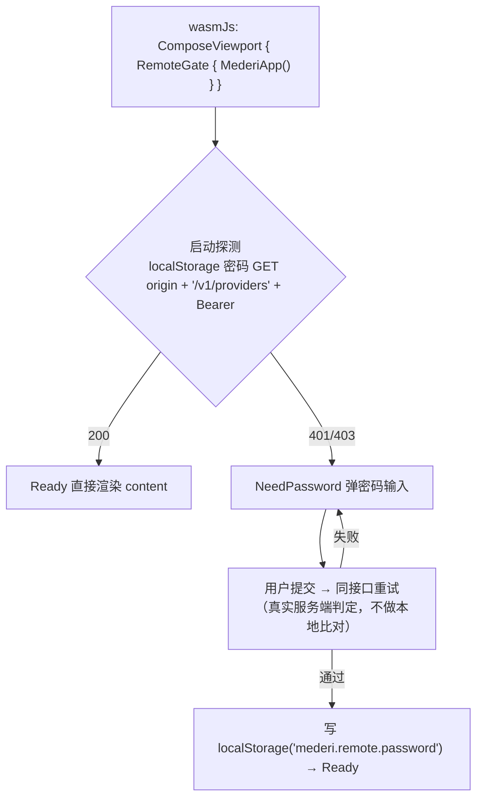

# 02 · app/shared（契约桥 + UI）与 server 模块

> 路径约定：`…/contract/` = `app/shared/src/commonMain/kotlin/xyz/mederi/core/contract/`；`…/jvm/` = `app/shared/src/jvmMain/kotlin/xyz/mederi/`。

## 1. AiCore 契约（`…/contract/AiCore.kt`）

对外唯一契约接口（KMP commonMain）。三实现：`MederiAiCore`（jvm 进程内直调 core）、`ServerAiCore`（commonMain，REST+SSE 遥控）、`MockAiCore`（UI 开发/预览）。

```kotlin
interface AiCore {
    val isReady: StateFlow<Boolean>
    suspend fun initialize(): Result<Unit>
    val projects: StateFlow<List<Project>>
    val providers: StateFlow<List<ProviderConfig>>
    val availableModels: StateFlow<List<ModelOption>>
    val availableAgents: StateFlow<List<AgentOption>>
    val builtinPresets: List<String>              // 内置供应商预设名（BuiltinProviders.allEntries）
    val configDir: String? get() = null           // 宿主配置/缓存基路径；纯 Web 返回 null

    // Project（单目录模型：一个项目恰好一个 directory）
    suspend fun createProject(input: CreateProjectInput): Result<Project>
    suspend fun renameProject(projectId: String, name: String): Result<Unit>
    suspend fun deleteProject(projectId: String): Result<Unit>       // 遍历会话统一走 deleteConversation

    // Conversation
    suspend fun createConversation(projectId: String, agent: AgentOption? = null): Result<Conversation>
    suspend fun deleteConversation(conversationId: String): Result<Unit>
        // 唯一删除封装入口: abortAndJoin → 删 session/history/diff → 删 .mederi 下 Mermaid png → 清本地缓存
    suspend fun renameConversation(conversationId: String, title: String): Result<Unit>
    fun observeConversation(conversationId: String): Flow<ConversationSnapshot>
    suspend fun getSnapshot(conversationId: String): Result<ConversationSnapshot>

    // Provider / Model / Key
    suspend fun configureProvider(providerId: String, input: ProviderUpdateInput): Result<Unit>
    suspend fun addBuiltinProvider(name: String, apiKey: String): Result<ProviderConfig>
    suspend fun deleteProvider(providerId: String): Result<Unit>
    suspend fun addProviderModel(providerId, providerModelId, name, supportsThinking=false,
        supportsImages=false, contextWindow: Int?=null, maxTokens: Int?=null,
        reasoningLevels: List<String>=emptyList(), isEnabled=true): Result<Unit>
    suspend fun updateProviderModel(providerId, modelId, /*全可空*/ ...): Result<Unit>
    suspend fun deleteProviderModel(providerId, modelId): Result<Unit>
    suspend fun setModelEnabled(providerId, modelId, enabled): Result<Unit>
    suspend fun refreshProviderModels(providerId): Result<List<String>>   // 只新增不碰存量
    suspend fun autoSetupProviderModels(providerId): Result<Int>          // 目录数据进存量模型唯一通道
    suspend fun createCustomProvider(input: CreateCustomProviderInput): Result<ProviderConfig>
    suspend fun addProviderApiKey(providerId, name, key, isDefault=false): Result<ApiKeyOption>
    suspend fun deleteProviderApiKey(providerId, keyId): Result<Unit>
    suspend fun setDefaultProviderApiKey(providerId, keyId): Result<Unit>

    // Message
    suspend fun sendMessage(conversationId: String, input: ChatPromptInput): Result<Unit>
    suspend fun steerMessage(conversationId: String, input: ChatPromptInput): Result<Unit>
        // 排队/引导（Steering）入口：会话 RUNNING 时进 pendingSteerings 队列（工具边界注入），非 RUNNING 降级为 sendMessage
    suspend fun abort(conversationId: String): Result<Unit>
    suspend fun rollbackToMessage(conversationId: String, messageId: String): Result<Unit>
    suspend fun resolveQuestion(conversationId, questionId, answers: List<List<String>>): Result<Unit>
    suspend fun resolvePlanApproval(conversationId, planId, approved: Boolean, model: ModelOption? = null, thinkingLevel: String? = null): Result<Unit>
    % 批准时刻输入框选中的模型/推理档位随批准手势传入（null=不改变，旧客户端兼容）——
    % core 批准时写入 session，同 turn 后续 spawn 的子代理按此模型执行（见 01-core.md SessionManager）
    suspend fun compressHistory(conversationId: String): Result<Unit>
        // 手动压缩。core 在翻状态机（RUNNING/IDLE）之前先空转预检：量不足时（olderBatches 为空 / 可压旧消息 < 2 条）
        // 只发 STATUS{scope=compaction, code=SKIPPED, reason=low_tokens|too_few} 事实后直接返回——不翻状态机、不发
        // SESSION_UPDATED / MESSAGE_COMPLETED（UI 不闪屏）；UI 裸事件旁路消费后弹「无需压缩」模态
        //（UiEffect.ShowCompactionNotice，见 §7.2；链路细节见 04-flows.md §5）
    suspend fun listMessages(conversationId): Result<List<ChatMessage>>
    suspend fun listMessagesPage(conversationId): Result<MessagesPage>   // 消息+token统计(快照对齐落库)
    suspend fun getMessage(conversationId, messageId): Result<ChatMessage>
    suspend fun listRawMessages(conversationId): Result<List<RawMessageDto>>  // 调试: payload 原文
    suspend fun getProcessStats(): Result<ProcessStats>   // 被监控端 = AiCore 所在宿主进程
    suspend fun getFileDiffs(conversationId, messageId: String? = null): Result<List<FileDiff>>

    fun events(): Flow<CoreEvent>

    // Skill 管理（UI 薄触发，文件操作全在 core）
    suspend fun listSkills(): Result<List<SkillItem>>
    suspend fun getSkillsRoot(): Result<String>
    suspend fun setSkillsRoot(path: String): Result<Unit>
    suspend fun installSkill(url: String): Result<SkillItem>
    suspend fun uninstallSkill(name: String): Result<Unit>

    // AGENTS.md 生成（API 形态，暂无命令/UI 入口；读取/注入在 core 代码级自动完成，见 01-core.md §7.4）
    suspend fun generateAgentsFile(projectId, modelId: String? = null): Result<String>  // 返回写入内容；modelId 缺省用项目最近会话模型

    // Office 文档预览（.docx/.xlsx/.pptx → HTML，经 DesktopBrowserRuntime KBrowser 渲染 / Server REST 获取）
    suspend fun previewOffice(conversationId: String, path: String): Result<String>  // 返回 HTML 字符串

    // MCP Server 管理（7 方法契约层带默认实现——成功空值：listMcpServers=emptyList / setMcpServerEnabled、
    // installMcpServer、updateMcpServer、deleteMcpServer、verifyMcpServer=Unit / getMcpServerJson="{}"；
    // MockAiCore 不覆写，走默认实现；MederiAiCore/ServerAiCore 覆写为真实转调）
    suspend fun listMcpServers(): Result<List<McpServerItem>>
    suspend fun setMcpServerEnabled(name: String, enabled: Boolean): Result<Unit>
    suspend fun installMcpServer(json: String): Result<Unit>
    suspend fun updateMcpServer(name: String, json: String): Result<Unit>
    suspend fun deleteMcpServer(name: String): Result<Unit>
    suspend fun verifyMcpServer(name: String): Result<Unit>
    suspend fun getMcpServerJson(name: String): Result<String>

    // SubagentConfig（子代理角色独立模型/推理档配置，设置页 Agents 面板）
    suspend fun listSubagentConfigs(): Result<List<SubagentConfigItem>>
    suspend fun updateSubagentConfig(role: String, input: UpdateSubagentConfigInput): Result<Unit>
    suspend fun getSubagentGlobalSettings(): Result<SubagentGlobalSettings>
    suspend fun updateSubagentGlobalSettings(input: UpdateSubagentGlobalSettingsInput): Result<Unit>

    // Browser 设置管理（Camoufox，契约 6 方法——默认实现 = 空设置/回显/空状态/空更新/install 拒绝/空列表；
    // MederiAiCore 直调 core BrowserSettingsApi，ServerAiCore 走 REST /v1/browser/*）
    suspend fun getCamoufoxSettings(): Result<CamoufoxSettings>
    suspend fun updateCamoufoxSettings(input: UpdateCamoufoxSettingsInput): Result<CamoufoxSettings>
    suspend fun getCamoufoxStatus(): Result<BrowserStatus>
    suspend fun checkCamoufoxUpdate(): Result<CamoufoxUpdate>
    suspend fun installCamoufox(versionTag: String?): Result<Unit>
    suspend fun listInstalledCamoufoxVersions(): Result<List<String>>
    // 子代理汇报取数（契约带默认失败实现 failure(MederiNotFoundException)，MederiAiCore/ServerAiCore 覆写）：
    // core SubagentManager.getReport 磁盘读 .mederi/plans/{planId}/reports/NN-executor.md / research.md，
    // 未落盘回退内存 result，agent 丢失/归档走 retired 恢复记录
    suspend fun getSubagentReport(agentId: String): Result<SubagentManager.SubagentReportData>
    suspend fun stopSubagent(agentId: String): Result<Unit>
}
```

**契约同步硬性规则**：`AiCore.kt → MederiAiCore → ServerAiCore → Server 路由` 任何变动四处同步，缺一即编译失败或运行期 404；新增 DTO 放 `contract/dto` / `contract/models`（kotlinx-serialization，commonMain）。

**配套契约接口**（与 AiCore 并列的平台能力注入）：
- `Terminal.kt`：`TerminalManager(getOrCreate/find/all)` + `TerminalSession(key/title/isRunning/exitCode/output()/write/resize/kill)` —— 仅本机 jvmMain 实现（PtyTerminalHub），遥控端 null。
- `SandboxHooks.kt`：`setSandboxExtraPaths(paths)` + `sandboxStatus(): SandboxStatusInfo?` —— 仅 MederiAiCore 实现；`SandboxStatusInfo(backend, available, shell, detail)`。
- `AiCoreProvider.kt`：`expect object AiCoreProvider { fun default(): AiCore }`。

## 2. 契约模型（`…/contract/models/` + `dto/`）

### 2.1 ChatModels.kt

- `enum ConversationStatus { Idle, Working, WaitingUser, Error }` —— 挂起态映射：`QUESTION_REQUESTED` / `PLAN_APPROVAL_REQUESTED` → WaitingUser，对应 RESOLVED → Working（`SnapshotReducer` 与 `MederiAiCore.startSessionStatusSync` / `ServerAiCore.startSessionStatusSync` 同映射，驱动侧边栏状态点）
- `Conversation(id, projectId?, title, status, createdAt: Long, updatedAt: Long, parentConversationId?=null, modelId?=null, modelProvider?=null, thinkingLevel: String?=null(仅回显 core 诊断值,非 UI 真理源), agent?=null, directory?=null)`
- `enum ChatRole { User, Assistant, System, Summary }`
- `ChatMessage(id, conversationId, role, blocks: List<ChatBlock>, createdAt, completedAt?, parentMessageId?, model?, agent?, isStreaming=false, error?=null, modelName?(assistant footer 模型显示名), agentMode?(APPROVAL/AUTONOMOUS), thinkingLevel?(实际推理档位), durationMs?(LLM 耗时), turnDiffSummary: TurnDiffSummaryUi?(本轮文件变更摘要,assistant 消息底部展示))` —— footer 诊断字段由 `MederiModelMapper.toChatMessage` 从 core Message 诊断字段填充（completedAt ≈ createdAt + durationMs 下界估计）；`turnDiffSummary` 由 MESSAGE_COMPLETED 的 `turnDiffSummary`/`diffMessageId` payload 回填（UI `TurnDiffCard` 单轮"N files changed"卡）
- `FileDiffSummaryUi(path, status, additions, deletions)`（单文件变更统计）；`TurnDiffSummaryUi(files: List<FileDiffSummaryUi>=[], totalAdditions=0, totalDeletions=0)`（单轮全部文件变更聚合摘要）
- `sealed class ChatBlock(id)`（type 判别多态序列化）：`Text(id, text)` / `Reasoning(id, text)` / `ToolCall(id, name, state: ToolCallState)` / `File(id, name, url, mimeType?)` / `Diff(id, filePath, before, after)` / `Unknown(id, type)`
- `sealed class ToolCallState`：`Pending(input: Map<String,String>)` / `Running(input: Map<String,String>)` / `Completed(input, output)` / `Failed(input, error)`
- `ToolCallUi(id, name, state, target?=null, isFailed=false)` —— VM 预计算展平展示模型；target = 命令原文 / 文件路径（会话目录内→相对路径，目录外→绝对路径）/ apply_patch 提取的文件清单；工具行展开区显示执行结果（Completed.output / Failed.error）
- `enum CoreEventType`（与 core EventType 同名一一对应，当前 25 个；新增 `SUBAGENT_PROGRESS` 与 `SUBAGENT_DISCARDED`；`MederiModelMapper.toCoreEvent` 按 `valueOf(name)` 映射）
- `CoreEvent(type, sessionId, messageId?=null, payload: Map<String,String>, timestamp="")`
- `PastedTextAttachment(id, index, text, lineCount, charCount)`；`ImageAttachment(id, name, mimeType, bytes, base64DataUrl, width=0, height=0)`
- `QueuedMessage(id, conversationId, text, pastedTexts=[], images=[], model?, thinkingLevel?, agent?, apiKeyId?, createdAt=0L)` —— 排队待发消息项（排队模式 / 引导模式共用）：排队模式 = 会话运行中输入框新消息进 FIFO 队列，Idle 自动出队发送；引导模式 = 队列项经 `steerMessage` 注入运行中 turn（§7.2 WorkspaceViewModel 排队/引导族）

### 2.2 其他 models

- **ConfigModels.kt**：`ModelOrigin{FETCHED, MANUAL}`；`ModelOption(id, name, provider, supportsThinking, supportsImages=false, supportsImagesOverride: Boolean?=null(用户覆盖,同步永不覆盖), reasoningLevels=[], providerModelId=id, origin=FETCHED, contextWindow?, maxTokens?, inputPricePerMillion?, outputPricePerMillion?, isEnabled=true)`；`AgentMode{APPROVAL, AUTONOMOUS}`；`AgentOption(id, name, description?, mode, model: ModelOption?=null, reasoningLevel?, systemPrompt?, tools=[])`
- **ProviderModels.kt**：`ProtocolType{OPENAI_CHAT("OpenAI 兼容"), OPENAI_RESPONSES, GOOGLE}`（displayName+placeholderUrl；`CREATABLE=[OPENAI_CHAT, OPENAI_RESPONSES]`）；`ReasoningLevels.ORDER=["NONE","MINIMAL","LOW","MEDIUM","HIGH","XHIGH","MAX"]`（档位顺序唯一真理源；`SELECTABLE` 由 ORDER 去 NONE 派生）；`ProviderType{Builtin, Custom}`；`CustomModelEntry(id, name, supportsThinking=false, supportsImages=false, contextWindow?, maxTokens?, reasoningLevels=[], isEnabled=true)`；`ApiKeyOption(id, name, maskedValue, isDefault)`；`ProviderConfig(id, name, type, baseUrl?, isConnected, models: List<ModelOption>, customModels=[], supportsApiKey, supportsBaseUrl, protocolType=DEFAULT, apiKeys=[], reasoningLevels: Map<String,String?>=空(级别名→请求体JSON片段/null), responseSanitization=false)`
- **ReasoningMenu.kt（纯函数唯一真理源）**：`derive(providerLevels, modelLevels): List<String>`（推导聊天菜单档位，NONE 恒第一；显示条件=模型勾选了级别或供应商任一档有值）；`resolve(modelMemoryLevel, modelLevels): String?`（**唯一推导链：模型记忆 > 默认档(MEDIUM 优先否则首档)**；菜单空=不支持返回 null）
- **ProjectModels.kt**：`Project(id, name, directory: String, conversations: List<Conversation>)`
- **FilesystemModels.kt**：`FileChangeStatus{Added, Modified, Deleted}`；`FileChange(filePath, status)`；`FileDiff(filePath, before, after, additions, deletions)`
- **PermissionModels.kt**：`QuestionRequest(id, conversationId, questions: List<Question>)`；`Question(id, prompt, options, multiSelect=false)`；`PlanSubtaskItem(index, name, status="PENDING", spec?, planDetail="")`（计划审批卡子任务行模型，PLAN_APPROVAL_REQUESTED / PLAN_PROGRESS 的 `subtasks` payload 解码目标）；`PlanApprovalRequest(id, conversationId, planPath, title, summary="", subtaskCount=0, planContent?=null, status="PENDING", subtasks: List<PlanSubtaskItem>=[]（全生命周期子任务投影，由 SnapshotReducer 驱动更新）)`（审批卡片只展示标题+子任务数，详细内容经 planPath 读取）
- **TodoModels.kt**：`TodoStatus`（wire 小写 pending/in_progress/completed/cancelled/failed）；`TodoItem(id, content, status, priority?=null)`；`internal TodoWireItem(content, status)`（事件 payload wire DTO，与 core encodeTodos 严格对齐，id/priority 不上 wire）
- **SkillModels.kt**：`SkillItem(name, description, location="", license?, compatibility?, allowedTools?)`——由 core `SkillInfo` 映射（UI 列表展示）
- **StatisticsModels.kt**：`TokenUsage(input=0, output=0, reasoning=0, cacheRead=0, cacheWrite=0)`（`total = input+output+reasoning`）；`CostSummary(total=0.0, currency="USD")`
- **CompactionModels.kt**：`CompactionConfig(auto?, tailTurns?, preserveRecentTokens?, reserved?, prune?)`
- **ProcessStatsModels.kt**：`ProcessStats(cpuUsage?, cpuCores=1, heapUsedBytes=0, heapCommittedBytes=0, heapMaxBytes?, rssBytes?, timestampMillis=0)`
- **McpModels.kt**：`McpServerStatus{UNCHECKED, OK, FAILED}`；`McpServerItem(name, enabled, kind="stdio", summary="", status=UNCHECKED, toolCount?, lastError?)`（MCP 列表展示条目，AppState.mcpStore 管理）
- **SubagentModels.kt**：`SubagentState(agentId, parentSessionId, role, modelId, modelName, reasoningLevel?, task, briefing?, status, startedAt, completedAt?=null, currentActivity?=null, currentTool?=null, lastMessage?=null, recentOutput?=null)`（子代理 UI 缓存对象，§3.1；支持实时流输出视窗与耗时统计）；`SubagentToolResult`（subagent(STATUS) 结果镜像，§3.1）；`SubagentConfigItem(role, displayName, description, modelId?, modelName?, reasoningLevel?, isInheriting=true)`；`UpdateSubagentConfigInput(modelId?, reasoningLevel?)`
- **BrowserModels.kt**：`CamoufoxSettings`（browserHome/binaryPath/autoCheckUpdate/headless/humanize(+humanizeMaxSeconds)/blockImages/blockWebgl/blockWebrtc/disableCoop/extraArgs + 指纹覆盖全可空 + proxy/advancedConfig——与 core `browser.CamoufoxSettings` 一一对应同默认值，app/shared 不依赖 core 故自成一份，不带 *Dto 后缀避免 MederiAiCore import 冲突；同 core：默认值 = Camoufox 官方推荐实践，路径不设默认必须手动配置至少其一）；`ProxyConfig(type="none"\|"http"\|"socks", host, port, bypass, username?, password?)`；`UpdateCamoufoxSettingsInput(settings)`（整体替换）；`BrowserStatus(configured, installedVersion?, latestVersion?, hasUpdate, supported, reason)`（不访问网络）；`CamoufoxUpdate`（字段同 BrowserStatus，latestVersion/hasUpdate 由网络查询填充）

### 2.3 dto/

- `ChatPromptInput(text, model: ModelOption?, agent: AgentOption?, thinkingLevel: String?, attachments: List<FileAttachment>, apiKeyId: String?=null)`；`apiKeyId` = 本次发送选定 key 的 ID（null=默认 key，从 AppState.selectedApiKeyIds 读当前模型供应商的选定 key）；`FileAttachment(name, mimeType, bytes)`
- `ConversationSnapshot(conversation, messages, tokenUsage, contextUsedTokens: Long=0(AI 视图窗口口径:窗口首条是 SUMMARY 走估算、否则用最近一条 Assistant inputTokens;与自动压缩同源,经 SessionManager.contextUsedTokens → aiViewContextUsedTokens 计算), cost, pendingQuestion?, pendingPlanApproval?, planApprovals=[], todos=[], childConversations=[], errorMessage?(错误/警告简报,ErrorBoard 输入框顶部一行展示), errorId?(ErrorCollector 生成的错误 ID,JVM 端可 ErrorCollector.get(id) 取完整 ErrorRecord), errorDiagnostic?(完整分层诊断报告纯文本,点"详细报告"展开;server→wasmJs 的详情唯一载体), statusHint?(仅限流重试过程提示,内存态——不再承载断流警告,警告走 errorMessage/ErrorBoard), errorIsStreamInterrupted=false(failureMode==PREMATURE_CLOSE 时置 true,MESSAGE_DELTA 复位;UI 据此在 ErrorBoard 显示"继续"按钮))`
- `MessagesPage(messages, tokenUsage, contextUsedTokens)` —— MESSAGE_COMPLETED/ERROR 后对齐落库数据用
- `RawMessageDto(seq, messageId?, role, payload(原始 JSON), createdAt)`
- `CreateProjectInput(name, directory)`；`ReasoningConfigInput(levels: Map<String,String?>)`；`ProviderUpdateInput(name?, apiKey?, baseUrl?, enabled?, customModels?, reasoningParameter?)`；`CreateCustomProviderInput(name, baseUrl, apiKey?, customModels, type=DEFAULT, responseSanitization=false, reasoningParameter?)`
- wire 请求 DTO：`CreateConversationInput(projectId, agent)`、`RenameConversationInput(title)`、`RenameProjectInput(name)`、`BuiltinProviderInput(name, apiKey)`、`AddModelInput/UpdateModelInput/SetModelEnabledInput`、`AddApiKeyInput(name, key, isDefault=false)`、`ResolveQuestionInput(answers)`、`RollbackMessageInput(messageId)`（`dto/ChatPromptInput.kt`，rollback 路由实际请求体）、`ResolvePlanApprovalInput(approved, model: ModelOption?=null, thinkingLevel: String?=null)`（批准时刻选中模型随批准手势传 core，写入 session 供同 turn spawn 动态读）、`ApiError(error)`、`ReadyInfo(ready, configDir)`、`PlanContent(content?)`
- Skill 组 DTO（`dto/SkillInput.kt`）：`SetSkillsRootInput(path)`、`InstallSkillInput(url)`、`SkillsRootResponse(path)`（String 直出 JSON 带引号，包一层类型安全）
- MCP 组 DTO（`dto/McpServerInput.kt`）：`InstallMcpServerInput(json)`（用户粘贴的标准 mcpServers JSON 原样传入，core 解析 UI 不解析）、`UpdateMcpServerInput(json)`（编辑回写，条目键须与 path 中 name 一致）、`SetMcpServerEnabledInput(enabled)`、`McpServerJsonResponse(json)`（getMcpServerJson 响应包装，String 直出 JSON 带引号，包一层类型安全）
- AGENTS.md 生成 2 件套（`dto/AgentsFileInput.kt`）：`GenerateAgentsFileInput(modelId?=null)`（缺省用项目最近会话的模型）、`GenerateAgentsFileResponse(content)`（写入内容响应包装）

## 3. SnapshotReducer（`…/contract/SnapshotReducer.kt`）

契约层 `CoreEvent` → `ConversationSnapshot` 的**纯逻辑**（跨平台，JVM 桥与 wasmJs 共用同一状态机）。

| 事件 | 聚合效果 |
|---|---|
| SESSION_CREATED | 原样返回 |
| SESSION_UPDATED | status=Working、清 errorMessage（新 turn 开始旧错误过时）；`applyWithRefresh` 对此**也触发 refreshPage 回查**（新 turn 开始时立即对齐刚落库的用户消息） |
| MESSAGE_DELTA | 在当前 streaming Assistant 占位消息上追加块（text/reasoning 合并到最后同类型块、tool_call 增量、image 新建 File 块），status=Working、清 statusHint |
| MESSAGE_COMPLETED | status=Idle、isStreaming=false、清 statusHint；断流警告以 **ErrorRecord payload**（error/errorId/fullDiagnostic, errorSeverity=WARNING, failureMode=PREMATURE_CLOSE）写入 errorMessage/errorId/errorDiagnostic，**failureMode==PREMATURE_CLOSE → errorIsStreamInterrupted=true** → **ErrorBoard 展示 + 可展开详细报告 + "继续"按钮**（`WorkspaceViewModel.continueAfterInterruption()` 重发 `"Continue"` 走正常 send 流程续写），会话保持 Idle（turn 真实完成）。正常收尾无这些 key → 三者保持原值；MESSAGE_DELTA 复位 errorIsStreamInterrupted |
| MESSAGE_ERROR | status=Error、errorMessage=payload["error"]（简报）、errorId=payload["errorId"]、errorDiagnostic=payload["fullDiagnostic"]、清 statusHint。**侧边栏红点语义**：状态点按 sessionStore 权威状态判定而非事件本身——ERROR→红点，IDLE（transient 可恢复，如限流重试耗尽）→蓝点，映射纯函数 `mapMessageErrorToStatus`（`…/jvm/core/bridge/MederiModelMapper.kt`） |
| STATUS | 仅 scope=provider 且 code=RETRYING 时写 statusHint="attempt/max"（带 `message` 时追加 "|serverMsg"，serverMsg=ErrorCollector.extractServerMessage 提取的供应商真实报错；带 `delayMs` 时再追加第三段 "|retryAt"，retryAt=delayMs+当前时间），不碰状态机；UI StatusBar 重试态第二行渲染 serverMsg。新出现的 steering STATUS（`TurnExecutor.steerMessage` 发 `status=steering_queued`，payload 仅 status/message）被 reducer **静默忽略**（payload 缺 RETRYING 约定键 scope=provider/code/attempt，不命中分支）——按代码现状如此。另有一条 **compaction scope**：`scope=compaction, code=SKIPPED, reason=low_tokens\|too_few` 由 `TurnExecutor.compressHistory` 的**空转预检**（翻状态机之前，判定口径与压缩策略共用 `planCompression`）发出；**`code=RUNNING/IDLE` 由 `MederiCompressionStrategy.compress` 发出**——三种触发（手动 / 自动 preflight / 节点内 isHistoryTooBig）的共同终点，进入 compress 发 RUNNING、try-finally 结束（含异常/早退）发 IDLE（构造经 `TurnExecutor` 两处注入 eventBus + sessionId，见 04-flows.md §5）。全部非 provider scope，故 **reducer 不写快照**（返回快照不变，既不写 statusHint 也不碰状态机，零污染）；UI 走**裸事件旁路**：`WorkspaceViewModel` 订阅 `events()` 按 sessionId 过滤 → **RUNNING→置本地 `isCompacting=true`（StatusBar 覆盖为"压缩中"）、IDLE→false（压缩结束复位）**；**SKIPPED→清 `turnStartByConv` 锚点 + `UiEffect.ShowCompactionNotice(code, reason)`** → `MainScreen` 本地化模态（见 §7.2 与 04-flows.md §5） |
| TOOL_CALLED | 完整 args 更新 ToolCall block(input)，状态 Running |
| TOOL_RESULT | 优先在已有消息中倒序查找匹配 block（按 toolCallId 精确匹配，回退：最后 Running/Pending 同名），状态 Completed/Failed 并保留 input；绝不产生空占位消息 |

工具参数解析走 `ToolArgParser.parse`（commonMain，`SnapshotReducer` 与 `MederiModelMapper` 共用）：以 `JsonObject` 宽容解析为 `Map<String,String>`，数字/布尔转字面量、嵌套结构保留 JSON 文本——避免 `read_file.max_lines` / `execute_command.timeout_seconds` 等非字符串参数让整条 args 解析失败导致路径/命令丢失。
| QUESTION_REQUESTED / RESOLVED | 写/清 pendingQuestion（REQUESTED 置 status=WaitingUser + 流式消息复位，RESOLVED 回 Working 并恢复最后一条 Assistant 消息 isStreaming=true） |
| PLAN_APPROVAL_REQUESTED / RESOLVED | **planApprovals 是全生命周期投影表**：REQUESTED 解码 `subtasks` payload（List<PlanSubtaskItem>）写入 PENDING 条目（按 id 去重置顶）+ 写/清 pendingPlanApproval + status=WaitingUser；RESOLVED 清 pendingPlanApproval、条目 status 迁 APPROVED/REJECTED + status 回 Working（approved 时恢复最后一条 Assistant 消息 isStreaming=true）。`PLAN_PROGRESS` 按 `action` 驱动同一张表的 status 迁移（voided→VOIDED / completed→COMPLETED / approved→APPROVED / subtask-started→IN_PROGRESS，且 payload `subtasks` 全量最新子任务同步替换）——概览面板"实施计划卡"（planOverviewList）的真理源 |
| TODO_UPDATED | 解码 payload["todos"] 整体替换快照 todos；解码失败丢弃事件保留先前快照 |
| PLAN_PROGRESS | 只驱动 planApprovals 投影表（status 迁移 + `subtasks` 替换），**不改变快照 todos** |
| SUBAGENT_*（STARTED/PROGRESS/COMPLETED/ERROR/STOPPED/DISCARDED） | **不改变会话快照**——子代理状态由独立的 `SubagentTracker` 聚合（VM 持缓存），会话快照只反映主代理视角；`SUBAGENT_PROGRESS` 流式更新执行动态；`SUBAGENT_DISCARDED` 在回滚时由 SubagentManager 发射，UI 移出缓存且不改变快照 |

入口：`applyWithRefresh(snapshot, event, refreshPage)`（MESSAGE_COMPLETED 先发"完成状态"快照再回查落库对齐发第二个；SESSION_UPDATED 触发 refreshPage 回查对齐刚落库消息后发一个；MESSAGE_ERROR 回查后只发最终一个）；及不含回查的 `apply(snapshot, event)`。

### 3.1 SubagentTracker + 子代理 MVVM 缓存（`…/contract/SubagentTracker.kt` / `…/contract/models/SubagentModels.kt`）

SUBAGENT_* 事件 → 子代理缓存表的纯逻辑（与 SnapshotReducer 同风格，跨平台，无状态；调用方持状态逐事件 apply）：

- `SubagentTracker.apply(states: Map<agentId, SubagentState>, event): Map` —— STARTED 以 agentId 建条目（全量元数据来自 payload）；`SUBAGENT_PROGRESS` 增量维护 `currentActivity`、`currentTool`、`lastMessage`（提取最新一句话，保留现场死因）与 `recentOutput`（滑动保留最新 1000 字符用于蹦字流视窗）；终态覆盖 status 并记录 `completedAt`（用于统计总耗时）；`SUBAGENT_DISCARDED` 从 states 中移除对应 agentId 条目；乱序终态（无 STARTED）安全跳过；非子代理事件原样返回
- `SubagentState(agentId, parentSessionId, role, modelId, modelName, reasoningLevel?, task, briefing?, status, startedAt, completedAt?=null, currentActivity?=null, currentTool?=null, lastMessage?=null, recentOutput?=null)` —— 每个子代理一个 UI 缓存对象（MVVM Model）；"工作中" = status==RUNNING（真实 job 状态；详情弹窗提供秒级计时器与实时流展示）
- `SubagentToolResult` —— core `SubagentManager.StatusResult` JSON 的契约镜像（宽松解码），subagent(STATUS) 落库 tool result 的解析用（WAIT 已删 2026-09-25）
- `ui/SubagentLifecycleNotification.kt`（2026-10 新增）—— 子代理通知/浮条谓词的**纯函数真理源**：`SubagentNotificationState`、`deriveActiveSubagentNotifications`、`hasRunningSubagents`、`shouldShowSubagentRunningBanner`；`WorkspaceViewModel.hasRunningSubagents` 复用这里的 `hasRunningSubagents(subagents)` 再叠加 chatItems 层「流式/运行中工具调用」判定，不得另写一份状态判定

**VM 接线**（WorkspaceViewModel）：`allSubagents`（compose state，事件驱动）+ `subagents`（按当前会话过滤的派生 getter）+ `subagent(agentId)`（详情只读数据源）+ `subagentReportMarkdown(toolName, resultJson)`（`ui/SubagentReport.kt` 纯转换：单一 `subagent` 工具（action=SPAWN/SPAWN_RESEARCHER/STATUS/STOP，原 6 工具封装合并，agent_status 不再单独注册）STATUS 的 COMPLETED 结果 → 汇报 markdown，null=非汇报普通卡片渲染；UI 折叠卡片点开用 InkCompose 渲染）——汇报全文不进事件/缓存，它在数据库的 tool result 里（wait_agent 已删 2026-09-25；完成报告落盘到 `.mederi/plans/{planId}/reports/NN-executor.md`，父上下文只收摘要+路径）。

## 4. 三实现架构图



### 4.1 MederiAiCore（`…/jvm/core/bridge/MederiAiCore.kt`）

`class MederiAiCore(configDir: String, dispatcher = Dispatchers.Default) : AiCore, SandboxHooks`。

**initialize() 流程（顺序）**：
1. `mederi = Mederi.create { configDir; userAgent = AppInfo.userAgent }`（出站 HTTP User-Agent 唯一注入点：所有 Koog 链路请求带 Mederi 身份头）→ **浏览器设置装配（Camoufox 注册已移出 create{} 内联块，紧随其后在 initialize 内完成）**：`browserSettingsManager = BrowserSettingsManager(mederi.settingsStore)`（SettingsStore key `browser.camoufox.settings`，JSON blob）→ `BrowserSettingsApiImpl(browserSettingsManager, installerProvider = { BrowserHome.of(current().browserHome)?.let { CamoufoxInstaller(it) } })` → `get()` 预热缓存 → `BrowserRegistry.register("camoufox", kind=CAMOUFOX, factory={...})`——**工厂读 `browserSettingsManager.current()`**：binary = browserHome 已下载版本 > `settings.binaryPath`（都不存在 → 引导错误"请在设置页 BROWSER 配置…"）、**profileDir = `settings.resolveProfileDir()`（core `CamoufoxSettingsMapping`：browserHome 非空 → `{browserHome}/profiles`；binaryPath 模式 → `{二进制父目录}/profiles` 跟随二进制同级；都空 → error"未配置浏览器路径：请先设置 browserHome 或 binaryPath"。已删除系统临时目录兜底——永不落临时目录）**、`config = settings.toCamoufoxConfig()`、`proxyPrefs = settings.proxy?.toFirefoxPrefs() ?: emptyMap()`。保存路径校验：`BrowserSettingsManager.validate()` 路径必填（browserHome/binaryPath 至少一个），UI 设置面板保存按钮同规则提前拦截（`browser_path_required`）。**JCEF 已整体移除，camoufox 是唯一注册源**（desktop 与 headless server 同源，不经契约），AI 经 `browser(action=RUN, browser=...)` 选择（未安装/未配置时选它得到引导错误）
2. `cleanupLegacyBuiltinProviders()` —— 删"无 API Key 且名字命中内置预设"的历史垃圾 Provider
3. `cleanupStaleRunningSessions()` —— 上次崩溃残留的 RUNNING session 逐个 `abortAndJoin` 复位（**必须走 abortAndJoin 而非 abort**：abort 对"无活跃 turn 的残留 RUNNING"整体 no-op，activeJobs 是内存态新建进程后为空，状态永远卡住；abortAndJoin 对陈旧 RUNNING 兜底复位 IDLE）
4. `syncBuiltinProviders()` —— 内置供应商 baseUrl/reasoningParameter/responseSanitization/modelsDevKey 与代码预设校验、不一致则更新
5. `refreshGlobalState()` —— 填充 projects/providers/availableModels/availableAgents 四个 StateFlow
6. `_isReady = true`
7. `mederi.modelCatalog.start()` —— models.dev 目录启动即拉 + 每小时刷新
8. `autoRefreshBuiltinGoogleModels()` —— 后台刷新已配 Key 的内置 Google 供应商模型（只新增不碰存量）
9. `autotitleService.start()` —— **会话自动命名挂在此处（谁初始化谁生效，desktop/server 天然一致）**
10. `startSessionStatusSync()` —— 订阅 core 会话事件流，实时把会话状态同步进 `_projects` StateFlow（驱动侧边栏状态点；映射 = SESSION_UPDATED→Working、MESSAGE_COMPLETED→Idle、MESSAGE_ERROR→sessionStore 权威终态经 `mapMessageErrorToStatus`、QUESTION/PLAN_APPROVAL REQUESTED→WaitingUser、RESOLVED→Working；同时维护 lastErrorBySessionId 终态错误注册表）
11. `startCamoufoxUpdateCheck()` —— 启动时静默检查 Camoufox 是否有更新（**尊重 `browserSettingsManager.current().autoCheckUpdate`**——关闭则直接跳过；未配置 browserHome 或平台不支持同样跳过；不自动下载——浏览器体积大，结果打日志，设置页 BROWSER tab 可手动检查/安装）

**浏览器设置 6 方法**：`getCamoufoxSettings`/`updateCamoufoxSettings`/`getCamoufoxStatus`/`checkCamoufoxUpdate`/`installCamoufox`/`listInstalledCamoufoxVersions` 直调 `browserSettingsApi`（core `BrowserSettingsApiImpl`，进程内不经 REST），契约 DTO 经 `toContract()/toCoreDto()` 映射到 `contract/models/BrowserModels.kt`。

`events()` = `mederi.sessions.events().map { MederiModelMapper.toCoreEvent(it) }`；`observeConversation()` 委托 MederiEventAggregator（初始快照 + SnapshotReducer.applyWithRefresh + refreshPage 回查 + initialTodos hydration：todo 唯一来源 = session.todos，与 plan 子任务展示解耦）。

**错误水合机制**：store 重建快照（getSnapshot / observe 初始快照）从 `MederiAiCore` 的 `lastErrorBySessionId` 内存注册表水合 errorMessage/errorDiagnostic/errorId/errorIsStreamInterrupted（MESSAGE_ERROR 写入、MESSAGE_COMPLETED 带断流警告写入、新 turn SESSION_UPDATED 清除），使「切回 Error 会话」能看到失败原因——流式中的错误经事件流实时写入，但 store 重建初始快照时需从内存注册表补回（落库消息不含错误字段）。

**BuiltinProviders**（object，`…/jvm/core/bridge/BuiltinProviders.kt`）：内置供应商预设唯一真理源（Google Gemini / Agnes SG+CN / Hetzner / Empero / OpenCode Zen / OpenRouter / 商汤 SenseNova），`allEntries()` 按端点展开、`isBuiltinName()` 判定；预设含 baseUrl/协议/响应清洗/推理参数(modelsDevKey)。
**BuiltinAgents**（object，commonMain）：内置 Agent 唯一真理源 = AgentMode 双预设（autonomous 自动审批 / approval 人工审批），`byId(id)`；不再区分编程/通用工作用途。

### 4.2 ServerAiCore（`…/commonMain/core/bridge/ServerAiCore.kt`）

`class ServerAiCore(baseUrl, passwordProvider: suspend () -> String? = {null}) : AiCore`。
- Ktor client 配置：`defaultRequest` 统一带 `User-Agent: AppInfo.userAgent`（身份头唯一真理源 = `AppInfo.userAgent`，见 §4.3）。
- 鉴权：passwordProvider 非空时所有 REST + SSE 带 `Authorization: Bearer <password>`。
- initialize：校验 baseUrl → 轮询 `GET /v1/ready`（20s 上限、250ms 间隔）→ 拉 presets/agents/models/providers/projects → isReady → `startSessionStatusSync()`（订阅全局 SSE `events()` 流，实时把会话状态同步进 `_projects` StateFlow 驱动侧边栏状态点；映射与 jvm 桥一致：SESSION_UPDATED→Working、MESSAGE_COMPLETED→Idle、MESSAGE_ERROR→Error、QUESTION/PLAN_APPROVAL REQUESTED→WaitingUser、RESOLVED→Working）。
- SSE：官方 SSE 插件，incoming data 段反序列化为 CoreEvent（失败丢弃），心跳注释帧不投递；两个流：`/v1/events`（全局）与 `/v1/sessions/{id}/events`（会话）。
- 新增契约方法的 REST 路径：`steerMessage` → `POST /v1/sessions/{id}/steer`（body=ChatPromptInput）；`getSubagentReport` → `GET /v1/subagents/{agentId}/report`（→ SubagentReportData）；`stopSubagent` → `POST /v1/subagents/{agentId}/stop`。
- 错误：非 2xx 抛异常（优先 ApiError.error 文本），方法边界包 Result 失败。

### 4.3 AppInfo（`…/commonMain/AppInfo.kt`，应用身份唯一真理源）

- `VERSION`：应用版本常量，**源码不写版本字面量**。唯一出处 = Gradle 工程根 `version.json`（CI 基于 git tag 写入）；构建脚本（app/shared 的 `generateVersionSource` 任务）读取后生成 `AppVersion.kt`（`MEDERI_APP_VERSION`）注入这里。
- `userAgent`（lazy）：`Mederi/<version> (<os> <os-version>; <arch>)` —— 组合 `VERSION` + `platformInfo()`，所有出站 HTTP 请求（Koog 链路经 `MederiConfig.userAgent` → `MederiHttpClientFactory`；Ktor 客户端经 `defaultRequest`）只从这里取值。
- `platformInfo(): PlatformInfo(osName, osVersion, arch)`：`expect` 声明，jvm/android/ios/wasmJs 各一个 `actual`（见 00-overview 平台注入矩阵）；`normalizeOsName`/`normalizeArch` 为标准 UA 粒度映射（Windows NT / Mac OS X / Linux / Android / iOS；aarch64→arm64、amd64→x86_64）。
- 硬性规则：禁止在调用处自行获取版本号 / os / arch 再拼 UA。

## 5. Server 路由表（`…/jvm/server/Server.kt`）

`Server.start(aiCore: MederiAiCore, requestedPort=8081, password?, webappDir?): RemoteStartResult`（幂等；**端口策略**=先按请求端口 bind，被占 → port=0 OS 挑空闲，`resolvedConnectors()` 读回实际端口并标记 portFallback）；`stop()` 幂等。
- install：ContentNegotiation(json)/SSE/CORS(anyHost + Authorization 等)；password 非空 → Authentication(bearer "mederi-remote")。
- webapp：webappDir 非空 → staticFiles("/")；否则 classpath `staticResources("/","static")`（内置 wasm 产物）；SPA fallback + preCompressed(GZIP) + .wasm Content-Type；`/` 与 `/v1/ready` 豁免鉴权。
- SSE：`respondEventStream(events)` —— 15s 心跳注释帧防代理断连；客户端断开结构化并发取消。

**路由清单**（`v1Routes(aiCore)` 内，可被鉴权包裹）：

| 方法+路径 | 转调 |
|---|---|
| GET `/info` | 纯文本 `"Mederi Server"`（`respondText` 健康探测，豁免鉴权） |
| GET `/v1/ready` | ReadyInfo（豁免鉴权） |
| GET `/v1/presets` / `/v1/agents` / `/v1/models` / `/v1/providers` / `/v1/projects` | 直接 respondData StateFlow 值 |
| GET `/v1/system/stats` | getProcessStats |
| POST `/v1/projects`；PATCH/DELETE `/v1/projects/{id}` | Project 组（单目录，无目录增删端点） |
| POST `/v1/sessions`；DELETE/PATCH `/v1/sessions/{id}` | Conversation 组 |
| GET `/v1/sessions/{id}/snapshot` \| `messages` \| `messages/raw` \| `messages/{messageId}` \| `diffs[?messageId=]` | 查询组 |
| POST `/v1/sessions/{id}/messages` \| `abort` \| `rollback` \| `questions/{questionId}` \| `plans/{planId}/approve`（body=`ResolvePlanApprovalInput(approved, model?, thinkingLevel?)`——批准时刻选中模型随批准传 core） \| `compress` | 动作组 |
| POST `/v1/sessions/{id}/steer`（body=ChatPromptInput） | steerMessage：排队/引导（Steering）入口 |
| SSE GET `/v1/events`（全局）；GET `/v1/sessions/{id}/events`（按 sessionId filter） | 事件流 |
| POST `/v1/providers`；POST `/v1/providers/builtin`；PATCH/DELETE `/v1/providers/{id}` | Provider 组 |
| POST `/v1/providers/{id}/models`；POST `.../models/refresh`；POST `.../models/auto-setup`；PATCH/DELETE `.../models/{modelId}`；POST `.../models/{modelId}/enabled` | Model 组 |
| POST `/v1/providers/{id}/keys`；DELETE `.../keys/{keyId}`；POST `.../keys/{keyId}/set-default` | Key 组 |
| GET `/v1/mcp/servers`；POST `/v1/mcp/servers`（InstallMcpServerInput）；PATCH/DELETE `/v1/mcp/servers/{name}`；POST `.../enabled`；POST `.../verify`；GET `.../json`（→McpServerJsonResponse） | MCP 组（ServerAiCore 遥控桥，desktop 直调不经过） |
| GET `/v1/skills`；GET `/v1/skills/root`（→SkillsRootResponse）；POST `/v1/skills/root`（SetSkillsRootInput）；POST `/v1/skills/install`（InstallSkillInput → SkillItem）；DELETE `/v1/skills/{name}` | Skill 组（UI 薄触发：列表/根目录/安装/卸载，文件操作全在 core） |
| POST `/v1/projects/{id}/agents-file/generate`（GenerateAgentsFileInput → GenerateAgentsFileResponse） | AGENTS.md 生成：扫描项目生成（已存在则原地改进）项目根 AGENTS.md（暂无 UI 入口，纯 API 形态） |
| GET `/v1/sessions/{id}/office-preview[?path=]` | Office 文档预览：`.docx/.xlsx/.pptx` → HTML 字符串（供浏览器面板渲染） |
| GET `/v1/subagents/{agentId}/report` | 子代理汇报取数：`aiCore.getSubagentReport` → `SubagentReportData`（磁盘读 `reports/NN-executor.md`/`research.md`，缺失回退内存/retired 记录，agent 不存在 → 404） |
| POST `/v1/subagents/{agentId}/stop` | 停止子代理：`aiCore.stopSubagent(agentId)`（向运行中子代理发送取消并标记「被用户关闭」；终态事件正常向上汇报给 AI） |
| GET `/v1/subagent-configs`；PUT `/v1/subagent-configs/{role}`（UpdateSubagentConfigInput）；GET `/v1/subagent-configs/global`；PUT `/v1/subagent-configs/global`（UpdateSubagentGlobalSettingsInput） | SubagentConfig 组：子代理角色（EXECUTOR/RESEARCHER/BROWSER_OPERATOR/BROWSER_BRAIN）独立模型/推理档配置 CRUD 与全局设置（单会话并发上限） |
| GET `/v1/browser/settings`；POST `/v1/browser/settings`（UpdateCamoufoxSettingsInput）；GET `/v1/browser/status`；POST `/v1/browser/check-update`；POST `/v1/browser/install[?version=]`；GET `/v1/browser/versions` | Browser 组（Camoufox 设置/状态/更新检查/安装/已装版本，转调 MederiAiCore 6 方法——`getCamoufoxSettings` 等；desktop 直调 core 不经 ServerAiCore） |

响应助手：`respondResult(Result)`（Unit 成功返回 `{}`，失败按 MederiException 子类映射 404/400/409/500 + ApiError）、`respondData(裸值)`、`respondError`。

**PtyTerminalHub**（`…/jvm/server/terminal/PtyTerminalHub.kt`）：终端会话注册表（TerminalManager 实现，desktop 与 server 共用）——一个 key=一个常驻 shell（pty4j，`$SHELL`→bash→sh、Windows cmd.exe，登录 shell，TERM=xterm-256color）；服务端 64KB scrollback 环形缓冲（attach 先回放再续流）；会话随宿主进程生命周期（进程退出→OS 关 pty master→SIGHUP）；`PtyTerminalSession` 提供 output 流/write/resize/kill。JVM-only（pty4j 无 KMP 替代品）。

## 6. server 模块（`server/src/main/kotlin/xyz/mederi/Application.kt`）

独立 JVM 进程 headless 部署薄启动器：
1. 读环境变量：`MEDERI_SERVER_PORT`(默认 8081)、`MEDERI_CONFIG_DIR`(默认 ~/.mederi)、`MEDERI_SERVER_PASSWORD`(非空则 /v1 Bearer 鉴权)、`MEDERI_WEBAPP_DIR`(可选外部 wasm UI)、`MEDERI_LLM_RETRY_MAX/MIN_MS/MAX_MS`（写 `LlmRetryConfig`）。
2. `MederiAiCore(configDir)` + `runBlocking { initialize() }`（失败记录 initError 不阻断启动）。
3. `embeddedServer(Netty, port, host="0.0.0.0") { serverModule(aiCore, ReadyInfo(ready = initError==null, configDir), password, webappDir) }.start(wait = true)` —— 复用 shared 的 serverModule，**路由代码零重复**。

## 7. AppState 与 ViewModel 层

### 7.1 AppState（`…/commonMain/ui/appstate/AppState.kt`）

`class AppState(aiCore, preferences: PreferencesStore, scope)`；宿主注入点 = `remoteControl: RemoteControlHooks?`、`terminalManager: TerminalManager?`、`uiBrowserHost: UiBrowserHost?`（**已移除/保留待清理**：内置 JCEF 浏览器宿主类已整体移除，接口 `UiBrowserHost` 与 `AppState.uiBrowserHost` 字段保留但无实现注入，恒 null）与 `fileTreeProvider: ProjectFileTreeProvider?`（desktop 宿主 `onAppStateReady` 注入 `ProjectFileTreeProviderJvm`，**VM 层读取用**——`WorkspaceViewModel.openFile` 读盘；`LocalProjectFileTreeProvider` CompositionLocal 保留给树面板，与本字段同源实例；遥控端/wasm 恒 null）；`canRenderJcef = uiBrowserHost != null`（恒 false，保留待清理）；`LocalAppState` CompositionLocal。

**持久化字段**：

| 字段 | 持久化 key | 说明 |
|---|---|---|
| theme: AppThemeMode | `app.theme` | DARK 默认 |
| remoteControlEnabled / remoteControlPassword / remotePort | `remote.enabled` / `remote.password` / `remote.port`（默认 8081，成功后回写实际端口） | 遥控 |
| remoteServerState | —（内存） | Idle/Starting/Running(port, portFallback)/Failed |
| tunnelState | —（内存） | Idle/Starting/Running(url)/Failed(notInstalled) |
| selectedProjectId / selectedConversationId | `workspace.lastProjectId` / `workspace.lastConversationId` | 选中态 |
| selectedModel | `workspace.lastModelId` + `workspace.lastModelProviderId` | 带自愈：列表重建后重指向同款新实例 |
| selectedAgentId | `workspace.lastAgentId` | |
| sandboxExtraPaths | `sandbox.extraPaths`(JSON 数组) | 写穿 SandboxHooks |
| modelReasoningLevels: Map\<modelId, level\> | `workspace.reasoningLevel.$modelId` | **模型推理档位记忆**（ReasoningMenu.resolve 的第一优先输入） |
| selectedApiKeyIds: Map\<providerId, apiKeyId\> | `workspace.apiKey.$providerId` | **供应商 API Key 记忆**（跨重启恢复；缺省=用默认 key；会话发送经 `getApiKeyId(provider.id)` 注入 ChatPromptInput.apiKeyId） |
| language: AppLanguage | `app.language` | i18n 语言设置（SYSTEM/ZH/ZH_TW/EN/JA/KO/FR/DE/ES/PT_BR/ID/MNC，缺省 SYSTEM；`setLanguage` 写穿持久化） |

i18n 资源（2026-10 定稿）：`composeResources` 下共 10 个 `values*/strings.xml`（values/ 默认中文 + values-en/ 英文为硬性双份 + zh-rTW/de/es/fr/id/ja/ko/pt-rBR 8 个翻译目录），**键集必须与 values/ 完全一致**（新增文案须同时补 10 份，由校验命令锁键集 md5 唯一）；传统中文只保留 `values-zh-rTW`（`values-b+zh+Hant` 与其逐字节重复，2026-10 已删除）
| leftSidebarPinned | `ui.sidebar.pinned`（缺省 false） | 左侧边栏固定开合态 |

派生：`selectedAgentMode`（selectedAgentId × availableAgents combine）；`processStats`（后台 1s 轮询）。
扩展 Store（唯一真理源，生命周期绑定 AppState，供概览快捷卡片与后续市场双向同步）：
- `skillStore: SkillStore`：管理 `skills: StateFlow<List<SkillItem>>`、`skillsRoot: StateFlow<String>`，提供 `refresh()`、`install(url)`、`uninstall(name)`、`setRootDirectory(path)`。
- `mcpStore: McpStore`：管理 `mcpServers: StateFlow<List<McpServerItem>>`，提供 `refresh()`、`toggleEnabled(name, enabled)`、`install(json)`、`update(name, json)`、`delete(name)`、`verify(name)`、`getJson(name)`。
- `browserSettingsStore: BrowserSettingsStore`（`ui/appstate/BrowserSettingsStore.kt`，AppState 构造即建，挂 aiCore 契约 6 方法）：管理 `settings: StateFlow<CamoufoxSettings>`、`status: StateFlow<BrowserStatus?>`、`installedVersions: StateFlow<List<String>>`，提供 `refresh()`（设置+状态+版本并发拉取）、`save(settings)`（整体替换）、`install(versionTag?)`、`checkUpdate()`——设置页 BROWSER tab 数据源。

方法：`persist(key, value)`（异步写、pendingWriteCount 计数）、`flushPreferences()`（退出前同步等待归零，2s 兜底）、`applyConversationDefaults`（补位不覆盖）、`setRemoteControl/startRemoteControl/stopRemoteControl`、`startTunnel/stopTunnel`、`handleProjectDeleted/handleConversationDeleted`（唯一允许偏好与引擎状态对齐的地方）、`hydrate()`（启动恢复，列表就绪后限时 3s 回填）。


### 7.2 ViewModel 类图

```mermaid
classDiagram
    class AppState {
        +aiCore +preferences
        +theme/selectedModel/selectedAgentId/...
        +modelReasoningLevels(模型记忆)
        +startRemoteControl()/startTunnel()
        +handleProjectDeleted()/handleConversationDeleted()
    }
    class WorkspaceViewModel {
        +conversationId +snapshot: ConversationSnapshot?
        -sessionCache: SessionUiCache  % 会话级缓存族(2026-09 收敛,替代散落 map): snapshotCache/observeJobs/pendingUserMessages/turnStartByConv/autoContinueCountByConv/queuedMessagesByConv 6 容器
        -errorState: ErrorState  % 错误族分组状态: message/diagnostic/id/isStreamInterrupted/isDetailOpen(对外 getter: error/errorDiagnostic/errorId/isStreamInterrupted/isErrorDetailOpen 同名)
        -diffState: DiffUiState  % diff 面板分组状态: items/selectedPath/showPanel(对外: diffItems/selectedDiffFilePath/showDiffPanel 同名)
        -isCompacting: Boolean  % compaction RUNNING/IDLE STATUS 事件维护的本地态(不写快照/不动契约); 供 WorkspaceFloatingOverlay 覆盖 turnStatus 为 Compacting; 切会话(attach)/snapshot 已 Idle/Error 兜底复位
        % 错误族与 diff 族已收敛为分组状态(2026-09 UI 规范化)
        +inputDraft: TextFieldValue  % 输入草稿唯一真理源
        -activeDockPanel: RightDockPanel?  % 保守保留平铺(同时服务全部 dock 面板)
        +uiBrowserHost: UiBrowserHost?  % 窄访问器 get() = appState.uiBrowserHost; 已移除/恒 null（保留待清理）
        +pendingFileOpen: PendingFileOpen?  % 文件打开确认态单一真理源(OpenExternally/RevealInFolder)；非 null 时 Workspace 根部渲染 ConfirmDialog
        +openFile(path)  % 对话流文件点击唯一路由：classifyFilePath 四档→INTERNAL_IMAGE 走 openImageInExtension / INTERNAL_TEXT 走 openTextInExtension(经 appState.fileTreeProvider.readText，NUL 扫描判二进制，查不到/二进制→降级 routeExternalOrReveal) / EXTERNAL→routeExternalOrReveal / REVEAL_IN_FOLDER→写 pendingFileOpen
        +confirmPendingFileOpen() / +cancelPendingFileOpen()  % 确认走 PlatformUtils.openFile(别名 openFileInOs,防与路由 openFile 递归)或 revealInFolder；两者都清态
        +chatItems: List~ChatListItem~  % derivedStateOf 展平
        +effectiveThinkingLevel: StateFlow  % 推理档位唯一真理源(ReasoningMenu.resolve)
        +effects: Flow~UiEffect~  % 一次性命令通道(Channel 派发: openSettings/openProjectMenu/ShowCompactionNotice)
        +openSettings() / openProjectMenu()  % 一次性命令, UI collect 消费落本地状态
        +attach(id) / detach() / send(text) / abort() / stopSubagent(agentId)
        +rollbackMessage(convId, msgId, text)  % 本地切片 + 即时从 subagentStates 剔除被回退子代理
        +approvePlan(planId, approved) / replyQuestion(...) 
        +tryAttachImage(...) Boolean  % 图片能力门禁
        +openDiff/closeDiff + toggleDockPanel...
        % 全局事件监听：BROWSER_TASK_STARTED → 自动展开 BROWSER 面板（JCEF 宿主已移除，面板无内置浏览器渲染）
        % STATUS{scope=compaction} 裸事件旁路（按 conversationId 过滤）：code=RUNNING→isCompacting=true / IDLE→false（压缩本地态，不写快照）；code=SKIPPED→清 sessionCache.turnStartByConv 锚点 + 派发 UiEffect.ShowCompactionNotice(code,reason)（core 侧只发事实，本 VM 只旁路不改状态机）
    }
    class SidebarViewModel {
        +uiState(expandedProjectIds, isBusy, error)
        +filteredProjects: StateFlow  % 全量项目树（不再按工作用途过滤）
        +theme: StateFlow~AppThemeMode~ / +language: StateFlow~AppLanguage~  % 窄状态转发 AppState(2026-09 规范化, Sidebar 不直操全局单例)
        +setTheme(mode) / setLanguage(lang)  % 转发 AppState.setTheme/setLanguage
        +createProject/renameProject/deleteProject
        +createProjectFromDirectory(dir)  % 目录查重：该目录已有项目则直接选中并展开，不重复创建
        +ensureConversationVisible(conversationId)  % 程序化选中会话前展开其所属项目
        +createConversation/deleteConversation/renameConversation
        +toggleProjectExpanded/selectProject/selectConversation/newSession
    % createConversation = 本地占位不落库（展开+选中项目、清空会话选中，同 newSession）；
    %  会话真实创建唯一入口 = WorkspaceViewModel.send 无会话自动 createConversation（convId==null 且项目已选）
    }
    class TerminalViewModel {
        % 依赖 AppState.terminalManager, 不依赖 AiCore
        +uiState: TerminalUiState(tabs: List~TerminalTab(key/error/unread/ended)~, activeKey)  % 对外唯一状态入口（2026-09 收敛，替代原 5 个平铺状态）
        +projects: StateFlow~List~Project~~ / +selectedProjectId: StateFlow~String?~  % 窄状态转发 appState 同源流(2026-09)
        -sessions: Map~key, TerminalSession~  % 会话对象容器（独立于 uiState，避免 data class 相等性噪声）
        +sessionOf/sessionTitleOf
        +selectTab/closeTab/addTab/restartTab/retryTab
        +bootstrapIfNeeded(project)  % 幂等自动开首个 tab
    }
    class RawMessagesViewModel {
        +rawMessages +isLoading
        +bind(conversationId)  % 拉取+订阅 events 过滤刷新
        +prettyPrintJson / +extractSummaryLabel / +extractTokens / +formatMessageTimestamp  % 委托至 TimeFormatter.formatMonthDayTime（强制用户系统本地时区）
    }
    AppState --> WorkspaceViewModel
    AppState --> SidebarViewModel
    AppState --> RawMessagesViewModel
    AppState --> TerminalViewModel : terminalManager
    AppState --> UiBrowserHost : uiBrowserHost（已移除/保留待清理，恒 null）
```

- **时间格式化真理源（`util/TimeFormatter.kt`，2026-10 规范化）**：所有面向用户展示时间的地方统一由 `TimeFormatter` 处理，强制转换为用户系统所属时区（`TimeZone.currentSystemDefault()`）；提供 `formatShortTime`（"HH:mm"）、`formatTimeWithSeconds`（"HH:mm:ss"）、`formatMonthDayTime`（"M/d HH:mm"）、`formatFullDateTime`（"yyyy-MM-dd HH:mm:ss"）；`TimeUtils.formatMessageTime` 为 thin wrapper 统一委托；`SubAgentComponents`（启动时刻/列表）与 `RawMessagesCard` 杜绝组件私有截串与平台原生实现分叉。

- **UiEffect 一次性命令族（`ui/UiEffect.kt`）**：sealed interface，`Channel<UiEffect>` 派发、UI 侧 collect 消费落本地状态（发送即消费，不持久化；与"常驻展示状态"分工见 UiEffect.kt 头部注释）。`OpenSettings` / `OpenProjectMenu` = 导航类一次性命令；**`ShowCompactionNotice(code, reason?)`** = **手动压缩预检空转时的一次性提示**——core `TurnExecutor.compressHistory` 判定没有可压缩内容（token 不足 / 可压轮次太少）时不翻状态机、只经 `STATUS{scope=compaction, code=SKIPPED, reason}` 报机器码事实，由 VM 的裸事件旁路收集器转成本 effect（按 sessionId 过滤；**同一收集器对 `code=RUNNING/IDLE` 只置/复位本地 `isCompacting`**——压缩进行中 StatusBar 覆盖为"压缩中"，见 §8；**命中 SKIPPED 才先清 `turnStartByConv` 锚点**）；`MainScreen.effects.collect` 收下落本地状态弹**本地化模态**（`compaction_skipped_title` + 按 `reason` 选 `compaction_skipped_low_tokens` / `compaction_skipped_too_few`，values/ 与 values-en/ 双份），关闭是纯本地 UI 动作。core 不需要知道 UI 有没有模态——**core 发事实 / UI 渲染，不耦合**。
- **子 VM 生命周期（2026-09 规范化）**：`RawMessagesViewModel` 与 `TerminalViewModel` 由 `Workspace()`（Route/Screen 层）`viewModel {}` 创建，经 `RightExtensionPanel` → `OverviewTabContent`（rawVm）/ `TerminalPanelContent`（terminalVm）注入——组件不再自建 VM、不再经 `WorkspaceViewModel.appStateRef` 摸全局单例（该出口已删除，浏览器 host 改 `uiBrowserHost` 窄访问器）。
- **WorkspaceViewModel 要点**：`attach(id)` = **按会话常驻观察流 + 缓存渲染**：每个被 attach 过的会话有一条 `observeConversation` 观察流持续把最新快照写入 `snapshotCache`（即使 UI 已切到别的会话也不取消），切换会话只改 `conversationId`、立即用缓存渲染（无缓存时先 `getSnapshot` 拉初始再交给观察流）；`send(text)` = 校验就绪/模型/图片门禁 guardImageSupport（send 与 rollbackMessage 共用唯一实现）→ PromptComposer.compose → 乐观更新 → 无会话自动 createConversation → 有待审批先 resolvePlanApproval(false) → sendMessage（thinkingLevel 只发 computeEffectiveThinkingLevel()）；`rollbackMessage` = 先验后切（restoreInputFromMessage 反解主指令/大段文本/图片 → 本地切片 → rollbackToMessage）→ **成功后才把内容粘贴回输入框重建待发态**（inputDraft + pendingPastedTexts + pendingImages，用户切模型/模式/改内容后自行发送），失败走 ErrorBoard；`restoreInputFromMessage(targetMsg?, fallbackText)` 为纯函数（PromptComposer.parse 拆主指令与大段文本、data: File block base64 还原图片）；`chatItems` 预计算 toolSummary/target/headerSummary/isReasoningActive。**会话切换不再闪烁（2026-09）**：历史上切换回 Working 会话时从 store 重建初始快照，而流式中的 assistant 消息尚未落库（`TurnIncrementalPersister.persistAssistant` 只在 LLM 响应结束后写入），导致快照缺 streaming 数据、StatusBar 短暂显示"排队较长"警告。现改为常驻观察流 + 缓存，切回即渲染最新缓存、流式增量不丢。
- **排队/引导族（Steering，2026-09 新增）**：`enqueueCurrentInput(trimmedText)`（把当前输入草稿（含粘贴文本/图片 + 当前模型/Agent/档位/apiKeyId）固化为 `QueuedMessage` 进按会话 FIFO 队列（本地，不立即落 core），清空输入草稿与附件）/ `removeQueuedMessage(id)`（移出队列）/ `steerQueuedMessage(queuedMsg)`（引导模式：从队列取出，组装 ChatPromptInput 经 `aiCore.steerMessage` 注入运行中 turn）/ `sendQueuedMessage(queuedMsg)`（发送队列项：组装 Prompt + 附件 → 乐观更新 + `aiCore.sendMessage`，清零 auto-continue 计数与计时锚点）/ `currentQueuedMessages`（当前会话队列，输入框顶部队列横幅数据源）；**会话 turn 结束回 Idle 时自动出队消费**队列首项。
- **计划概览族**：`planOverviewList`（派生 = snapshot.planApprovals + pendingPlanApproval 去重合并，映射四个生命周期阶段 PendingApproval/InProgress/Completed/Voided，**概览面板"实施计划卡"真理源**）/ `openPlanFile(item)`（读 plan.md 全文——planContent 优先、缺失经 planPath 落盘读、再缺退回标题+摘要——在 PLAN 面板打开）/ `openPlanInExtension(planId, title, content)`（写 `currentPlan` + 展开 PLAN 面板，单向数据流唯一写口）/ `openSpecInExtension(planId, planTitle, subtaskIndex, subtaskName, specContent)`（在阅读器打开子任务执行清单 Spec，缺 spec 显示"尚未生成"占位）/ `currentPlan: PlanItem?`（当前展示的实施计划内容）。
- **断流自动补发**：`checkAndTriggerAutoContinue(id, snap)`（attach 快照时评估：`errorIsStreamInterrupted` 且非 Working 且模型已吐出部分内容（text/reasoning/tool_call 块任一非空）→ **自动补发一次 `"Continue"`**（走 continueAfterInterruption 正常 send 流程），严格每会话每次断流最多补 1 次，`SessionUiCache.autoContinueCountByConv` 计数、手动 send 后清零——与 §8 ErrorBoard 手动"继续"按钮互补：自动只发一次，用户仍可从 ErrorBoard 手动续发）。
- **文件打开路由族（2026-10 新增）**：`openFile(path)` = **对话流文件点击的唯一路由**（分档纯函数 = `util/FileTypeClassifier.classifyFilePath`，四档 INTERNAL_TEXT/INTERNAL_IMAGE/EXTERNAL/REVEAL_IN_FOLDER）：内部能看的直接开右侧 dock（`openTextInExtension` / `openImageInExtension`，InkImage 经 Coil3 支持本地路径）；**代码围栏高亮（2026-10）**：INTERNAL_TEXT 打开时代码文件经 `util/FileTypeClassifier.codeFenceLanguageFor` 按后缀自动包 ```lang 代码围栏（md/markdown 原样直出不包；无词法器后缀如 txt/log/gradle 裸 ``` 等宽不高亮，只包 content 不碰行列计数）；**INTERNAL_TEXT 新增纯代码后缀 dart/scala/sc/hs/ex/exs/r/diff/patch**（有词法器、能进查看器）；其余写 `pendingFileOpen: PendingFileOpen?`（`ui/WorkspaceUiState.kt` 的 sealed interface，`OpenExternally(path, appName?)` / `RevealInFolder(path)`），Workspace 根部（与 ErrorDetailDialog 同层）渲染 `ConfirmDialog`（title = 文件名，message = 问句）。**二分守卫**：`readText` 对二进制返回 U+FFFD 乱码而非 null（`==null` 只表示不存在/IO 异常），故二进制判定只能用 `content.contains('\u0000')`，命中即降级 `routeExternalOrReveal`（`defaultAppNameFor` 有名则带应用名，查不到也仍是 `OpenExternally(path, null)`，UI 走泛称文案「用系统默认应用打开？」——**查不到应用名不等于不打开**：macOS 上 `defaultAppNameFor` 恒 null，早前把 null 降级成 `RevealInFolder` 导致 mac 外部档永远只能揭示目录、文件打不开）。**同名陷阱**：VM 的 `openFile`（路由）与 `PlatformUtils.openFile` 同名，VM 侧以 `import xyz.mederi.util.openFile as openFileInOs` 别名导入，`confirmPendingFileOpen` 调的是别名（用 `openFile(...)` 会无限递归）。**打开失败显性化（2026-10）**：`PlatformUtils.openFile` 已改为返回 `Boolean`（macOS 走 `open` 命令拿 exit code 而非 `Desktop.open`——JDK mac 实现可能抛 IOException 错误码 256 且拿不到失败原因），`confirmPendingFileOpen` 对 `OpenExternally` 分支检查返回值，失败时置 `fileOpenErrorNotice`（`WorkspaceFloatingOverlay` 错误提示条，5 秒自动消失，文案 `file_open_failed`）——**绝不静默吞异常**（历史事故：macOS 沙箱拦 LaunchServices（错误 -54/256）时用户点「打开」毫无反应）。遥控端/wasm：`appState.fileTreeProvider` 恒 null → INTERNAL_TEXT 一律降级为外部/揭示确认。**四个点击源已全部收敛到本路由**（2026-10）：① **DiffCards 文件行**（`Workspace.kt` `TurnDiffCard` 接线）——**行点击 = 打开文件本身**（原 `openDiff(messageId, filePath)` 已改），**「审阅」按钮仍走 `openDiff(messageId, null)` 看 diff**，两个动作语义分开；② **项目文件树叶子**（`TreePanelContent.onOpen`）——只置 `activePath` 后调 `openFile(n.path)`，**树面板不再自行 `readText` 拼内容**（读盘与二进制守卫统一由路由承担，原 `openFileViewer(title, content)` 死代码已删）；③ **计划卡「阅读 plan.md 全文」**（`InfoPanels.PlanOverviewItemCard`）——**平台分流**：`planPath` 非空且 `LocalProjectFileTreeProvider.current != null`（桌面端，文件在盘上）走 `openFile(planPath)`（md → INTERNAL_TEXT → ARTIFACTS），否则保留 `openPlanFile(item)` 走内存 `planContent` 兜底开 PLAN 面板（遥控端文件在 server 机器上，盲走 `openFile` 只会弹无用的「打开所在目录」；`openPlanFile` 因此保留不删）；④ **助手正文 `MarkdownView.onLinkClick`**（`Workspace.kt:903` 一处）——`util/LinkTargetClassifier.localPathOrNull` 纯字符串分档（`file://` / `file:` / `/` 开头 / Windows 盘符，commonMain 禁用 `java.net.URI`；**`#L10-L20` 行锚点在此剥掉**——带锚点会让扩展名算成 `kt#l10-l20`、分档误判 REVEAL_IN_FOLDER，既不开查看器又让 `open -R` 因路径不存在静默失败，而 AI 的代码引用链接几乎都带锚点）→ `openFile(localPath)`，否则 `util.openUrl(url)` 交系统浏览器；`RightExtensionPanel` / `ViewerTabs` 内的 MarkdownView 本次不接。
- 次级方法：`requestCompaction()`（手动压缩历史，概览面板 ContextMetricsCard 入口）/ `previewOffice(path)`（office-preview HTML 生成）/ `showErrorDetail()`（展开详细报告）。
- **TerminalViewModel key 约定**：`"project:<id>"`、`"project:<id>#<n>"`、`"tmp:<n>"`。

## 8. UI 组合结构（commonMain）



- `ChatLayout.kt`（`ui/ChatLayout.kt`）不是 Composable，是**布局常量 object**（全部为 Dp 字面量）：`contentMaxWidth=1000.dp`（消息列/输入框内容最大宽）、`userBubbleMaxWidth=680.dp`（用户气泡最大宽）、**`userBubbleCompactMaxWidth=320.dp`（移动端用户气泡最大宽）**、`actionCardMaxWidth=640.dp`（高危授权/计划审批/问询卡最大宽）、**`conversationMinWidth=360.dp`（对话区最小宽=手机宽度，右侧面板+Dock 不得压缩至此宽度以下）**、`rightDockWidth=46.dp`、`itemSpacing=4.dp`（消息条目基础间距）、**`thoughtBottomSpacing=4.dp`（思考折叠条与正文间距）**、`turnSpacing=14.dp`（轮次间距）等。注意：**header 40.dp 不在 ChatLayout，是 `Workspace.kt` 的布局字面量**（Workspace Header `.height(40.dp)` 对齐顶栏线条）。
- 三个职责分离的条栏：**StatusBar**（现归属于输入框顶部顶层浮层 `WorkspaceFloatingOverlay`，采用 Option 3 Linear Tech Capsule 极简胶囊风格，自适应宽度、等宽耗时微标，AI 运转状态，`deriveTurnStatus(snapshot)`，永不显示错误；压缩进行中（`TurnStatus.Compacting`，经 `isCompacting` 覆盖派生状态）显示"压缩中"+压缩耗时——图标 `FeatherIcons.Archive` / `accentSecondary`，文案 `status_compacting`（"压缩中"/"Compacting"），见 §7.2 与 04-flows.md §5；计时锚定"发送请求时刻"`WorkspaceViewModel.turnStartedAt`（send 时记录、turn 结束清除），每秒 `now - turnStartedAt` 重算——切会话回来不重置；**与 footer durationMs 语义不同：StatusBar=从发请求起算，footer=API 有回应起算到回复结束**）、**ErrorBoard**（ChatInputCard 顶部，错误/警告唯一出口：单行简报 + "详细报告"展开 + 关闭；断流时（快照 errorIsStreamInterrupted）额外显示"继续"按钮 → `continueAfterInterruption()` 重发 Continue 续写半截回复，数据源=快照 errorMessage）、**SystemInfoBar**（最底部，纯 CPU/RSS/JVM 资源监控，不接错误）。
- **TurnStatus 枚举与展示规则（`ui/TurnStatus.kt`）**：`Idle / Sending / Preparing / Thinking / CallingTool / Generating / WaitingAnswer / Retrying / Compacting / Aborted`（`deriveTurnStatus(snapshot)` 纯函数从快照派生；`Compacting` 2026-10 新增，不走快照派生——由 VM `isCompacting` 本地态经 `WorkspaceFloatingOverlay` 覆盖，见 §7.2）。`shouldDisplayInStatusBar` 仅 `Sending / Preparing / Retrying / Compacting` 为 true：等待响应、异常重试、**压缩进行中（持续显示，压缩中）**才显示状态栏；收到内容时（Thinking/Generating/CallingTool…）卡片内已在渲染，状态栏隐藏。显示文案唯一映射点 = `StatusBar.turnStatusLabel()`（i18n，枚举不持有表现层文案）；`statusIconAndColor` 单分支对应图标/tint（Compacting = Archive / accentSecondary）。
- **AssistantMessageFooter**：assistant 消息轮次底部元数据条（模型名 · 审批/自主 · 推理档 · 耗时 · 完成时间），数据来自 core Message 诊断字段（modelName/agentMode/reasoningLevel/durationMs）经契约 ChatMessage 透传，`computeChatItems` 只挂在轮次最后一个文本块（AssistantFooterInfo）。诊断字段由 `TurnIncrementalPersister.persistAssistant` 增量落库时注入（否则 reconcile 时 assistant 消息被"已存在"识别、字段永不补上）；**durationMs = API 有回应（响应创建）→ 落库**（`withAssistantDuration`），非"从发请求起算"。
- **输入框顶部顶层浮动层与子代理工作态通知（2026-10）**：`WorkspaceFloatingOverlay`（`ui/components/WorkspaceFloatingOverlay.kt`）挂载在输入框正上方（`Modifier.zIndex(10f)`），统一收敛两类非对话正文的运行态：1）`StatusBar`（Option 3 Linear Tech Capsule，自适应内容宽度、深石板磨砂半透明底色、1px 细微边界、等宽字体计时微标，靠最左对齐悬浮贴近输入框）；2）子智能体工作态单一浮动条（微条外观壳由 `atoms/StatusStrip.kt` 提供，固定文案"当前有子智能体在工作，请在概览中查看详情"，支持「查看概览 ↗」跳转与用户点 `✕` 手动关闭）。**极简生命周期与动效转移**：不再叠罗汉堆叠多条历史状态，仅由 `hasRunningSubagents`（当前会话是否存在 RUNNING 态子智能体或流式/运行中调用）驱动展示，当子任务全部结束时自动隐藏并复位关闭态（`isSubagentBannerDismissed`）；概览面板中 `SubAgentManagementCard` 整卡容器在 `runningCount > 0` 时启用 `WorkingAnimationStyle.BorderBeam` 流光边框动画，单个子任务行去除边框动画仅保留内部状态旋转指示器。**压缩进行中（2026-10）**：渲染期 `val status = if (viewModel.isCompacting) TurnStatus.Compacting else turnStatus`——`isCompacting` **优先覆盖**派生 `turnStatus` 为 `Compacting`（不经快照 / 不经 `deriveTurnStatus`，纯本地事件态，由 STATUS{scope=compaction} RUNNING/IDLE 维护，见 §7.2），`StatusBar` 据此显示"压缩中"与压缩耗时。
- **对话流卡片四层模型（2026-10）**：对话流里的卡片按**外壳轻重 = 用户关注度**分四层——越需要用户停下来操作的层，外壳越实、颜色越重。层与层的分工是硬约定：**每个外壳只归一层**，新卡片先判它属于哪层，再选对应的壳，不得临时新写第四种外观。
  - **正文层（无外壳）**：答案正文（走 inkcompose `MarkdownView`，字号由 markdown 主题决定，不在此处约束）、步骤过渡语（12.sp textMuted，**已去伪斜体**——中文 italic 是假斜体，观感发斜）、`AssistantMessageFooter`（10.5.sp 等宽 + textMuted 0.8 alpha，段间 `" · "` 连接，左侧 11dp Info 图标）。
  - **过程层（无外壳折叠行，hover 才显形）**：`atoms/ProcessRow.kt` 的 `ProcessRow` 是**唯一壳**——思考行（`ReasoningBlock`）、工作过程栏（`WorkTraceCard`）、工具动作行（`ToolCallsBlock.ToolActionGroupRow`）三处共用；规格 = 6dp 圆角 + 静止透明无描边 + hover `surfaceHover`（tween 120ms）+ 14dp 前置图标 + 12.sp Medium 主文案 + 12.sp textMuted meta + 12dp chevron（展开旋转 90°）+ 展开区 2dp divider 左导轨线 + `start 12/top 2/bottom 6` 内边距。**改造原因**：三者此前圆角（4/6dp）、hover 有无、内边距（2/4/6dp）、箭头（11/12dp）各写各的，改一处就长得不一样。`ProcessRow` 另有两个参数：`clickable=false`（不可展开的行，不挂交互、无箭头）、`leading` 插槽（运行中的 CircularProgressIndicator 取代静态图标）。
  - **对象层（唯一实底卡片壳）**：`atoms/StatusStrip.kt` 升级为 8dp 圆角 + `surfaceCard` 底（hover → `surfaceHover`）+ 1dp 描边（hover → `borderStrong`，`animateColorAsState` tween 120ms，与 `DocumentArtifactCard` 同一套）+ padding 10/6 + 13dp 前置图标（可旋转）+ 12.sp 单行省略文本 + 入口「12.sp 文字 + 12dp ChevronRight」（**不再是胶囊**）。**状态不再整行染色**：`textColor` 参数已删除，失败/取消时整行文字保持 `textPrimary`，状态只由图标色 + 边框色承载（运行/失败 35% 强调）。子代理派发/运行条与终态通知条共用它；`DocumentArtifactCard` 圆角同步为 8dp。
  - **待办层（品牌色淡底）**：`PlanApprovalCard` / `QuestionCard` 原为「去壳 + 2dp 左 rail」，现为卡片壳（`accentBg` 底 + `accentBorder` 描边 + 8dp 圆角 + 12dp 内边距，左 rail 去掉避免框套框）；`ErrorBoard` 圆角 10→8dp，红色系同规格。**理由**：审批/提问是全流里唯一「停下来等用户操作」的卡片，去壳反而让它最弱。
- **对话流子代理轻量微条与事件卡（2026-09）**：`SubagentCallsBlock` 与 `EventMessageCard` 均采用单行轻量通知微条（~30dp 高，极低空间占用，拒绝重型展开卡片）：完结汇报时 `EventMessageCard`（`ChatListItem.EventMessageCard`）同样采用单行微条展示三档终态文案 + 「查看详情 + 箭头图标」（`StatusStrip` 右侧「文字 + ChevronRight」入口，无底色胶囊），整条支持点击直接滑开右侧阅读器（`RightDockPanel.PLAN` / Reader）渲染完整 Markdown 报告；同时右侧常驻 Dock 栏（`RightDock.kt`）的 Activity 图标与 `hasRunningSubagents` 联动，在子代理运行期间呈现呼吸脉冲微光紫点（Pulse Badge）。
  - **微条外观壳统一收敛到 `ui/components/atoms/StatusStrip.kt`（2026-10 新增）**：两条微条的外观壳已**统一收敛到 `StatusStrip`**，规格 = **对象层卡片壳**（与 `DocumentArtifactCard` 同源）：8dp 圆角 + `surfaceCard` 底 + 1dp 描边（hover 换 `borderStrong`，120ms `animateColorAsState` 过渡）+ 前置图标 + 单行省略文本 + 右侧**「文字（accentText/hover→accentHover）+ ChevronRight 箭头」入口**（不再是带 `accentSecondary` 底色的胶囊，0.18f/0.08f 底色已彻底删除）+ 整行点击。**状态只由图标色与边框色表达，文字一律 `textPrimary` 不染色**——壳已删除 `textColor` 参数，`EventMessageCard` 错误态红字与 `SubagentCallStrip` 失败态红字同步删除（`EventMessageCard` 保留 35% `statusError` 边框）。派工条（`ToolCallsBlock.kt` 的 `SubagentCallStrip`）与终态卡（`EventMessageCard.kt`）只保留各自的「状态判定 + 文案 + 图标/配色/动效开关」决策，组件本身**不携带任何状态语义**（边框色、是否流光、是否旋转、是否可点击全部由调用方经参数传入）。历史背景：这两处曾是两份逐字重复的实现（含 19 行完全相同的胶囊代码），改一处忘另一处就会出现两条微条长得不一样的事故。
  - **终态判定唯一真理源 `ui/components/SubagentLabels.kt`（2026-09 新增）**：`SubagentTerminalKind` 枚举（COMPLETED / ERROR / STOPPED / OTHER）+ 纯函数 `subagentTerminalKind(status: String)`（大小写不敏感、忽略首尾空白；COMPLETED→COMPLETED，ERROR/FAILED→ERROR，STOPPED→STOPPED，其余→OTHER）+ `@Composable roleLabelOf(role)`（EXECUTOR/RESEARCHER/BROWSER_* 走本地化资源，其他非空值首字母大写，空串兜底 `subagent_role_generic`）+ `hasSpecificRole(role)`。派工条与终态卡**共用同一角色映射与外观壳 `StatusStrip`**。
  - **EventMessageCard 三档终态文案与角色解耦**：无具体角色时统一展示「子智能体任务已完成 / 失败 / 已取消」，有具体角色时展示「子智能体（角色）任务已完成 / 失败 / 已取消」，彻底消除「子智能体 子代理」与「子代理 子代理」等叠字语病。**报告摘要不再塞进单行状态行**——单行只承载「状态 + 角色」，摘要只在点击后的「查看详情」阅读器里看。配色语义：COMPLETED 成功绿对勾 / STOPPED 次要中性色 Info 图标（被取消不是成功）/ ERROR+OTHER 错误红 AlertCircle。
  - **报告全文读取走 `LocalProjectFileTreeProvider`（KMP 硬性约束）**：事件卡用 `LocalProjectFileTreeProvider.current?.readText(reportPath)` 读落盘报告（桌面端为 `java.io` 实现），**provider 为 null（未注入的平台/遥控端）或读不出内容时回落 `item.summary` 原文**——commonMain 不再直接触碰 `java.io.File`。`ChatListItem.EventMessageCard` 已**移除 `fullContent` 字段**（死字段，报告正文一律在渲染期现读现用，不进 item 数据模型）。
- **对话流时间线保真、非最终消息折叠与计划状态门禁（2026-09 / 2026-10）**：`ChatItemsBuilder.computeChatItems` 在执行中（`isActiveAssistant`）按产生先后线性平铺推理、步骤过渡语、工具调用与就地挂载的 `PlanApprovalCard`，彻底杜绝执行过程中新消息置顶、旧计划与卡片垫底的时序倒置；轮次完成后（`!isActiveAssistant`），按用户指令周期（以真实人类用户消息为边界，跨 `<event_message>` 子代理唤醒轮次）折叠非最终消息——周期内中间轮次（同一用户周期内后续已有 `<event_message>` 或后续 Assistant 轮次）的全部 `TextMessage` 以及最终轮次中出现在工具调用前（或非最后一条交付消息）的过渡语 `TextMessage`，一律按原始发生时序收入 `WorkTraceBlock.items`，顶层对话流只保留周期内最后一条最终回复（及 `DocumentCard`/`PlanApproval`/`QuestionCard`）；`PlanApprovalCard` 严格以正向 `isPending`（PENDING/PENDING_APPROVAL）作为 Proceed 按钮启用门禁，进入执行中（IN_PROGRESS）、已批准（APPROVED/AUTO_APPROVED）或完成（COMPLETED）后均保持禁用，杜绝二次重复点击批准。
- **QuestionCard 内联化（2026-10）**：`ChatListItem` 新增 `QuestionCard(key, request: QuestionRequest, isTurnStart=false)` 变体。ask_user 挂起（工具 Running 且 `snapshot.pendingQuestion` 非空）时 `computeChatItems` 不发该 ask 工具的 `ToolCalls` 行，改在其原位内联发 `QuestionCard`（key = `{msgId}_{blockId}_q`，request = pendingQuestion）——对齐 PlanApproval 内联模式，消除"等待用户回答…"+ 末尾卡的重复标签；回答后（工具 Completed、pendingQuestion 清空）工具行回归 `ToolCalls`（ASK 动作行完成态显示已回答/拒绝）。LazyColumn 末尾的独立 QuestionCard item 已删除，`viewModel.pendingQuestion` 保留为顶部 `LaunchedEffect` 的滚底触发键；答题/翻页状态机（WorkspaceViewModel 的 questionPage / questionAnswers）不变。**已回答显示修复（2026-10）**：ask_user 工具出参在 TurnExecutor 侧经 `formatToolResultOutput` 提取（Koog `JSONLiteral.toString()` 对字符串包引号且不转义=非法 JSON，改为 `toKotlinxJsonElement()` 对称处理，与 toolArgs 修复同源）；`parseAskItems` 硬化（支持裸数组形态、合法 JSON 无 answer 时不再把原始 JSON 回退塞进 Q1、多问 questionId 不匹配按序 1:1 回退），已回答卡片按 questionId 正确归位到各提问。
- **概览面板（OVERVIEW 入口，`OverviewTabContent` @ InfoPanels.kt，2026-09 原型还原）**：按 mederi_ui_prototype 分节 inspector 布局（padding 20/20/12/20，gap 16）：概览标题 + `OverviewSectionHeader` 分节头（会话状态/实施计划/原始消息，右侧状态文字）。自上而下 = 会话状态节（`ContextUsageCard`：上下文占用 + Compact 手动压缩（卡片名与文案已纠偏：原名 `TokensOverviewCard`/「Token 用量」语义错——显示的是上下文窗口占用而非累计 token 消耗） + 24sp 主值 + 4dp 进度，`requestCompaction()`；`UsageMetricCard` ×2：交互轮次/参考费用）/ 实施计划节（`PlansOverviewCard`，见下）/ 三张管理卡 `SubAgentManagementCard` / `McpManagementCard`（唯一真理源 mcpStore）/ `SkillManagementCard`（唯一真理源 skillStore）/ `TodoListCard`（仅 todos 非空时，原型未定义但保留防丢功能）/ 原始消息节（`RawMessagesCard` 默认折叠手风琴，RawMessagesViewModel 驱动）。**`PlansOverviewCard`（实施计划卡）**：数据源 = `planOverviewList`（全生命周期：待批准/执行中/已完成/已作废）；每个计划一张原型式计划卡（名称 13.5sp/500 + 待批准时 soft iris `MederiPrimaryDecisionButton` 批准钮 + plan.md 全文链接 + 步骤状态图形列表 `MederiStepStatusIcon`（Done=绿勾划线/Active=accent 实心/Todo=空心）+ Spec 链接 + 默认 3 步展开全部）；批准走 `approvePlan(id)` 正常审批链。
- **共享原子组件库 `ui/components/atoms/`（2026-09 新建）**：ExpandableRow.kt（`ExpandableContent`/`ExpandChevron`/`ExpandableRow` 折叠交互）、Dialogs.kt（`MederiDialog` 基底 + `ConfirmDialog` + `InputDialog`）、MederiCards.kt（`MederiCard` 通用卡片壳——Surface 卡片壳收敛的唯一出口，新卡片一律基于它组装 + `MederiMetricCard` 度量卡）、PanelCard.kt（`PanelCard`/`CardHeader`/`PanelEmptyState`，PanelCard 已基于 MederiCard 组装）、MederiIconButton.kt、CopyButton.kt（`CopyFeedbackState`/`rememberCopyFeedback`/`CopyButton`）、MederiMarkdown.kt（MarkdownView 包裹样板）、MederiButtons.kt（按钮 8 变体：`MederiPrimaryDecisionButton`（soft iris：accentBg 底 + accentText 字 + accentBorder 描边，含 danger 参数）/`MederiSurfaceButton`/`MederiGhostButton`/`MederiCompactStrokeButton`/`MederiMinimalIconButton`/`MederiIconSquareButton`（含 active 参数）/`MederiPanelHeaderIconButton`/`MederiSendRoundButton`）、MederiBadges.kt（chip/badge/status：`MederiTabBadge`/`MederiRunningPulseBadge`/`MederiRoleTag`/`MederiCompatBadge`/`MederiProjectPill`/`MederiPlanIdTag`/`MederiStatusDot`/`MederiGitBadge`/`MederiFileTypeIconSquare`）、MederiSwitch.kt（`MederiMiniSwitch`：28×16 mini 开关，MCP 行与输入卡迷你开关共用；2026-09 新增）、StatusStrip.kt（`StatusStrip`：对象层状态条唯一实底卡片壳——8dp 圆角/surfaceCard 底/1dp 描边（hover→borderStrong，120ms）/可选 BorderBeam 流光/前置图标（可选旋转）/单行省略文本（固定 textPrimary，状态不染色，`textColor` 参数已删）/右侧「文字 + ChevronRight」入口（无底色胶囊）/整行点击，子代理派发条与终态事件卡共用；2026-10 新增）、ProcessRow.kt（`ProcessRow`：过程层一行折叠头唯一壳，思考行 / 工作过程栏 / 工具动作行共用——6dp 圆角/静止透明无描边/hover surfaceHover（120ms）/14dp 前置图标/12.sp Medium 主文案 + 12.sp textMuted meta/12dp chevron（展开旋转 90°）/展开区 2dp 左导轨线，另含 `clickable=false` 与 `leading` 插槽两个参数；2026-10 新建）。全局设计 token 另置 `theme/Tokens.kt`（`MederiSpacing`/`MederiRadius`/`MederiTypeScale`，与主题无关 dark/light 共用，取值真理源 = docs/design/standard/01-tokens.md）。回填了 Sidebar 4 对话框、InfoPanels/Skill/Mcp 空态、Skill/Mcp/Metrics/RawMessages 卡片外壳与 Header、ProviderKeyDialogs 确认框等 10+ 处重复；折叠交互统一（ToolCallsBlock/UserMessageCards/WorkTraceCard/ReasoningBlock 7 处）。
- **层归位（2026-09）**：`TurnStatus`/`RetryHint`/`deriveTurnStatus`/`parseRetryHint` 从 ui/components 移入 `ui/TurnStatus.kt`（VM 不再反向依赖视图层）；`ToolActionKind`/`classifyToolAction`/`ToolActionGroup`/`groupToolCallsByAction` 从 ChatCards.kt 移入 `ui/chat/ToolActions.kt`（数据投影层单一来源）；新增 `ui/ErrorDetailFormatter.kt`（extractErrorCategory/cleanErrorSummary/extractErrorSuggestion/buildBugReportMarkdown 纯函数，ErrorDetailDialog 组合期解析下沉）；`RightDockPanel` 枚举从 ChatListItems.kt 移入 `ui/RightDockPanel.kt`。
- **重文件拆分（2026-09）**：Sidebar.kt 拆出 `ConversationStatusDot.kt`；ChatInputCard.kt 拆出 `command/SlashCommandTransformation.kt` + `ChatInputAttachments.kt`（附件行）；ChatCards.kt 拆出 `icons.kt`（BrainIcon/TerminalPromptIcon）与 `scroll.kt`（shouldEnableReasoningScroll/ContainNestedScrollConnection/containScroll），ChatCards 只留 format 工具；ChatInputSelectors.kt 抽 `ModelPickerList`（ModelSelectorMenu 与 MobileModelBottomSheet 共用）；ViewerTabs.kt 新增 `ExportActionButton` 原子（导出 5 Boolean 状态机收敛为 Idle/Exporting/Done）；SettingsScreen.kt 拆出 `AgentSettingsPanel` / `GeneralSettingsPanel` / `SandboxSettingsPanel` / `RemoteSettingsPanel` / `SystemSettingsPanel` / **`BrowserSettingsPanel`**（各面板独立高内聚；**设置页新增 BROWSER tab**（`SettingsTab.BROWSER`，图标 Globe）= Camoufox 设置面板，5 分区：路径/安装（browserHome/binaryPath/自动检查更新/已装版本/检查更新/安装）、启动行为（headless/humanize(+maxSec)/blockImages/blockWebgl/blockWebrtc/disableCoop/extraArgs）、指纹覆盖（UA/locale/timezone/geo/webgl/webrtc/屏幕/并发/字体等，全可空）、代理（type/host/port/bypass/username/password）、高级（advancedConfig JSON 原样透传）），设置公共原子沉淀于 `SettingsAtoms.kt`（SettingsCard/Section/Row/Stepper/PillToggle）。**保存校验：browserHome 与 binaryPath 均 blank 时显示 `browser_path_required` 错误并禁用保存按钮**（与 core validate 同规则提前拦截）。
- **自动隐藏侧边栏唤出/收起（2026-09 重构）**：自动隐藏抽屉的唤出/收起不再是散落在各处、互相打架的守卫旗标，而是纯逻辑 `xyz.mederi.ui.SidebarReveal`（`shouldReveal` / `shouldRearm` / `HIDE_DELAY_MILLIS`，jvmTest 覆盖真值表）。不变量 = 只有边缘条能唤出抽屉、抽屉自身 hover 只维持开启（不主动唤出）、显式关闭进 latch；`SidebarEdgeIndicator` 与抽屉改用 `Modifier.hoverable`。原子层补充：`MederiMinimalIconButton` 新增 `active` 参数，Sidebar 顶栏按钮不再手写副本。
- 渲染 AI 回复使用 `:inkcompose` 的 `MarkdownView`（见 03-inkcompose.md）。

## 9. 平台入口与特性

### 9.1 RemoteGate（`…/wasmJsMain/server/RemoteGate.kt`）



**硬性禁止 `?password=` URL 参数**（会留浏览器历史）。密码未验证不创建 AiCore。

### 9.2 SessionTitleService（`…/jvm/core/autotitle/SessionTitleService.kt`）

- 挂载：`MederiAiCore.initialize()` 内 `autotitleService.start()`（lazy 构造，注入 `Mederi`，构造时传 `{ refreshProjects() }`，改名成功后回调刷新侧边栏），订阅 `mederi.sessionManager.events()`。
- 触发：收到 `SESSION_UPDATED` 且该会话**首次**进入处理（内存 processedSessions）时判定；条件 = 标题仍为 "New Session" 且**恰好一条** user 消息（core durable-first 保证回查可见）。
- 选模型（所有层：**当前供应商优先 → 其他已连接供应商**；扫描范围 = 供应商**全部**模型，**不过滤 isEnabled**）：
  1. 免费模型：`mederi.modelCatalog.getFor(providerKey, baseUrl, modelId)` 价格 input==0 && output==0
  2. 小模型：名字含 `flash` / `lite`（大小写不敏感），排除含 `mini` 的
- 请求：走 `OneShotCompletion.execute(provider, model, key, "autotitle", ...)`（**不注入任何推理参数**，服务器默认）→ `mederi.sessionManager.rename(id, title)`；候选逐个试，请求报错推下一个。
- 兜底：候选耗尽 → 直接用用户发信息用的模型（`session.aiModel` 快照 id → provider 现值）再请求一次；仍失败 → `session_yyyy-MM-ddTHH:mm:ss`（本地时间）。
- 旧的 OpenCode Zen 免费模型链 / X-Session-ID / 自建 HttpClient / timestamp 命名已整体删除。

### 9.3 desktopApp（`app/desktopApp/src/main/kotlin/xyz/mederi/`）

- `main.kt` 注入：进程级 `PtyTerminalHub()` 单例 → `appState.terminalManager`；`onAppStateReady` 中若 aiCore 是 MederiAiCore → `appState.remoteControl = DesktopRemoteControlHooks(aiCore, webappDir)` + **后台预热 `DesktopBrowserRuntime.ensureInitialized()`**（KBrowser 全局单例，`useOsr=true`，专供 inkcompose mermaid 渲染 / Markdown 导出）；camoufox 在 MederiAiCore 注册（唯一注册源），desktopApp 不再注册 JCEF 浏览器宿主。`LaunchedEffect` 观察 `remoteControlEnabled` 自动启停内嵌 server；`webappDir` = 环境变量 `MEDERI_WEBAPP_DIR` 或探测三个常见 wasm 产物路径；`onCloseRequest` 顺序收尾：`Server.stop()` → `terminalHub.shutdown()` → `DesktopBrowserRuntime.shutdown()` → `stopTunnel()` → `flushPreferences()` → 退出。
- **`DesktopBrowserRuntime`（desktopApp `browser/DesktopBrowserRuntime.kt`，object 全局单例）**：统一管理 KBrowser（JCEF/Chromium）的生命周期——`ensureInitialized()` 幂等线程安全：`JcefChecker.isJcefAvailable` 检查 → `KBrowser.initializeConfig(storageDir, useOsr=true)` + `initializeKBrowser()` → 向 inkcompose 注入单例引用（`SingleMermaidWorker.attachBrowser(KBrowser)` + `MarkdownExporter.setBrowser(KBrowser)`）；`shutdown()` 回收 KBrowser。**职责 = 渲染运行时宿主**（mermaid 离屏 PNG / Markdown→PDF 导出），**非浏览器自动化宿主**（内置 JCEF 浏览器宿主类已整体移除）。`UiBrowserHost`（commonMain）接口与 `AppState.uiBrowserHost` 字段保留但无实现注入（恒 null），保留待清理。desktopApp 依赖 `libs.kbrowser`（与 inkcompose 同版本同源）。
- `DesktopRemoteControlHooks.kt`：`start(port, password) = Server.start(...)`；`localAddress` = 枚举 site-local IPv4（10/8、172.16/12、192.168/16）；`isCloudflaredInstalled()` = `cloudflared --version` 探测（未装 UI 提示自行安装，不代装）；`startTunnel(port)` = **pty4j** 真实 pty 拉起 `cloudflared tunnel run`（读 `~/.cloudflared/config.yml`），幂等；**生命周期** = 本进程退出 → OS 关 pty master → SIGHUP → cloudflared 退出（无需看门狗）；`parseTunnelDomain()` = 解析 config.yml 第一条 ingress hostname 拼 `https://<host>`。

### 9.4 其他入口

- **androidApp**（`MainActivity.kt`）：`MermaidCacheConfig.setBaseDirectory(cacheDir)` + 注入 `AndroidAppContext.applicationContext`（SharedPrefs 工厂）→ `setContent { App() }`；AiCoreProvider.android = ServerAiCore（100% 遥控端）。
- **webApp**（wasmJs `main.kt`）：`ComposeViewport { RemoteGate { MederiApp() } }`。
- **iosApp**：SwiftUI `WindowGroup → ContentView → ComposeView(MainViewControllerKt.MainViewController())`；shared 的 `MainViewController() = ComposeUIViewController { App() }`；AiCoreProvider.ios = ServerAiCore（暂硬编码 127.0.0.1:8081）。

## 10. preferences 契约（`…/contract/preferences/`）

- `PreferencesStore`：`suspend getString(key): String?` / `putString(key, value)` / `remove(key)`；默认 `getBoolean/putBoolean`（字符串编解码）。
- `PreferencesFactory`：`expect fun defaultPreferencesStore(): PreferencesStore`。
- 实现：`InMemoryPreferencesStore`（测试/兜底）；`JsonFilePreferencesStore(file, fileSystem)`（jvm/android/ios 共用：Mutex 串行化、临时文件+原子 rename、解析失败先备份 `.corrupt-*.bak` 再继续，绝不静默覆盖）；android `SharedPrefsPreferencesStore`；wasmJs `WasmJsPreferencesStore`（localStorage 键前缀 `mederi.pref.`，禁用时降级内存）。

## 11. util/ 与 Mock/

- **PromptComposer**：粘贴大文本判定（`isLargeText` ≥800 字符或 ≥15 行）+ Prompt 组装/解析（compose 主指令在前、粘贴文本以编号 XML `<pasted_text>` 标签追加在后；parse 反向拆分）。
- **GitUtils**：`expect fun getGitBranch(directoryPath): String?`。
- **PlatformUtils**：`expect openUrl` + `expect openFile(path): Boolean`（成功 true 失败 false——2026-10 由 Unit 改为 Boolean；macOS 用 `open` 命令（LaunchServices，与双击行为一致，exit 0 = 成功），Windows/Linux 用 `Desktop.open` 包 try-catch）+ `expect defaultAppNameFor(path): String?`（查系统默认打开程序的人类可读名；macOS 恒 null 走泛称，Linux 走 `xdg-mime`→`.desktop` 的 `Name`，Windows 走 `assoc`+`ftype`→exe 友好名表）+ `expect revealInFolder(path): Boolean`（mac `open -R` / Windows `explorer /select,"path"` 单参数 / Linux KDE `dolphin --select` 失败回落 `xdg-open` 父目录）+ 纯函数 `formatContextWindow`(token→"x.x万/K")、`formatBytes`、`formatCpuUsage`。jvm actual 全部走 `ProcessBuilder(List)` 数组传参 + `runCatching` 兜底（宿主 OS I/O，免 JNI/JNA，其余平台 stub 返回 null/false）；遥控端文件不在本地，均返回 null/false。
- **ClipboardHelper**：`expect object PlatformClipboard { getImage()/getText() }`（读系统剪贴板图片/文本）。
- **DirectoryPicker**：`expect suspend fun pickDirectory(title: String): String?`（title 为原生对话框标题，UI 层 stringResource 后传入）。
- **FilePickerUtils**：`expect suspend fun pickSaveFile(defaultName: String, extension: String, title: String, filterLabel: String): String?`（title/filterLabel 由 UI 层本地化后传入）；`expect suspend fun writeTextToFile(filePath: String, text: String): Boolean`。
- **DocumentExporter**（`util/DocumentExporter.kt`）：`suspend fun exportDocumentToHtml / exportDocumentToPdf`——内部 `pickSaveFile → MarkdownExporter.toHtml/toPdf → writeTextToFile → openFile`，返回 `ExportResult(status, error)`（`ExportStatus{EXPORTED, CANCELLED, WRITE_FAILED, EXPORT_FAILED}`；2026-09 自 TextReaderTabContent 移出，Composable 层零 I/O）。
- **Mock 体系**（`…/core/mock/`）：`MockAiCore`（实现全部 AiCore；initialize 装 MockSeedData 后 500ms 就绪；sendMessage 起协程跑 MockScenarios 剧本；resolveQuestion 用 CompletableDeferred）+ `MockIdGenerator` + `MockScenarios`（三个可复现剧本：流式 reasoning、tool call Pending→Running→Completed、问询卡片等）+ `MockSeedData`（2 供应商/5 preset/3 项目/若干会话含子会话与错误会话）。用途：未接真实 core 的平台兜底 + UI 开发预览。

## 12. theme/Theme.kt

主题机制：`AppThemeMode`（仅 `DARK`, `LIGHT`；属性 `isDark`；AppState 持久化 `app.theme`；`GLASS_DARK/GLASS_LIGHT` 已于 2026-09-27 移除，`fromString` 未知值回落 DARK）→ `AppTheme(theme)` Composable 统一注入 Material3 ColorScheme 与 `LocalMederiColors`；`MedicalColors` 取值域 = Radix 色阶（docs/design/standard/01-tokens.md §1.1/§1.2 语义别名层，Dark/Light 双套），`bgInverted/bgInvertedHover` 为 send 按钮等反色控件专用；DiagramTheme/CodeTheme/LatexTheme 由 inkcompose 侧从 colorScheme 派生（`DiagramTheme.material3(colorScheme)`）。

- **MederiColors 状态语义 token（2026-09 新增 4 枚）**：`statusWorking`（0xFFF59E0B 琥珀，工作中/流转指示）、`statusWaiting`（0xFF10B981 翠绿，等待用户/空闲）、`statusIdle`（0xFF38BDF8 晴空蓝，正常结束）、`statusError`（0xFFEF4444 玫瑰红，报错）——Dark/Light 双份同值，消费端 = Sidebar ConversationStatusDot、ToolCallsBlock 运行 spinner、DocumentArtifactCard 流式指示。
- **MederiColors 迁值 Radix + 语义别名（2026-09-27）**：32 字段按 01-tokens §1.4 映射表迁到 Radix 取值，并新增语义别名字段：`accentHover/accentBg/accentText/accentBorder(iris-6)/accentFocus(iris-7)`、`borderStrong(gray-7)`、`successBg/successText`、`warningBg/warningText`、`dangerBg/dangerText`、`bgInverted/onInverted/bgInvertedHover`——组件只消费别名层，禁止直接读写基础色阶（gray-N/iris-N）。
- 颜色硬编码收口（2026-09）：ToolCallsBlock 淡灰三元→textSecondary/textMuted、EDIT/SUBAGENT 紫→thoughtAccent、终端输出块→surfaceCode/onSurfaceCode/surfaceCardBorder/accentDanger；SettingsScreen previewBg→surfaceWorkspace 等，ui/ 下断言 hex 零残留（`atoms/MederiBadges.kt` 的 KotlinGradient 为唯一登记例外）。
