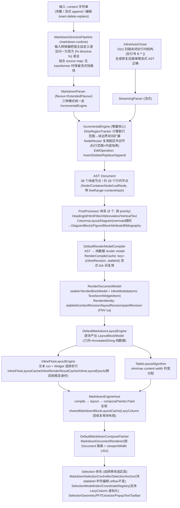
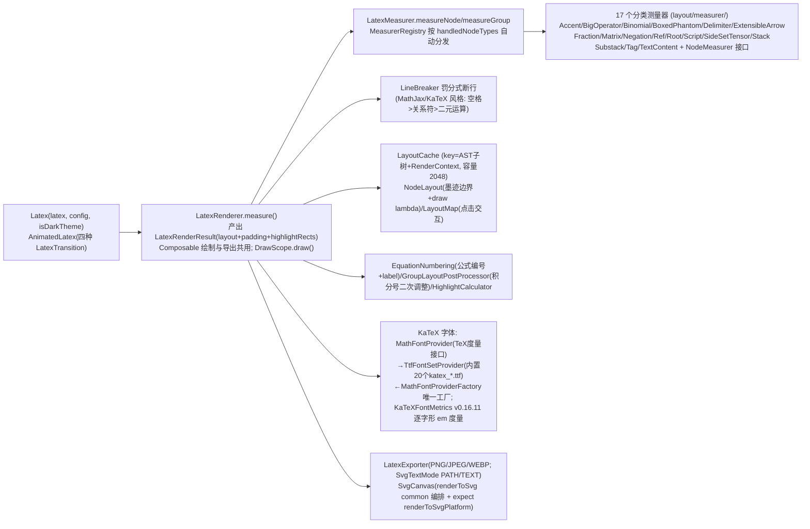
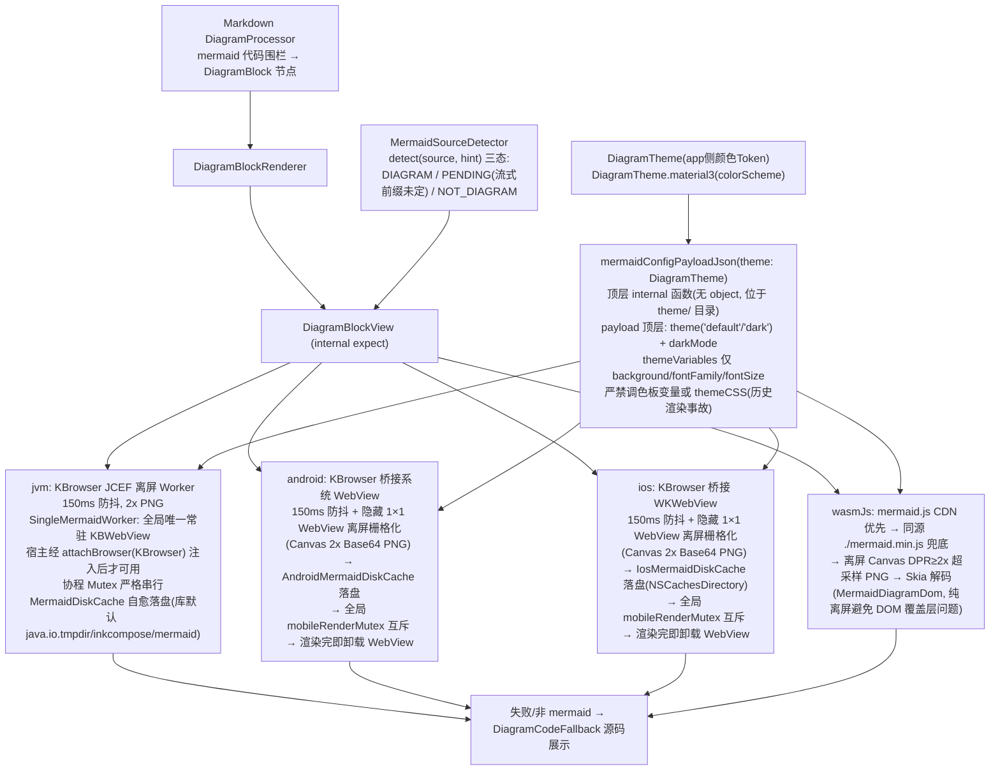

# 03 · inkcompose 模块（富文本渲染库，:inkcompose，包 xyz.emuci）

> 单 KMP 模块，目标平台 jvm / android / iosArm64+Simulator / wasmJs（无 js 目标）。约 520 个 .kt 文件（common/平台源集 389 + 测试 131）。
> 对 app 层暴露的**公共 API 只有 `xyz.emuci.inkcompose` 包**，内部领域包不要对外引用。
> 领域依赖：除 markdown-renderer → {latex/syntax/diagram}（嵌入渲染）与 diff → syntax（代码高亮复用）外，其余领域零依赖。

## 1. 公共 API（`common/entry/` + `common/image/`）

| 符号 | 文件 | 说明 |
|---|---|---|
| `MarkdownView(...)` | `common/entry/kotlin/xyz/emuci/inkcompose/MarkdownView.kt` | 统一渲染入口 Composable |
| `RenderStyle` | `common/entry/kotlin/xyz/emuci/inkcompose/RenderStyleExport.kt` | 排版版式配置（纯几何与结构规则，提供 `RenderStyle.Chat` 与 `RenderStyle.Github` 两套预设） |
| `MarkdownColors` | `common/entry/kotlin/xyz/emuci/inkcompose/RenderStyleExport.kt` | 色彩皮肤配置（纯颜色系统，解耦排版版式，提供 `light` / `dark` / `fromMaterial3` / `auto`） |
| `MarkdownConfig` | `common/entry/kotlin/xyz/emuci/inkcompose/RenderStyleExport.kt` | Markdown 解析与渲染配置（方言、表情、标题编号、`enableHighlight` 高亮开关、流式合并阈值等） |
| `LocalRenderStyle` / `LocalMarkdownColors` / `LocalMarkdownConfig` | 同目录 RenderStyleExport.kt | 排版风格、色彩皮肤与解析配置的 CompositionLocal 注入 |
| `RenderType` | 同目录 RenderType.kt | `AUTO / TEXT / MARKDOWN / LATEX / MERMAID / VLR / CODE` |
| `MermaidCacheConfig` | 同目录（object + 顶层 expect 函数） | `setBaseDirectory(path)` / `getBaseDirectory()` / `clearSessionCache(sessionKey)` |
| `LocalSessionKey` | 同目录 | `compositionLocalOf<String?>`，会话标识用于图表缓存前缀 |
| `MarkdownExporter` | `common/entry/kotlin/xyz/emuci/inkcompose/MarkdownExporter.kt` | Markdown 文档导出器（object）：`setBrowser(browser: KBrowser?)` / `getBrowser()` + `toHtml`×2（同步，自包含 HTML 字符串）+ `suspend toPdf`×2（`Result<String>`，KBrowser 打印矢量 PDF）；配置 `HtmlExportOptions` / `PdfExportOptions`（含 `landscape`/`printBackground`/`browser: KBrowser?`） |
| `DiffView` / `MultiFileDiffView` | `common/entry/kotlin/xyz/emuci/inkcompose/DiffView.kt` | 差异查看器：`DiffView` 4 重载（`DiffFile` 结构化 / unified `patch` 字符串 / `oldText,newText` 文本对比）+ `MultiFileDiffView` 多文件列表 |
| `DiffFile` / `DiffHunk` / `DiffLine` / `DiffStats` | `common/entry/kotlin/xyz/emuci/inkcompose/DiffModels.kt` | 4 个 typealias → 内部 `xyz.emuci.diff.model.*`（对外入口别名） |
| `InkImage(...)` | `common/image/kotlin/xyz/emuci/inkcompose/InkImage.kt` | 统一图片组件（Coil3）：网络 URL、base64 data URI、本地文件（`~/`、`/abs`、`file://`、Windows 盘符 `C:\`/`C:/` → `file:///`、Android `content://`）、SVG（jvm/ios/wasm=Skia SVGDOM，android=coil-svg ServiceLoader）；失败显示可见占位不静默；配套 public `getInkImageLoader(context)`（进程级共享 loader）+ `InkSvgSanitizer`（`sanitizeSvgForSkia`，修复 Skia SVGDOM 渐变缺陷，被 `InkSvgDecoder.jvm.kt` 调用） |

**MarkdownView 参数签名**：

```kotlin
fun MarkdownView(
    content: String, modifier: Modifier = Modifier,
    type: RenderType = RenderType.AUTO, isStreaming: Boolean = false,
    language: String? = null,
    style: RenderStyle = RenderStyle.Chat,   // 排版风格：Chat（气泡紧凑） / Github（标准 GFM 长文阅读）
    colors: MarkdownColors? = null,          // 色彩皮肤：null 时由 MaterialTheme.colorScheme 自动推导
    markdownTheme: MarkdownTheme? = null,    // 传统主题兼容覆盖（若传入则优先使用）
    codeTheme: CodeTheme? = null,
    markdownConfig: MarkdownConfig = LocalMarkdownConfig.current,
    latexConfig: LatexConfig = LatexConfig(),
    diagramTheme: DiagramTheme = DiagramTheme.Default,
    onLinkClick: ((String) -> Unit)? = null,
    enableSelection: Boolean = true,
    selectionMenuActions: List<SelectionMenuAction> = emptyList(),
    enableScrollOverride: Boolean? = null,   // null=BoxWithConstraints 自动检测; LazyColumn 中传 false
    sessionKey: String? = null,              // 回退到 LocalSessionKey
)
```

分发：`AUTO`→`MARKDOWN`；MARKDOWN 内 `BoxWithConstraints.hasBoundedHeight` 自动选 StaticColumn/LazyColumn；`LATEX`→`Latex`，`MERMAID`→`DiagramBlockView`，`VLR`→`VTextView`，`CODE`→`CodeBlock`；外层 `CompositionLocalProvider(LocalSessionKey, LocalRenderStyle, LocalMarkdownColors, LocalMarkdownConfig)`。

## 2. MarkdownExporter（HTML / PDF 导出）

公共入口 `common/entry/kotlin/xyz/emuci/inkcompose/MarkdownExporter.kt`：

- `object MarkdownExporter`
  - `setBrowser(browser: KBrowser?)` / `getBrowser()`：宿主注入已初始化就绪的 KBrowser 全局单例（`toPdf` 在 `options.browser` 为空时回退用它）。
  - `toHtml(markdown, options)` / `toHtml(document: Document, options)`：同步，返回完整的自包含样式独立 HTML 页面字符串。
  - `suspend toPdf(markdown, outputPath, options)` / `suspend toPdf(document, outputPath, options)`：返回 `Result<String>`，成功为生成的 PDF 绝对路径。
- 配置 DTO：`HtmlExportOptions`（title / customCss / embedFonts / flavour）；`PdfExportOptions`（title / customCss / embedFonts / `landscape` / `printBackground` / flavour / `browser: KBrowser?`）。
- 平台 actual 四份：
  - **jvm 真实现**（`jvm/kotlin/xyz/emuci/inkcompose/MarkdownExporter.jvm.kt`）：`getBundledMongolianFontBase64()` 读打包字体（`composeResources/xyz.emuci.inkcompose.resources/font/NotoSansMongolian-Regular.ttf`，进程级缓存）；`exportMarkdownHtmlToPdfPlatform` 用 KBrowser `printToPDF`（`CefPdfPrintSettings`），页面 load 20s 超时 + 打印 Mutex 严格串行。
  - **android / ios / wasmJs 桩**（同包 `MarkdownExporter.{android,ios,wasmJs}.kt`）：`getBundledMongolianFontBase64()` 返回 null；`exportMarkdownHtmlToPdfPlatform` 返回 `Result.failure(UnsupportedOperationException(...))`。
- 引入 2 个新 expect：`exportMarkdownHtmlToPdfPlatform` + `getBundledMongolianFontBase64`（均定义在 `MarkdownExporter.kt`）。

## 3. Markdown 渲染管线

### 3.1 全管线流程图



### 3.2 解析器要点（`common/markdown-parser/kotlin/xyz/emuci/markdown/parser/`）

- **入口** `MarkdownParser.kt`：`MarkdownParser(flavour=ExtendedFlavour, customEmojiMap, enableAsciiEmoticons, enableLinting, appendCoalesceThreshold=0, enableHighlight=null)`（`enableHighlight: Boolean?` null=跟随 flavour 默认；`InlineParser` 行内扩展开关（自动链接/扩展行内/强调合并/删除线）统一由 `MarkdownFlavour` 单源提供，`enableHighlight` 保留独立覆盖参数）；完整 `parse()` / 流式 `beginStream+append+endStream` / 编辑 `insert/delete/replace`；暴露 `document`、`sourceText`、`diagnostics`。
- **Flavour 体系**（`flavour/`）：`MarkdownFlavour`（接口：blockStarters + postProcessors 定义方言；行内开关 `enableGfmAutolinks/enableExtendedInline/enableEmphasisCoalescing/enableStrikethrough/enableHighlight` 默认值）→ `CommonMarkFlavour`（零扩展，`enableHighlight=false`）→ `GFMFlavour`（+表格/任务列表/删除线/自动链接，`enableHighlight=false`）→ `MarkdownExtraFlavour`（PHP Extra，明确排除 math/emoji/directive，`enableHighlight=false`）→ `ExtendedFlavour`（默认全集，`enableHighlight=true`）；`FlavourCache`：内置单例方言全局共享、预构建冻结 `BlockStarterRegistry`。
- **BlockStarter 体系**（`block/starters/`）：接口 `priority`（越小越先）+ `canInterruptParagraph` + `tryStart(cursor, lineIdx, tip)`；17 个实现：Heading/SetextHeading/FencedCodeBlock/IndentedCodeBlock/BlockQuote/ListItem/Table/ThematicBreak/HtmlBlock/FrontMatter/CustomContainer/MathBlock/FootnoteDefinition/DefinitionDescription/DirectiveBlock/PageBreak/TabBlock。辅助：`BlockParser`（块级主循环）、`OpenBlock`（栈节点）、`TableParser`。
- **PostProcessor 体系**（`block/postprocessors/`）：接口 `priority + process(document)`；`PostProcessorRegistry`（Copy-on-Write 原子注册表，`withDefaults()`）；9 个：HeadingIdProcessor、HtmlFilterProcessor、AbbreviationProcessor、VerticalTextProcessor（```vlr→VerticalTextBlock）、ColumnsLayoutProcessor、DiagramProcessor（mermaid 围栏→DiagramBlock）、FigureProcessor、BlockAttributeProcessor、BibliographyProcessor。
- **AST**（`ast/`）：`Node`→`ContainerNode`/`LeafNode`。块级 38 个（Document/Heading/SetextHeading/Paragraph/ThematicBreak/FencedCodeBlock/IndentedCodeBlock/BlockQuote/ListBlock/ListItem/HtmlBlock/LinkReferenceDefinition/Table*/FootnoteDefinition/MathBlock/DefinitionList*/Admonition/FrontMatter/BlankLine/TocPlaceholder/AbbreviationDefinition/CustomContainer/DiagramBlock/VerticalTextBlock/ColumnsLayout*/PageBreak/DirectiveBlock/TabBlock*/BibliographyDefinition/Figure；`BlockNodes.kt` 另含非节点 `BibEntry` data class）；行内约 28 个（Text/Soft|HardLineBreak/Emphasis/StrongEmphasis/Strikethrough/InlineCode/Link/Image/Autolink/InlineHtml/HtmlEntity/EscapedChar/FootnoteReference/InlineMath/Highlight/Superscript/Subscript/InsertedText/Emoji/StyledText/Abbreviation/KeyboardInput/DirectiveInline/CitationReference/Spoiler/WikiLink/RubyText）。`inline/InlineParser`（CommonMark 分隔符算法链表实现）+ `InlineScanner`。
- **基础设施**：`core/SourceText`（行偏移索引+contentHash）、`LineCursor`（tab 展开）、`AttributeParser`、`HtmlEntities`；`html/HtmlRenderer`（AST→HTML，SSR/导出）；`lint/`（Diagnostic/LintingPostProcessor）。

### 3.3 渲染器要点（`common/markdown-renderer/kotlin/xyz/emuci/markdown/renderer/`）

- **管线层次**：`Markdown.kt`（顶层 Composable：异步解析+文档缓存，Static/Lazy 双模式；`MarkdownStreaming.kt` 全局 `parsedDocumentCache` key=(markdown, MarkdownConfig) 防跨配置污染，`MarkdownConfig.enableHighlight: Boolean?=null` 透传 `MarkdownParser`（null=跟随 flavour））→ `internal/RendererFacadeState`（门面状态）→ `internal/MarkdownEngineHost`（三段管线宿主，持有 InlineLayoutRuntime + 全局共享块布局缓存）→ `MarkdownDocumentRenderer`（按 Document 隔离 + viewportWidth 有界 LRU 防 LazyColumn 高度 thrash）→ `internal/compose/`（`MarkdownComposePainter` 绘制接口 + `DefaultMarkdownComposePainter` + `ComposeRenderEnvironment` + `InlineLayoutContent`）。
- **顶层包文件**（除 `Markdown.kt` 入口、`MarkdownConfig`/`MarkdownTheme`/`MarkdownColors`/`RenderStyle` 预设与上文各 internal 组件外）：`MarkdownImage.kt` / `MarkdownLayouts.kt` / `MarkdownNavigationController.kt` / `MarkdownRenderMode.kt` / `MarkdownStreaming.kt` / `RendererContext.kt` / `FootnoteNavigation.kt` / `SelectionMenuAction.kt`。
- **Render model 编译**（`internal/core/`）：`compile/RenderModelCompiler`（接口）→ `DefaultRenderModelCompiler`（唯一实现，AST→纯数据）；`RenderCompileEnvironment`；`compile/InlineCompiler`；`compile/RenderCompileCache`；`identity/RenderIdentity`（四元组 revision，FNV-1a 内容寻址）；`model/`（RenderDocumentModel/RenderBlockModel(sealed)/InlineModel(InlineAtom=TextAtom+WidgetAtom)/WidgetModel(sealed Inline+Block 两族)）。
- **布局引擎**（`internal/layout/`）：`engine/MarkdownLayoutEngine`(接口)→`DefaultMarkdownLayoutEngine`(object)；`LayoutEnvironment`（viewportWidth/blockSpacing/theme/density/textMeasurer/latexMeasurer/epoch…）；`BlockMeasurementKernel`；`engine/MarkdownLayoutSource` / `engine/TableLayoutMetrics`；`inline/InlineFlowLayoutEngine.computeInlineFlowLayout` + 缓存三件（`InlineFlowLayoutCache`/`InlineRenderResultCache`/`InlineLayoutEpoch` 跨回收稳定环境身份）+ `InlineLayoutRuntime`（每 Host 运行时）+ `InlineFlowInput`/`InlineFlowModels`/`InlineLayoutBlockSupport`/`InlineLayoutMetrics`/`LayoutInlineRunGeometry`；`table/TableLayoutAlgorithm`；`list/ListLayoutMetrics`；输出 `model/LayoutBlockModel/LayoutDocumentModel/LayoutGeometry`；`widget/BlockWidgetLayoutProtocol`（图/表/竖排测量摆放协议）。
- **Block renderer**（`block/`，分发器 `BlockRenderer`）：Paragraph/Heading/BlockQuote/List/Table/CodeBlock（info-string `{title/linenos/highlight}`）/MathBlock（嵌入 Latex）/DiagramBlock（→DiagramBlockView）/VerticalTextBlock（→VTextView）/Admonition（`> [!NOTE]`）/CustomContainer（`:::type`）/Directive（`` 外部插件，渲染桥 `internal/adapter/DirectiveScopeAdapters`）/Figure/FigureCaption/ColumnsLayout/TabBlock/Bibliography/PageBreak/ThematicBreak/Misc（HtmlBlock/FrontMatter/脚注）。
- **Selection**（`internal/selection/`，自研跨块选区层）：MarkdownSelectionController（组合状态/手势/渲染/复制）、MarkdownSelectionState（range+活动手柄+`isMouseInput` 输入模式标志）、SelectionAnchor（块 stableId+块内字符偏移，reflow 不变）、SelectionModelIndex（块序列↔字符偏移全局索引）、SelectionGestures/Handles/Modifiers、SelectionCoordinateRegistry（window↔local 换算，支持 LazyColumn 虚拟化）、SelectionGeometry（RunHit 命中检测）、SelectionTextExtractor、`expect plainTextClipEntry`(SelectionClipboard)、`expect isSecondaryClick()`、PopupTextToolbar(自实现 TextToolbar，纯渲染协议：`MenuState` 只存锚点 rect、忽略 TextToolbar 回调)、PopupTextToolbarHost(Popup 黑白紧凑菜单：`PopupPositionProvider` 把 rect 经 `rootCoordinates.windowToLocal` 换算定位，行高 40dp、`leadingIcon`（前导图标，可空）)、SurrogateSupport（UTF-16 代理对防 emoji 切半）。**输入模式分流**（桌面级选取）：`SelectionGestures` 新增不消费事件的 pointerInput recorder（`awaitEachGesture{awaitFirstDown(requireUnconsumed=false)}` 按 `down.type` 写入 `state.isMouseInput`）；`detectDragGestures.onDrag` 按 `change.type` 分流——Mouse 跳过 `dispatchPreScroll` 直接框选（列表滚动交滚轮），Touch 保持 nestedScroll 先喂父级 LazyColumn；`finishSelectionGesture`/`selectWordAtRootLocal`/`showContextMenuAt` 仅触屏 bump `toolbarRequestKey` 且仅触屏设 `skipNextTapClear`（鼠标右键弹菜单后，下次左键点击直接清选区）。
- **缓存设施**：`internal/util/LruCache`（通用有界 LRU，主线程无锁）、`DimensionUtils`（`parseDimensionDp`/`parseFontSizeSp` 字符串尺寸解析）、`CacheMutex`（class + 顶层 expect 函数：JVM=监视器锁/Native=AtomicInt CAS 自旋锁/wasm=直接执行）、RenderCompileCache、InlineRenderResultCache、InlineFlowLayoutCache、sharedMarkdownBlockLayoutCache、viewportWidthCache。

## 4. LaTeX 域

### 4.1 解析器（`common/latex-parser/`）

- **入口** `LatexParser.kt`：组件化 = `LatexTokenStream`（peek/advance/expect）+ `EnvironmentParser`（matrix/aligned/cases…）+ `CommandParser` + `ChemicalParser`（`\ce{}`）+ `LatexParserContext`（含自定义 `\newcommand`）。
- **handler 体系**（`component/handler/`）：`CommandRegistry`（`fun interface CommandHandler { parse(cmdName, ctx, stream): LatexNode? }` + 按类别 installXxxHandlers）；目录共 21 个文件（19 个分类 Handlers + `CommandRegistry` + `ParseUtils`）：Accent/Advanced/ArrowAndStack/BigOperator/Color/Delimiter/Fraction/Hyperlink/Macro/Operator/PackageCommand/Reference/Root/Section/Space/SpecialEffect/Style/Table/TextDirection。
- **增量**：`IncrementalLatexParser`（tree-sitter 风格三层：增量分词→AST 子树复用→容错解析）；`incremental/IncrementalTokenizer`（脏区分词+偏移平移复用）、`TreeReuser`（prefix/dirty/suffix 三段）、`TextEdit`（TSInputEdit 语义）。Tokenizer：`LatexTokenizer`（startOffset 增量扫描）。
- **AST**：`model/LatexNode.kt` sealed 约 50 个节点（Text/Command/Environment/Group/Superscript/Subscript/Fraction/Root/Matrix/Array/Symbol/Operator/Delimited/Accent/BigOperator/Stack/Binomial/Color/MathStyle/Aligned/Cases/Split/Multline/Eqnarray/Subequations/Boxed/Enclose/Phantom/NewCommand/Negation/Tag/Substack/Smash/SideSet/Tensor/Label/Ref/EqRef…），自描述协议（children/withSourceRange/withChildren/accept）；`SourceRange`。
- **基础设施**：`SymbolMap`（LaTeX 符号→Unicode 表）、`SourceMapper`（源码偏移↔AST 双向，编辑器集成）、`ParseDiagnostic`。
- **Visitor**：`LatexVisitor<T>`+Base、`MathMLVisitor`（AST→Presentation MathML）、`AccessibilityVisitor`（MathSpeak 风格屏幕阅读文本）。

### 4.2 渲染器（`common/latex-renderer/`）



- 公共入口：`Latex.kt`（`Latex(...)` + `LatexAutoWrap` 自适应换行版）、`AnimatedLatex.kt`（`LatexTransition{CROSSFADE, SLIDE_UP, SLIDE_DOWN, FADE_SLIDE}`）；配置 `model/RenderStyle.kt` 的 `LatexConfig`（fontSize/theme/lineBreaking/highlight/accessibilityEnabled/onNodeClick/onHyperlinkClick）与 `LatexTheme/LatexThemeColors`。

## 5. 语法高亮域

- **解析**（`common/syntax-parser/`）：`Lexer` 接口（`tokenize(code): List<CodeToken>`，range 全覆盖）；`LanguageRegistry`（object 注册表+别名+惰性默认注册）；`ConfigurableLexer`（规格驱动通用 Lexer：keywords/builtins/types/fixedTokens/注释/字符串/注解前缀/大小写/运算符，多数语言由它派生）；29 个语言 Lexer object（CppLexer 在 `CLexer.kt`、HtmlLexer 在 `XmlLexer.kt`，两文件各含 2 个 object；按 `lexer/` 目录文件：Bash/CLexer(C+Cpp)/Css/Dart/Diff/Dockerfile/Elixir/Go/Haskell/Java/JavaScript/Json/Kotlin/Lua/Php/PlainText/Python/RLang/Ruby/Rust/Scala/Sql/Swift/Toml/TypeScript/XmlLexer(Xml+Html)/Yaml，共 27 个语言文件）；`LanguageRegistry.registerDefaults()` 注册 28 个规范语言 + PlainText 兜底；`stream/IncrementalHighlighter`（稳定前缀 Token 复用+尾部脏区重解析+(language|code) AST 缓存）；模型 `CodeAst/CodeToken/TokenType`。
- **渲染**（`common/syntax-render/`）：`CodeBlock(code, language, title, isStreaming, theme, showLineNumbers, startLine, highlightedLines, showCopyButton…)`；`InlineCode/InlineCodeStyle/InlineCodeMeasurer`；`StreamingCursor`（流式光标动画）；`HighlightedString`（CodeLineKind 共 6 值：NORMAL/HIGHLIGHTED/DIFF_ADDED/DIFF_REMOVED/DIFF_META_HEADER/DIFF_META_HUNK，diff meta 行着色，与 `CodeTheme.backgroundForLine` 配套）；主题 `CodeTheme` 接口 + `OneDarkPro/DraculaPro/GithubLight/SolarizedLight` 内置 object（LocalCodeTheme 默认 OneDarkPro）；`i18n/Strings`（中英）+ `PlatformLocale`（object + expect `getPlatformLocaleLanguageCode`）。

## 6. 差异查看域（`common/diff/`）

- 目录结构 `common/diff/kotlin/xyz/emuci/diff/`：
  - `algorithm/MyersDiffAlgorithm.kt`：public `object MyersDiffAlgorithm`（`computeDiff(oldText, newText, contextRadius, filePath)` / `computeDiffLines(oldLines, newLines)`；Myers 差分 + hunk 构建）。
  - `parser/UnifiedDiffParser.kt`：public `object UnifiedDiffParser`（`parse(diffText): List<DiffFile>` 解析标准 git/unified diff；`detectLanguage(filePath)`）。
  - `model/DiffModel.kt`：`DiffFile`（oldPath/newPath/language/hunks/stats + displayPath/fileName）、`DiffHunk`（oldStart/oldCount/newStart/newCount/header/lines）、`DiffLine`（sealed：Unchanged/Added/Deleted）、`DiffStats`（additions/deletions + `calculate(hunks)`）。
  - `model/DiffDisplayModel.kt`：`DiffDisplayItem`（sealed：`CodeLine` / `Collapsed` 折叠区段 + 展开逻辑）。
  - `ui/`：`DiffFileHeader` / `DiffHunkExpander` / `DiffLineRow`（Composable 文件头、折叠胶囊、代码行）。
  - `syntax/DiffSyntaxHighlighter.kt`：public `object DiffSyntaxHighlighter`（`highlightLine(content, language, theme): AnnotatedString`，桥接 syntax-parser 的 `LanguageRegistry`/`Lexer` + syntax-render 的 `buildHighlightedString`）。
- 公共入口（`common/entry/kotlin/xyz/emuci/inkcompose/`）：
  - `DiffView.kt`：`DiffView` 4 重载（`DiffFile` 结构化输入 / `patch: String` unified diff 输入 / `oldText, newText` 文本对比输入）+ `MultiFileDiffView(diffs: List<DiffFile>)` 多文件列表。
  - `DiffModels.kt`：4 个 typealias（`DiffFile`/`DiffHunk`/`DiffLine`/`DiffStats` → 内部 `xyz.emuci.diff.model.*`）。
- 依赖链：diff → syntax-render（`DiffView`/`DiffSyntaxHighlighter` 复用 `xyz.emuci.syntax.theme.CodeTheme` + Lexer + 高亮）。
- 消费方：app/shared 的 DIFF 面板（`InfoPanels.kt` 的 `DiffPanelContent`）只用 `DiffView(oldText/newText, filePath)` 单文件重载渲染 turn 差异；`MultiFileDiffView` 无仓内消费方（公共 API，供外部宿主使用）。

## 7. 图表域（`common/diagram/`）



- **jvm 渲染工作者** `SingleMermaidWorker`（`jvm/.../diagram/mermaid/SingleMermaidWorker.kt`）：`object`，全局唯一常驻 `KBWebView`，协程 Mutex 严格串行；宿主经 `attachBrowser(browser: KBrowser)` 注入已就绪的 KBrowser 单例，`isBrowserAttached()` 查询注入状态——**未注入前 Worker 不可用**，`ensureWorkerReady` 轮询等待 2s 后放弃；`KBrowser` 已升为 commonMain 依赖（宿主与库共享同一单例）。
- **磁盘缓存** `MermaidDiskCache`（`jvm/.../diagram/mermaid/MermaidDiskCache.kt`）：库默认根目录 = `java.io.tmpdir/inkcompose`（落盘 `${baseDir}/mermaid/`）；`~/.mederi/mermaid` 仅当宿主经 `MermaidCacheConfig.setBaseDirectory(path)` 注入后生效。具备目录/坏文件自愈 + 原子写（.tmp → renameTo）。
- **各平台 mermaid.js 加载策略**：
  - jvm：worker HTML 优先内嵌 `jvm/resources/mermaid.min.js`（inline `<script>` 内联），读取失败回退 CDN `cdn.jsdelivr.net/npm/mermaid@11`（`SingleMermaidWorker.kt:232-241` `buildWorkerHtml`）；
  - android / ios：移动端 worker 页只走 CDN（`buildMobileWorkerHtml`，无内嵌资源通道）；
  - wasmJs：**CDN 优先 → 同源 `./mermaid.min.js` 兜底**（`MermaidDiagramDom.wasmJs.kt:117`，urls 依次尝试，非"同源优先"）。

## 8. 竖排文字域（`common/vtext/`）

- `VTextView`：**public** `@Composable fun VTextView(text, modifier, style, config: VTextConfig = VTextConfig())`（`common/vtext/kotlin/xyz/emuci/vtext/VTextView.kt`）——只读竖排（蒙古文/满文随列旋转连写、汉字假名直立补偿，自动加载 NotoSansMongolian）；`config.verticalFontFamily` 为空时回退打包字体。
- `VerticalText`（列度量 `ColumnMetrics`/`computeColumnMetrics`、Canvas 绘制、直立字符判定 `shouldBeUprightCodePoint`）。
- `VTextConfig`（`VTextConfig.kt`，6 字段）：`verticalFontFamily`（默认 Noto Sans Mongolian）、`ascentTrim`、`baselineShift`、`fixedWidth`、`columnSpacing`、`softWrap: Boolean = false`（自动折列换行；`VTextInternalConfig` 同步）。
- **`vlr` 块属性**：Markdown ```vlr 围栏可携带 `height`（如 `300dp`）、`fontSize`（如 `18sp`）、`wrap` 属性（解析进 `VerticalTextBlock` 的 `height/fontSize/wrap` + Kramdown/Pandoc 风格 `attributes`）；`VerticalTextBlockRenderer`（`markdown-renderer/block/VerticalTextBlockRenderer.kt`）解析为 `VerticalTextBlockWidgetModel`，`wrap` 传导为 `VTextView` 的 `VTextConfig.softWrap`（`wrap=true` 时自动折列，`false` 时对固定高度启用竖向滚动）。

## 9. runtime 域（`common/markdown-runtime/`）—— 宿主扩展机制

- `MarkdownDirectivePipeline`：按注册表顺序串联 input transformer，组合 source map；`supportsStreamingFastPath`。
- `MarkdownDirectivePlugin`（扩展插件接口，四合一）：`id`/`priority` + `inputTransformers` + `blockDirectiveRenderers`/`inlineDirectiveRenderers` + `htmlDirectiveFallbacks`。
- `MarkdownDirectiveRegistry`：插件按 priority+id 排序，聚合 tag→renderer 映射。
- `MarkdownInputTransformer`：把宿主自定义语法转换成官方 directive 语法（避免污染 parser）。
- `DirectiveBlockRenderScope`（tagName/args/content）暴露给外部插件渲染原生 Compose 内容；`HtmlDirectiveFallback`/`MarkdownSourceMap`/`MarkdownTransformResult`。
- **用途**：宿主 app 注册 `MarkdownDirectivePlugin` 注入自定义块/行内 UI；与渲染器经 `MarkdownConfig`/`RendererFacadeState.directiveRegistry` 打通。

## 10. 平台层（expect → actual 矩阵）

commonMain 全部顶层 expect 函数（零 expect class/object）：`DiagramBlockView`(diagram)、`setMermaidCacheBaseDirectory`/`getMermaidCacheBaseDirectory`/`clearMermaidSessionCache`(entry/MermaidCacheConfig)、`exportMarkdownHtmlToPdfPlatform`/`getBundledMongolianFontBase64`(entry/MarkdownExporter)、`inkExpandUserHome`/`inkSvgDecoderFactory`(image)、`getCurrentPlatform`/`measureGlyphBounds`/`renderToSvgPlatform`/`ImageBitmap.encodeToFormat`(latex-renderer)、`createCacheMutexHandle`/`withCacheMutexLock`/`plainTextClipEntry`/`isSecondaryClick`(markdown-renderer)、`getPlatformLocaleLanguageCode`(syntax)。

| 领域 | jvm | android | ios | wasmJs |
|---|---|---|---|---|
| diagram | DiagramBlockView.jvm + MermaidDiskCache + SingleMermaidWorker | DiagramBlockView.android + AndroidMermaidDiskCache | DiagramBlockView.ios + IosMermaidDiskCache | DiagramBlockView.wasmJs + MermaidDiagramDom |
| image | InkImagePlatform.jvm（`inkExpandUserHome` + `inkSvgDecoderFactory`=Skia SVGDOM）+ InkSvgDecoder + MermaidCacheConfig | InkImagePlatform.android（`inkExpandUserHome` + `inkSvgDecoderFactory`=null 交 coil-svg）+ MermaidCacheConfig | InkImagePlatform.ios（同两函数）+ InkSvgDecoder + MermaidCacheConfig | InkImagePlatform.wasmJs（同两函数，含 SVG 解码器）+ InkSvgDecoder + MermaidCacheConfig(no-op) |
| latex | LatexExporter/SvgCanvas/GlyphBoundsProvider/Platform | 同左各 .android | 同左各 .ios | 同左各 .wasmJs |
| selection | SelectionClipboard/SelectionPointerEvent/CacheMutex | 同左 | 同左 | 同左 |
| i18n | PlatformLocale(Locale.getDefault) | 同左 | 同左 | 同左 |
| export | MarkdownExporter.jvm（真实现：printToPDF） | MarkdownExporter.android（桩：UnsupportedOperationException） | MarkdownExporter.ios（桩） | MarkdownExporter.wasmJs（桩） |

> `InkImagePlatform` 是**文件名**而非类名——四平台文件 `InkImagePlatform.{jvm,android,ios,wasmJs}.kt` 各只含 `inkExpandUserHome` + `inkSvgDecoderFactory` 两个 actual。

平台 actual 落在**嵌套包目录**（非平铺合并）：`jvm|android|ios|wasmJs/kotlin/xyz/emuci/{codehigh,diagram,inkcompose,latex,markdown}`；syntax 域 i18n actual 置 `codehigh/i18n/`（包仍 `xyz.emuci.syntax.i18n`）；diff 域无平台 actual。jvm 另有 `jvm/resources/`：`mermaid.min.js` + 11 个 `.pro` 文件（`META-INF/proguard/`：codehighlight-parser/render、diagram-core/layout/parser/render、latex-base/parser/renderer、syntax-parser/render）。

## 11. 构建配置（`inkcompose/build.gradle.kts`）

- 源集组织：`val inkModules = [entry, image, latex-parser, latex-renderer, syntax-parser, syntax-render, diagram, markdown-parser, markdown-runtime, markdown-renderer, vtext, diff]`（12 个领域目录）；`commonMain.kotlin.srcDirs(inkModules.map { "common/$it/kotlin" })`；commonTest 同法映射 `common-test/<domain>/kotlin`；`jvmMain←jvm/kotlin(+resources←jvm/resources)`、`jvmTest←jvm-test/kotlin`、`androidMain←android/kotlin`、`iosMain←ios/kotlin`、`wasmJsMain←wasmJs/kotlin`。
- 依赖：commonMain `api` = compose.runtime/foundation/ui/material3/components.resources + kotlinx-coroutines-core；`implementation` = coil-compose、coil-network-ktor3、**ktor-client-core**（对齐 Ktor 版本消除 wasmJs 传递 npm `ws` 版本冲突）、**kbrowser**。androidMain 加 androidx.graphics.path + **ktor-client-cio**（库自带引擎保证 URL 图即用）+ coil-svg；iosMain ktor-client-darwin；jvmMain compose.desktop.currentOs + ktor-client-cio + **kotlinx-coroutinesSwing**。
- Compose resources：`packageOfResClass = "xyz.emuci.inkcompose.resources"`；`customDirectory("commonMain", common/composeResources)` —— KaTeX 字体 ×20 + NotoSansMongolian-Regular.ttf。
- 所有 Test 任务注入 JCEF JVM 参数（`--enable-native-access=jcef` 与两处 add-opens，服务 Mermaid 离屏渲染测试）。`jvmToolchain(25)`。
