# 04 · 核心流程图与时序图

> 本篇描述运行时行为。类与文件的位置见 01-core.md / 02-app-shared.md。

## 1. 发送消息全链路（sendMessage 端到端时序图）

```mermaid
sequenceDiagram
    autonumber
    participant UI as WorkspaceViewModel<br/>(app/shared commonMain)
    participant AC as AiCore<br/>(MederiAiCore 直调 / ServerAiCore REST)
    participant SM as SessionManagerImpl
    participant TE as TurnExecutor
    participant HS as HistoryStore (data.db)
    participant K as Koog AIAgent (turn 内)
    participant LLM as LLM 供应商
    participant EB as eventBus (SharedFlow)

    UI->>UI: guardImageSupport 剔除放行(模型不支持图片 → 剔除本次图片<br/>+ 一次性轻提示 imageStrippedNotice; 历史保留)<br/>PromptComposer.compose(主指令+粘贴文本)<br/>乐观消息入 pendingUserMessages
    UI->>AC: sendMessage(conversationId, ChatPromptInput{text, model, agent, thinkingLevel=effectiveThinkingLevel, apiKeyId=getApiKeyId(model.provider)})
    AC->>AC: MederiInputMapper.toMessageParts / toAgentConfig；记录 lastApiKeyIdByProvider（自动命名跟随用）
    AC->>SM: SessionManager.sendMessage(id, SendMessageRequest{..., apiKeyId})
    SM->>TE: TurnExecutor.sendMessage(sessionId, request)
    TE->>TE: activeApiKeyId = request.apiKeyId（本 turn 唯一真理源）
    TE->>TE: 校验 IDLE → 读 Project → PlanStore.loadBySession<br/>组装 activePlanContent/spec指针/activeTodoContent(互斥)
    TE->>TE: SystemPrompts.build(agentMode, activePlan, activeTodo)<br/>+ withSkills(继承角色) + withProjectRules(AGENTS.md 指令链,<br/>向上:git根→项目目录 + 向下:项目目录直接子目录一层, 浅→深)
    TE->>TE: effectiveModel/effectiveReasoningLevel → sessionStore.updateAgentConfig
    TE->>HS: append(用户消息+durable环境块) 【durable-first】
    TE->>EB: SESSION_UPDATED
    TE->>TE: sessionStore.updateStatus(RUNNING)
    TE->>TE: scope.launch { runTurn() }
    AC-->>UI: (立即返回)

    rect rgb(235, 244, 255)
        note over TE,LLM: runTurn（后台协程）
        TE->>TE: 解析 apiKey = activeApiKeyId?.let{getKeyValue(provider,it)} ?: getDefaultKeyValue(provider)<br/>(选定 key 优先，未选回退默认；压缩/子代理/浏览器同类同源)
        TE->>TE: preflightCompressionIfNeeded<br/>(contextUsedTokens > 70% 窗口 → compressOnce，带 apiKeyId)
        TE->>TE: ToolFactory.build(工具集, agentMode/role裁剪)<br/>透传 AgentsSubtreeDiscovery: read/list 工具访问路径上<br/>发现未注入过的 AGENTS.md 时追加进工具返回文本(会话级去重)
        TE->>TE: buildTurnAgent: KoogClientFactory(+RetryableLLMClient)<br/>+ KoogModelBuilder + KoogParamsBuilder<br/>+ ChatMemory(HistoryStoreChatHistoryProvider)<br/>+ graphStrategy(+Compression) + EventHandler
        K->>HS: load → aiViewWindow(最后 SUMMARY 之后) → KoogMessageMapper
        K->>LLM: requestLLMStreaming(系统提示+AI视图窗口+哨兵输入)
        loop 流式帧
            LLM-->>K: StreamFrame (text/reasoning/tool_call/tool result/end)
            K-->>EB: MESSAGE_DELTA (launchStreamConsumer)
            EB-->>UI: SSE 或进程内 → SnapshotReducer 更新快照
        end
        loop 工具循环 (maxAgentIterations=50)
            K->>K: toAssistantMessageSafe(args 坏 JSON 降级 "{}")
            K->>HS: TurnIncrementalPersister.persistAssistant（增量落库防崩丢）
            K->>K: nodeExecuteTools: 执行工具<br/>(文件写白名单/沙盒命令/Plan/Verify/ask_user...)
            K-->>EB: TOOL_CALLED / TOOL_RESULT 事件
            alt ask_user / create_plan(APPROVAL)
                K-->>EB: QUESTION_REQUESTED / PLAN_APPROVAL_REQUESTED (工具协程挂起)
                UI-->>AC: resolveQuestion / resolvePlanApproval
                AC->>TE: resolveQuestion/resolvePlanApproval → deferred.complete
                K->>HS: persistToolResults
            end
            K->>LLM: send_tool_results → requestLLMStreaming
        end
        K->>HS: ChatMemory store → HistoryStoreChatHistoryProvider.reconcile<br/>(指纹对齐/插 SUMMARY/补诊断; 失败退回 replace)
        TE->>HS: (压缩触发时) 插入 SUMMARY 标记消息
        TE->>EB: MESSAGE_COMPLETED (可选 warning)
        TE->>TE: diffTracker.captureSnapshot → diffStore.save(TurnDiff)
        TE->>TE: sessionStore.updateStatus(IDLE)
    end
    UI->>UI: SnapshotReducer.applyWithRefresh + refreshPage 回查落库对齐
```

## 2. Turn 执行流程图（含错误分类）

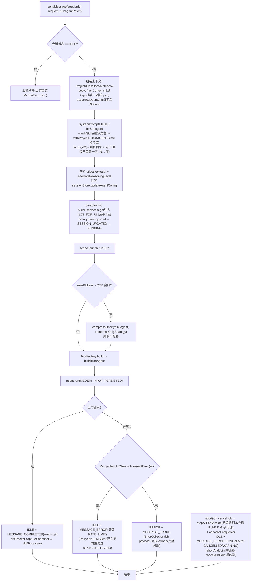

**事件流消费侧**：`eventBus` → 三路消费：① `MederiAiCore.events()`（进程内）/ `GET /v1/events`（SSE 遥控端）→ 客户端 `SnapshotReducer` 聚合快照；② `launchStreamConsumer` 把 StreamFrame 转 MESSAGE_DELTA；③ UI 层特性（SessionTitleService 等）订阅。

## 3. 事件 → UI 快照聚合流程

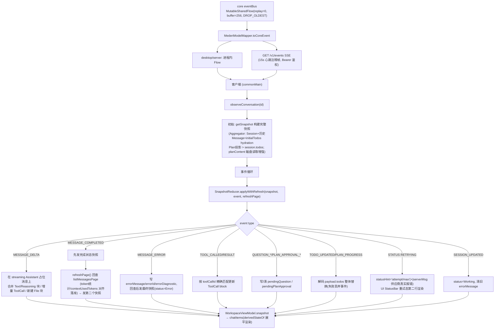

**BROWSER_TASK_* 事件**：`BROWSER_TASK_STARTED/STEP/COMPLETED/ERROR/STOPPED` 不经 `SnapshotReducer` 聚合，由 `WorkspaceViewModel` 侧直接消费（展开浏览器面板 / 更新步骤列表）。

## 4. Plan Loop（复杂改动主流程）

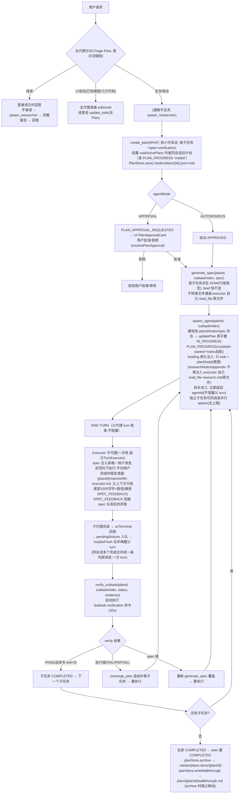

**并行执行（2026-09，2026-09-14 异步化）**：工具执行节点 `nodeExecuteTools(parallel=true)`——同一条消息的多个工具调用并行执行，无并发上限，由 AI 调度（信任 AI，代码不设闸门，仅沙箱兜底）。约束：`create_plan` 单独发；**禁止同消息混发 generate_spec 与 spawn_agent**（并行无序，spawn 可能读到未写入的 spec）；同文件并发写已由 `FileWriteRegistry` 代码级硬拒绝（write_file/edit_file try-lock，占用即 Error，AI 下轮重试），不得重复执行同一命令仍靠 AI 自律。plan 状态写入一律走 `PlanStore.updatePlan`（原子读改写），防止并行 spawn/generate_spec/verify 互相覆盖。**子代理异步化（2026-09-14）+ 主动上报（2026-09-25）**：spawn_agent / spawn_researcher 改为异步派工（立即返回 agentId，后台协程跑子代理），父代理 turn 不再被阻塞，可继续对话；子代理终态经 `SubagentManager.onTerminal` 回调入 TurnExecutor `pendingNotices` 队列，父 turn 空闲时 `maybeFlush` 批量合并成一条内部消息自动唤起新 turn（同会话多个完成合并成一次 turn；竞态时放回队列等 turn 收尾冲刷；watchdog 默认 10 分钟超时发 stalled 通知）。`wait_agent` 枚举值已删，父代理不再阻塞拉取。**diff 合并子代理改动（2026-09-23）**：主 turn runTurn 开头 `ParentDiffRegistry.register`，子代理 turn 结束时把文件改动经 `onTurnDiff` 回调 + `ParentDiffRegistry.mergeInto` 合并进父 turn 的 `TurnDiffTracker`（`mergeChanges`），finally 里 `unregister`——修复"turn 改动摘要不含子代理改动"的 bug。子代理自身 diff 仍独立落库（其临时 InMemory store），合并只影响父 turn 的 TurnDiff 聚合。**walkthrough 自动生成（2026-09-23）**：计划全部子任务 COMPLETED 时，`PlanStore.writeWalkthrough(plan)` 自动装配 walkthrough 文档写至 `plans-done/{planId}-walkthrough.md`（内容由 `buildWalkthrough` 聚合 plan/subtask/spec/verification/changes）。

**Plan 审批时序（APPROVAL 模式）**：

```mermaid
sequenceDiagram
    autonumber
    participant M as 主代理(工具协程)
    participant PAR as PlanApprovalRequester
    participant EB as eventBus
    participant UI as WorkspaceViewModel(SnapshotReducer)
    participant TE as TurnExecutor
    participant PS as PlanStore(.mederi/plans/)

    M->>PS: PlanStore.save(plan)
    M->>PAR: request(planId, planPath, title, summary, planContent, subtaskCount)
    PAR->>PAR: 取消当前 pending(superseded)
    PAR->>EB: PLAN_APPROVAL_REQUESTED(payload 含 planContent)
    EB-->>UI: SnapshotReducer → pendingPlanApproval + planApprovals
    Note over M: CompletableDeferred.await() 挂起<br/>(turn 保持 RUNNING)
    UI->>TE: resolvePlanApproval(convId, planId, approved, model, thinkingLevel)
    Note over UI: model/thinkingLevel = 批准时刻输入框选中值<br/>(与 send() 同源: selectedModel/effectiveThinkingLevel)
    TE->>TE: 批准且 model≠null → sessionStore.updateAgentConfig<br/>写入 session.aiModel/reasoningLevel("最后一次选择"语义)
    Note over TE: create_plan 挂起等批准期间用户可能切了模型——<br/>同 turn 后续 spawn_agent 动态读 session 拿到新模型
    TE->>PAR: resolve(planId, approved) → deferred.complete
    PAR->>EB: PLAN_APPROVAL_RESOLVED
    EB-->>UI: 清 pendingPlanApproval, 对应项 status=APPROVED/REJECTED
    PAR-->>M: PlanApprovalResult(approved, superseded=false)
    alt approved=true
        M->>M: notebook.append → 继续生成 spec/spawn
    else approved=false
        M->>M: 向用户说明, 不执行计划
    end
```

**跨 turn / 重启后批准（"批准与 turn 解耦"）**（2026-09）：
上面是同 turn 批准——requester（内存 CompletableDeferred）存活，`resolvePlanApproval` 直接唤醒挂起的 create_plan，AI 同 turn 执行。
翻历史 / 进程重启后 requester 已消亡，无法唤醒任何挂起协程，走**跨 turn 分支**（`TurnExecutor.resolvePlanApproval`）：
1. 批准模型写入 session（同上），拒绝（approved=false）无存活 turn 可唤醒、无状态变更，直接返回 false（计划保持 PENDING_APPROVAL）；
2. 从 PlanStore 按 planId `load` 并校验：会话匹配、非终态、PENDING_APPROVAL——不满足则跳过（作废/已完成/他会话计划不可批）；
3. `updatePlan` 置 APPROVED 落盘 → 发 `PLAN_APPROVAL_RESOLVED` 事件；
4. 以一条 **UI 隐藏内部消息**（整条文本以 `<<<NOT_FOR_UI>>>` 开头，UI 渲染 `substringBefore` 得空串 → 用户不可见、AI 可见）经 `sendMessageInternal` 启动新执行 turn，AI 读到 Active Plan 已是 APPROVED 后自行走 generate_spec → spawn → verify。

**重启/翻历史恢复待批准卡片**：`MederiAiCore.initialPlanApproval()`（MederiEventAggregator.observe 初始快照 + getSnapshot 共用）读该会话最新非终态计划投影为契约 `PlanApprovalRequest` 填入 `pendingPlanApproval`——`status` 区分：
- APPROVAL 模式 + PENDING_APPROVAL → `"PENDING"`（待用户批准）；
- 自动模式已 APPROVED / 执行中 IN_PROGRESS → `"AUTO_APPROVED"`（已自动审批，UI 可展示而非完全不展示）。
职能边界：core **只把计划状态作为数据给 UI**，不判定卡片必须在对话内/外——UI 层自决渲染位置。

**问与计划挂起时用户直接回复**（三条硬规则之一）：`sendMessageInternal` 检测到 pending 时先 `injectNeutralPlanToolResult`（补写中性 ToolResult 落库，非批准/非拒绝）再 abort 旧 turn——计划保持 PENDING_APPROVAL，AI 响应新消息，绝不反问"为什么"。计划无"拒绝"态，只有批准/作废/被无视三态。

### 4.1 子代理生命周期与事件流（spawn → 终态）

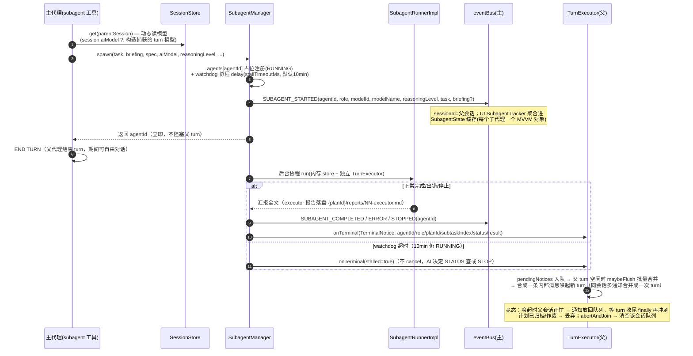

**abort 级联收割**：用户点"停止"（abort/abortAndJoin）→ cancel 父 turn job → `stopAllForSession(parentSessionId)` 杀本会话全部 RUNNING 子代理——子代理挂全局 scope 不随父 turn 取消而亡，不收割即孤儿（旧模型继续写文件，与"继续"后重 spawn 的新代理并发写同一批 targetFiles）。被杀子代理发 `SUBAGENT_STOPPED`，plan 子任务保持 IN_PROGRESS（"继续"后重 spawn 是干净路径）。

## 5. 上下文压缩流程（自动 + 手动）

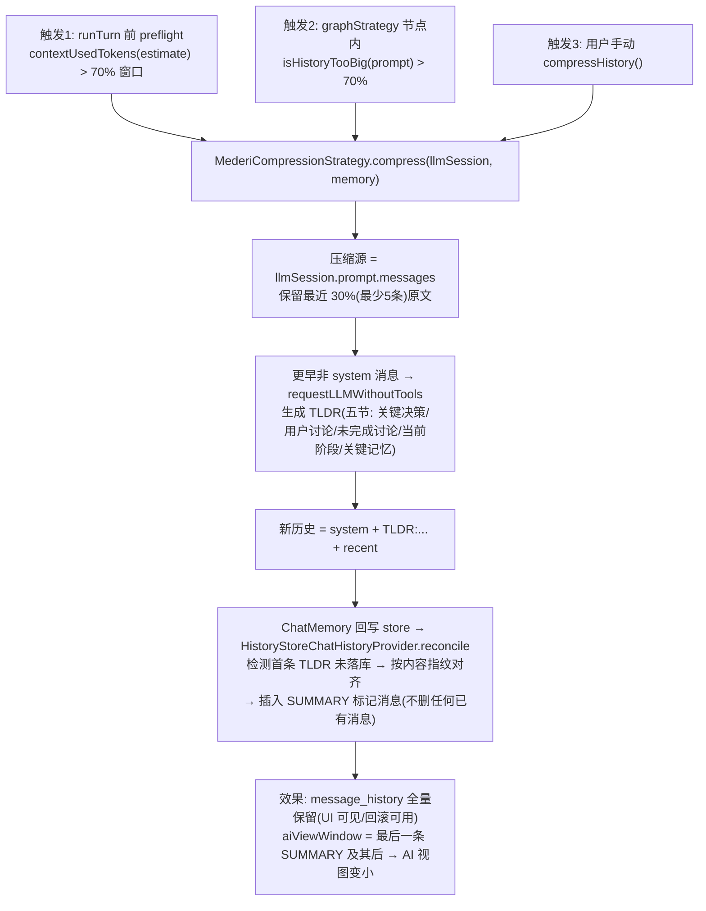

## 6. ask_user 问询时序

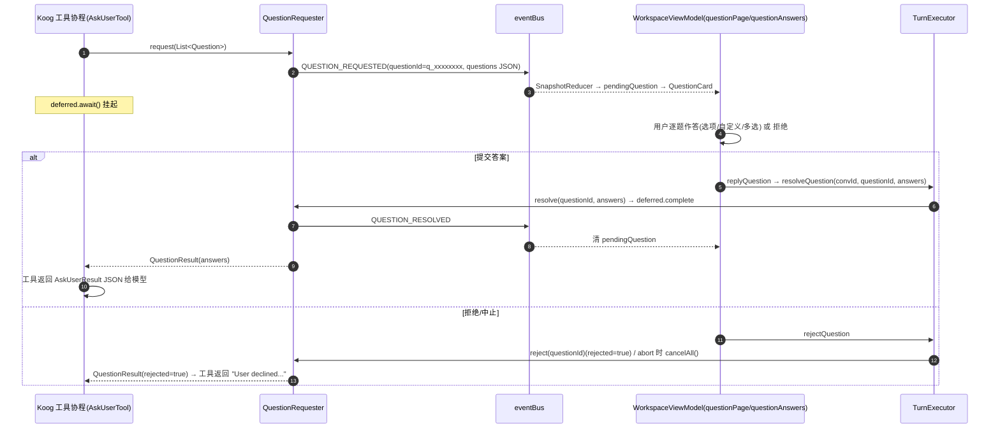

## 7. 子代理（spawn / spawn_researcher / 异步管理 / 主动上报）时序

> 2026-09-14：spawn 改为**异步派工**——`SpawnAgentTool` 调 `SubagentManager.spawn` 立即返回 agentId，
> 子代理在后台协程运行，父代理 turn 不被阻塞。
> 2026-09-25：**主动上报**——子代理终态经 `SubagentManager.onTerminal` 回调通知父 TurnExecutor，
> 入 `pendingNotices` 队列，父 turn 空闲时 `maybeFlush` 批量合并成一条内部消息唤起新 turn；
> 父代理不再需要 `wait_agent`（已删），可用 `agent_status` 查询、`stop_agent` 主动停止。
> watchdog（默认 10 分钟）超时后发 `stalled=true` 通知，AI 决定查状态还是停止。

```mermaid
sequenceDiagram
    autonumber
    participant M as 主代理工具协程(SpawnAgentTool)
    participant SM as SubagentManager
    participant PS as PlanStore
    participant SR as SubagentRunnerImpl<br/>(后台协程)
    participant ITE as 独立 TurnExecutor<br/>(InMemory store + 独立 eventBus)
    participant PTE as 父 TurnExecutor<br/>(pendingNotices 队列)
    participant EB as 主 eventBus

    M->>PS: load(planId) 硬校验 planId/subtaskIndex/spec 非空
    alt 校验失败
        M-->>M: 返回拒绝文本(spec 不存在即拒)
    end
    M->>PS: updatePlan 原子置 subtask IN_PROGRESS
    M->>EB: PLAN_PROGRESS('subtask-started' + todos 投影)
    M->>M: SubagentConfigManager.resolve(role=EXECUTOR/RESEARCHER,<br/>fallbackModel=会话模型, fallbackReasoning=会话推理档)<br/>→ 配置了独立模型/推理档则覆盖父会话, 否则继承
    M->>SM: spawn(task, briefing(简化: 只 task + planDetail, 不再注入 researchNotes/appendix), plan=st.spec, role=EXECUTOR, planId=plan.id, executorSubtaskIndex, planStore)
    SM->>SM: agents[agentId]=RUNNING; scope.launch { SR.run(...) }<br/>+ watchdog: scope.launch { delay(stallTimeoutMs, 默认10min) }
    SM-->>M: 立即返回 {"agentId":"sub_xxx","status":"RUNNING"} (不阻塞)
    M-->>M: 主代理 END TURN; 期间继续对话/派发其他任务
    Note over SM,ITE: 后台执行(与父 turn 并行)
    SR->>SR: 内存建临时 Session(sub_xxxxxxxx, AUTONOMOUS)
    SR->>ITE: sendMessage(inputText=spec清单自顶向下+SPEC_FEEDBACK约定, subagentRole=EXECUTOR)
    Note over ITE: RESEARCHER 则 inputText=只读调研任务<br/>工具裁剪=read_file+list_directory
    Note over ITE: 继承策略=中心化 AgentCapabilities 表<br/>MCP: 主/执行/研究都继承(每子代理 turn 独立现连现断)<br/>Skills: 主/执行注入提示词, 研究不注入
    loop 子 turn 内
        ITE->>ITE: 正常 TurnExecutor 流程(事件走独立 eventBus)
    end
    SR->>SR: 等 MESSAGE_COMPLETED/MESSAGE_ERROR 终态事件
    SR->>SR: 取最后一条 ASSISTANT 消息文本 → persistReportAndReturnSummary<br/>EXECUTOR: 落盘 {planId}/reports/NN-executor.md, 返回尾部1500字符+路径(捕获SPEC_FEEDBACK)<br/>RESEARCHER: 有活跃 plan 时落盘 {planId}/research.md, 返回头部800字符+路径; 无活跃 plan 全文回灌
    SR->>SM: 更新状态 COMPLETED/ERROR, 返回摘要
    Note over SM,SR: scope 继承调用方协程上下文: stop_agent 取消可级联取消内部 turn
    SM->>PTE: onTerminal(TerminalNotice: agentId/role/planId/subtaskIndex/status/result)<br/>(正常终态/STOPPED 均发; watchdog 超时未 RUNNING 完则发 stalled=true)
    PTE->>PTE: pendingNotices 入队(按父会话分组)<br/>父 turn 空闲 → maybeFlush 批量合并成一条内部消息唤起新 turn<br/>竞态(父会话正忙) → 放回队列, 等 turn 收尾 finally 冲刷<br/>计划已归档/作废 → 丢弃; abortAndJoin → 清空该会话队列
    PTE->>M: (被唤醒的新 turn) verify_subtask / converge_plan / 下一个 spawn
    Note over M: 独立子任务可同消息并行: 多个 spawn 各自后台跑,<br/>无并发上限, 由 AI 调度(信任 AI); 完成通知合并唤醒后逐个 verify_subtask
    Note over ITE: 子代理一次任务即死; 无会话残留
```

**briefing 简化 + 报告落盘（方案A 2026-09-24）**：SpawnAgentTool 拼装 briefing 时只注入 ①`task`（来自调用方参数）②`planDetail`（子任务意图/brief，恒不变）——不再注入 `researchNotes` 全文、不再注入 `appendix` 摘录（appendix 字段已删）。executor 是干脏活的便宜模型，需要调研结论时自己 `read_file .mederi/plans/{planId}/research.md`，需要原文件认知时直接 `read_file` 该路径。executor 完成时报告落盘到 `{planId}/reports/NN-executor.md`，父上下文只收尾部 1500 字符 + 路径（尾部捕获 SPEC_FEEDBACK）；researcher 在有活跃 plan 时报告落盘到 `{planId}/research.md`，父上下文只收头部 800 字符 + 路径，无活跃 plan 时保持原行为——全文回灌父上下文（无法保证制定 plan 时该 researcher 仍可用）。子代理 TurnExecutor 透传 `onTurnDiff` 回调，结束时把文件改动经 `ParentDiffRegistry` 合并进父 turn 的 diffTracker（见 §4 diff 合并说明）。

**per-role 模型解析（2026-09）**：`SpawnAgentTool` / `SpawnResearcherTool` 派发时经 `SubagentConfigManager.resolve(role=EXECUTOR/RESEARCHER, fallbackModel=会话模型, fallbackReasoning=会话推理档)` 覆盖父会话模型——配置了独立模型/推理档则覆盖，否则继承。

## 8. 回滚（rollbackMessage）流程

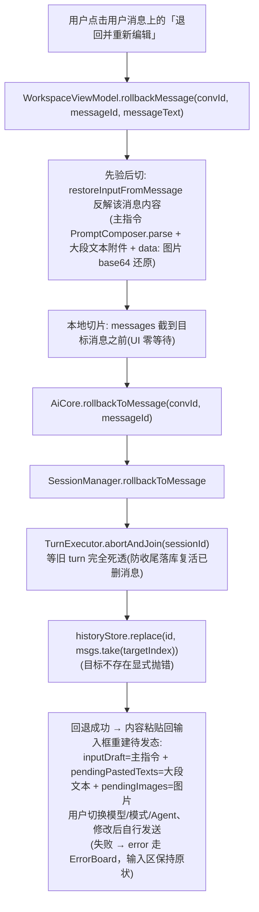

## 8.1 浏览器任务（browser，2026-09-14；2026-09 合并为单一入口）

> 主代理只派发/看状态/停止，浏览器内部对主代理完全透明。BROWSER agent 在后台协程跑
> 4-phase 循环（perceive→decide→execute→postprocess），页面快照每步新鲜取、用完即丢，
> memory 是 AI 自总结。细节经 BROWSER_TASK_* 事件给 UI，用户自己看。
> 主代理入口为 `browser` 工具（action=RUN/STATUS/STOP/INFO，委托原 run_browser_task 等四个工具类）。

```mermaid
sequenceDiagram
    autonumber
    participant U as 用户
    participant MA as 主代理 turn
    participant RBT as browser(RUN)→RunBrowserTaskTool
    participant BTM as BrowserTaskManager
    participant BO as BrowserOperator(手和眼)
    participant BB as BrowserBrain(大脑)
    participant BC as BrowserControl(Camoufox)
    participant EB as eventBus
    participant WV as WorkspaceViewModel

    U->>MA: "搜一下51job的Java开发工作"
    MA->>RBT: browser(action=RUN, task, browser="camoufox", recipe="job_filter")
    RBT->>BTM: runTask(task, model, projectId, sessionId, browser, recipe)
    BTM->>BTM: resolve(browser)→factory(suspend)→createBrowserControl<br/>tasks[taskId]=STARTED; scope.launch{...}
    BTM->>EB: BROWSER_TASK_STARTED(taskId, STARTED, browser="camoufox")
    RBT-->>MA: {"taskId":"bt_xxx","status":"RUNNING","browser":"camoufox"} (立即返回, 不阻塞)
    MA-->>U: 主代理继续对话(浏览器任务在后台跑)
    Note over WV: 任意 BROWSER_TASK_STARTED：UI 自动展开浏览器面板
    EB-->>WV: BROWSER_TASK_STARTED(任意 browser)
    Note over WV: openDockPanel(BROWSER)（Camoufox 任务监控）
    Note over BTM,BC: 后台执行(与主 turn 并行)
    BTM->>BC: Camoufox: BiDiBrowserControl(binary 已下载)→start()
    BTM->>BO: operator.run(task)
    loop 4-phase 循环(每步)
        BO->>BC: snapshot() → 新鲜 a11y tree
        BO->>BO: LLM 一次调用([system+memory+history+snapshot]) → decision{actions,memory,is_done}
        opt 需要内容判定 (遇到判定需求 / ask_ai)
            BO->>BB: judge(content, instruction, recipeRules)
            BB-->>BO: BrainResult (返回结构化判定)
        end
        BO->>BC: 执行 actions(navigate/click/type/scroll/done)
        BO->>BTM: onStep(step, thought, results)
        BTM->>EB: BROWSER_TASK_STEP(taskId, step, thought, results, browser)
        Note over BO: memory = decision.memory(AI自总结)<br/>stepHistory 保留最后10条<br/>snapshot 用完即丢
    end
    BO-->>BTM: BrowserTaskResult(success, rawMessage)
    BTM->>BB: generateFinalReport(taskHistory, goal, rawMessage, recipeRules)
    BB-->>BTM: BrainResult (一句话简报 + reports/*.md 落盘)
    BTM->>EB: BROWSER_TASK_COMPLETED/ERROR(taskId, executiveSummary, browser)
    Note over U: 用户在任务面板看细节；主代理查 STATUS 拿到一句话简报<br/>任意 BROWSER_TASK_STARTED 即浏览器面板已自动展开（Camoufox 任务监控面板）
    Note over MA: 用户问"任务怎样了?" → 主代理查 browser(STATUS, taskId)
```

> 浏览器选择（2026-09）：`browser`(RUN) 的 `browser` 参数缺省 → BrowserRegistry 默认。
> 内置 JCEF 浏览器宿主已移除，Camoufox（BiDiBrowserControl）是唯一注册源、即默认；
> 任意 BROWSER_TASK_STARTED 都会把浏览器面板展开为 Camoufox 任务监控视图。浏览器面板在所有端均可展开
> （不再依赖内置 JCEF 宿主，遥控端/wasm 同样适用）。

> 浏览器子代理模型解析（2026-09-23）：browser(RUN) 派发时，RunBrowserTaskTool 直传父会话模型/推理档
> （不再按浏览器名解析）；BrowserTaskManager.runTask 后台按角色独立解析——操作者
> （SubagentRole.BROWSER_OPERATOR）与大脑（SubagentRole.BROWSER_BRAIN）经 SubagentConfigManager.resolve
> 各取配置的独立模型/推理档（设置页 Agents 面板与 Executor/Researcher 同款卡片可配模型+推理档+恢复继承），
> 配置了独立模型/推理档则覆盖父会话，否则继承；operator/brain 各建独立 llmCaller
> （BrowserLLMHelper 或注入的 llmCallerProvider），Operator 按操作者模型执行、Brain 按大脑模型执行。
> 浏览器实现（现仅 Camoufox）仍由 browser(RUN) 的 browser 参数选择，与角色配置无关。

## 9. 会话自动改名（SessionTitleService）

```mermaid
sequenceDiagram
    autonumber
    participant TE as TurnExecutor(durable-first 落库)
    participant EB as eventBus
    participant ST as SessionTitleService(jvmMain, 挂 MederiAiCore.initialize)
    participant MC as ModelCatalog(models.dev 价格目录)
    participant OC as OneShotCompletion(复用用户供应商 Koog 链路, 不发推理参数)
    participant SM as SessionManager.rename

    TE->>EB: SESSION_UPDATED(用户消息已落库)
    EB-->>ST: 事件
    ST->>ST: 首次处理该会话?<br/>标题=="New Session" 且恰好一条 user 消息?
    alt 条件满足
        ST->>ST: 选模型(当前供应商优先→其他已连接; 全量模型不过滤 isEnabled)<br/>① 免费(input==0&&output==0)<br/>② 小模型(flash/lite, 排除 mini)
        Note over ST: 有候选 → 逐个请求, 报错换下一个
        ST->>MC: getFor(providerKey, baseUrl, modelId) 查免费/价格
        ST->>OC: execute(provider, model, key): 候选之一<br/>key = preferredApiKeyId(provider)?.let{getKeyValue} ?: 默认<br/>(候选即当前会话供应商时用该会话最近选定 key, 其余默认)
        OC-->>ST: ≤40 字标题
        alt 全部候选失败
            ST->>OC: execute(用户发信息用的模型): 兜底
            alt 兜底也失败
                ST->>ST: session_yyyy-MM-ddTHH:mm:ss
            end
        end
        ST->>SM: rename(id, title)
    end
    Note over ST: 全程静默不重试; 每会话只处理一次
```

## 10. 遥控链路启动（desktop 内嵌 / 独立 server / wasm 密码门）

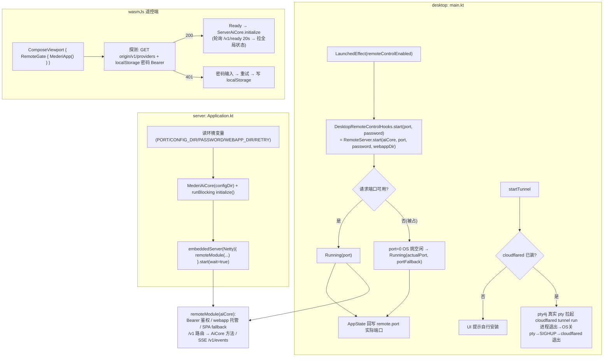

## 11. 初始化时序（desktop 冷启动全链）

```mermaid
sequenceDiagram
    autonumber
    participant M as main.kt(desktop)
    participant APP as MederiApp/App/MainScreen
    participant ST as AppState
    participant MAC as MederiAiCore
    participant MED as Mederi.create()
    participant SVC as 子服务

    M->>M: PtyTerminalHub() → terminalManager
    M->>M: 后台 CoroutineScope(Dispatchers.Default).launch { DesktopBrowserRuntime.ensureInitialized() } 预热 KBrowser（供 inkcompose mermaid/导出）
    M->>APP: setContent { App() }
    APP->>ST: 创建 AppState(AiCoreProvider.default(), preferences)
    APP->>MAC: initialize()
    MAC->>MED: Mederi.local(configDir)
    MED->>MED: MederiPaths.ensureDirectories + handleLegacyFiles(旧文件须批准)
    MED->>MED: 双库 driver + Schema.create + 7 Store 装配
    MED->>MED: Manager 层 + API 层装配
    MAC->>MAC: cleanupLegacyBuiltinProviders / cleanupStaleRunningSessions / syncBuiltinProviders
    MAC->>MAC: refreshGlobalState(4 个 StateFlow) → isReady=true
    MAC->>SVC: modelCatalog.start()(models.dev 每小时刷新)
    MAC->>SVC: autoRefreshBuiltinGoogleModels(后台)
    MAC->>SVC: autotitleService.start()(自动改名)
    APP->>ST: hydrate()(恢复偏好, 列表就绪后 3s 内回填选中态)
    APP->>APP: MainScreen 组合 Sidebar+Workspace; WorkspaceViewModel.attach(选中会话)
    M->>M: 观察 remoteControlEnabled → 自动启停内嵌 RemoteServer
```

## 12. apply_patch 工具三阶段（已注销，不注册给 AI——实现保留备用）

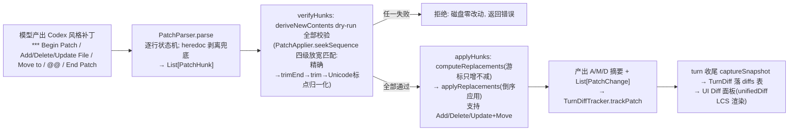

## 13. 图片发送链路（能力门禁）

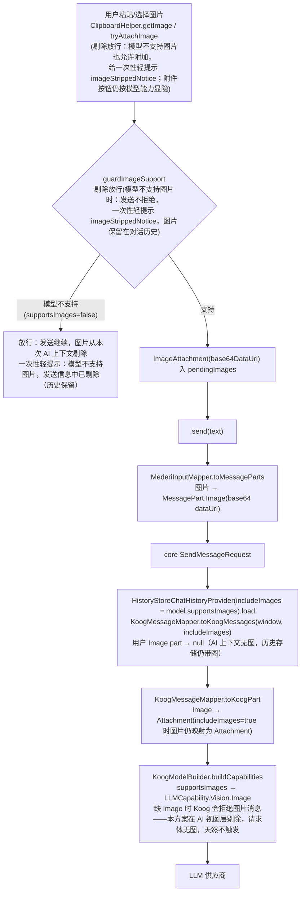

## 14. 终端（Terminal）数据流

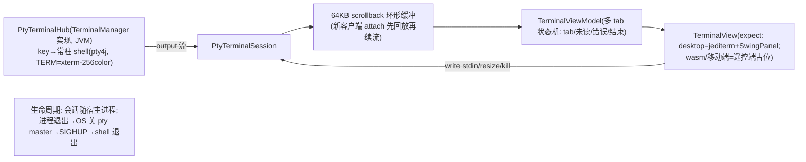

## 15. 状态机汇总

**Session 状态机**：`IDLE → (sendMessage) RUNNING → (正常) IDLE`；`RUNNING → (可重试错误) IDLE(限流提示)`；`RUNNING → (致命错误) ERROR → (下次 sendMessage 前校验失败)`；`RUNNING → (abort) IDLE`。

**Message 状态机**：`PROCESSING(streaming 占位) → COMPLETED / ERROR`；快照里 isStreaming 对应 PROCESSING。

**Plan 状态机**：`PENDING_APPROVAL → (批准) APPROVED → (spawn 首子任务) IN_PROGRESS → (全子任务 COMPLETED) COMPLETED → archive(plans-done/)`；`PENDING_APPROVAL/APPROVED/IN_PROGRESS → (create_plan 前置 voidActivePlans) VOIDED → .mederi/plans-voided/`；`PENDING_APPROVAL → (拒绝) 停留/用户重试`。

**Subtask 状态机**：`PENDING → (spawn) IN_PROGRESS → (verify PASS) COMPLETED`；`IN_PROGRESS → (verify FAIL/PARTIAL) FAILED → (converge_plan 追加补救 或 regenerate spec) 重执行`。

**ToolCallState（契约层）**：`Pending → Running → Completed / Failed`。

**RemoteServerUiState**：`Idle → Starting → Running(port, portFallback?) / Failed`；**TunnelUiState**：`Idle → Starting → Running(url) / Failed(notInstalled)`。
