# 04 · 核心流程图与时序图

> 本篇描述运行时行为。类与文件的位置见 01-core.md / 02-app-shared.md。

## 1. 发送消息全链路（sendMessage 端到端时序图）

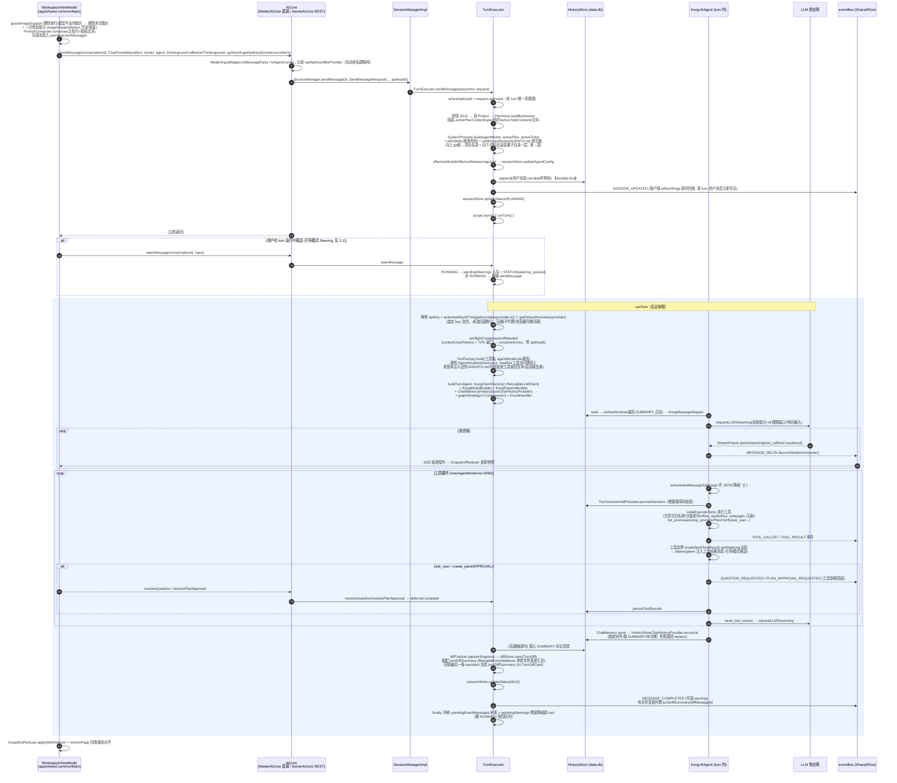

## 2. Turn 执行流程图（含错误分类）

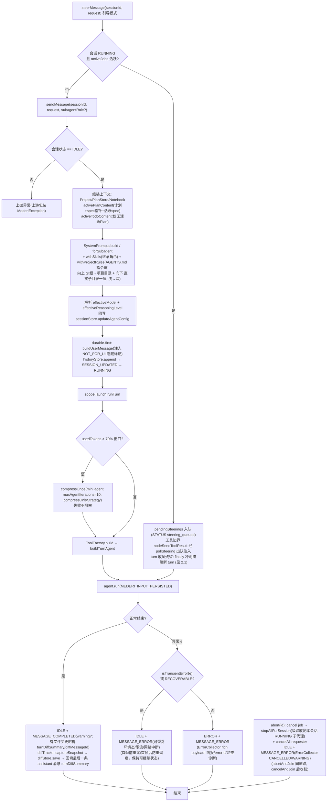

**事件流消费侧**：`eventBus` → 三路消费：① `MederiAiCore.events()`（进程内）/ `GET /v1/events`（SSE 遥控端）→ 客户端 `SnapshotReducer` 聚合快照；② `launchStreamConsumer` 把 StreamFrame 转 MESSAGE_DELTA；③ UI 层特性（SessionTitleService 等）订阅。

### 2.1 引导/排队模式（Steering）

用户在 turn RUNNING 时插话的两条 UI 路径（共用 `QueuedMessage` 模型，输入框上方队列横幅展示 `currentQueuedMessages`）：

- **排队模式**：`WorkspaceViewModel.enqueueCurrentInput` 把当前输入框文本/粘贴/图片压入会话队列 `queuedMessagesByConv`（`removeQueuedMessage` 可移除）；turn 结束恢复 Idle 时**自动出队** `sendQueuedMessage`（即普通 sendMessage，携带入队时的模型/推理档/agent/apiKeyId）。
- **引导模式**：`steerQueuedMessage` 取出排队项，经 `AiCore.steerMessage`（契约 → `MederiAiCore` 直调 / `POST /v1/sessions/{id}/steer` 遥控路由）**立即注入**运行中的 turn。

Core 侧链路（`TurnExecutor`）：

| 链路环节 | 行为 |
|---|---|
| `steerMessage` | 会话 RUNNING 且 activeJobs 活跃 → `SteeringItem` 入 `pendingSteerings` 队列 + 发 `STATUS(status=steering_queued)`（SnapshotReducer 忽略该事件，见 §3）；非 RUNNING → 安全降级 `sendMessage` |
| 工具边界注入 | `graphStrategy`（`mederiSingleRunStrategy*`）的 `nodeSendToolResult` 调 `pollSteering` 出队，有项则把插话追加进本轮工具结果消息，LLM 下一步即可见并据此调整 |
| turn 收尾冲刷 | turn 结束 finally 冲刷未被工具边界消费的残留 `pendingSteerings`（逐条降级 `sendMessage` 开新 turn，撞 RUNNING 冲突放回队列） |

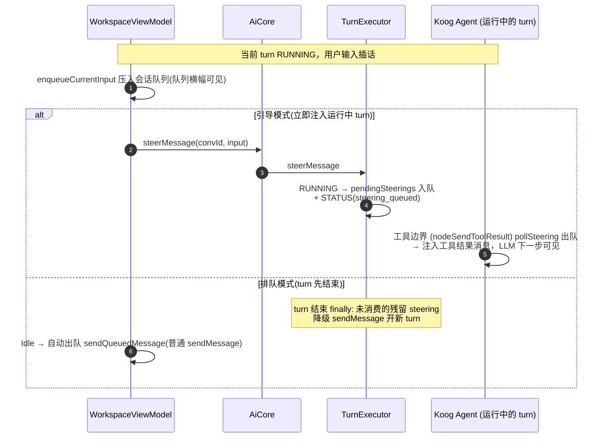

## 3. 事件 → UI 快照聚合流程

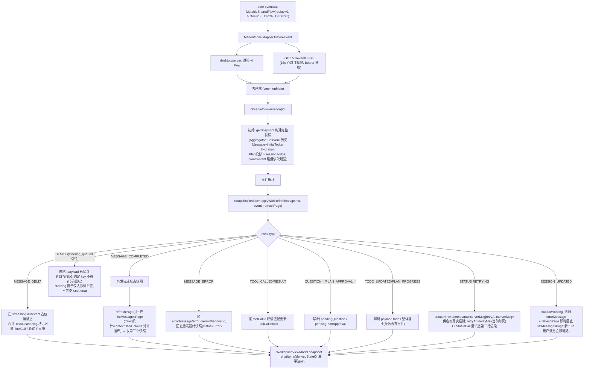

**BROWSER_TASK_* 事件**：`BROWSER_TASK_STARTED/STEP/COMPLETED/ERROR/STOPPED` 不经 `SnapshotReducer` 聚合，由 `WorkspaceViewModel` 侧直接消费（展开浏览器面板 / 更新步骤列表）。

## 4. Plan Loop（复杂改动主流程）

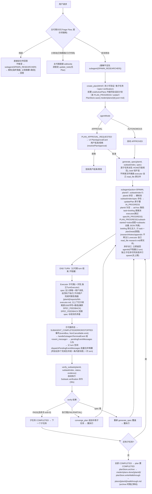

**并行执行（2026-09，2026-09-14 异步化，2026-09 并发上限硬门禁）**：工具执行节点 `nodeExecuteTools(parallel=true)`——同一条消息的多个工具调用并行执行；**子代理单会话并发受限**（设置页可配，默认 2，见下述并发门禁），同父会话内 EXECUTOR 与 RESEARCHER 同池计数，达到上限时 spawn 工具返回指导文案让模型结束 turn 等待唤醒；浏览器任务不经 SubagentManager，天然排除在外。约束：`create_plan` 单独发；**禁止同消息混发 generate_spec 与 subagent(SPAWN)**（并行无序，spawn 可能读到未写入的 spec）；同文件并发写已由 `FileWriteRegistry` 代码级硬拒绝（write_file/edit_file try-lock，占用即 Error，AI 下轮重试），不得重复执行同一命令仍靠 AI 自律。plan 状态写入一律走 `PlanStore.updatePlan`（原子读改写），防止并行 subagent(SPAWN)/generate_spec/verify 互相覆盖。**子代理异步化（2026-09-14）+ 主动上报（2026-09-25）**：子代理统一为单一 `subagent` 工具 action 分流（SPAWN/SPAWN_RESEARCHER/STATUS/STOP，原 6 个独立工具封装合并；`agent_status`/`stop_agent` 工具类保留但不向 AI 注册）。`subagent(SPAWN)` 支持 planId 可选：有 planId 走计划流程（spec 硬校验+IN_PROGRESS），无 planId 走 ad-hoc 路径（task+briefing 直接派 executor，跳过 spec/IN_PROGRESS）。派工异步（立即返回 agentId，后台协程跑子代理），父代理 turn 不再被阻塞，可继续对话；子代理终态经主 eventBus 发 `SUBAGENT_COMPLETED/ERROR/STOPPED` 事件（NonCancellable emit），父 TurnExecutor 订阅后 `handleSubagentTerminalEvent` 合成 `<event_message>` 入 `pendingEventMessages` 队列，父 turn 空闲时 `dispatchPendingEventMessages` 批量合并成一条内部消息自动唤起新 turn（同会话多个完成合并成一次 turn；竞态（父会话正忙）时放回队列等 turn 收尾 finally 冲刷；abortAndJoin 清空该会话队列）。agent 丢失/归档（不在内存表）时 `subagent(STATUS)` 返回 NOT_FOUND + `AgentRecoveryInfo`（retired 记录：末次状态/result/报告路径/touchedFiles 部分认知），父代理据此判断已改动文件（与 targetFiles 比对查越界）再决定重跑或接受部分成果。`wait_agent` 枚举值已删，父代理不再阻塞拉取。**diff 合并子代理改动（2026-09-23）**：主 turn runTurn 开头 `ParentDiffRegistry.register`，子代理 turn 结束时把文件改动经 `onTurnDiff` 回调 + `ParentDiffRegistry.mergeInto` 合并进父 turn 的 `TurnDiffTracker`（`mergeChanges`），finally 里 `unregister`——修复"turn 改动摘要不含子代理改动"的 bug。子代理自身 diff 仍独立落库（其临时 InMemory store），合并只影响父 turn 的 TurnDiff 聚合。**walkthrough 自动生成（2026-09-23）**：计划全部子任务 COMPLETED 时，`PlanStore.writeWalkthrough(plan)` 自动装配 walkthrough 文档写至 `plans/{planId}/walkthrough.md`（archive 时随整个计划目录移到 `plans-done/{planId}/walkthrough.md`，内容由 `buildWalkthrough` 聚合 plan/subtask/spec/verification/changes；`verify_subtask` 全 PASS 文案亦指向该路径）。

**Plan 审批时序（APPROVAL 模式）**：

```mermaid
sequenceDiagram
    autonumber
    participant M as 主代理(工具协程)
    participant PAR as PlanApprovalRequester
    participant EB as eventBus
    participant UI as WorkspaceViewModel(SnapshotReducer)
    participant TE as TurnExecutor
    participant PS as PlanStore(.mederi/plans/)

    M->>PS: PlanStore.save(plan)
    M->>PAR: request(planId, planPath, title, summary, planContent, subtaskCount)
    PAR->>PAR: 取消当前 pending(superseded)
    PAR->>EB: PLAN_APPROVAL_REQUESTED(payload 含 planContent)
    EB-->>UI: SnapshotReducer → pendingPlanApproval + planApprovals
    Note over M: CompletableDeferred.await() 挂起<br/>(turn 保持 RUNNING)
    UI->>TE: resolvePlanApproval(convId, planId, approved, model, thinkingLevel)
    Note over UI: model/thinkingLevel = 批准时刻输入框选中值<br/>(与 send() 同源: selectedModel/effectiveThinkingLevel)
    TE->>TE: 批准且 model≠null → sessionStore.updateAgentConfig<br/>写入 session.aiModel/reasoningLevel("最后一次选择"语义)
    Note over TE: create_plan 挂起等批准期间用户可能切了模型——<br/>同 turn 后续 subagent(SPAWN) 动态读 session 拿到新模型
    TE->>PAR: resolve(planId, approved) → deferred.complete
    PAR->>EB: PLAN_APPROVAL_RESOLVED
    EB-->>UI: 清 pendingPlanApproval, 对应项 status=APPROVED/REJECTED
    PAR-->>M: PlanApprovalResult(approved, superseded=false)
    alt approved=true
        M->>M: notebook.append → 继续生成 spec/spawn
    else approved=false
        M->>M: 向用户说明, 不执行计划
    end
```

**跨 turn / 重启后批准（"批准与 turn 解耦"）**（2026-09）：
上面是同 turn 批准——requester（内存 CompletableDeferred）存活，`resolvePlanApproval` 直接唤醒挂起的 create_plan，AI 同 turn 执行。
翻历史 / 进程重启后 requester 已消亡，无法唤醒任何挂起协程，走**跨 turn 分支**（`TurnExecutor.resolvePlanApproval`）：
1. 批准模型写入 session（同上），拒绝（approved=false）无存活 turn 可唤醒、无状态变更，直接返回 false（计划保持 PENDING_APPROVAL）；
2. 从 PlanStore 按 planId `load` 并校验：会话匹配、非终态、PENDING_APPROVAL——不满足则跳过（作废/已完成/他会话计划不可批）；
3. `updatePlan` 置 APPROVED 落盘 → 发 `PLAN_APPROVAL_RESOLVED` 事件；
4. 以一条 **UI 隐藏内部消息**（整条文本以 `<<<NOT_FOR_UI>>>` 开头，UI 渲染 `substringBefore` 得空串 → 用户不可见、AI 可见）经 `sendMessageInternal` 启动新执行 turn，AI 读到 Active Plan 已是 APPROVED 后自行走 generate_spec → spawn → verify。

**重启/翻历史恢复待批准卡片**：`MederiAiCore.initialPlanApproval()`（MederiEventAggregator.observe 初始快照 + getSnapshot 共用）读该会话最新非终态计划投影为契约 `PlanApprovalRequest` 填入 `pendingPlanApproval`——`status` 区分：
- APPROVAL 模式 + PENDING_APPROVAL → `"PENDING"`（待用户批准）；
- 自动模式已 APPROVED / 执行中 IN_PROGRESS → `"AUTO_APPROVED"`（已自动审批，UI 可展示而非完全不展示）。
职能边界：core **只把计划状态作为数据给 UI**，不判定卡片必须在对话内/外——UI 层自决渲染位置。

**问与计划挂起时用户直接回复**（三条硬规则之一）：`sendMessageInternal` 检测到 pending 时先 `injectNeutralPlanToolResult`（补写中性 ToolResult 落库，非批准/非拒绝）再 abort 旧 turn——计划保持 PENDING_APPROVAL，AI 响应新消息，绝不反问"为什么"。计划无"拒绝"态，只有批准/作废/被无视三态。

### 4.1 子代理生命周期与事件流（spawn → 终态）

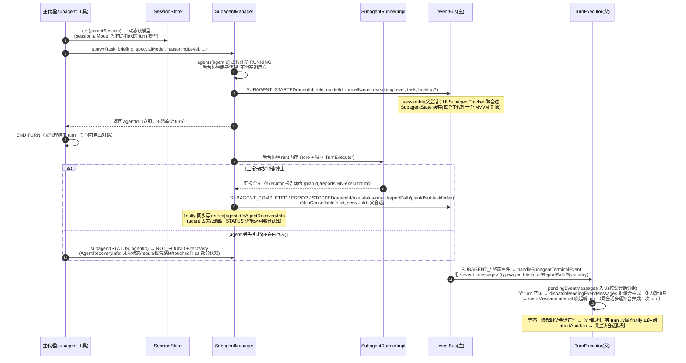

**abort 级联收割**：用户点"停止"（abort/abortAndJoin）→ cancel 父 turn job → `stopAllForSession(parentSessionId)` 杀本会话全部 RUNNING 子代理——子代理挂全局 scope 不随父 turn 取消而亡，不收割即孤儿（旧模型继续写文件，与"继续"后重 spawn 的新代理并发写同一批 targetFiles）。被杀子代理发 `SUBAGENT_STOPPED`，plan 子任务保持 IN_PROGRESS（"继续"后重 spawn 是干净路径）。

**子代理汇报取数链（2026-09）**：全量报告可随时拉取——`AiCore.getSubagentReport(agentId)` → `SessionManager.getSubagentReport` → `SubagentManager.getReport`：磁盘读报告全文（`{planId}/reports/NN-executor.md` / `research.md`），文件缺失时回退内存 result 或 `AgentRecoveryInfo`（retired）记录；遥控端对应路由 `GET /v1/subagents/{agentId}/report`。`<event_message>` 唤醒消息的 UI 通道：对话流内由 `EventMessageCard`（系统事件卡）渲染——读落盘报告全文/摘要展示，**非**仅 SubagentTracker 卡片。

## 5. 上下文压缩流程（自动 + 手动）

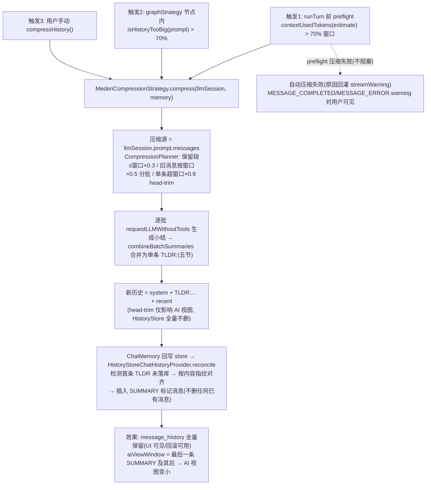

## 6. ask_user 问询时序

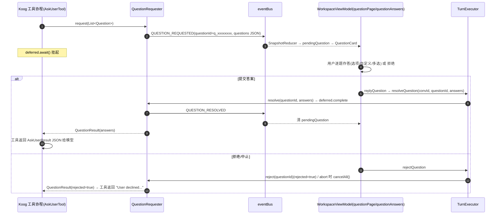

## 7. 子代理（subagent 工具 action 分流 / 异步管理 / 主动上报）时序

> 2026-09-14：spawn 改为**异步派工**——单一 `subagent` 工具（`ToolFactory.SUBAGENT_TOOL_NAMES`，
> action=SPAWN/SPAWN_RESEARCHER/STATUS/STOP；原 6 个独立工具 spawn_agent/spawn_researcher/agent_status/
> stop_agent/wait_agent 封装合并，内部实现类保留但不向 AI 注册）调 `SubagentManager.spawn`
> 立即返回 agentId，子代理在后台协程运行，父代理 turn 不被阻塞。
> 2026-09-25：**主动上报（eventBus 事件链）**——子代理终态经主 eventBus 发
> `SUBAGENT_COMPLETED/ERROR/STOPPED` 事件（NonCancellable emit，sessionId=父会话），父 TurnExecutor
> 订阅后组 `<event_message>` 入 `pendingEventMessages` 队列，父 turn 空闲时
> `dispatchPendingEventMessages` 批量合并成一条内部消息唤起新 turn；
> 父代理不再需要 `wait_agent`（已删），用 `subagent(STATUS)` 查询、`subagent(STOP)` 主动停止。
> **概览面板与详情弹窗用户手动关闭（2026-09）**：UI 针对运行中的子代理提供关闭按钮（`WorkspaceViewModel.stopSubagent` → `AiCore.stopSubagent(agentId)`），SubagentManager 设置 `stopReason = "被用户关闭"` 并取消子代理协程；子代理退出时发射携带 `result = "被用户关闭"` 的 `SUBAGENT_STOPPED` 事件，按正常终态事件进入父会话 `pendingEventMessages` 并唤醒父 turn，与正常结束一样汇报给 AI 说明被用户关闭。
> agent 丢失/归档（不在内存表）后无超时卡死类通知机制（代码无该实现）——`subagent(STATUS)` 返回
> NOT_FOUND + `AgentRecoveryInfo`（retired 记录：末次状态/result/报告路径/touchedFiles 部分认知），
> AI 据此判断已改动文件、再决定重跑或接受部分成果。
> 子代理 `SPAWN` 的 planId 可选：无 planId 走 ad-hoc 路径（task+briefing 直接派 executor，
> 跳过 spec/IN_PROGRESS）；有 planId+subtaskIndex 时 spec 存在性硬校验仍成立。

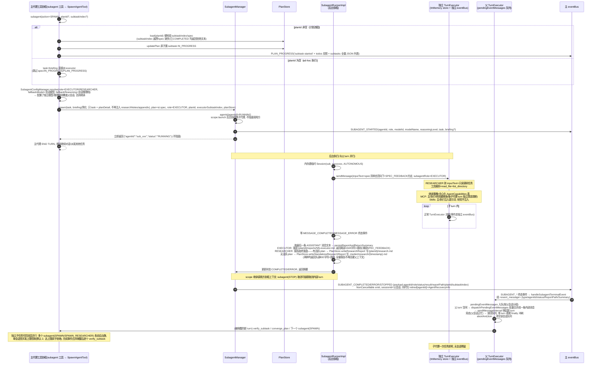

**briefing 简化 + 报告落盘（方案A 2026-09-24）**：SpawnAgentTool 拼装 briefing 时只注入 ①`task`（来自调用方参数）②`planDetail`（子任务意图/brief，恒不变）——不再注入 `researchNotes` 全文、不再注入 `appendix` 摘录（appendix 字段已删）。executor 是干脏活的便宜模型，需要调研结论时自己 `read_file .mederi/plans/{planId}/research.md`，需要原文件认知时直接 `read_file` 该路径。executor 完成时报告落盘到 `{planId}/reports/NN-executor.md`，父上下文只收尾部 1500 字符 + 路径（尾部捕获 SPEC_FEEDBACK）；researcher 报告**始终落盘**——有活跃 plan 时写 `{planId}/research.md`，无活跃 plan 时经 `PlanStore.writeStandaloneResearchReport` 写 `.mederi/research/{timestamp}.md`，两种情况父上下文都只收头部 800 字符 + 路径（全量报告不再有回灌通道；详情一律 read_file 取盘）。EXECUTOR 无 planId/planStore 或写盘失败时才回退全文回灌。子代理 TurnExecutor 透传 `onTurnDiff` 回调，结束时把文件改动经 `ParentDiffRegistry` 合并进父 turn 的 diffTracker（见 §4 diff 合并说明）。

**per-role 模型解析（2026-09）**：`SpawnAgentTool` / `SpawnResearcherTool` 派发时经 `SubagentConfigManager.resolve(role=EXECUTOR/RESEARCHER, fallbackModel=会话模型, fallbackReasoning=会话推理档)` 覆盖父会话模型——配置了独立模型/推理档则覆盖，否则继承。

## 8. 回滚（rollbackMessage）流程

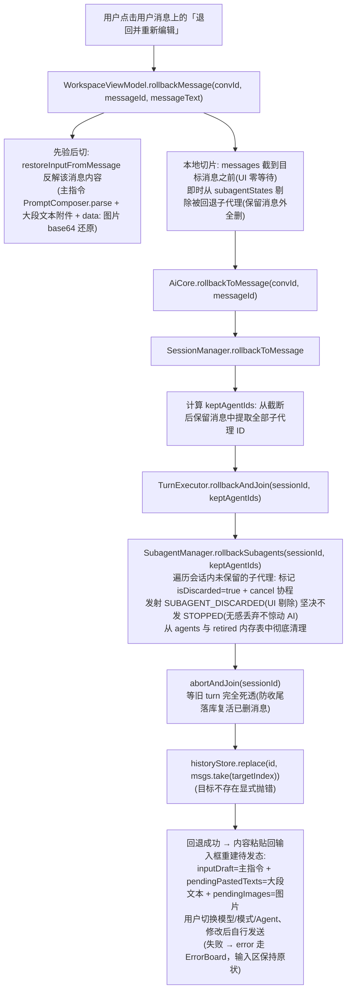

**回滚子代理无感丢弃（2026-09）**：当用户回滚到某一条消息时，若该消息时尚未创立子 Agent（即子 Agent 是在后续被回退掉的对话轮次中生成的），这些子 Agent 会被静默丢弃。`SessionManager` 从保留的历史消息中提取所有合法的 `keptAgentIds`，通知 `SubagentManager.rollbackSubagents`。未保留的子代理标记为 `isDiscarded = true` 并取消运行，发射 `SUBAGENT_DISCARDED` 事件通知 UI 即时移出缓存；**坚决不发射 `SUBAGENT_STOPPED` 事件**，不生成 `<event_message>`，绝不向 AI 汇报，真正实现无感丢弃。

## 8.1 浏览器任务（browser，2026-09-14；2026-09 合并为单一入口）

> 主代理只派发/看状态/停止，浏览器内部对主代理完全透明。BROWSER agent 在后台协程跑
> 4-phase 循环（perceive→decide→execute→postprocess），页面快照每步新鲜取、用完即丢，
> memory 是 AI 自总结。细节经 BROWSER_TASK_* 事件给 UI，用户自己看。
> 主代理入口为 `browser` 工具（action=RUN/STATUS/STOP/INFO，委托原 run_browser_task 等四个工具类）。

```mermaid
sequenceDiagram
    autonumber
    participant U as 用户
    participant MA as 主代理 turn
    participant RBT as browser(RUN)→RunBrowserTaskTool
    participant BTM as BrowserTaskManager
    participant BO as BrowserOperator(手和眼)
    participant BB as BrowserBrain(大脑)
    participant BC as BrowserControl(Camoufox)
    participant EB as eventBus
    participant WV as WorkspaceViewModel

    U->>MA: "搜一下51job的Java开发工作"
    MA->>RBT: browser(action=RUN, task, browser="camoufox", recipe="job_filter")
    RBT->>BTM: runTask(task, model, projectId, sessionId, browser, recipe)
    BTM->>BTM: resolve(browser)→factory(suspend)→createBrowserControl<br/>tasks[taskId]=STARTED; scope.launch{...}
    BTM->>EB: BROWSER_TASK_STARTED(taskId, STARTED, browser="camoufox")
    RBT-->>MA: {"taskId":"bt_xxx","status":"RUNNING","browser":"camoufox"} (立即返回, 不阻塞)
    MA-->>U: 主代理继续对话(浏览器任务在后台跑)
    Note over WV: 任意 BROWSER_TASK_STARTED：UI 自动展开浏览器面板
    EB-->>WV: BROWSER_TASK_STARTED(任意 browser)
    Note over WV: openDockPanel(BROWSER)（Camoufox 任务监控）
    Note over BTM,BC: 后台执行(与主 turn 并行)
    BTM->>BC: Camoufox: BiDiBrowserControl(binary 已下载)→start()
    BTM->>BO: operator.run(task)
    loop 4-phase 循环(每步)
        BO->>BC: snapshot() → 新鲜 a11y tree
        BO->>BO: LLM 一次调用([system+memory+history+snapshot]) → decision{actions,memory,is_done}
        opt 需要内容判定 (遇到判定需求 / ask_ai)
            BO->>BB: judge(content, instruction, recipeRules)
            BB-->>BO: BrainResult (返回结构化判定)
        end
        BO->>BC: 执行 actions(navigate/click/type/scroll/done)
        BO->>BTM: onStep(step, thought, results)
        BTM->>EB: BROWSER_TASK_STEP(taskId, step, thought, results, browser)
        Note over BO: memory = decision.memory(AI自总结)<br/>stepHistory 保留最后10条<br/>snapshot 用完即丢
    end
    BO-->>BTM: BrowserTaskResult(success, rawMessage)
    BTM->>BB: generateFinalReport(taskHistory, goal, rawMessage, recipeRules)
    BB-->>BTM: BrainResult (一句话简报 + reports/*.md 落盘)
    BTM->>EB: BROWSER_TASK_COMPLETED/ERROR(taskId, executiveSummary, browser)
    Note over U: 用户在任务面板看细节；主代理查 STATUS 拿到一句话简报<br/>任意 BROWSER_TASK_STARTED 即浏览器面板已自动展开（Camoufox 任务监控面板）
    Note over MA: 用户问"任务怎样了?" → 主代理查 browser(STATUS, taskId)
```

> 浏览器选择（2026-09）：`browser`(RUN) 的 `browser` 参数缺省 → BrowserRegistry 默认。
> 内置 JCEF 浏览器宿主已移除，Camoufox（BiDiBrowserControl）是唯一注册源、即默认；
> 任意 BROWSER_TASK_STARTED 都会把浏览器面板展开为 Camoufox 任务监控视图。浏览器面板在所有端均可展开
> （不再依赖内置 JCEF 宿主，遥控端/wasm 同样适用）。

> 浏览器子代理模型解析（2026-09-23）：browser(RUN) 派发时，RunBrowserTaskTool 直传父会话模型/推理档
> （不再按浏览器名解析）；BrowserTaskManager.runTask 后台按角色独立解析——操作者
> （SubagentRole.BROWSER_OPERATOR）与大脑（SubagentRole.BROWSER_BRAIN）经 SubagentConfigManager.resolve
> 各取配置的独立模型/推理档（设置页 Agents 面板与 Executor/Researcher 同款卡片可配模型+推理档+恢复继承），
> 配置了独立模型/推理档则覆盖父会话，否则继承；operator/brain 各建独立 llmCaller
> （BrowserLLMHelper 或注入的 llmCallerProvider），Operator 按操作者模型执行、Brain 按大脑模型执行。
> 浏览器实现（现仅 Camoufox）仍由 browser(RUN) 的 browser 参数选择，与角色配置无关。

## 9. 会话自动改名（SessionTitleService）

```mermaid
sequenceDiagram
    autonumber
    participant TE as TurnExecutor(durable-first 落库)
    participant EB as eventBus
    participant ST as SessionTitleService(jvmMain, 挂 MederiAiCore.initialize)
    participant MC as ModelCatalog(models.dev 价格目录)
    participant OC as OneShotCompletion(复用用户供应商 Koog 链路, 不发推理参数)
    participant SM as SessionManager.rename

    TE->>EB: SESSION_UPDATED(用户消息已落库)
    EB-->>ST: 事件
    ST->>ST: 首次处理该会话?<br/>标题=="New Session" 且恰好一条 user 消息?
    alt 条件满足
        ST->>ST: 选模型(当前供应商优先→其他已连接; 全量模型不过滤 isEnabled)<br/>① 免费(input==0&&output==0)<br/>② 小模型(flash/lite, 排除 mini)
        Note over ST: 有候选 → 逐个请求, 报错换下一个
        ST->>MC: getFor(providerKey, baseUrl, modelId) 查免费/价格
        ST->>OC: execute(provider, model, key): 候选之一<br/>key = preferredApiKeyId(provider)?.let{getKeyValue} ?: 默认<br/>(候选即当前会话供应商时用该会话最近选定 key, 其余默认)
        OC-->>ST: ≤40 字标题
        alt 全部候选失败
            ST->>OC: execute(用户发信息用的模型): 兜底
            alt 兜底也失败
                ST->>ST: session_yyyy-MM-ddTHH:mm:ss
            end
        end
        ST->>SM: rename(id, title)
    end
    Note over ST: 全程静默不重试; 每会话只处理一次
```

## 10. 遥控链路启动（desktop 内嵌 / 独立 server / wasm 密码门）


## 11. 初始化时序（desktop 冷启动全链）

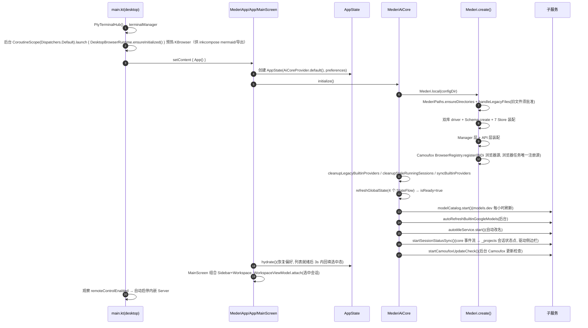

## 12. apply_patch 工具三阶段（已注销，不注册给 AI——实现保留备用）

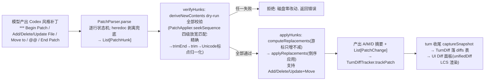

## 13. 图片发送链路（能力门禁）

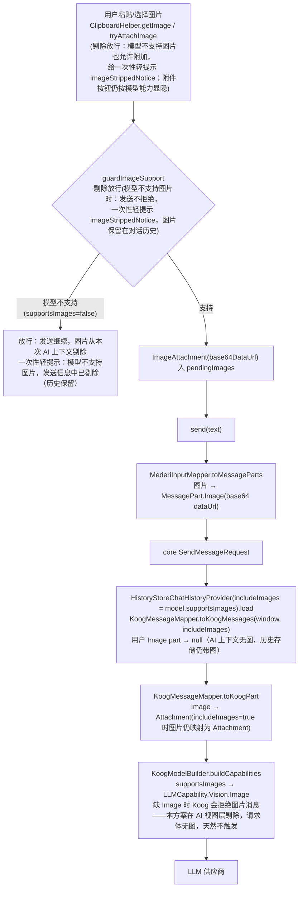

## 14. 终端（Terminal）数据流

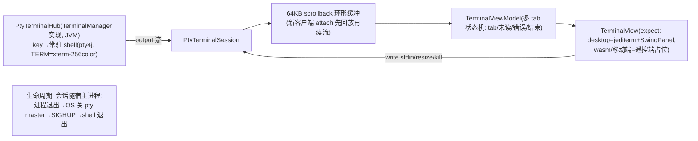

## 15. 状态机汇总

**Session 状态机**：`IDLE → (sendMessage) RUNNING → (正常) IDLE`；`RUNNING → (可重试错误) IDLE(限流提示)`；`RUNNING → (致命错误) ERROR → (下次 sendMessage 前校验失败)`；`RUNNING → (abort) IDLE`。

**契约层会话状态（ConversationStatus，SnapshotReducer）**：4 值 `Idle / Working / Error / WaitingUser`——`QUESTION_REQUESTED`/`PLAN_APPROVAL_REQUESTED` → **WaitingUser**（同时把流式占位消息 isStreaming 置 false，交互挂起），对应 `QUESTION_RESOLVED`/`PLAN_APPROVAL_RESOLVED` → Working；双侧（进程内与 SSE 遥控端）经 `startSessionStatusSync` 同步驱动侧边栏状态点。

**排队/引导（Steering，见 §2.1）**：`RUNNING` 中 `steerMessage` → `pendingSteerings` 入队（发 `STATUS(steering_queued)`，SnapshotReducer 按代码现状忽略）→ 工具边界 `pollSteering` 注入；turn 收尾残留降级新 turn；UI 侧 turn 结束回 Idle 时排队队列自动出队。

**Message 状态机**：`PROCESSING(streaming 占位) → COMPLETED / ERROR`；快照里 isStreaming 对应 PROCESSING。

**Plan 状态机**：`PENDING_APPROVAL → (批准) APPROVED → (spawn 首子任务) IN_PROGRESS → (全子任务 COMPLETED) COMPLETED → archive(plans-done/)`；`PENDING_APPROVAL/APPROVED/IN_PROGRESS → (create_plan 前置 voidActivePlans) VOIDED → .mederi/plans-voided/`；`PENDING_APPROVAL → (拒绝) 停留/用户重试`。

**Subtask 状态机**：`PENDING → (spawn) IN_PROGRESS → (verify PASS) COMPLETED`；`IN_PROGRESS → (verify FAIL/PARTIAL) FAILED → (converge_plan 追加补救 或 regenerate spec) 重执行`。

**ToolCallState（契约层）**：`Pending → Running → Completed / Failed`。

**RemoteServerUiState**：`Idle → Starting → Running(port, portFallback?) / Failed`；**TunnelUiState**：`Idle → Starting → Running(url) / Failed(reason, notInstalled)`（`notInstalled=true` = 本机未装 cloudflared，AppState.kt L72-73）。
