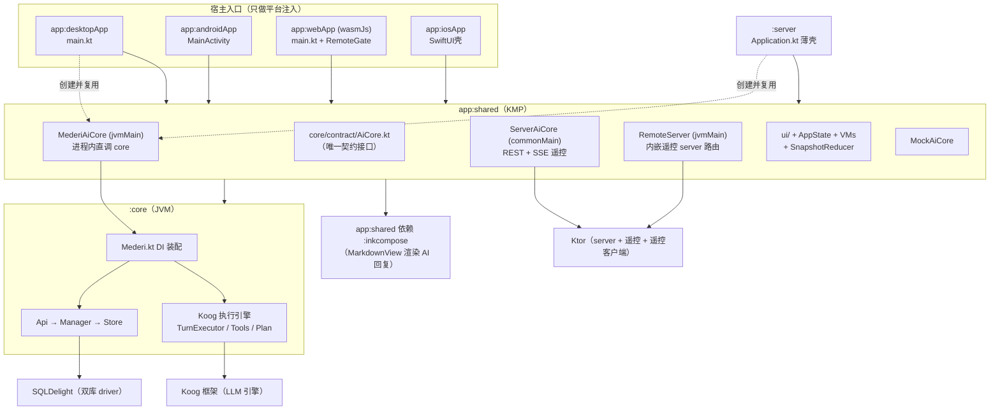
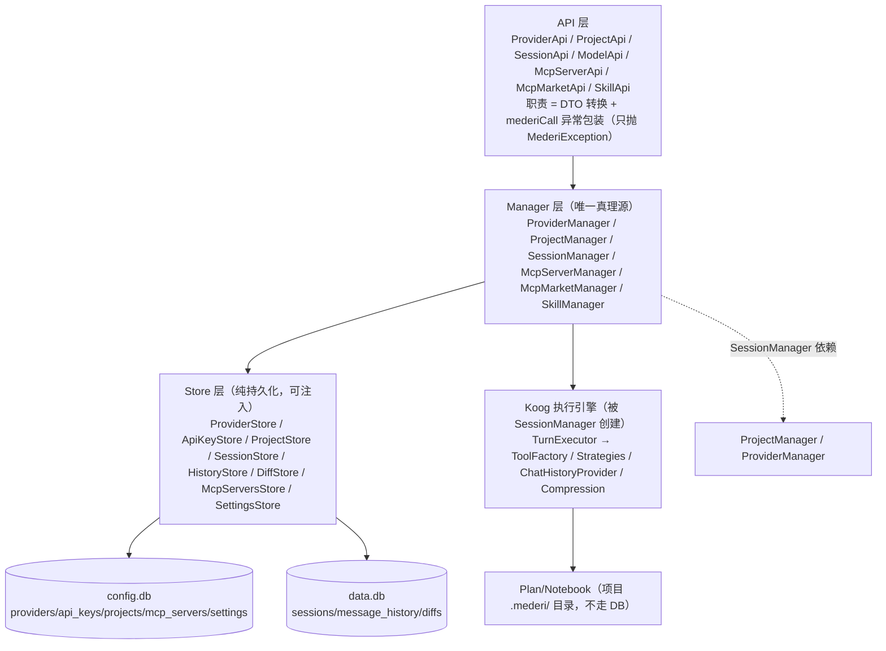

# 00 · 总体架构

## 1. 仓库模块结构图

```
mederi/                                  ← git 仓库根 = /Users/liuzhe/Projects/mederi/mederi
├── core/                                ← 领域核心（Gradle 模块 :core，当前仅 jvm 目标）
│   └── src/commonMain/kotlin/xyz/mederi/
│       ├── Mederi.kt                    ← DI 装配唯一入口
│       ├── model/                       ← 领域模型（纯 Kotlin，@Serializable）
│       ├── api/ + api/impl/             ← API 层（DTO 转换 + MederiException 包装）
│       ├── session/ project/ provider/  ← Manager 层（唯一真理源）
│       ├── store/ + store/sqlite/       ← Store 层（纯持久化，InMemory + Sqlite 双实现）
│       ├── koog/ + infrastructure/koog/ ← Koog 执行引擎适配（TurnExecutor 等）
│       ├── tools/                       ← 工具系统（FS/Shell/Plan/Verify/Subagent/Sandbox/Diff/Patch）
│       ├── browser/ + browser/bidi/ + browser/install/  ← 浏览器自动化模块（BrowserControl/BrowserAgentRunner/BrowserTaskManager + BiDi 层 + Camoufox 下载安装）
│       ├── plan/                        ← 计划系统（Plan/PlanStore/Notebook/审批）
│       ├── mcp/{servers,engine,market}/ ← MCP 配置管理 + 内核引擎（McpConnector）+ MCP 市场
│       ├── provider/                    ← Provider 领域模型 + Koog client 适配
│       ├── metadata/                    ← models.dev 模型目录（ModelCatalog）
│       ├── prompt/                      ← 系统提示词（骨架 SystemPrompts + 素材 PromptGuides）
│       ├── question/                    ← ask_user 挂起-恢复机制
│       ├── config/ debug/               ← 配置容器/路径/迁移审批；调试日志/进程监控
│       └── sqldelight/{config,data}/    ← 双库 schema（.sq）
├── app/
│   ├── shared/                          ← 跨平台 UI + AiCore 契约桥（模块 :app:shared）
│   │   ├── commonMain/kotlin/xyz/mederi/
│   │   │   ├── core/contract/           ← AiCore 接口 + models/ dto/ + SnapshotReducer + preferences/
│   │   │   ├── core/bridge/             ← ServerAiCore（REST/SSE 遥控端实现）+ BuiltinAgents
│   │   │   ├── core/mock/               ← MockAiCore（UI 开发/预览）
│   │   │   ├── core/ui/                 ← AppState + 4 个 ViewModel（commonMain）
│   │   │   ├── ui/                      ← Compose UI（MainScreen/Workspace/Sidebar/components/settings）
│   │   │   ├── App.kt MederiApp.kt      ← 全平台唯一 App 入口组合链
│   │   │   └── theme/ util/             ← 主题；平台工具 expect/actual
│   │   ├── jvmMain/.../core/
│   │   │   ├── bridge/MederiAiCore.kt   ← core 的唯一封装（进程内直调）
│   │   │   ├── remote/RemoteServer.kt   ← 内嵌遥控 server（desktop 与 server 共用）
│   │   │   ├── remote/terminal/PtyTerminalHub.kt ← pty 终端（JVM-only）
│   │   │   └── autotitle/SessionTitleService.kt  ← 会话自动命名
│   │   └── {androidMain,iosMain,wasmJsMain}/ ← 平台 actual（ServerAiCore 接线、preferences、剪贴板等）
│   ├── desktopApp/src/main/kotlin/xyz/mederi/    ← main.kt + DesktopRemoteControlHooks.kt
│   ├── androidApp/.../MainActivity.kt   ← Android 壳
│   ├── webApp/.../main.kt               ← wasmJs 壳（RemoteGate 密码门）
│   └── iosApp/                          ← Xcode 工程（SwiftUI → ComposeUIViewController）
├── server/                              ← :server，headless 独立部署（JVM-only 薄壳）
│   └── src/main/kotlin/xyz/mederi/Application.kt
├── inkcompose/                          ← :inkcompose，富文本渲染库（单 KMP 模块，包 xyz.emuci）
│   ├── common/{entry,image,markdown-parser,markdown-renderer,markdown-runtime,
│   │          latex-parser,latex-renderer,syntax-parser,syntax-render,diagram,vtext}/kotlin/
│   ├── {jvm,android,ios,wasmJs}/kotlin/ ← 平台 actual 平铺
│   ├── common-test/<domain>/ jvm-test/  ← 测试（jvmTest 2600+）
│   └── common/composeResources/font/    ← KaTeX×20 + NotoSansMongolian
├── scripts/                             ← e2e 冒烟/审批/收敛测试脚本（正式测试资产）
├── docs/                                ← 设计文档（本目录 architecture/ 在其中）
└── AGENTS.md                            ← 业务规则唯一权威
```

## 2. 模块依赖关系图



**关键事实**：
- desktop 与 server **共享同一个 `MederiAiCore` 实例语义**：desktop 进程直调 + 内嵌 RemoteServer；server 进程创建 MederiAiCore + 同一套 `remoteModule()` 路由。二者只是两个 interface（宿主入口）。
- android/ios/wasm 的 `AiCoreProvider` 默认返回 **ServerAiCore**（遥控端），不直连 core（core 当前仅声明 jvm 目标）。
- core 的实际实现（Koog/JDBC SQLite/java.io）是 JVM 侧逻辑；core 真正 KMP 化前不假设其跨平台。

## 3. 平台注入矩阵（AiCoreProvider 与平台能力）

| 关注点 | desktop (jvm) | server (jvm) | android | ios | wasmJs |
|---|---|---|---|---|---|
| `AiCoreProvider.default()` | `MederiAiCore("~/.mederi")` | （main 直接 new MederiAiCore） | `ServerAiCore`（baseUrl/密码读 SharedPrefs） | `ServerAiCore`（暂硬编码 127.0.0.1:8081） | `ServerAiCore`（origin 自身，密码 localStorage，dev 可 `?server=`） |
| preferences 实现 | `JsonFilePreferencesStore(~/.mederi/preferences.json)` | —（headless） | `SharedPrefsPreferencesStore` | 沙盒 Documents `preferences.json` | `WasmJsPreferencesStore`（localStorage，前缀 `mederi.pref.`，禁用时降级内存） |
| 终端 TerminalManager | `PtyTerminalHub`（pty4j） | `PtyTerminalHub` | null（遥控） | null（遥控） | null（遥控） |
| 内置浏览器 UiBrowserHost | **`JcefBrowserHost`（tab=KBPage，`BrowserRegistry.register("jcef")`）** | null | null（遥控） | null（遥控） | null（遥控） |
| RemoteControlHooks | `DesktopRemoteControlHooks`（RemoteServer + cloudflared 隧道） | 本身即 server | — | — | — |
| Mermaid 缓存目录 | `~/.mederi/mermaid/` | — | `cacheDir`（MainActivity 注入） | NSCachesDirectory | no-op（同文档 DOM 渲染） |
| RemoteGate 密码门 | 无 | 无 | 无 | 无 | **有**（包在 MederiApp 外层） |
| `AppInfo.platformInfo()`（UA 平台信息） | `System.getProperty(os.name/version/arch)` | 同 desktop | `Build.VERSION.RELEASE` + `SUPPORTED_ABIS` | `UIDevice.systemVersion` + `kotlin.native.Platform.cpuArchitecture` | 解析 `navigator.userAgent` |
| UI 布局 | Row: Sidebar + Workspace（宽 ≥768dp）；窄屏抽屉 | — | 同 shared 逻辑 | 同 shared 逻辑 | 同 shared 逻辑 |

## 4. 分层架构与依赖方向（core）



依赖方向无循环：`SessionManager → ProjectManager / ProviderManager`；Manager 方法签名只用领域类型。

## 5. 双库存储模型（§详见 01-core.md 存储节）

| 库 | 内容 | 特性 | store |
|---|---|---|---|
| `~/.mederi/config.db` | providers、api_keys、projects、mcp_servers、settings（skill 根目录等） | 极小、低频写、事务一致 | Sqlite*Store(configDriver) |
| `~/.mederi/data/data.db` | sessions、message_history、diffs | 高频 append、随使用增长 | Sqlite*Store(dataDriver) |
| `~/.mederi/skills/` | skill 包（每个 skill 一个子目录，含 SKILL.md） | Koog discoverSkills 自动发现根 | SkillManagerImpl |
| `~/.mederi/preferences.json` | UI 偏好（theme、遥控端口、选中态、推理档位记忆、沙盒白名单） | **设备级语义**，app:shared 层管理，不进库 | PreferencesStore |
| `<项目>/.mederi/` | plans/*.json+md、plans-done/、notebook.md | 计划系统文件（机器+人读双份） | PlanStore / Notebook |

## 6. 硬性规则速查索引（细节见 AGENTS.md）

| 规则 | 一句话 | 违反后果示例 |
|---|---|---|
| 契约四处同步 | AiCore.kt → MederiAiCore → ServerAiCore → RemoteServer 路由（+Mock） | 编译失败或运行期 404 |
| Manager=唯一真理源 | 业务状态只有 Manager 一处写 | 状态分叉 |
| 推理档位唯一真理源 | 显示与发送都走 `ReasoningMenu.resolve(effectiveThinkingLevel)` | "显示高实际没推理"（真实事故） |
| 模型元数据唯一写路径 | FETCHED 模型元数据只经 `ModelMerge.mergeFetched`，用户数据进存量模型唯一通道=`autoSetupProviderModels` | 用户开关被目录洗掉（真实事故） |
| 能力传导到引擎 | supportsImages/supportsReasoning → `KoogModelBuilder.buildCapabilities` 加 LLMCapability | 设置全通但引擎拒绝图片 |
| durable-first | 用户消息先落库再置 RUNNING | 回查/自动改名拿到旧状态 |
| 上下文挂载互斥 | 有活跃 Plan 时禁用 update_todo（AgentTools 硬门禁），todo 面板显示 Plan 投影 | 两份进度真理源 |
| 文件写白名单 | write/edit/patch 只能写项目目录 + `.mederi/` + 全局白名单；读全盘放行 | 沙盒逃逸 |
| 不兜底原则 | 数据层面没有就是没有；程序层面报错不崩 | 默认值掩盖问题 |
| 禁手拼 JSON | 结构化数据一律 @Serializable + kotlinx.serialization | 解析脆弱 |
| 删库审批 | 删任何用户数据文件前必须经用户批准 | — |
| KMP 优先 | commonMain 优先，JVM 专属需 KMP 无替代品理由 | — |
