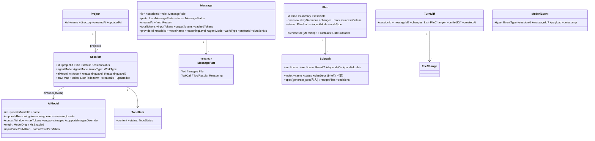
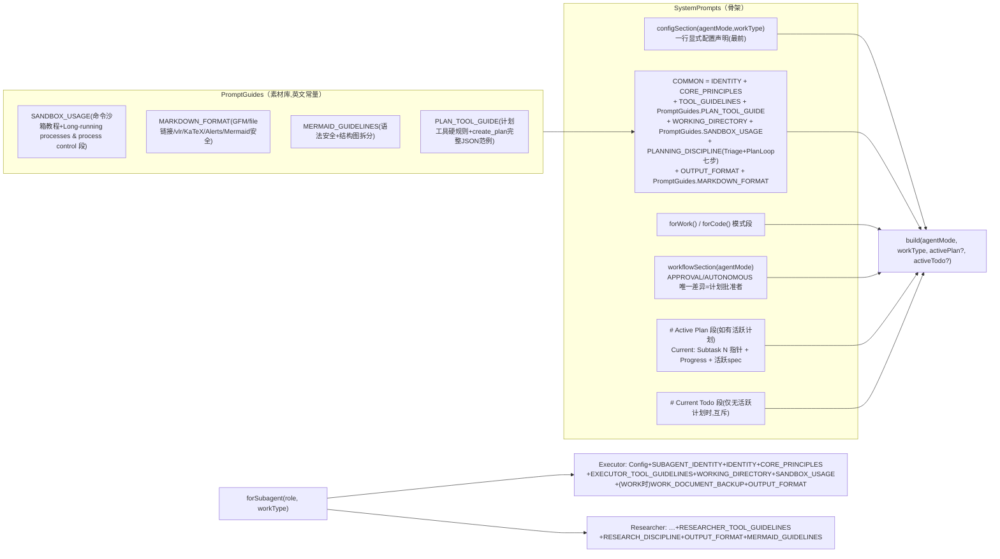
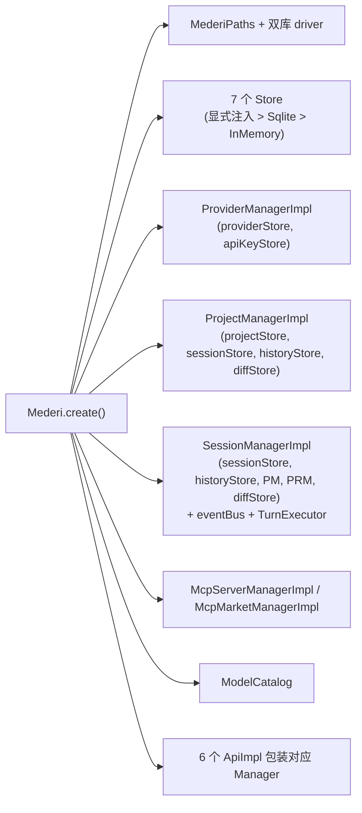

# 01 · core 模块（领域核心，:core，当前仅 JVM 目标）

> 路径约定：`…/` = `core/src/commonMain/kotlin/xyz/mederi/`。
> 注意：`model/`、`koog/` 等目录下文件的 `package` 声明可能是 `xyz.mederi.domain.model`、`xyz.mederi.infrastructure.koog` 等，与目录名不完全一致——以文件内 package 为准。

## 1. DI 装配（`…/Mederi.kt`）

`Mederi` 私有构造，3 个工厂入口：`local(config: String)`、`backend(historyStore, sessionStore, apiKeyStore, providerStore, projectStore)`、`create(block: MederiConfig.() -> Unit)`（前两者最终都调 create）。

**create() 装配顺序**：

1. `MederiConfig().apply(block)` → configDir 展开 `~` → `MederiPaths(dirPath).ensureDirectories()`；`MederiHttpClientFactory.userAgent = config.userAgent`（出站 HTTP 身份头统一注入）。
2. `handleLegacyFiles(paths, config.configMigrationRequester)`——检测 JSON 时代遗留文件（`config/providers/`、`config/projects.json`、`config/mcp-servers.json`、`config/providers.json`、`data/mederi.db(-wal/-shm)`），**必须经用户批准才删**；无审批器只打日志保留。
3. 双库 driver：`createDriver(dbPath)` = `JdbcSqliteDriver`（WAL + foreign_keys），分别对 config.db（`MederiConfigDatabase.Schema.create`）与 data.db（`MederiDataDatabase.Schema.create`）建表（.sq 全部 IF NOT EXISTS）。
4. Store 选择（优先级：**显式注入 > Sqlite > InMemory**）：
   - config.db 侧：`apiKeyStore` / `providerStore` / `projectStore` / `mcpServerStore`
   - data.db 侧：`historyStore` / `sessionStore` / `diffStore`
5. `ModelCatalog()`（内存索引，需外部调 `start()`）。
6. Manager 装配：`ProviderManagerImpl(providerStore, apiKeyStore)`；`ProjectManagerImpl(projectStore, sessionStore, historyStore, diffStore)`；`SessionManagerImpl(sessionStore, historyStore, projectManager, providerManager, diffStore, mcpConnector)`；`McpServerManagerImpl(mcpServerStore, mcpConnector)`；`McpMarketManagerImpl(OfficialRegistrySource())`；`McpConnector(mcpServerStore)`（引擎，manager 与 TurnExecutor 共享）。
7. API 装配：`ProviderApiImpl(providerManager, modelCatalog)`、`ModelApiImpl(providerManager)`、`ProjectApiImpl(projectManager)`、`SessionApiImpl(sessionManager)`、`McpServerApiImpl(mcpServerManager)`、`McpMarketApiImpl(mcpMarketManager)`。

`Mederi` 公开成员：`historyStore: HistoryStore?`、`providers: ProviderApi`、`projects: ProjectApi`、`providerManager`、`projectManager`、`sessionManager`、`sessions: SessionApi`、`models: ModelApi`、`mcpMarket: McpMarketApi`、`mcpServers: McpServerApi`、`modelCatalog: ModelCatalog`。

### config 包

- `MederiConfig`（`…/config/MederiConfig.kt`）：可注入容器。`configDir: String?`、`configMigrationRequester: ConfigMigrationRequester?`、`providerStore/projectStore/historyStore/apiKeyStore/sessionStore/diffStore/mcpServerStore`（全部可空 = 默认推导链生效）、`userAgent: String`（出站 HTTP User-Agent，装配层注入，默认 `Mederi/dev`）。
- `MederiPaths`（`…/config/MederiPaths.kt`）：`root: File`、`dataDir = root/data`、`configDatabaseFile = root/config.db`、`dataDatabaseFile = dataDir/data.db`、`ensureDirectories()`。
- `ConfigMigrationRequester`（接口，`…/config/ConfigMigrationRequester.kt`）：`suspend fun requestDeletion(legacyFiles: List<String>): Boolean`。

## 2. 领域模型（`…/model/`，package 实为 `xyz.mederi.domain.model`）

### 2.1 类图（模型关系）



### 2.2 枚举一览

| 枚举 | 值 | 语义 |
|---|---|---|
| `SessionStatus` | `IDLE, RUNNING, ERROR` | 会话运行状态 |
| `MessageRole` | `SYSTEM, USER, ASSISTANT, SUMMARY` | SUMMARY=压缩标记消息（UI 可见，prompt 压缩节点） |
| `MessageStatus` | `PROCESSING, COMPLETED, ERROR` | 消息状态 |
| `AgentMode` | `APPROVAL, AUTONOMOUS` | 工具集完全一致，唯一区别=计划批准者 |
| `WorkType` | `WORK, CODE` | 差异只在提示词引导 |
| `SubagentRole` | `EXECUTOR, RESEARCHER` | EXECUTOR=全工具（无 plan/spawn/verify/ask_user/todo）；RESEARCHER=只读 read_file/list_directory |
| `ModelOrigin` | `FETCHED, MANUAL` | FETCHED=端点/目录权威（唯一写路径 ModelMerge）；MANUAL=用户权威 |
| `TodoStatus` | `PENDING, IN_PROGRESS, COMPLETED, CANCELLED, FAILED`（wire 小写；FAILED 仅 Plan 投影产生） | |
| `PlanStatus` | `PENDING_APPROVAL, APPROVED, IN_PROGRESS, COMPLETED` | |
| `SubtaskStatus` | `PENDING, IN_PROGRESS, COMPLETED, FAILED` | |
| `VerifyStatus` | `PASS, PARTIAL, FAIL` | |
| `GapType` | `MISSING, PARTIAL, CONTRADICTS, UNREQUESTED` | verify 差距类型 |
| `ProjectContextType` | `GREENFIELD, BROWNFIELD` | |
| `FileChangeStatus` | `ADDED, MODIFIED, DELETED` | diff 用 |
| `ProviderType` | `OPENAI_CHAT, OPENAI_RESPONSES, GOOGLE` | |
| `ReasoningLevel` | `NONE, LOW, MEDIUM, HIGH, MAX` | |

### 2.3 关键 data class 字段（穷尽）

- **`MessagePart`（sealed，`…/model/Message.kt`）**：
  - `Text(text)`；`Image(url, mimeType?)`；`File(path)`
  - `ToolCall(id?, tool, args)`；`ToolResult(id?, tool, output, isError=false, status?, durationMs?, error?)`
  - `Reasoning(content: List<String>, summary?, encrypted?, id?)`
  - `const val UI_HIDDEN_MARKER = "<<<NOT_FOR_UI>>>"`（消息文本中该标记后 UI 不渲染、AI 可见——系统环境注入块）
- **`Message`**：见类图。诊断字段 totalTokens/inputTokens/outputTokens/cachedTokens/durationMs 等写入时抽取进 message_history 列。
- **`Provider`（`…/provider/domain/model/Provider.kt`）**：`id, name, type: ProviderType, baseUrl, reasoningParameter: ReasoningParameter?, models: List<AIModel>, responseSanitization: Boolean=false, modelsDevKey: String?, @Transient apiKeys: List<ProviderApiKey>`（apiKeys 读时合并、写时剥离）；派生 `defaultApiKey`、`supportsReasoning`。
- **`ProviderApiKey`**：`id, name, @Contextual maskedValue, isDefault`；companion `mask()`（前3+"..."+后4，≤7 返回 "***"）。
- **`ReasoningParameter`**：`levels: Map<ReasoningLevel, String?>, parameterName: String="", customRequestBody: Map<String,String>`。核心思想：**不对供应商参数做语义解释**，每档对应用户编写的请求体 JSON 片段，发送时根级合并。方法 `resolve(level)` / `supportsLevel` / `availableLevels` / `validate()`；companion `forOpenAIChat()/forOpenAIResponses()/forGoogle()/forType(type)`。
- **`RemoteModelInfo`（`…/provider/domain/model/RemoteModelInfo.kt`）**：`providerModelId, name, contextWindow?, maxTokens?, supportsReasoning?, inputPricePerMillion?, outputPricePerMillion?, supportsImages?, reasoningLevels`（不落库的远端中间结构，可空=远端未提供）。
- **`TodoItem`（`…/model/Todo.kt`）**：`content, status`；扩展 `List<TodoItem>.encodeTodos(): String` / `decodeTodos(raw): List<TodoItem>?`（唯一 Json 配置，失败安全降级 null）。
- **`FileDiff`（`…/model/FileDiff.kt`）**：`filePath, before, after, additions, deletions`（UI DTO）。
- **`MederiEvent`（`…/model/MederiEvent.kt`）**：`type: EventType, sessionId, messageId?, payload: Map<String,String>, timestamp`。

## 3. Manager 层（唯一真理源）

### 3.1 SessionManager（`…/session/SessionManager.kt` / `SessionManagerImpl.kt`）

```kotlin
suspend fun list(): List<Session>
suspend fun listByProject(projectId: String): List<Session>
suspend fun get(id: String): Session?
suspend fun require(id: String): Session
suspend fun create(agentConfig: AgentConfig, projectId: String, title: String, env: Map<String,String>): Session
suspend fun rename(id: String, title: String): Session
suspend fun delete(id: String)          // turnExecutor.abortAndJoin → 级联删 session/history/diff
suspend fun abort(id: String)
suspend fun sendMessage(id: String, request: SendMessageRequest)
suspend fun rollbackToMessage(id: String, messageId: String)   // abortAndJoin 后 historyStore.replace(截断)
suspend fun resolveQuestion(id: String, questionId: String, answers: List<List<String>>)
suspend fun resolvePlanApproval(id: String, planId: String, approved: Boolean)
suspend fun compressHistory(id: String)
suspend fun listMessages(id: String): List<Message>
suspend fun getMessage(id: String, messageId: String): Message
suspend fun listRawMessages(id: String): List<RawMessageRecord>  // payload 原文直读，调试用
suspend fun getFileDiffs(id: String, messageId: String? = null): List<FileDiff>
fun events(sessionId: String): Flow<MederiEvent>
fun events(): Flow<MederiEvent>          // 全局事件总线（MutableSharedFlow replay=0, buffer=256, DROP_OLDEST）
```

Impl 内部创建 `TurnExecutor(sessionStore, historyStore, eventBus, providerManager, projectManager, diffStore)`。`create` 生成 `sess_xxxxxxxx` 并发 SESSION_CREATED。

### 3.2 ProjectManager（`…/project/`）

```kotlin
suspend fun list(): List<Project>
suspend fun get(id: String): Project?;  suspend fun require(id: String): Project
suspend fun create(name: String, directory: String): Project   // ensureMederiDir 建 .mederi/{plans,plans-done,notebook.md}
suspend fun delete(id: String)          // 级联删 Session+History+Diff
suspend fun rename(id, name): Project
```

**项目目录模型（单目录）**：项目恰好绑定一个目录 `directory`（绝对路径，非空），承载 `.mederi/`、shell cwd、相对路径解析。引擎内部工具/沙箱仍以 `List<String>`（containment 白名单）接收，调用侧统一 `listOf(project.directory)`。
**旧数据迁移**：`SqliteProjectStore` 读取旧版 `directories: List<String>` payload 时取第一个目录迁移为单目录（内存态生效，下次保存回写新形状）。

### 3.3 ProviderManager（`…/provider/`）

Provider 组：`list()`（读时合并 keys）/ `listWithoutKeys()` / `get/require` / `create(name,type,baseUrl,reasoningParameter?,responseSanitization,modelsDevKey?)` / `update` / `delete`（级联删 keys）。
Key 组：`listKeys` / `addKey(providerId,name,value,isDefault)` / `deleteKey` / `setDefaultKey` / `getDefaultKeyValue(providerId): String?`（明文）。
Model 组：

```kotlin
suspend fun listModels(providerId): List<AIModel>
suspend fun addModel(providerId, ..., ): AIModel          // MANUAL 模型，用户权威
suspend fun addFetchedModel(providerId, merged: AIModel, isEnabled): AIModel  // FETCHED 落库通道
suspend fun applyRemoteMetadata(providerId, modelId, endpoint: RemoteModelInfo?, catalog: ModelMetadata?): AIModel
        // FETCHED 元数据唯一写路径；endpoint!=null=refresh 全量权威，==null=目录回填只补空
suspend fun updateUserModel(providerId, modelId, ...全可空): AIModel
        // FETCHED 模型只许改 isEnabled/图片覆盖，传其他字段抛错
suspend fun deleteModel(providerId, modelId)
suspend fun getModel(modelId): AIModel?;  suspend fun listAllModels(): List<AIModel>   // 跨供应商
suspend fun fetchRemoteModels(providerId): List<RemoteModelInfo>  // OPENAI_* Bearer / GOOGLE x-goog-api-key，Google 分页 pageSize=1000
suspend fun fetchRemoteModelIds(providerId): List<String>
```

Impl 规则：写前 `validateReasoningParameter`（`{` 开头必须是合法 JSON 对象）；HTTP 解析抽在 `RemoteModelParsing.kt`（`parseOpenAIModelsResponse` 带 vLLM 别名 / `parseGoogleModelsResponse` 分页）。

## 4. API 层（`…/api/` + `api/impl/`）

**统一异常（`…/api/exception/MederiException.kt`）**：抽象基类 `MederiException`，子类 `MederiNotFoundException / MederiValidationException / MederiStateException / MederiInternalException`；`mederiCall(block)` 映射 `NoSuchElementException→NotFound`、`IllegalArgumentException→Validation`、`IllegalStateException→State`、其他→Internal。

| API | 方法（Impl 全部薄转调 + mederiCall） | 特别逻辑 |
|---|---|---|
| `SessionApi` | list / create(CreateSessionRequest) / get / rename / delete / abort / sendMessage(SendMessageRequest) / rollbackToMessage / resolveQuestion / resolvePlanApproval / compressHistory / listMessages / getMessage / listRawMessages(→RawMessageDto) / getFileDiffs / events | RawMessageRecord→Dto 转换 |
| `ProjectApi` | list / create / get / delete / rename / addDirectory / removeDirectory | |
| `ProviderApi` | list / create / get / update / delete / addKey / listKeys / deleteKey / setDefaultKey / listModels / addModel / updateModel / deleteModel / **refreshModels** / **autoSetupModels** | refresh 只新增远端新模型（DEFAULT_VISIBLE_MODEL_LIMIT=10 补足启用）不碰存量元数据；autoSetupModels=目录元数据进存量 FETCHED 模型唯一通道；type 字符串解析失败抛 Validation |
| `ModelApi` | list / get（跨供应商聚合） | |
| `McpServerApi` | install(mcpServersJson) / list / getJson / update / setEnabled / delete / **discover(name)** / verify / **verifyAll** / verifyConfig | 无 DTO 转换；list 返回带缓存 status 的 McpServerInfo |
| `McpMarketApi` | search(query,cursor,pageSize) / detail(id) / installOptions(detail) / installConfig(detail,...) / installConfig(id,...) | |

SessionApi 同文件 DTO：`AgentConfig(agentMode, workType=CODE, aiModel=null, reasoningLevel=null)`、`CreateSessionRequest(agentConfig, projectId, title="", env)`、`RenameSessionRequest(title)`、`SendMessageRequest(agentConfig, parts: List<MessagePart>)`、`RawMessageRecord(seq, messageId?, role, payload, createdAt, modelId?, durationMs?, finishReason?, status?)`、`MessageSummary(seq, messageId?, role, content, createdAt)`（HistoryStore.kt 内）。

## 5. Store 层（`…/store/`）

| Store 接口 | 方法 | Sqlite 实现 → 表（库） |
|---|---|---|
| `SessionStore` | list / get / insert / update(id, status?, title?) / updateAgentConfig(id, agentMode?, workType?, aiModel?, reasoningLevel?) / updateTodos / delete | `SqliteSessionStore` → **sessions**（data.db） |
| `HistoryStore` | load(sessionId) / append / replace(sessionId, messages) / delete(sessionId) / rollbackTo(sessionId, seq) / listSummary / listRaw | `SqliteHistoryStore` → **message_history**（data.db） |
| `ProjectStore` | list / get / save(upsert) / delete | `SqliteProjectStore` → **projects**（config.db） |
| `ProviderStore` | list（不含 keys）/ get / save / delete | `SqliteProviderStore` → **providers**（config.db） |
| `ApiKeyStore` | listByProvider（脱敏）/ add / delete / setDefault / getDefaultValue（明文） | `SqliteApiKeyStore` → **api_keys**（config.db） |
| `DiffStore` | save(TurnDiff) / list(sessionId) / get(sessionId, messageId?)(null=最近) / delete | `SqliteDiffStore` → **diffs**（data.db） |
| `McpServersStore` | list / get(name) / save / saveAll（单次写盘）/ delete(name) | `SqliteMcpServersStore` → **mcp_servers**（config.db） |

每接口都有 `InMemory*Store` 实现（测试/兜底）。统一模式：**payload 列存领域对象完整 JSON（存储即真相），常用查询字段提升独立列**。

### 数据库表结构（`core/src/commonMain/sqldelight/`）

**config.db**（`config/xyz/mederi/db/config/ConfigDatabase.sq`）：

```sql
providers(id PK, name, type, payload)                       -- Provider 聚合根整行 JSON，apiKeys @Transient 不入 payload
api_keys(id PK, provider_id IDX, name, key_value, is_default, created_at)
projects(id PK, name, payload, created_at)                  -- 按 created_at ASC, name ASC 排序
mcp_servers(name PK, enabled, payload)                      -- McpServerConfig 整行 JSON
```

**data.db**（`data/xyz/mederi/db/data/DataDatabase.sq`）：

```sql
sessions(id PK, project_id IDX, title, status DEFAULT 'IDLE',
         agent_mode DEFAULT 'AUTONOMOUS', work_type DEFAULT 'CODE',
         ai_model(JSON), reasoning_level, env DEFAULT '{}', todos DEFAULT '[]',
         created_at, updated_at)                            -- 按 updated_at DESC 排序
message_history(session_id+seq 复合PK, message_id, role, content,
         payload(消息 JSON 真相), created_at,
         model_id, duration_ms, finish_reason, status)      -- 诊断列直查；按 seq ASC
diffs(id AUTOINCREMENT PK, session_id IDX, message_id IDX, changes_json, unified_diff, created_at)
```

## 6. Koog 执行引擎（`…/koog/`，package 实为 `xyz.mederi.infrastructure.koog`）

### 6.1 类图

```mermaid
classDiagram
    class SessionManagerImpl {
        -eventBus: MutableSharedFlow~MederiEvent~
        -turnExecutor: TurnExecutor
        +sendMessage(id, request)
        +resolveQuestion(id, qid, answers)
        +resolvePlanApproval(id, planId, approved)
        +compressHistory(id)
        +events() Flow
    }
    class TurnExecutor {
        -activeJobs: ConcurrentHashMap
        -questionRequesters / planApprovalRequesters
        -subagentRunner: SubagentRunnerImpl
        +sendMessage(sessionId, request, subagentRole?)
        -sendMessageInternal()   % durable-first: 用户消息先落库
        -runTurn()               % preflight 压缩 → ToolFactory → buildTurnAgent → agent.run
        -buildTurnAgent()        % KoogClientFactory/ModelBuilder/ParamsBuilder + Strategy + ChatMemory
        -buildUserMessage()      % 注入 <<<NOT_FOR_UI>>> 环境块
        -launchStreamConsumer()  % StreamFrame → MESSAGE_DELTA
        -preflightCompressionIfNeeded()  % >70% 窗口先压缩
        +abort(id) +abortAndJoin(id)
        +resolveQuestion(...) +resolvePlanApproval(...)
        +compressHistory(id) -compressOnce()
        -retryWrapped(client)
    }
    class HistoryStoreChatHistoryProvider {
        +load(conversationId) List~KoogMessage~    % aiViewWindow 窗口
        +store(conversationId, messages)           % 指纹 reconcile + SUMMARY 插入
        {static} +aiViewWindow(historyStore, sessionId)
        {static} +insertMarker(historyStore, sessionId, note)
        {static} TLDR_PREFIX = "TLDR:"
    }
    class KoogMessageMapper {
        <<object>>
        +toKoogMessages/toKoogMessage(Mederi→Koog)
        +fromKoogMessage/fromKoogUserMessage(Koog→Mederi)
        +createUserMessage(parts)
    }
    class MederiAgentStrategies {
        {static} MEDERI_INPUT_PERSISTED 哨兵输入
        +mederiSingleRunStrategy(persister?)
        +mederiSingleRunStrategyWithCompression(config, persister?)
        +compressOnlyStrategy(strategy)
    }
    class MederiCompressionStrategy {
        +compress(llmSession, memoryMessages)
        % 保留最近30%(最少5条)，更早的喂 LLM 生成 TLDR
    }
    class TurnIncrementalPersister {
        +persistAssistant(response)   % turn 内增量落库防崩丢；带 MessageDiagnostics(withDiagnostics)
        +persistToolResults(results)  % + withAssistantDuration（durationMs = API 有回应→落库，footer 耗时）
    }
    class SubagentRunnerImpl {
        +run(task, briefing, plan, role, workType, directories, aiModel, reasoningLevel, projectId, parentSessionId) String
        % 内存 InMemory store + 独立 TurnExecutor，等终态事件取最后 ASSISTANT
    }
    class RetryableLLMClient {
        +execute/executeStreaming/executeMultipleChoices
        % 只重试临时故障；首帧后不重试；CancellationException 永不
        {static} +isTransientError(e)
    }
    TurnExecutor --> HistoryStoreChatHistoryProvider : ChatMemory 桥
    TurnExecutor --> MederiAgentStrategies : graphStrategy
    TurnExecutor --> TurnIncrementalPersister
    TurnExecutor --> SubagentRunnerImpl
    TurnExecutor --> RetryableLLMClient : retryWrapped
    TurnExecutor --> ToolFactory
    MederiAgentStrategies --> MederiCompressionStrategy
    HistoryStoreChatHistoryProvider --> KoogMessageMapper
    TurnIncrementalPersister --> KoogMessageMapper
    SessionManagerImpl --> TurnExecutor
```

### 6.2 TurnExecutor 关键语义（`…/koog/TurnExecutor.kt`）

- **sendMessage 流程**：`sendMessage` → 失败置 ERROR + 经 `ErrorCollector.collect` 收集（分类/堆栈/cause 链/诊断报告入内存历史 + DebugLog）→ 发 MESSAGE_ERROR（rich payload）再上抛 → `sendMessageInternal`：
  1. RUNNING 校验 → 读 project → `PlanStore(listOf(project.directory))` / `Notebook(listOf(project.directory))` → `planStore.loadBySession(sessionId)` 组装 activePlanContent（`Current: Subtask N` 指针 + Progress；**spec 只挂活跃子任务**：IN_PROGRESS 优先否则 nextPending）
  2. activeTodoContent（仅无活跃 Plan 时，互斥防两份进度真理源）
  3. `SystemPrompts.build(...)` 或 `SystemPrompts.forSubagent(...)`
  4. 解析 effectiveModel/effectiveReasoningLevel → 回写 `sessionStore.updateAgentConfig`
  5. **durable-first**：`buildUserMessage`（在最后 Text part 追加 `<<<NOT_FOR_UI>>>` + UTC/Local 时间 + CommandSandbox.environmentNote + 项目目录 + 白名单 + `.mederi` 路径）→ `historyStore.append`（用户消息先落库）
  6. 置 RUNNING → PlanApprovalRequester 入 map → `scope.launch { runTurn(...) }`
- **runTurn**：`preflightCompressionIfNeeded`（contextUsedTokens > 70% 窗口先 compressOnce，失败不阻塞）→ 建 QuestionRequester → `ToolFactory.build` → `buildTurnAgent` → `agent.run(MEDERI_INPUT_PERSISTED, sessionId)`（哨兵输入：用户消息已落库，LLM 节点不再追加）→ newContextFlag 消费（insertMarker）→ 置 IDLE + MESSAGE_COMPLETED（断流时带 ErrorRecord payload：`error/errorId/fullDiagnostic/errorSeverity=WARNING` → 客户端 ErrorBoard 展示+可展开详细报告，另带 `warning` 人类提示文本；HTTP 状态码/网络异常/提前关闭+已收帧数字符数）→ diffTracker.captureSnapshot + diffStore.save。错误分类：`RetryableLLMClient.isTransientError` → IDLE + MESSAGE_ERROR（分类 RATE_LIMIT，可恢复不标 ERROR）；否则 ERROR + MESSAGE_ERROR。所有错误路径统一经 `ErrorCollector.collect` 生成 MESSAGE_ERROR 的 rich payload（见 §11 事件表）。
- **buildTurnAgent**：`KoogClientFactory.create`（可包 RetryableLLMClient）→ `KoogModelBuilder.build` → `KoogParamsBuilder.build` → `prompt(sessionId, params){ system(...) }` → AIAgentConfig（maxAgentIterations=50 + KotlinxSerializer ignoreUnknownKeys/coerceInputValues/explicitNulls=false）→ 安装 ChatMemory.Feature（HistoryStoreChatHistoryProvider + system 前置 PreProcessor 保缓存）与 EventHandler.Feature（onLLMStreamingFrameReceived→frameChannel；onToolCallStarting/Completed/Failed→TOOL_CALLED/TOOL_RESULT + toolTimings）→ graphStrategy：有 contextWindow 时 `mederiSingleRunStrategyWithCompression(HistoryCompressionConfig(isHistoryTooBig = used>70%, MederiCompressionStrategy()))`，否则 `mederiSingleRunStrategy`。
- **abort**：cancel job、cancelAll requester、置 IDLE、经 `ErrorCollector.collect(CancellationException)` 发 MESSAGE_ERROR（分类 CANCELLED / 严重级 WARNING）。**abortAndJoin**：cancelAndJoin 等旧 turn 死透（rollback 必须用，防收尾落库复活已删消息）。
- **launchStreamConsumer**：StreamFrame → MESSAGE_DELTA（text/reasoning/tool_call 帧；空名续片过滤；**End 无 finishReason 置断流警告——经 `ErrorCollector.collectWarning`（phase=streaming）生成 WARNING 级 ErrorRecord**（`服务器关闭连接但未发送结束标记（已收 N 帧/N 字符）`），**ErrorContext 含 providerId/providerName/modelId/modelName**（由 runTurn 传入），`failureMode=PREMATURE_CLOSE`（责任方=服务端/代理），`detail` 拼入 `StreamCloseDiagnostics.summary()`（流关闭模式/责任方判定/已收行数字节数/持续时间/最大间隔/最后 5 条原始 SSE 行/非 data: 错误信号行）——诊断来自 `MederiOpenAILLMClient.lastStreamDiagnostics`（onCompletion 写入），记录同时随 MESSAGE_COMPLETED 的 ErrorRecord payload 传给 UI 统一错误出口（ErrorBoard）；流消费异常经 `ErrorCollector.collect`（phase=streaming，含 provider/model 上下文）统一提取 HTTP 状态码/网络异常类型后置警告，警告文案 = `流式中断：<ErrorRecord.formatShortMessage()>（已收 N 帧/N 字符）`，ErrorCollector 内部完成日志+入历史）。
- 内部 `TrackingHistoryProvider`：包装 HistoryStoreChatHistoryProvider 记录 storeCalled 观测回写时机。

### 6.3 HistoryStoreChatHistoryProvider 核心设计

**对话历史只有一套（全量保存 UI 可见），AI 视图是它的窗口**：
- `load` = `aiViewWindow(historyStore, sessionId)`（最后一条 SUMMARY 及其后的消息）→ `KoogMessageMapper.toKoogMessages`。
- `store` = Koog 消息映射回 Mederi Message（withDiagnostics/withAssistantDuration/withToolTimings 补诊断）→ **reconcile 回写**：压缩场景（首条 TLDR 未落库）按内容指纹 `signature(message)` 对齐、**插入** SUMMARY 标记（不删已有消息）；常规场景对齐后只 append 新消息；对齐失败退回整体 `replace`。
- `insertMarker(historyStore, sessionId, note)`：new_context 标记。

### 6.4 MederiAgentStrategies（graph 节点）

- 哨兵 `MEDERI_INPUT_PERSISTED = "\u0000mederi_input_persisted\u0000"`。
- `mederiSingleRunStrategy`：节点 `call_llm_streaming`（requestLLMStreaming → `toAssistantMessageSafe`（ToolCallComplete args 解析失败降级 `"{}"`，turn 不中断）→ 手动 appendPrompt → persistAssistant）+ `nodeExecuteTools()` + `send_tool_results`（先 persistToolResults 再 requestLLMStreaming）；**边注册 onToolCalls 先于 onTextMessage**（防 Text+Call 混排丢工具调用）。私有 `mergeFragmentedToolCalls` 合并 deepseek 型分片工具调用续片。
- `mederiSingleRunStrategyWithCompression`：同上 + `nodeCompressHistory`（Koog 原版，条件 isHistoryTooBig）+ `send_compressed`。
- `compressOnlyStrategy`：单节点压缩（手动压缩 mini agent 用，maxAgentIterations=10）。

### 6.5 压缩（MederiCompressionStrategy）

`compress(llmSession, memoryMessages)`：压缩源 = `llmSession.prompt.messages`；保留最近 30%（最少 5 条）原文，更早非 system 消息喂 LLM 生成 TLDR（`requestLLMWithoutTools`），结果 = `system + TLDR + recent`。SUMMARY_PROMPT 要求首行 `TLDR:`，五节：关键决策/用户讨论情况/未完成讨论/当前阶段/关键记忆。

### 6.6 TokenEstimator（`…/tools/TokenEstimator.kt`）

token 估算统一入口（真实值优先，估算兜底）：`estimateTokens/contextUsedTokens`（domain 消息与 Koog 消息双重载）；`weightedTokens`：ASCII 4 字符/token、CJK 1.1 字/token、图 2000、其他 50。

## 7. 工具系统（`…/tools/`）

### 7.1 ToolFactory（object，`…/tools/ToolFactory.kt`）

```text
FS_TOOL_NAMES      = [read_file, write_file, edit_file, list_directory, execute_command, apply_patch]
AGENT_TOOL_NAMES   = [update_todo, ask_user]          # get_context_remaining / new_context 已实现未开放
PLAN_TOOL_NAMES    = [create_plan, generate_spec, write_log, converge_plan]
SUBAGENT_TOOL_NAMES= [spawn_agent, spawn_researcher]
VERIFY_TOOL_NAMES  = [verify_subtask]
PROCESS_TOOL_NAMES = [list_processes, stop_process]   # 宿主侧进程管理，主代理 + EXECUTOR
ALL_TOOL_NAMES     = FS + AGENT + PLAN + VERIFY + SUBAGENT + PROCESS
```

`build(toolNames, directories, sessionId, historyStore, eventBus, modelContextWindow, newContextWindowFlag, diffTracker?, subagentRunner?, aiModel?, reasoningLevel?, projectId?, questionRequester?, agentMode=AUTONOMOUS, workType?, subagentRole?, planApprovalRequester?, planStore?, notebook?, commandSandbox?, sessionStore?): ToolRegistry`

**裁剪规则**：RESEARCHER 只给 read_file/list_directory；子代理（isSubagent）无 plan/spawn/verify/ask_user/todo 工具；主代理 canPlan/canSpawn/canAskUser/canTodo 依赖相应依赖项非空。

### 7.2 各工具与安全模型

| 文件 | 工具/类 | 要点 |
|---|---|---|
| `FileSystemTools.kt` | read_file(path, max_lines=2000) / write_file / edit_file / list_directory / apply_patch(patch) | `resolveForRead` **全盘可读**（相对路径在项目目录解析）；`resolveForWrite` **必须在项目目录内**（containment 白名单，代码强制）；write/edit→diffTracker.recordWrite；apply_patch 三阶段=PatchParser.parse → verifyHunks（dry-run 全部校验，失败磁盘零改动）→ applyHunks（产出 A/M/D + `List<PatchChange>` → diffTracker.trackPatch） |
| `ShellTools.kt` | execute_command(command, timeout_seconds=120) → `CommandResult(output, exitCode)` | `runCommand`：sandbox.wrap 包装、主目录执行、**启动即注册 ProcessRegistry**（进程组回收）、超时 destroyForcibly **+ 整组 SIGKILL**、警告前缀 |
| `ProcessTools.kt` | list_processes(filter?) / stop_process(pid, force=false) | **宿主侧进程回收**（沙箱外）：list 惰性剔除已死组、输出 pid/命令/工作目录/启动时间；stop 只按 ProcessRegistry 定向 kill -- -pgid（TERM→轮询→force 时 SIGKILL），**查不到 pid 即拒绝**，只杀 mederi 自己启动的进程 |
| `AgentTools.kt` | update_todo / ask_user（+未开放 get_context_remaining / new_context） | update_todo：**硬门禁**（APPROVED/IN_PROGRESS 计划存在即拒）；校验 content 非空、禁 FAILED、至多 1 个 IN_PROGRESS；落库 sessions.todos + TODO_UPDATED。ask_user → QuestionRequester.request 挂起，拒绝返回 "User declined..." |
| `PlanTools.kt` | create_plan / generate_spec / write_log / converge_plan | 含宽松反序列化器（LenientStringList/LenientSubtaskArg/LenientCreatePlanArgs/coerceObjectListField 容错模型错形 JSON）；create_plan：validatePlan 聚合校验 → PlanStore.save → APPROVAL 经 PlanApprovalRequester 挂起（superseded/approved/rejected）→ notebook.append → emitPlanTodos（PLAN_PROGRESS + todos 投影）；AUTONOMOUS 自动 APPROVED。generate_spec：只写 Subtask.spec（brief 不动）+ PLAN_PROGRESS("spec-generated")。converge_plan：append-only 追加补救子任务 |
| `VerifyTools.kt` | verify_subtask(planId, subtaskIndex, status: PASS/PARTIAL/FAIL, evidence, gapType?, remediation?) | **自动执行** Subtask.verification 命令（shellTools.runCommand, 10s）；PASS 但 exit≠0 → 拒绝存储让模型重判；PASS→COMPLETED、PARTIAL/FAIL→FAILED；全部 COMPLETED → plan 置 COMPLETED + `planStore.archive`；发 PLAN_PROGRESS |
| `subagent/SpawnAgentTool.kt` | spawn_agent(task, briefing, planId, subtaskIndex) / spawn_researcher(task, briefing) | spawn_agent **硬校验** planId/subtaskIndex/spec 存在性（spec 空即拒）→ 置 IN_PROGRESS → PLAN_PROGRESS("subtask-started") → subagentRunner.run(plan=st.spec, role=EXECUTOR, briefing 含 planDetail)；spawn_researcher 无计划门禁，role=RESEARCHER, plan=null |
| `subagent/SubagentRunner(Impl).kt` | 接口 + 实现 | Impl 依赖 ProviderManager+ProjectManager；内存 InMemorySessionStore/HistoryStore + 独立 eventBus(replay=64) + 临时 Session(`sub_xxxxxxxx`, AUTONOMOUS) → 独立 TurnExecutor → 按角色拼 inputText（EXECUTOR: spec 清单自顶向下 + SPEC_FEEDBACK 回报机制；RESEARCHER: 只读调研）→ sendMessage(subagentRole=role) → 等 MESSAGE_COMPLETED/ERROR 终态 → 取最后 ASSISTANT 文本；异常转 "[subagent error] ..." |
| `sandbox/CommandSandbox.kt` | `CommandSandbox(projectDirs)` + `SandboxStatus` | **永远开、无开关**；读全盘放行、写锁白名单（项目目录 + SandboxConfig.extraWritablePaths + 临时目录 + 构建缓存 ~/.gradle ~/.m2 ~/.cache ~/.konan ~/Library/Caches ~/Library/Java + /dev）；shell 探测链 bash→sh（Windows bash.exe→cmd）；`wrap(command)` → `WrappedCommand(argv, warning, processGroupLeader)`：macOS Seatbelt（sandbox-exec -f，SBPL profile 按白名单 hash 缓存）+ **进程组长包装**（macOS perl `setpgrp(0,0)`+exec / Linux setsid，使整条命令树共享 PGID=直接子进程 pid）/ Linux bwrap 功能烟测（只检测不代装）/ Windows 降级警告（无进程组）；companion `environmentNote()` 注入环境块（含 Process control 行） |
| `sandbox/ProcessRegistry.kt` | object（全局单例） | **进程组注册表**：`register(pid, pgid, command, workDir)` 只在 runCommand 启动点写入；`list()` 惰性剔除已死组；`killGroup(pid, pgid, force)` 宿主侧 kill -- -pgid / Windows taskkill /T；`isAlive` = kill -0 组探测。安全边界：只杀 mederi spawn 的进程，沙箱内命令无法写注册表 |
| `sandbox/SandboxConfig.kt` | object | `@Volatile extraWritablePaths` 进程级全局白名单（UI 写穿、下个 turn 生效） |
| `diff/TurnDiffTracker.kt` | trackPatch / recordWrite / recordDelete / captureSnapshot / buildDiff | MAX_FILE_SIZE=512KB + skipDirs(.git/.gradle/build/node_modules…)；captureSnapshot 刷新已追踪文件磁盘内容兜底 |
| `diff/DiffRenderer.kt` | unifiedDiff / countChanges | 行级 LCS（MAX_LCS_CELLS=5,000,000 超限 fallback replace-all），contextRadius=3 |
| `diff/`模型 | `TurnDiff(sessionId, messageId?, changes: List<FileChange>, unifiedDiff, createdAt)`；`FileChange(path, status, before?, after?)`；`PatchChange(path, status, before?, after?)` | |
| `patch/PatchParser.kt` | parse(patch): List<PatchHunk> | Codex 风格补丁状态机（`*** Begin Patch / Add File / Delete File / Update File / Move to / @@ / End of File / End Patch`），heredoc 剥离兜底；`PatchHunk = AddFile / DeleteFile / UpdateFile(path, movePath?, chunks)`；`UpdateChunk(changeContext?, oldLines, newLines, isEndOfFile)`；异常 `PatchParseException{InvalidPatch; InvalidHunk}` |
| `patch/PatchApplier.kt` | seekSequence / computeReplacements / applyReplacements / deriveNewContents | seekSequence 四级放宽匹配（精确→trimEnd→trim→Unicode 标点归一化）；Replacement 游标只增不减；applyReplacements 倒序应用 |

## 8. Plan 系统（`…/plan/`）

### 8.1 类图

```mermaid
classDiagram
    class Plan {
        +id +title +summary +sessionId
        +projectContext: ProjectContextType
        +languageStack +businessLogic +overview
        +inScope +outScope +keyDecisions: List~Decision~
        +changes: List~PlannedChange~ +dataAndParams +risks +successCriteria
        +architecture: String?  % Mermaid 代码，InkCompose 渲染
        +subtasks: List~Subtask~ +status: PlanStatus
        +createdAt +agentMode +workType
        +isAllCompleted +needsConvergence +currentSubtask +nextPending
    }
    class Subtask {
        +index +name +status +planDetail
        +spec: String? +targetFiles +decisions
        +verification +verificationResult: VerificationResult?
        +dependsOn +parallelizable
    }
    class PlanStore {
        +save(plan)  % .mederi/plans/{id}.json + .md 双文件
        +load(planId) +loadBySession(sessionId) +loadActive()
        +archive(planId)  % 移到 plans-done/
        +update(plan)
    }
    class PlanApprovalRequester {
        -pendingId + CompletableDeferred
        +request(planId, planPath, title, summary, planContent, subtaskCount) PlanApprovalResult
        +resolve(planId, approved) Boolean
        +cancelAll()
    }
    class Notebook {
        +append(entry)  % .mederi/notebook.md，写路径自愈
    }
    class PlanProjection {
        {static} toTodoProjection(plan) List~TodoItem~
        % 唯一投影函数，content = "Subtask {n}: {name}"
    }
    Plan "1" --> "*" Subtask
    PlanStore --> Plan
    PlanApprovalRequester --> Plan : 审批事件桥
    PlanProjection --> Plan
```

- **PlanStore 存储**（`…/plan/PlanStore.kt`）：项目主目录 `.mederi/plans/{planId}.json`（机器真理源）+ `{planId}.md`（人读 Markdown，`buildMarkdown` 渲染含 `#### Verification` 段——验证标准在批准时即对用户可见）；归档到 `.mederi/plans-done/`。模块级函数 `findMederiDir`（只读）/`ensureMederiDir`（自愈建 plans/plans-done/notebook.md）。
- **分层规则**：create_plan = WHAT（中层技术方案，用户批准对象）；批准后 generate_spec 逐子任务派生 HOW（行级规范，写 Subtask.spec，**brief 恒不覆盖**）；spawn_agent 硬绑定执行存储的 spec；verify 三分支：PASS / 执行错→converge_plan / spec 错→重新 generate_spec 覆盖→重执行。
- **Decision**：`question, choice, rationale, alternatives`；**PlannedChange**：`module, action(MODIFY/NEW/DELETE), filePath, description, rationale`；**VerificationResult**：`status, evidence, gapType?, remediation?`。

## 9. Provider / Koog 适配（`…/provider/`）

### 9.1 Koog 适配类图

```mermaid
classDiagram
    class KoogClientFactory {
        <<object>>
        +create(provider, apiKey) LLMClient
        -createOpenAIClient(provider, apiKey)
        % responseSanitization||reasoningParameter!=null → MederiOpenAILLMClient
        % 否则 Koog 原版 OpenAILLMClient
        -createGoogleClient(provider, apiKey) GoogleLLMClient
    }
    class KoogModelBuilder {
        <<object>>
        +build(model: AIModel, type): LLModel
        -buildCapabilities(model, type)
        % OPENAI_CHAT→Completions, RESPONSES→Responses
        % supportsReasoning→Thinking, supportsImages→Vision.Image(能力必须传导到引擎)
    }
    class KoogParamsBuilder {
        <<object>>
        +build(type, reasoningLevel, reasoningParameter?, temperature?, maxTokens?): LLMParams
        % 级别 JSON 片段根级合并 additionalProperties（用户填什么发什么）
        % Google: thinkingConfig 数字→thinkingBudget, low/high→thinkingLevel, includeThoughts=true
    }
    class MederiOpenAILLMClient {
        % 覆盖 Koog 默认 client 的兼容性修复
        % reasoning_content + vLLM `reasoning` 别名; Ktor SSE 自建解析
        % Responses API 全套自实现(delta 事件→StreamFrame)
    }
    class RetryableLLMClient {
        +maxRetries=10, minDelayMs=1s, maxDelayMs=10s
        % STATUS 事件(scope=provider, code=RETRYING)推 UI
    }
    class LlmRetryConfig {
        <<object>> @Volatile maxRetries/minDelayMs/maxDelayMs
        % server 可用环境变量 MEDERI_LLM_RETRY_* 配置
    }
    class OneShotCompletion {
        <<object>>
        +execute(provider, model, apiKey, tag, prompt, maxTokens) String?
        % 轻量一次性补全（会话自动命名等）
        % 不注入任何推理参数(reasoningParameter=null, 服务器默认) — 推理型模型关思考普遍报错
    }
    class UrlNormalizer {
        <<object>> +normalize(url): NormalizedUrl(base, versionPath)
        % 拆 https://host/v1 → base + versionPath，不纠错
    }
    class ModelMerge {
        <<object>>
        +mergeFetched(existing, endpoint?, catalog?): AIModel  % FETCHED 唯一合并实现(表驱动)
        +createFetched(providerModelId, endpoint, catalog): AIModel
        % endpoint!=null=refresh 全量权威; null=回填只补空
        % 用户权威恒保留: isEnabled/reasoningLevel/origin/id
        % supportsImagesOverride 存在时压过一切
    }
    class ModelCatalog {
        % models.dev 目录 api.json 内存索引, 每小时刷新
        +start()(幂等) +refresh() +get(baseUrl, modelId) +getFor(...)
        +version: StateFlow~Int~
    }
    class MederiHttpClientFactory {
        <<object, KoogHttpClient.Factory>>
        +create(clientName, baseUrl, headers, ...) KoogHttpClient
        +userAgent: String  % @Volatile, 装配层注入(MederiConfig.userAgent)
        % 出站 HTTP 唯一工厂: 统一注入 User-Agent 身份头(权威覆盖同名头)
        % 禁止在其他位置直接 HttpClientFactoryResolver.resolve()
    }
    KoogClientFactory --> MederiHttpClientFactory
    KoogClientFactory --> MederiOpenAILLMClient
    KoogClientFactory --> UrlNormalizer
    RetryableLLMClient --> LlmRetryConfig
    MederiHttpClientFactory --> KoogHttpClient
    ProviderManagerImpl --> MederiHttpClientFactory
    ModelCatalog --> MederiHttpClientFactory
    OfficialRegistrySource --> MederiHttpClientFactory
```



**sanitize 包**（`…/provider/infrastructure/koog/sanitize/`）：`MederiOpenAILLMClient`（非流式/流式 Chat Completions 用 SanitizedModels 解析；`executeResponsesAPI/buildResponsesRequestJson/executeStreamingResponsesAPI/processResponsesStreamingFlow` 自实现 Responses；`processStreamingFlow` Chat 流式帧 toolCall index 归一化）、`SanitizeJson`（Json: ignoreUnknownKeys+isLenient+explicitNulls=false+SnakeCase）、`SanitizedModels`（`SanitizedChatCompletionResponse/.../SanitizedResponsesAPI*`，`effectiveReasoning = reasoningContent ?: reasoningAlias`）。

**出站 HTTP 唯一工厂**（`…/http/MederiHttpClientFactory.kt`）：`MederiHttpClientFactory`（object，实现 `KoogHttpClient.Factory`）是所有 Koog 链路出站请求（LLM 对话 / models.dev 目录 / MCP registry / 模型列表拉取）的唯一创建入口，`create()` 统一注入 `User-Agent` 身份头（`Mederi/<version> (<os> <os-version>; <arch>)`，值来自 `MederiConfig.userAgent`，由装配层注入）。**硬性规则：禁止在其他位置直接 `HttpClientFactoryResolver.resolve()`**——KoogClientFactory（LLM 三客户端）、ProviderManagerImpl.fetchRemoteModels、ModelCatalog.fetch、OfficialRegistrySource.withClient 均已切换。

**硬性规则**：
- 推理机制不对供应商参数做语义解释：用户填什么发什么，机制不纠错；内置供应商参数按官方文档预填且 UI 不可编辑，仅自定义供应商可配。
- 任何路径不允许假流式（禁止"非流式拿全量再转帧"）。
- 系统永不自动写存量模型元数据（refresh 只同步列表）；两处同步（refresh 与 autoSetup）只能喂不同输入（endpoint 有无），合并规则改 ModelMerge 一处 + ModelMergeTest 穷举组合。

## 10. MCP（`…/mcp/`）

```mermaid
classDiagram
    subgraph servers["mcp/servers/ 配置管理"]
        class McpServerManager {
            +install(mcpServersJson) +list() +getJson(name) +update(name, json)
            +setEnabled(name, enabled) +delete(name)
            +discover(name) McpDiscoveryResult +verify(name) +verifyAll() +verifyConfig(json)
            % statusCache: name→(status, toolCount, lastError, lastCheckedAt)
            % install/update/enable 后自动 verify 写缓存
        }
        class McpServerConfig {
            +name +enabled +raw: JsonElement
            +connection: McpConnection
        }
        class McpConnection {
            <<sealed>>
            Stdio(command, args, env)
            Remote(url, headers, transportType?)
        }
        class McpServersParser {
            <<object>> +parse(json): Result
            % 接受 {"mcpServers":{...}} 标准形态与裸条目兼容
        }
        class McpServersStore
    end
    subgraph engine["mcp/engine/ 内核引擎（Koog agents-mcp）"]
        class McpConnector {
            +discover(config) McpDiscoveryResult
            +verify(connection) McpVerifyResult
            +openSession() McpSession
            % transport 映射: stdio→jvmMain起进程+defaultStdioTransport
            % remote sse→SseClientTransport / 默认→mcpStreamableHttpTransport
            % 工具名加 server 前缀(serverName_toolName)防撞名
        }
        class McpSession {
            +tools: List~ToolBase~
            +close()
        }
        class PrefixedMcpToolDescriptorParser
        class MederiMcpTool {
            % 定制 McpTool：LLM 侧带前缀名，server 调用回落原始名(ToolId)
        }
        class McpStdioTransport {
            <<expect/actual>>
        }
    end
    subgraph market["mcp/market/ 市场"]
        class McpMarketManager {
            +search(query, cursor, pageSize) +detail(id)
            +installOptions(detail) +buildInstallConfig(detail, optionId?, inputs)
            +installConfig(id, optionId?, inputs)
        }
        class OfficialRegistrySource {
            % registry.modelcontextprotocol.io v0.1
            % 即用即毁 KoogHttpClient, cursor 翻页
        }
        class McpClientConfigBuilder {
            <<object>> % 变量替换编译器
            % runtime 推导: npm→npx -y, pypi→uvx, oci→docker, nuget→dnx, cargo→二进制
            % {token} 代入链: 预填→用户输入→default→空串
            % 发射 {"mcpServers": {短名: 条目}}
        }
        class McpMarketSource
    end
    McpServerManagerImpl --> McpServersStore
    McpServerManagerImpl --> McpConnector
    McpServerManagerImpl --> McpServersParser
    McpServerConfig --> McpConnection
    McpConnector --> McpServersStore
    McpConnector --> McpSession
    McpConnector --> PrefixedMcpToolDescriptorParser
    McpConnector --> McpStdioTransport
    McpMarketManagerImpl --> McpMarketSource
    McpMarketManagerImpl --> McpClientConfigBuilder
    McpMarketManagerImpl --> OfficialRegistrySource
```

**关系**：市场产出标准 mcpServers JSON → `McpServerApi.install` 消费入库 McpServersStore；两者零耦合。`McpConnector`（引擎）读 McpServersStore 的已启用配置 → 经 Koog `agents-mcp` + MCP Kotlin SDK 连 server、listTools、把工具转成 Koog `Tool`（`PrefixedMcpToolDescriptorParser` 加 `serverName_` 前缀防撞名；Koog 原版 `McpTool` 用 `descriptor.name` 调 server，前缀后 server 找不到工具——故用 `MederiMcpTool` 定制，server 调用回落 metadata[ToolId] 的原始名）。可用性 = 真连接（initialize + listTools 计数），替代了早期手写握手 `McpVerifier`（已删）。

**状态缓存**（`McpServerManagerImpl.statusCache`，内存，非配置）：install/update/setEnabled(true)/verify/verifyAll 时更新；`list()` 合并进 `McpServerInfo`。core 重启归零为 UNCHECKED。

domain 模型（market）：`McpSearchResult/McpServerSummary/McpServerDetail/McpPackage/McpRemote/McpTransport/McpKeyValue/McpArgument/McpInputSpec/McpInstallOption(kind: LOCAL/REMOTE, id="package-N"/"remote-N")/McpInputField`；servers：`McpInstallResult(installed, errors)`、`McpServerInfo(name, enabled, kind, summary, status=UNCHECKED, toolCount?, lastError?, lastCheckedAt?)`、`McpVerifyResult(ok, latencyMs, serverInfo?, toolCount?, error?)`、`McpToolInfo(name, description?)`、`McpDiscoveryResult(ok, tools, error?)`、`McpServerStatus(UNCHECKED/OK/FAILED)`。

**接线**：`McpConnector` 由 `Mederi.create` 装配 → `McpServerManagerImpl`（verify/discover）+ `SessionManagerImpl → TurnExecutor`（主代理每 turn `openSession()` 合并 MCP tools 进 `ToolFactory.build(mcpTools=...)`，turn 结束 `McpSession.close()`；子代理不接入，只读隔离）。依赖：`ai.koog:agents-mcp:1.2.0-beta` + `ktor-client-core/cio` + `ktor-sse`（core 新增）。

## 11. 事件系统（`…/model/MederiEvent.kt`）

总线 = `SessionManagerImpl` 内 `MutableSharedFlow<MederiEvent>`（replay=0、extraBufferCapacity=256、DROP_OLDEST）。TurnExecutor/工具/RetryableLLMClient/Requester 均 emit。

| EventType（全部 14 个） | payload 约定 |
|---|---|
| `SESSION_CREATED` / `SESSION_UPDATED` | 无 / 状态变化 |
| `MESSAGE_DELTA` | `type`(text/reasoning/tool_call)、`content`；tool_call 另有 `name`、`state`(running/completed) |
| `MESSAGE_COMPLETED` | 正常收尾无额外 key；**断流时携带 ErrorRecord payload**（`error`=formatShortMessage、`errorId`、`fullDiagnostic`、`errorCategory`=NETWORK、`errorSeverity`=WARNING、`failureMode`=PREMATURE_CLOSE、`providerName`/`modelName`，另带 `warning` 人类提示文本）。两类来源——① End 帧无 finishReason（`collectWarning`，无异常）：`流式连接提前中断：服务器关闭连接但未发送结束标记（已接收 N 帧 / N 字符）`② 流消费异常（`collect`）：`流式中断：<ErrorRecord.formatShortMessage()>（已接收 N 帧 / N 字符）`。客户端 MESSAGE_COMPLETED 分支把 `error/errorId/fullDiagnostic` 写入快照 errorMessage/errorId/errorDiagnostic（severity=WARNING 不进 Error 状态，会话保持 Idle），`failureMode==PREMATURE_CLOSE` 时置 `errorIsStreamInterrupted=true` → ErrorBoard 显示"继续"按钮（重发 Continue 走正常 send 流程，历史里的半截回复让模型自然续写）→ ErrorBoard 展示 |
| `MESSAGE_ERROR` | rich payload（由 `ErrorRecord.toPayload()` 生成）：`error`(简报 `[分类] 异常类型: 消息(HTTP xxx)`，向后兼容)、`errorId`、`errorCategory`、`errorSeverity`、`errorType`(完整类名)、`errorPhase`、`httpStatus`、`errorBody`、`networkErrorType`、`providerName`、`modelName`、`toolName`、`recoverySuggestion`、`fullDiagnostic`(完整分层诊断报告)、`causeChain` |
| `TOOL_CALLED` | `tool`、`toolCallId`、`args` |
| `TOOL_RESULT` | `tool`、`toolCallId`、`output`、`isError` |
| `QUESTION_REQUESTED` | `questionId`、`questions`(JSON) |
| `QUESTION_RESOLVED` | `questionId`、`answers`(JSON) |
| `PLAN_APPROVAL_REQUESTED` | `planId`、`planPath`、`title`、`summary`、`subtaskCount`、`planContent` |
| `PLAN_APPROVAL_RESOLVED` | `planId`、`approved` |
| `PLAN_PROGRESS` | `planId`、`action`(created/approved/subtask-started/spec-generated/verified/converged/completed)、计数与 `todos`（`Plan.toTodoProjection().encodeTodos()`） |
| `TODO_UPDATED` | `todos`(JSON)、可选 `explanation` |
| `STATUS` | 环境态（不落库不改状态机）：`scope=provider`、`code=RETRYING`、`message`、`attempt`、`maxAttempts` |

## 12. QuestionRequester（`…/question/QuestionRequester.kt`）

挂起-恢复机制：`Question(id, prompt, options=[], allowCustom=false, multiSelect=false)`；`QuestionResult(answers: List<List<String>>, rejected=false)`（answers 与 questions 顺序一致，多选内层多个）。
- `request(questions)`：生成 `q_xxxxxxxx` → 注册 CompletableDeferred → 发 QUESTION_REQUESTED → await。
- `resolve(questionId, answers)`：complete → 发 QUESTION_RESOLVED。`reject(questionId)`（rejected=true）。`cancelAll()`（turn 中止时 TurnExecutor 调，全部以 rejected 完成）。

## 13. 提示词组装（`…/prompt/`）



## 14. debug 包（`…/debug/`）

- `DebugLog`（object）：`Level{DEBUG,INFO,ERROR}`；`@Volatile enabled`（JVM 属性 `mederi.debug`，缺省 true）、`minLevel`、`layers: Set<String>?`；inline 展开零开销关闭、调用点位置 `(类.方法 文件:行号)`。
- `ErrorCollector`（object）：**全项目错误唯一收集点**。`collect(throwable, ErrorContext(phase/sessionId/providerId/providerName/modelId/modelName/toolName))` → `ErrorRecord`（id/timestamp/category[NETWORK,API,AUTH,RATE_LIMIT,TOOL,CONFIG,SERIALIZATION,STATE,CANCELLED,INTERNAL]/severity[FATAL,RECOVERABLE,WARNING]/exceptionType/exceptionMessage/causeChain/stackTrace/httpStatusCode/errorBody/networkErrorType/failureMode/fullDiagnostic/上下文/recoverySuggestion）。内部自动完成：诊断提取（HTTP 状态码来自 `KoogHttpClientException`、网络类型超时/重置/TLS/DNS，原 `SseDiagnostics` 逻辑已吸收）+ 分类 + 严重级别 + 恢复建议 + `DebugLog.error` 全量日志 + 写入内存 ring 历史（MAX_HISTORY=50）。查询：`recent()` / `recentForSession(sessionId)` / `get(errorId)`。事件载体 `ErrorRecord.toPayload()` = MESSAGE_ERROR rich payload（含 `failureMode`）。**`collectWarning(message, detail?, ErrorContext)`**：无异常上下文（断流静默失败）生成 WARNING 级 ErrorRecord（category=NETWORK、exceptionType=StreamInterrupted、**failureMode=PREMATURE_CLOSE**、`detail` 拼入 fullDiagnostic），随 MESSAGE_COMPLETED 走统一错误出口。
- `StreamCloseDiagnostics`（debug）：SSE 流关闭的结构化诊断。`MederiOpenAILLMClient.executeStreaming/executeStreamingResponsesAPI` 的 `onCompletion` 块写入 `lastStreamDiagnostics` 字段（mode=done/premature-close/exception、lines/bytes/durationMs/maxGapMs/ttfbMs/lastRawLines[最后 5 条原始 SSE 行、data: 过滤前]、errorSseLines[非 data: 疑似错误行]、errorType/errorMessage）；`TurnExecutor` 断流时经 `diagnosticsProvider`（穿 clientRef→RetryableLLMClient.delegate()→MederiOpenAILLMClient.lastStreamDiagnostics）读取并拼入 `collectWarning` 的 detail。**核心判读：premature-close 无异常 = 服务端/代理关闭连接（客户端网络问题会抛异常）→ 责任方 SERVER/PROXY**。
- `ProcessStatsMonitor`（object，JVM）：`snapshot(): ProcessStats`——CPU（OperatingSystemMXBean）/堆/RSS（Linux /proc/self/statm、macOS `ps -o rss=`、Windows null 不造假值）；无后台线程，调用方 ≥500ms 轮询。
- `StreamTimingLog`：流式速率统计（ttfb/duration/maxGap/avgGap + 每秒 progress）；每次 flow 收集须新建实例。
- `StreamTrace`（object）：结构化内存 ring（CAPACITY=2048/layer、MAX_SESSIONS=8）；`StreamSession`（deltaCount/charCount/minDeltaLen/maxGapMs + type-interleave/tiny-delta 判定）；`exportJson()/summary()`。

## 15. 一页速查：core 对象创建链


