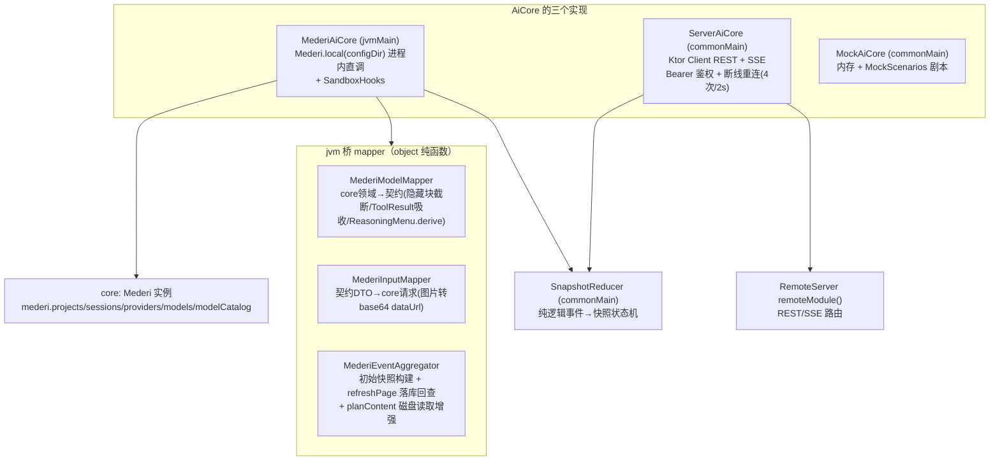
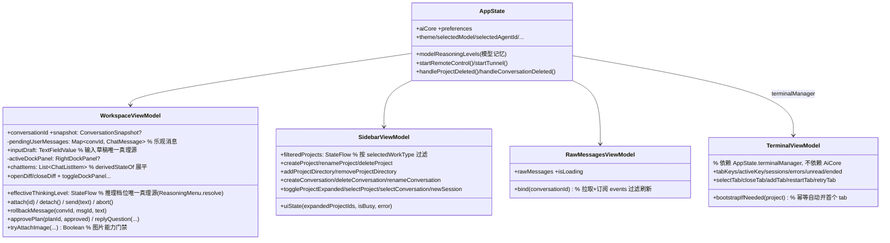
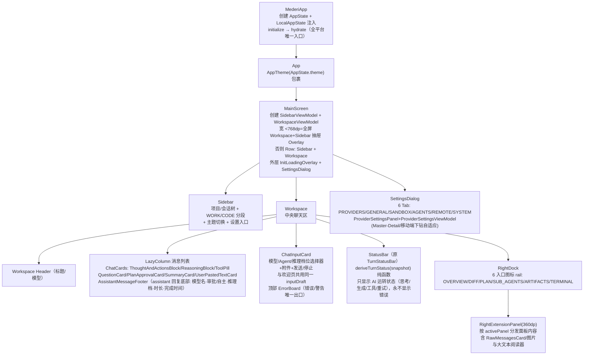
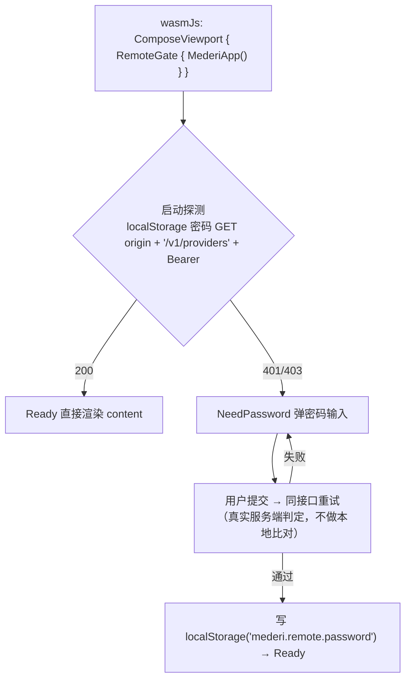

# 02 · app/shared（契约桥 + UI）与 server 模块

> 路径约定：`…/contract/` = `app/shared/src/commonMain/kotlin/xyz/mederi/core/contract/`；`…/jvm/` = `app/shared/src/jvmMain/kotlin/xyz/mederi/`。

## 1. AiCore 契约（`…/contract/AiCore.kt`）

对外唯一契约接口（KMP commonMain）。三实现：`MederiAiCore`（jvm 进程内直调 core）、`ServerAiCore`（commonMain，REST+SSE 遥控）、`MockAiCore`（UI 开发/预览）。

```kotlin
interface AiCore {
    val isReady: StateFlow<Boolean>
    suspend fun initialize(): Result<Unit>
    val projects: StateFlow<List<Project>>
    val providers: StateFlow<List<ProviderConfig>>
    val availableModels: StateFlow<List<ModelOption>>
    val availableAgents: StateFlow<List<AgentOption>>
    val builtinPresets: List<String>              // 内置供应商预设名（BuiltinProviders.allEntries）
    val configDir: String? get() = null           // 宿主配置/缓存基路径；纯 Web 返回 null

    // Project（单目录模型：一个项目恰好一个 directory）
    suspend fun createProject(input: CreateProjectInput): Result<Project>
    suspend fun renameProject(projectId: String, name: String): Result<Unit>
    suspend fun deleteProject(projectId: String): Result<Unit>       // 遍历会话统一走 deleteConversation

    // Conversation
    suspend fun createConversation(projectId: String, agent: AgentOption? = null): Result<Conversation>
    suspend fun deleteConversation(conversationId: String): Result<Unit>
        // 唯一删除封装入口: abortAndJoin → 删 session/history/diff → 删 .mederi 下 Mermaid png → 清本地缓存
    suspend fun renameConversation(conversationId: String, title: String): Result<Unit>
    fun observeConversation(conversationId: String): Flow<ConversationSnapshot>
    suspend fun getSnapshot(conversationId: String): Result<ConversationSnapshot>

    // Provider / Model / Key
    suspend fun configureProvider(providerId: String, input: ProviderUpdateInput): Result<Unit>
    suspend fun addBuiltinProvider(name: String, apiKey: String): Result<ProviderConfig>
    suspend fun deleteProvider(providerId: String): Result<Unit>
    suspend fun addProviderModel(providerId, providerModelId, name, supportsThinking=false,
        supportsImages=false, contextWindow: Int?=null, maxTokens: Int?=null,
        reasoningLevels: List<String>=emptyList(), isEnabled=true): Result<Unit>
    suspend fun updateProviderModel(providerId, modelId, /*全可空*/ ...): Result<Unit>
    suspend fun deleteProviderModel(providerId, modelId): Result<Unit>
    suspend fun setModelEnabled(providerId, modelId, enabled): Result<Unit>
    suspend fun refreshProviderModels(providerId): Result<List<String>>   // 只新增不碰存量
    suspend fun autoSetupProviderModels(providerId): Result<Int>          // 目录数据进存量模型唯一通道
    suspend fun createCustomProvider(input: CreateCustomProviderInput): Result<ProviderConfig>
    suspend fun addProviderApiKey(providerId, name, key, isDefault=false): Result<ApiKeyOption>
    suspend fun deleteProviderApiKey(providerId, keyId): Result<Unit>
    suspend fun setDefaultProviderApiKey(providerId, keyId): Result<Unit>

    // Message
    suspend fun sendMessage(conversationId: String, input: ChatPromptInput): Result<Unit>
    suspend fun abort(conversationId: String): Result<Unit>
    suspend fun rollbackToMessage(conversationId: String, messageId: String): Result<Unit>
    suspend fun resolveQuestion(conversationId, questionId, answers: List<List<String>>): Result<Unit>
    suspend fun resolvePlanApproval(conversationId, planId, approved: Boolean): Result<Unit>
    suspend fun compressHistory(conversationId: String): Result<Unit>
    suspend fun listMessages(conversationId): Result<List<ChatMessage>>
    suspend fun listMessagesPage(conversationId): Result<MessagesPage>   // 消息+token统计(快照对齐落库)
    suspend fun getMessage(conversationId, messageId): Result<ChatMessage>
    suspend fun listRawMessages(conversationId): Result<List<RawMessageDto>>  // 调试: payload 原文
    suspend fun getProcessStats(): Result<ProcessStats>   // 被监控端 = AiCore 所在宿主进程
    suspend fun getFileDiffs(conversationId, messageId: String? = null): Result<List<FileDiff>>

    fun events(): Flow<CoreEvent>
}
```

**契约同步硬性规则**：`AiCore.kt → MederiAiCore → ServerAiCore → RemoteServer 路由` 任何变动四处同步，缺一即编译失败或运行期 404；新增 DTO 放 `contract/dto` / `contract/models`（kotlinx-serialization，commonMain）。

**配套契约接口**（与 AiCore 并列的平台能力注入）：
- `Terminal.kt`：`TerminalManager(getOrCreate/find/all)` + `TerminalSession(key/title/isRunning/exitCode/output()/write/resize/kill)` —— 仅本机 jvmMain 实现（PtyTerminalHub），遥控端 null。
- `SandboxHooks.kt`：`setSandboxExtraPaths(paths)` + `sandboxStatus(): SandboxStatusInfo?` —— 仅 MederiAiCore 实现；`SandboxStatusInfo(backend, available, shell, detail)`。
- `AiCoreProvider.kt`：`expect object AiCoreProvider { fun default(): AiCore }`。

## 2. 契约模型（`…/contract/models/` + `dto/`）

### 2.1 ChatModels.kt

- `enum ConversationStatus { Idle, Working, Error }`
- `Conversation(id, projectId?, title, status, createdAt: Long, updatedAt: Long, parentConversationId?=null, modelId?=null, modelProvider?=null, thinkingLevel: String?=null(仅回显 core 诊断值,非 UI 真理源), agent?=null, directory?=null, workType=CODE)`
- `enum ChatRole { User, Assistant, System, Summary }`
- `ChatMessage(id, conversationId, role, blocks: List<ChatBlock>, createdAt, completedAt?, parentMessageId?, model?, agent?, isStreaming=false, error?=null, modelName?(assistant footer 模型显示名), agentMode?(APPROVAL/AUTONOMOUS), thinkingLevel?(实际推理档位), durationMs?(LLM 耗时))` —— footer 诊断字段由 `MederiModelMapper.toChatMessage` 从 core Message 诊断字段填充（completedAt ≈ createdAt + durationMs 下界估计）
- `sealed class ChatBlock(id)`（type 判别多态序列化）：`Text(id, text)` / `Reasoning(id, text)` / `ToolCall(id, name, state: ToolCallState)` / `File(id, name, url, mimeType?)` / `Diff(id, filePath, before, after)` / `Unknown(id, type)`
- `sealed class ToolCallState`：`Pending` / `Running(input: Map<String,String>)` / `Completed(input, output)` / `Failed(input, error)`
- `ToolCallUi(id, name, state, target?=null, isFailed=false)` —— VM 预计算展平展示模型；target = 命令原文 / 文件路径（会话目录内→相对路径，目录外→绝对路径）/ apply_patch 提取的文件清单；工具行展开区显示执行结果（Completed.output / Failed.error）
- `enum CoreEventType`（与 core EventType 14 个一一对应）
- `CoreEvent(type, sessionId, messageId?=null, payload: Map<String,String>, timestamp="")`
- `PastedTextAttachment(id, index, text, lineCount, charCount)`；`ImageAttachment(id, name, mimeType, bytes, base64DataUrl, width=0, height=0)`

### 2.2 其他 models

- **ConfigModels.kt**：`ModelOrigin{FETCHED, MANUAL}`；`ModelOption(id, name, provider, supportsThinking, supportsImages=false, supportsImagesOverride: Boolean?=null(用户覆盖,同步永不覆盖), reasoningLevels=[], providerModelId=id, origin=FETCHED, contextWindow?, maxTokens?, inputPricePerMillion?, outputPricePerMillion?, isEnabled=true)`；`AgentMode{APPROVAL, AUTONOMOUS}`；`WorkType{WORK, CODE}`；`AgentOption(id, name, description?, mode, workType=CODE, model: ModelOption?=null, reasoningLevel?, systemPrompt?, tools=[])`
- **ProviderModels.kt**：`ProtocolType{OPENAI_CHAT("OpenAI 兼容"), OPENAI_RESPONSES, GOOGLE}`（displayName+placeholderUrl；`CREATABLE=[OPENAI_CHAT, OPENAI_RESPONSES]`）；`ReasoningLevels.SELECTABLE=["LOW","MEDIUM","HIGH","MAX"]`；`ProviderType{Builtin, Custom}`；`CustomModelEntry(id, name, supportsThinking=false, supportsImages=false, contextWindow?, maxTokens?, reasoningLevels=[], isEnabled=true)`；`ApiKeyOption(id, name, maskedValue, isDefault)`；`ProviderConfig(id, name, type, baseUrl?, isConnected, models: List<ModelOption>, customModels=[], supportsApiKey, supportsBaseUrl, protocolType=DEFAULT, apiKeys=[], reasoningLevels: Map<String,String?>=空(级别名→请求体JSON片段/null), responseSanitization=false)`
- **ReasoningMenu.kt（纯函数唯一真理源）**：`derive(providerLevels, modelLevels): List<String>`（推导聊天菜单档位，NONE 恒第一；显示条件=模型勾选了级别或供应商任一档有值）；`resolve(modelMemoryLevel, modelLevels): String?`（**唯一推导链：模型记忆 > 默认档(MEDIUM 优先否则首档)**；菜单空=不支持返回 null）
- **ProjectModels.kt**：`Project(id, name, directory: String, conversations: List<Conversation>)`
- **FilesystemModels.kt**：`FileChangeStatus{Added, Modified, Deleted}`；`FileChange(filePath, status)`；`FileDiff(filePath, before, after, additions, deletions)`
- **PermissionModels.kt**：`QuestionRequest(id, conversationId, questions: List<Question>)`；`Question(id, prompt, options, allowCustom, multiSelect=false)`；`PlanApprovalRequest(id, conversationId, planPath, title, summary="", subtaskCount=0, planContent?=null, status="PENDING")`（审批卡片只展示标题+子任务数，详细内容经 planPath 读取）
- **TodoModels.kt**：`TodoStatus`（wire 小写 pending/in_progress/completed/cancelled/failed）；`TodoItem(id, content, status, priority?=null)`；`internal TodoWireItem(content, status)`（事件 payload wire DTO，与 core encodeTodos 严格对齐，id/priority 不上 wire）
- **StatisticsModels.kt**：`TokenUsage(input=0, output=0, reasoning=0, cacheRead=0, cacheWrite=0)`（`total = input+output+reasoning`）；`CostSummary(total=0.0, currency="USD")`
- **CompactionModels.kt**：`CompactionConfig(auto?, tailTurns?, preserveRecentTokens?, reserved?, prune?)`
- **ProcessStatsModels.kt**：`ProcessStats(cpuUsage?, cpuCores=1, heapUsedBytes=0, heapCommittedBytes=0, heapMaxBytes?, rssBytes?, timestampMillis=0)`

### 2.3 dto/

- `ChatPromptInput(text, model: ModelOption?, agent: AgentOption?, thinkingLevel: String?, attachments: List<FileAttachment>)`；`FileAttachment(name, mimeType, bytes)`
- `ConversationSnapshot(conversation, messages, tokenUsage, contextUsedTokens: Long=0(最近一条 Assistant inputTokens,与自动压缩同源), cost, pendingQuestion?, pendingPlanApproval?, planApprovals=[], todos=[], childConversations=[], errorMessage?(错误/警告简报,ErrorBoard 输入框顶部一行展示), errorId?(ErrorCollector 生成的错误 ID,JVM 端可 ErrorCollector.get(id) 取完整 ErrorRecord), errorDiagnostic?(完整分层诊断报告纯文本,点"详细报告"展开;server→wasmJs 的详情唯一载体), statusHint?(仅限流重试过程提示,内存态——不再承载断流警告,警告走 errorMessage/ErrorBoard), errorIsStreamInterrupted=false(failureMode==PREMATURE_CLOSE 时置 true,MESSAGE_DELTA 复位;UI 据此在 ErrorBoard 显示"继续"按钮))`
- `MessagesPage(messages, tokenUsage, contextUsedTokens)` —— MESSAGE_COMPLETED/ERROR 后对齐落库数据用
- `RawMessageDto(seq, messageId?, role, payload(原始 JSON), createdAt)`
- `CreateProjectInput(name, directory)`；`ReasoningConfigInput(levels: Map<String,String?>)`；`ProviderUpdateInput(name?, apiKey?, baseUrl?, enabled?, customModels?, reasoningParameter?)`；`CreateCustomProviderInput(name, baseUrl, apiKey?, customModels, type=DEFAULT, responseSanitization=false, reasoningParameter?)`
- wire 请求 DTO：`CreateConversationInput(projectId, agent)`、`RenameConversationInput(title)`、`RenameProjectInput(name)`、`BuiltinProviderInput(name, apiKey)`、`AddModelInput/UpdateModelInput/SetModelEnabledInput`、`AddApiKeyInput(name, key, isDefault=false)`、`ResolveQuestionInput(answers)`、`ResolvePlanApprovalInput(approved)`、`ApiError(error)`、`ReadyInfo(ready, configDir)`、`PlanContent(content?)`

## 3. SnapshotReducer（`…/contract/SnapshotReducer.kt`）

契约层 `CoreEvent` → `ConversationSnapshot` 的**纯逻辑**（跨平台，JVM 桥与 wasmJs 共用同一状态机）。

| 事件 | 聚合效果 |
|---|---|
| SESSION_CREATED | 原样返回 |
| SESSION_UPDATED | status=Working、清 errorMessage（新 turn 开始旧错误过时） |
| MESSAGE_DELTA | 在当前 streaming Assistant 占位消息上追加块（text/reasoning 合并到最后同类型块、tool_call 增量、image 新建 File 块），status=Working、清 statusHint |
| MESSAGE_COMPLETED | status=Idle、isStreaming=false、清 statusHint；断流警告以 **ErrorRecord payload**（error/errorId/fullDiagnostic, errorSeverity=WARNING, failureMode=PREMATURE_CLOSE）写入 errorMessage/errorId/errorDiagnostic，**failureMode==PREMATURE_CLOSE → errorIsStreamInterrupted=true** → **ErrorBoard 展示 + 可展开详细报告 + "继续"按钮**（`WorkspaceViewModel.continueAfterInterruption()` 重发 `"Continue"` 走正常 send 流程续写），会话保持 Idle（turn 真实完成）。正常收尾无这些 key → 三者保持原值；MESSAGE_DELTA 复位 errorIsStreamInterrupted |
| MESSAGE_ERROR | status=Error、errorMessage=payload["error"]（简报）、errorId=payload["errorId"]、errorDiagnostic=payload["fullDiagnostic"]、清 statusHint |
| STATUS | 仅 scope=provider 且 code=RETRYING 时写 statusHint="供应商限流，重试中 (attempt/max)"，不碰状态机 |
| TOOL_CALLED | 完整 args 更新 ToolCall block(input)，状态 Running |
| TOOL_RESULT | 按 toolCallId 精确匹配（回退：最后 Running/Pending 同名），状态 Completed/Failed 并保留 input |

工具参数解析走 `ToolArgParser.parse`（commonMain，`SnapshotReducer` 与 `MederiModelMapper` 共用）：以 `JsonObject` 宽容解析为 `Map<String,String>`，数字/布尔转字面量、嵌套结构保留 JSON 文本——避免 `read_file.max_lines` / `execute_command.timeout_seconds` 等非字符串参数让整条 args 解析失败导致路径/命令丢失。
| QUESTION_REQUESTED / RESOLVED | 写/清 pendingQuestion |
| PLAN_APPROVAL_REQUESTED / RESOLVED | 写/清 pendingPlanApproval + planApprovals 去重列表 |
| TODO_UPDATED / PLAN_PROGRESS | 解码 payload["todos"] 整体替换快照 todos；解码失败丢弃事件保留先前快照 |

入口：`applyWithRefresh(snapshot, event, refreshPage)`（MESSAGE_COMPLETED 先发"完成状态"快照再回查落库对齐发第二个；MESSAGE_ERROR 回查后只发最终一个）；及不含回查的 `apply(snapshot, event)`。

## 4. 三实现架构图



### 4.1 MederiAiCore（`…/jvm/core/bridge/MederiAiCore.kt`）

`class MederiAiCore(configDir: String, dispatcher = Dispatchers.Default) : AiCore, SandboxHooks`。

**initialize() 流程（顺序）**：
1. `mederi = Mederi.create { configDir; userAgent = AppInfo.userAgent }`（出站 HTTP User-Agent 唯一注入点：所有 Koog 链路请求带 Mederi 身份头）
2. `cleanupLegacyBuiltinProviders()` —— 删"无 API Key 且名字命中内置预设"的历史垃圾 Provider
3. `cleanupStaleRunningSessions()` —— abort 上次崩溃残留的 RUNNING session
4. `syncBuiltinProviders()` —— 内置供应商 baseUrl/reasoningParameter/responseSanitization/modelsDevKey 与代码预设校验、不一致则更新
5. `refreshGlobalState()` —— 填充 projects/providers/availableModels/availableAgents 四个 StateFlow
6. `_isReady = true`
7. `mederi.modelCatalog.start()` —— models.dev 目录启动即拉 + 每小时刷新
8. `autoRefreshBuiltinGoogleModels()` —— 后台刷新已配 Key 的内置 Google 供应商模型（只新增不碰存量）
9. `autotitleService.start()` —— **会话自动命名挂在此处（谁初始化谁生效，desktop/server 天然一致）**

`events()` = `mederi.sessions.events().map { MederiModelMapper.toCoreEvent(it) }`；`observeConversation()` 委托 MederiEventAggregator（初始快照 + SnapshotReducer.applyWithRefresh + refreshPage 回查 + initialTodos hydration：Plan 投影 > session.todos）。

**BuiltinProviders**（object，`…/jvm/core/bridge/BuiltinProviders.kt`）：内置供应商预设唯一真理源（Google Gemini / Agnes SG+CN / Hetzner / Empero / OpenCode Zen / OpenRouter / 商汤 SenseNova），`allEntries()` 按端点展开、`isBuiltinName()` 判定；预设含 baseUrl/协议/响应清洗/推理参数(modelsDevKey)。
**BuiltinAgents**（object，commonMain）：内置 Agent 唯一真理源 = AgentMode×WorkType 四组合（autonomous-code / approval-code / autonomous-work / approval-work），`byId(id)`。

### 4.2 ServerAiCore（`…/commonMain/core/bridge/ServerAiCore.kt`）

`class ServerAiCore(baseUrl, passwordProvider: suspend () -> String? = {null}) : AiCore`。
- Ktor client 配置：`defaultRequest` 统一带 `User-Agent: AppInfo.userAgent`（身份头唯一真理源 = `AppInfo.userAgent`，见 §4.3）。
- 鉴权：passwordProvider 非空时所有 REST + SSE 带 `Authorization: Bearer <password>`。
- initialize：校验 baseUrl → 轮询 `GET /v1/ready`（20s 上限、250ms 间隔）→ 拉 presets/agents/models/providers/projects → isReady。
- SSE：官方 SSE 插件，incoming data 段反序列化为 CoreEvent（失败丢弃），心跳注释帧不投递；两个流：`/v1/events`（全局）与 `/v1/sessions/{id}/events`（会话）。
- 错误：非 2xx 抛异常（优先 ApiError.error 文本），方法边界包 Result 失败。

### 4.3 AppInfo（`…/commonMain/AppInfo.kt`，应用身份唯一真理源）

- `VERSION`：应用版本常量，**源码不写版本字面量**。唯一出处 = Gradle 工程根 `version.json`（CI 基于 git tag 写入）；构建脚本（app/shared 的 `generateVersionSource` 任务）读取后生成 `AppVersion.kt`（`MEDERI_APP_VERSION`）注入这里。
- `userAgent`（lazy）：`Mederi/<version> (<os> <os-version>; <arch>)` —— 组合 `VERSION` + `platformInfo()`，所有出站 HTTP 请求（Koog 链路经 `MederiConfig.userAgent` → `MederiHttpClientFactory`；Ktor 客户端经 `defaultRequest`）只从这里取值。
- `platformInfo(): PlatformInfo(osName, osVersion, arch)`：`expect` 声明，jvm/android/ios/wasmJs 各一个 `actual`（见 00-overview 平台注入矩阵）；`normalizeOsName`/`normalizeArch` 为标准 UA 粒度映射（Windows NT / Mac OS X / Linux / Android / iOS；aarch64→arm64、amd64→x86_64）。
- 硬性规则：禁止在调用处自行获取版本号 / os / arch 再拼 UA。

## 5. RemoteServer 路由表（`…/jvm/core/remote/RemoteServer.kt`）

`RemoteServer.start(aiCore: MederiAiCore, requestedPort=8081, password?, webappDir?): RemoteStartResult`（幂等；**端口策略**=先按请求端口 bind，被占 → port=0 OS 挑空闲，`resolvedConnectors()` 读回实际端口并标记 portFallback）；`stop()` 幂等。
- install：ContentNegotiation(json)/SSE/CORS(anyHost + Authorization 等)；password 非空 → Authentication(bearer "mederi-remote")。
- webapp：webappDir 非空 → staticFiles("/")；否则 classpath `staticResources("/","static")`（内置 wasm 产物）；SPA fallback + preCompressed(GZIP) + .wasm Content-Type；`/` 与 `/v1/ready` 豁免鉴权。
- SSE：`respondEventStream(events)` —— 15s 心跳注释帧防代理断连；客户端断开结构化并发取消。

**路由清单**（`v1Routes(aiCore)` 内，可被鉴权包裹）：

| 方法+路径 | 转调 |
|---|---|
| GET `/info`、GET `/v1/ready` | ReadyInfo |
| GET `/v1/presets` / `/v1/agents` / `/v1/models` / `/v1/providers` / `/v1/projects` | 直接 respondData StateFlow 值 |
| GET `/v1/system/stats` | getProcessStats |
| POST `/v1/projects`；PATCH/DELETE `/v1/projects/{id}` | Project 组（单目录，无目录增删端点） |
| POST `/v1/sessions`；DELETE/PATCH `/v1/sessions/{id}` | Conversation 组 |
| GET `/v1/sessions/{id}/snapshot` \| `messages` \| `messages/raw` \| `messages/{messageId}` \| `diffs[?messageId=]` | 查询组 |
| POST `/v1/sessions/{id}/messages` \| `abort` \| `rollback` \| `questions/{questionId}` \| `plans/{planId}/approve` \| `compress` | 动作组 |
| SSE GET `/v1/events`（全局）；GET `/v1/sessions/{id}/events`（按 sessionId filter） | 事件流 |
| POST `/v1/providers`；POST `/v1/providers/builtin`；PATCH/DELETE `/v1/providers/{id}` | Provider 组 |
| POST `/v1/providers/{id}/models`；POST `.../models/refresh`；POST `.../models/auto-setup`；PATCH/DELETE `.../models/{modelId}`；POST `.../models/{modelId}/enabled` | Model 组 |
| POST `/v1/providers/{id}/keys`；DELETE `.../keys/{keyId}`；POST `.../keys/{keyId}/set-default` | Key 组 |

响应助手：`respondResult(Result)`（Unit 成功返回 `{}`，失败按 MederiException 子类映射 404/400/409/500 + ApiError）、`respondData(裸值)`、`respondError`。

**PtyTerminalHub**（`…/jvm/core/remote/terminal/PtyTerminalHub.kt`）：终端会话注册表（TerminalManager 实现，desktop 与 server 共用）——一个 key=一个常驻 shell（pty4j，`$SHELL`→bash→sh、Windows cmd.exe，登录 shell，TERM=xterm-256color）；服务端 64KB scrollback 环形缓冲（attach 先回放再续流）；会话随宿主进程生命周期（进程退出→OS 关 pty master→SIGHUP）；`PtyTerminalSession` 提供 output 流/write/resize/kill。JVM-only（pty4j 无 KMP 替代品）。

## 6. server 模块（`server/src/main/kotlin/xyz/mederi/Application.kt`）

独立 JVM 进程 headless 部署薄启动器：
1. 读环境变量：`MEDERI_SERVER_PORT`(默认 8081)、`MEDERI_CONFIG_DIR`(默认 ~/.mederi)、`MEDERI_SERVER_PASSWORD`(非空则 /v1 Bearer 鉴权)、`MEDERI_WEBAPP_DIR`(可选外部 wasm UI)、`MEDERI_LLM_RETRY_MAX/MIN_MS/MAX_MS`（写 `LlmRetryConfig`）。
2. `MederiAiCore(configDir)` + `runBlocking { initialize() }`（失败记录 initError 不阻断启动）。
3. `embeddedServer(Netty, port, host="0.0.0.0") { remoteModule(aiCore, ReadyInfo(ready = initError==null, configDir), password, webappDir) }.start(wait = true)` —— 复用 shared 的 remoteModule，**路由代码零重复**。

## 7. AppState 与 ViewModel 层

### 7.1 AppState（`…/commonMain/core/ui/appstate/AppState.kt`）

`class AppState(aiCore, preferences: PreferencesStore, scope)`；宿主注入点 = `remoteControl: RemoteControlHooks?` 与 `terminalManager: TerminalManager?`；`LocalAppState` CompositionLocal。

**持久化字段**：

| 字段 | 持久化 key | 说明 |
|---|---|---|
| theme: AppThemeMode | `app.theme` | DARK 默认 |
| remoteControlEnabled / remoteControlPassword / remotePort | `remote.enabled` / `remote.password` / `remote.port`（默认 8081，成功后回写实际端口） | 遥控 |
| remoteServerState | —（内存） | Idle/Starting/Running(port, portFallback)/Failed |
| tunnelState | —（内存） | Idle/Starting/Running(url)/Failed(notInstalled) |
| selectedProjectId / selectedConversationId | `workspace.lastProjectId` / `workspace.lastConversationId` | 选中态 |
| selectedModel | `workspace.lastModelId` + `workspace.lastModelProviderId` | 带自愈：列表重建后重指向同款新实例 |
| selectedAgentId | `workspace.lastAgentId` | |
| sandboxExtraPaths | `sandbox.extraPaths`(JSON 数组) | 写穿 SandboxHooks |
| modelReasoningLevels: Map\<modelId, level\> | `workspace.reasoningLevel.$modelId` | **模型推理档位记忆**（ReasoningMenu.resolve 的第一优先输入） |

派生：`selectedWorkType / selectedAgentMode`（selectedAgentId × availableAgents combine）；`processStats`（后台 1s 轮询）。
方法：`persist(key, value)`（异步写、pendingWriteCount 计数）、`flushPreferences()`（退出前同步等待归零，2s 兜底）、`applyConversationDefaults`（补位不覆盖）、`setRemoteControl/startRemoteControl/stopRemoteControl`、`startTunnel/stopTunnel`、`handleProjectDeleted/handleConversationDeleted`（唯一允许偏好与引擎状态对齐的地方）、`hydrate()`（启动恢复，列表就绪后限时 3s 回填）。

### 7.2 ViewModel 类图



- **WorkspaceViewModel 要点**：`attach(id)` = getSnapshot 校验可达 + observeConversation 订阅 + 乐观消息对账；`send(text)` = 校验就绪/模型/图片门禁 guardImageSupport（send 与 rollbackMessage 共用唯一实现）→ PromptComposer.compose → 乐观更新 → 无会话自动 createConversation → 有待审批先 resolvePlanApproval(false) → sendMessage（thinkingLevel 只发 computeEffectiveThinkingLevel()）；`rollbackMessage` = 先验后切（restoreInputFromMessage 反解主指令/大段文本/图片 → 本地切片 → rollbackToMessage）→ **成功后才把内容粘贴回输入框重建待发态**（inputDraft + pendingPastedTexts + pendingImages，用户切模型/模式/改内容后自行发送），失败走 ErrorBoard；`restoreInputFromMessage(targetMsg?, fallbackText)` 为纯函数（PromptComposer.parse 拆主指令与大段文本、data: File block base64 还原图片）；`chatItems` 预计算 toolSummary/target/headerSummary/isReasoningActive。
- **TerminalViewModel key 约定**：`"project:<id>"`、`"project:<id>#<n>"`、`"tmp:<n>"`。

## 8. UI 组合结构（commonMain）



- `ChatLayout.kt` 不是 Composable，是**布局常量对象**（contentMaxWidth=1000dp、userBubbleMaxWidth=680dp、sidebarWidth=260dp、rightPanelWidth=360dp、headerHeight=40dp、turnSpacing=14dp 等）。
- 三个职责分离的条栏：**StatusBar**（消息区，AI 运转状态，`deriveTurnStatus(snapshot)`，永不显示错误；计时锚定"发送请求时刻"`WorkspaceViewModel.turnStartedAt`（send 时记录、turn 结束清除），每秒 `now - turnStartedAt` 重算——切会话回来不重置；**与 footer durationMs 语义不同：StatusBar=从发请求起算，footer=API 有回应起算到回复结束**）、**ErrorBoard**（ChatInputCard 顶部，错误/警告唯一出口：单行简报 + "详细报告"展开 + 关闭；断流时（快照 errorIsStreamInterrupted）额外显示"继续"按钮 → `continueAfterInterruption()` 重发 Continue 续写半截回复，数据源=快照 errorMessage）、**SystemInfoBar**（最底部，纯 CPU/RSS/JVM 资源监控，不接错误）。
- **AssistantMessageFooter**：assistant 消息轮次底部元数据条（模型名 · 审批/自主 · 推理档 · 耗时 · 完成时间），数据来自 core Message 诊断字段（modelName/agentMode/reasoningLevel/durationMs）经契约 ChatMessage 透传，`computeChatItems` 只挂在轮次最后一个文本块（AssistantFooterInfo）。诊断字段由 `TurnIncrementalPersister.persistAssistant` 增量落库时注入（否则 reconcile 时 assistant 消息被"已存在"识别、字段永不补上）；**durationMs = API 有回应（响应创建）→ 落库**（`withAssistantDuration`），非"从发请求起算"。
- 其余组件：`InitLoadingOverlay`（备用全屏遮罩）、`SegmentedControl`（WorkType/AgentMode 复用）、`SubAgentComponents`（SubAgentCard/SubAgentTabContent）、`TerminalPanelContent`（多 tab 终端渲染，状态机全在 TerminalViewModel）、`TerminalView`（expect：desktop=jediterm+SwingPanel；wasm/移动端=遥控端占位）。
- 渲染 AI 回复使用 `:inkcompose` 的 `MarkdownView`（见 03-inkcompose.md）。

## 9. 平台入口与特性

### 9.1 RemoteGate（`…/wasmJsMain/core/remote/RemoteGate.kt`）



**硬性禁止 `?password=` URL 参数**（会留浏览器历史）。密码未验证不创建 AiCore。

### 9.2 SessionTitleService（`…/jvm/core/autotitle/SessionTitleService.kt`）

- 挂载：`MederiAiCore.initialize()` 内 `autotitleService.start()`（lazy 构造，注入 `Mederi`，构造时传 `{ refreshProjects() }`，改名成功后回调刷新侧边栏），订阅 `mederi.sessionManager.events()`。
- 触发：收到 `SESSION_UPDATED` 且该会话**首次**进入处理（内存 processedSessions）时判定；条件 = 标题仍为 "New Session" 且**恰好一条** user 消息（core durable-first 保证回查可见）。
- 选模型（所有层：**当前供应商优先 → 其他已连接供应商**；扫描范围 = 供应商**全部**模型，**不过滤 isEnabled**）：
  1. 免费模型：`mederi.modelCatalog.getFor(providerKey, baseUrl, modelId)` 价格 input==0 && output==0
  2. 小模型：名字含 `flash` / `lite`（大小写不敏感），排除含 `mini` 的
- 请求：走 `OneShotCompletion.execute(provider, model, key, "autotitle", ...)`（**不注入任何推理参数**，服务器默认）→ `mederi.sessionManager.rename(id, title)`；候选逐个试，请求报错推下一个。
- 兜底：候选耗尽 → 直接用用户发信息用的模型（`session.aiModel` 快照 id → provider 现值）再请求一次；仍失败 → `session_yyyy-MM-ddTHH:mm:ss`（本地时间）。
- 旧的 OpenCode Zen 免费模型链 / X-Session-ID / 自建 HttpClient / timestamp 命名已整体删除。

### 9.3 desktopApp（`app/desktopApp/src/main/kotlin/xyz/mederi/`）

- `main.kt` 注入：进程级 `PtyTerminalHub()` 单例 → `appState.terminalManager`；`onAppStateReady` 中若 aiCore 是 MederiAiCore → `appState.remoteControl = DesktopRemoteControlHooks(aiCore, webappDir)`；`LaunchedEffect` 观察 `remoteControlEnabled` 自动启停内嵌 server；`webappDir` = 环境变量 `MEDERI_WEBAPP_DIR` 或探测三个常见 wasm 产物路径；`onCloseRequest` 顺序收尾：`RemoteServer.stop()` → `terminalHub.shutdown()` → `stopTunnel()` → `flushPreferences()` → 退出。
- `DesktopRemoteControlHooks.kt`：`start(port, password) = RemoteServer.start(...)`；`localAddress` = 枚举 site-local IPv4（10/8、172.16/12、192.168/16）；`isCloudflaredInstalled()` = `cloudflared --version` 探测（未装 UI 提示自行安装，不代装）；`startTunnel(port)` = **pty4j** 真实 pty 拉起 `cloudflared tunnel run`（读 `~/.cloudflared/config.yml`），幂等；**生命周期** = 本进程退出 → OS 关 pty master → SIGHUP → cloudflared 退出（无需看门狗）；`parseTunnelDomain()` = 解析 config.yml 第一条 ingress hostname 拼 `https://<host>`。

### 9.4 其他入口

- **androidApp**（`MainActivity.kt`）：`MermaidCacheConfig.setBaseDirectory(cacheDir)` + 注入 `AndroidAppContext.applicationContext`（SharedPrefs 工厂）→ `setContent { App() }`；AiCoreProvider.android = ServerAiCore（100% 遥控端）。
- **webApp**（wasmJs `main.kt`）：`ComposeViewport { RemoteGate { MederiApp() } }`。
- **iosApp**：SwiftUI `WindowGroup → ContentView → ComposeView(MainViewControllerKt.MainViewController())`；shared 的 `MainViewController() = ComposeUIViewController { App() }`；AiCoreProvider.ios = ServerAiCore（暂硬编码 127.0.0.1:8081）。

## 10. preferences 契约（`…/contract/preferences/`）

- `PreferencesStore`：`suspend getString(key): String?` / `putString(key, value)` / `remove(key)`；默认 `getBoolean/putBoolean`（字符串编解码）。
- `PreferencesFactory`：`expect fun defaultPreferencesStore(): PreferencesStore`。
- 实现：`InMemoryPreferencesStore`（测试/兜底）；`JsonFilePreferencesStore(file, fileSystem)`（jvm/android/ios 共用：Mutex 串行化、临时文件+原子 rename、解析失败先备份 `.corrupt-*.bak` 再继续，绝不静默覆盖）；android `SharedPrefsPreferencesStore`；wasmJs `WasmJsPreferencesStore`（localStorage 键前缀 `mederi.pref.`，禁用时降级内存）。

## 11. util/ 与 Mock/

- **PromptComposer**：粘贴大文本判定（`isLargeText` ≥800 字符或 ≥15 行）+ Prompt 组装/解析（compose 主指令在前、粘贴文本以编号 XML `<pasted_text>` 标签追加在后；parse 反向拆分）。
- **GitUtils**：`expect fun getGitBranch(directoryPath): String?`。
- **PlatformUtils**：`expect openUrl/openFile` + 纯函数 `formatContextWindow`(token→"x.x万/K")、`formatBytes`、`formatCpuUsage`。
- **ClipboardHelper**：`expect object PlatformClipboard { getImage()/getText() }`（读系统剪贴板图片/文本）。
- **DirectoryPicker**：`expect suspend fun pickDirectory(): String?`。
- **Mock 体系**（`…/core/mock/`）：`MockAiCore`（实现全部 AiCore；initialize 装 MockSeedData 后 500ms 就绪；sendMessage 起协程跑 MockScenarios 剧本；resolveQuestion 用 CompletableDeferred）+ `MockIdGenerator` + `MockScenarios`（三个可复现剧本：流式 reasoning、tool call Pending→Running→Completed、问询卡片等）+ `MockSeedData`（2 供应商/5 preset/3 项目/若干会话含子会话与错误会话）。用途：未接真实 core 的平台兜底 + UI 开发预览。

## 12. theme/Theme.kt

主题机制：`AppThemeMode`（AppState 持久化 `app.theme`）→ `AppTheme(theme)` Composable 统一注入 Material3 ColorScheme；DiagramTheme/CodeTheme/LatexTheme 由 inkcompose 侧从 colorScheme 派生（`DiagramTheme.material3(colorScheme)`）。
