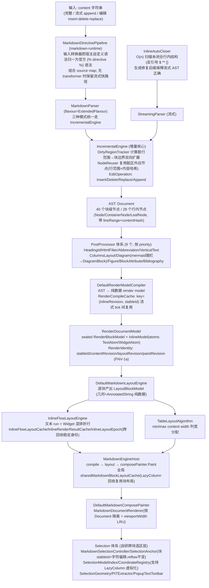
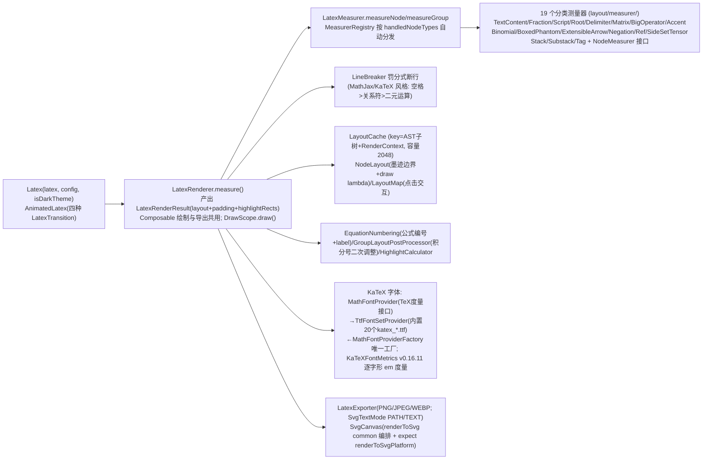
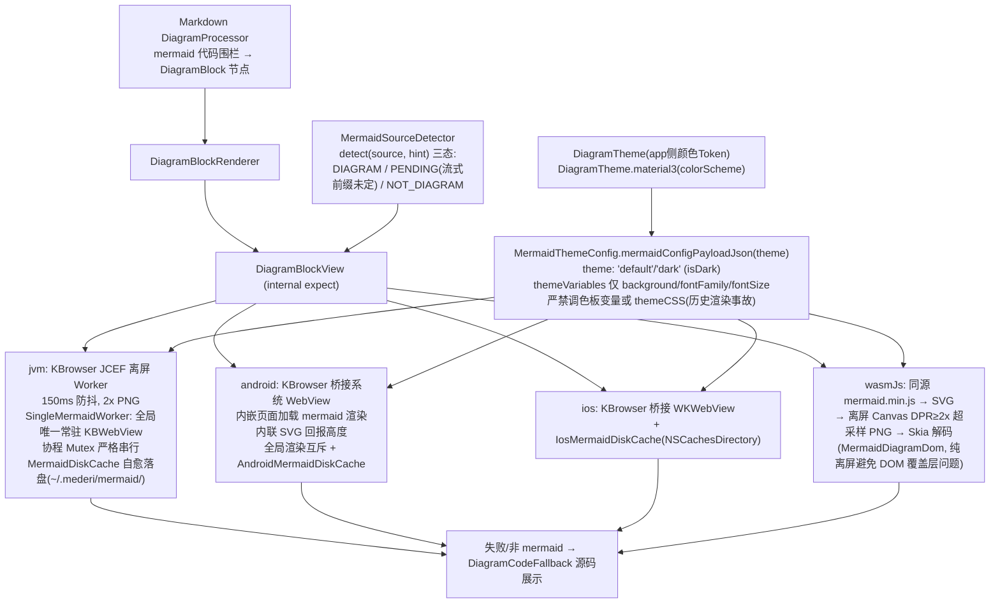

# 03 · inkcompose 模块（富文本渲染库，:inkcompose，包 xyz.emuci）

> 单 KMP 模块，目标平台 jvm / android / iosArm64+Simulator / wasmJs（无 js 目标）。369 个 .kt 文件。
> 对 app 层暴露的**公共 API 只有 `xyz.emuci.inkcompose` 包**，内部领域包不要对外引用。
> 领域依赖只有一条链：markdown-renderer → latex/syntax/diagram（嵌入渲染），其余领域零依赖。

## 1. 公共 API（`common/entry/` + `common/image/`）

| 符号 | 文件 | 说明 |
|---|---|---|
| `MarkdownView(...)` | `common/entry/kotlin/xyz/emuci/inkcompose/MarkdownView.kt` | 统一渲染入口 Composable |
| `RenderType` | 同目录 RenderType.kt | `AUTO / TEXT / MARKDOWN / LATEX / MERMAID / VLR / CODE` |
| `MermaidCacheConfig` | 同目录（expect object） | `setBaseDirectory(path)` / `getBaseDirectory()` / `clearSessionCache(sessionKey)` |
| `LocalSessionKey` | 同目录 | `compositionLocalOf<String?>`，会话标识用于图表缓存前缀 |
| `InkImage(...)` | `common/image/kotlin/xyz/emuci/inkcompose/InkImage.kt` | 统一图片组件（Coil3）：网络 URL、base64 data URI、本地文件（`~/`、`/abs`、`file://`、Android `content://`）、SVG（jvm/ios/wasm=Skia SVGDOM，android=coil-svg ServiceLoader）；失败显示可见占位不静默 |

**MarkdownView 参数签名**：

```kotlin
fun MarkdownView(
    content: String, modifier: Modifier = Modifier,
    type: RenderType = RenderType.AUTO, isStreaming: Boolean = false,
    language: String? = null,
    markdownTheme: MarkdownTheme? = null, codeTheme: CodeTheme? = null,
    markdownConfig: MarkdownConfig = MarkdownConfig.Default,
    latexConfig: LatexConfig = LatexConfig(),
    diagramTheme: DiagramTheme = DiagramTheme.Default,
    onLinkClick: ((String) -> Unit)? = null,
    enableSelection: Boolean = true,
    selectionMenuActions: List<SelectionMenuAction> = emptyList(),
    enableScrollOverride: Boolean? = null,   // null=BoxWithConstraints 自动检测; LazyColumn 中传 false
    sessionKey: String? = null,              // 回退到 LocalSessionKey
)
```

分发：`AUTO`→`MARKDOWN`；MARKDOWN 内 `BoxWithConstraints.hasBoundedHeight` 自动选 StaticColumn/LazyColumn；`LATEX`→`Latex`，`MERMAID`→`DiagramBlockView`，`VLR`→`VTextView`，`CODE`→`CodeBlock`；外层 `CompositionLocalProvider(LocalSessionKey)`。

## 2. Markdown 渲染管线

### 2.1 全管线流程图



### 2.2 解析器要点（`common/markdown-parser/kotlin/xyz/emuci/markdown/parser/`）

- **入口** `MarkdownParser.kt`：`MarkdownParser(flavour=ExtendedFlavour, customEmojiMap, enableAsciiEmoticons, enableLinting, appendCoalesceThreshold=0)`；完整 `parse()` / 流式 `beginStream+append+endStream` / 编辑 `insert/delete/replace`；暴露 `document`、`sourceText`、`diagnostics`。
- **Flavour 体系**（`flavour/`）：`MarkdownFlavour`（接口：blockStarters + postProcessors 定义方言）→ `CommonMarkFlavour`（零扩展）→ `GFMFlavour`（+表格/任务列表/删除线/自动链接）→ `MarkdownExtraFlavour`（PHP Extra，明确排除 math/emoji/directive）→ `ExtendedFlavour`（默认全集）；`FlavourCache`：内置单例方言全局共享、预构建冻结 `BlockStarterRegistry`。
- **BlockStarter 体系**（`block/starters/`）：接口 `priority`（越小越先）+ `canInterruptParagraph` + `tryStart(cursor, lineIdx, tip)`；17 个实现：Heading/SetextHeading/FencedCodeBlock/IndentedCodeBlock/BlockQuote/ListItem/Table/ThematicBreak/HtmlBlock/FrontMatter/CustomContainer/MathBlock/FootnoteDefinition/DefinitionDescription/DirectiveBlock/PageBreak/TabBlock。辅助：`BlockParser`（块级主循环）、`OpenBlock`（栈节点）、`TableParser`。
- **PostProcessor 体系**（`block/postprocessors/`）：接口 `priority + process(document)`；`PostProcessorRegistry`（Copy-on-Write 原子注册表，`withDefaults()`）；9 个：HeadingIdProcessor、HtmlFilterProcessor、AbbreviationProcessor、VerticalTextProcessor（```vlr→VerticalTextBlock）、ColumnsLayoutProcessor、DiagramProcessor（mermaid 围栏→DiagramBlock）、FigureProcessor、BlockAttributeProcessor、BibliographyProcessor。
- **AST**（`ast/`）：`Node`→`ContainerNode`/`LeafNode`。块级 40 个（Document/Heading/SetextHeading/Paragraph/ThematicBreak/FencedCodeBlock/IndentedCodeBlock/BlockQuote/ListBlock/ListItem/HtmlBlock/LinkReferenceDefinition/Table*/FootnoteDefinition/MathBlock/DefinitionList*/Admonition/FrontMatter/BlankLine/TocPlaceholder/AbbreviationDefinition/CustomContainer/DiagramBlock/VerticalTextBlock/ColumnsLayout*/PageBreak/DirectiveBlock/TabBlock*/BibliographyDefinition/Figure）；行内 28 个（Text/Soft|HardLineBreak/Emphasis/StrongEmphasis/Strikethrough/InlineCode/Link/Image/Autolink/InlineHtml/HtmlEntity/EscapedChar/FootnoteReference/InlineMath/Highlight/Superscript/Subscript/InsertedText/Emoji/StyledText/Abbreviation/KeyboardInput/DirectiveInline/CitationReference/Spoiler/WikiLink/RubyText）。`inline/InlineParser`（CommonMark 分隔符算法链表实现）+ `InlineScanner`。
- **基础设施**：`core/SourceText`（行偏移索引+contentHash）、`LineCursor`（tab 展开）、`AttributeParser`、`HtmlEntities`；`html/HtmlRenderer`（AST→HTML，SSR/导出）；`lint/`（Diagnostic/LintingPostProcessor）。

### 2.3 渲染器要点（`common/markdown-renderer/kotlin/xyz/emuci/markdown/renderer/`）

- **管线层次**：`Markdown.kt`（顶层 Composable：异步解析+文档缓存，Static/Lazy 双模式）→ `internal/RendererFacadeState`（门面状态）→ `internal/MarkdownEngineHost`（三段管线宿主，持有 InlineLayoutRuntime + 全局共享块布局缓存）→ `MarkdownDocumentRenderer`（按 Document 隔离 + viewportWidth 有界 LRU 防 LazyColumn 高度 thrash）→ `internal/compose/MarkdownComposePainter`（`Paint(document, environment)` 绘制接口）。
- **Render model 编译**（`internal/core/`）：`compile/RenderModelCompiler`（接口）→ `DefaultRenderModelCompiler`（唯一实现，AST→纯数据）；`RenderCompileEnvironment`；`compile/InlineCompiler`；`compile/RenderCompileCache`；`identity/RenderIdentity`（四元组 revision，FNV-1a 内容寻址）；`model/`（RenderDocumentModel/RenderBlockModel(sealed)/InlineModel(InlineAtom=TextAtom+WidgetAtom)/WidgetModel(sealed Inline+Block 两族)）。
- **布局引擎**（`internal/layout/`）：`engine/MarkdownLayoutEngine`(接口)→`DefaultMarkdownLayoutEngine`(object)；`LayoutEnvironment`（viewportWidth/blockSpacing/theme/density/textMeasurer/latexMeasurer/epoch…）；`BlockMeasurementKernel`；`inline/InlineFlowLayoutEngine.computeInlineFlowLayout` + 缓存三件（`InlineFlowLayoutCache`/`InlineRenderResultCache`/`InlineLayoutEpoch` 跨回收稳定环境身份）+ `InlineLayoutRuntime`（每 Host 运行时）；`table/TableLayoutAlgorithm`；`list/ListLayoutMetrics`；输出 `model/LayoutBlockModel/LayoutDocumentModel/LayoutGeometry`；`widget/BlockWidgetLayoutProtocol`（图/表/竖排测量摆放协议）。
- **Block renderer**（`block/`，分发器 `BlockRenderer`）：Paragraph/Heading/BlockQuote/List/Table/CodeBlock（info-string `{title/linenos/highlight}`）/MathBlock（嵌入 Latex）/DiagramBlock（→DiagramBlockView）/VerticalTextBlock（→VTextView）/Admonition（`> [!NOTE]`）/CustomContainer（`:::type`）/Directive（`` 外部插件）/Figure/FigureCaption/ColumnsLayout/TabBlock/Bibliography/PageBreak/ThematicBreak/Misc（HtmlBlock/FrontMatter/脚注）。
- **Selection**（`internal/selection/`，自研跨块选区层）：MarkdownSelectionController（组合状态/手势/渲染/复制）、MarkdownSelectionState（range+活动手柄）、SelectionAnchor（块 stableId+块内字符偏移，reflow 不变）、SelectionModelIndex（块序列↔字符偏移全局索引）、SelectionGestures/Handles/Modifiers、SelectionCoordinateRegistry（window↔local 换算，支持 LazyColumn 虚拟化）、SelectionGeometry（RunHit 命中检测）、SelectionTextExtractor、`expect plainTextClipEntry`(SelectionClipboard)、`expect isSecondaryClick()`、PopupTextToolbar(自实现 TextToolbar)、SurrogateSupport（UTF-16 代理对防 emoji 切半）。
- **缓存设施**：`internal/util/LruCache`（通用有界 LRU，主线程无锁）、`CacheMutex`（expect：JVM=监视器锁/Native=kotlin.concurrent.Lock/wasm=直接执行）、RenderCompileCache、InlineRenderResultCache、InlineFlowLayoutCache、sharedMarkdownBlockLayoutCache、viewportWidthCache。

## 3. LaTeX 域

### 3.1 解析器（`common/latex-parser/`）

- **入口** `LatexParser.kt`：组件化 = `LatexTokenStream`（peek/advance/expect）+ `EnvironmentParser`（matrix/aligned/cases…）+ `CommandParser` + `ChemicalParser`（`\ce{}`）+ `LatexParserContext`（含自定义 `\newcommand`）。
- **handler 体系**（`component/handler/`）：`CommandRegistry`（`fun interface CommandHandler { parse(cmdName, ctx, stream): LatexNode? }` + 按类别 installXxxHandlers）；19 个 handler 文件：Accent/Advanced/ArrowAndStack/BigOperator/Color/Delimiter/Fraction/Hyperlink/Macro/Operator/PackageCommand/Reference/Root/Section/Space/SpecialEffect/Style/Table/TextDirection + ParseUtils。
- **增量**：`IncrementalLatexParser`（tree-sitter 风格三层：增量分词→AST 子树复用→容错解析）；`incremental/IncrementalTokenizer`（脏区分词+偏移平移复用）、`TreeReuser`（prefix/dirty/suffix 三段）、`TextEdit`（TSInputEdit 语义）。Tokenizer：`LatexTokenizer`（startOffset 增量扫描）。
- **AST**：`model/LatexNode.kt` sealed 约 50 个节点（Text/Command/Environment/Group/Superscript/Subscript/Fraction/Root/Matrix/Array/Symbol/Operator/Delimited/Accent/BigOperator/Stack/Binomial/Color/MathStyle/Aligned/Cases/Split/Multline/Eqnarray/Subequations/Boxed/Enclose/Phantom/NewCommand/Negation/Tag/Substack/Smash/SideSet/Tensor/Label/Ref/EqRef…），自描述协议（children/withSourceRange/withChildren/accept）；`SourceRange`。
- **基础设施**：`SymbolMap`（LaTeX 符号→Unicode 表）、`SourceMapper`（源码偏移↔AST 双向，编辑器集成）、`ParseDiagnostic`。
- **Visitor**：`LatexVisitor<T>`+Base、`MathMLVisitor`（AST→Presentation MathML）、`AccessibilityVisitor`（MathSpeak 风格屏幕阅读文本）。

### 3.2 渲染器（`common/latex-renderer/`）



- 公共入口：`Latex.kt`（`Latex(...)` + `LatexAutoWrap` 自适应换行版）、`AnimatedLatex.kt`（`LatexTransition{CROSSFADE, SLIDE_UP, SLIDE_DOWN, FADE_SLIDE}`）；配置 `model/RenderStyle.kt` 的 `LatexConfig`（fontSize/theme/lineBreaking/highlight/accessibilityEnabled/onNodeClick/onHyperlinkClick）与 `LatexTheme/LatexThemeColors`。

## 4. 语法高亮域

- **解析**（`common/syntax-parser/`）：`Lexer` 接口（`tokenize(code): List<CodeToken>`，range 全覆盖）；`LanguageRegistry`（object 注册表+别名+惰性默认注册）；`ConfigurableLexer`（规格驱动通用 Lexer：keywords/builtins/types/fixedTokens/注释/字符串/注解前缀/大小写/运算符，多数语言由它派生）；30 个语言 Lexer（Bash/C/Css/Dart/Diff/Dockerfile/Elixir/Go/Haskell/Java/JavaScript/Json/Kotlin/Lua/Php/PlainText/Python/RLang/Ruby/Rust/Scala/Sql/Swift/Toml/TypeScript/Xml/Yaml…）；`stream/IncrementalHighlighter`（稳定前缀 Token 复用+尾部脏区重解析+(language|code) AST 缓存）；模型 `CodeAst/CodeToken/TokenType`。
- **渲染**（`common/syntax-render/`）：`CodeBlock(code, language, title, isStreaming, theme, showLineNumbers, startLine, highlightedLines, showCopyButton…)`；`InlineCode/InlineCodeStyle/InlineCodeMeasurer`；`StreamingCursor`（流式光标动画）；`HighlightedString`（CodeLineKind NORMAL/HIGHLIGHTED/DIFF_ADDED/DIFF_REMOVED）；主题 `CodeTheme` 接口 + `OneDarkPro/DraculaPro/GithubLight/SolarizedLight` 内置 object（LocalCodeTheme 默认 OneDarkPro）；`i18n/Strings`（中英）+ expect `PlatformLocale`。

## 5. 图表域（`common/diagram/`）



## 6. 竖排文字域（`common/vtext/`）

- `VTextView`（internal Composable，只读竖排：蒙古文/满文随列旋转连写、汉字假名直立补偿，自动加载 NotoSansMongolian）。
- `VerticalText`（列度量 `ColumnMetrics`/`computeColumnMetrics`、Canvas 绘制、直立字符判定 `shouldBeUprightCodePoint`）。
- `VTextConfig`：`verticalFontFamily`（默认 Noto Sans Mongolian）、`ascentTrim`、`baselineShift`、`fixedWidth`、`columnSpacing`。

## 7. runtime 域（`common/markdown-runtime/`）—— 宿主扩展机制

- `MarkdownDirectivePipeline`：按注册表顺序串联 input transformer，组合 source map；`supportsStreamingFastPath`。
- `MarkdownDirectivePlugin`（扩展插件接口，四合一）：`id`/`priority` + `inputTransformers` + `blockDirectiveRenderers`/`inlineDirectiveRenderers` + `htmlDirectiveFallbacks`。
- `MarkdownDirectiveRegistry`：插件按 priority+id 排序，聚合 tag→renderer 映射。
- `MarkdownInputTransformer`：把宿主自定义语法转换成官方 directive 语法（避免污染 parser）。
- `DirectiveBlockRenderScope`（tagName/args/content）暴露给外部插件渲染原生 Compose 内容；`HtmlDirectiveFallback`/`MarkdownSourceMap`/`MarkdownTransformResult`。
- **用途**：宿主 app 注册 `MarkdownDirectivePlugin` 注入自定义块/行内 UI；与渲染器经 `MarkdownConfig`/`RendererFacadeState.directiveRegistry` 打通。

## 8. 平台层（expect → actual 矩阵）

commonMain 全部 11 处 expect：`DiagramBlockView`(diagram)、`MermaidCacheConfig`(entry)、`inkExpandUserHome`/`inkSvgDecoderFactory`(image)、`getCurrentPlatform`/`measureGlyphBounds`/`renderToSvgPlatform`/`ImageBitmap.encodeToFormat`(latex-renderer)、`CacheMutex`/`plainTextClipEntry`/`isSecondaryClick`(markdown-renderer)、`PlatformLocale`(syntax)。

| 领域 | jvm | android | ios | wasmJs |
|---|---|---|---|---|
| diagram | DiagramBlockView.jvm + MermaidDiskCache + SingleMermaidWorker | DiagramBlockView.android + AndroidMermaidDiskCache | DiagramBlockView.ios + IosMermaidDiskCache | DiagramBlockView.wasmJs + MermaidDiagramDom |
| image | InkImagePlatform(`~`展开) + InkSvgDecoder(Skia SVGDOM) + MermaidCacheConfig | InkImagePlatform(svgFactory=null 交 coil-svg) + MermaidCacheConfig | InkImagePlatform + InkSvgDecoder + MermaidCacheConfig | InkImagePlatform(含 SVG 解码器) + InkSvgDecoder + MermaidCacheConfig(no-op) |
| latex | LatexExporter/SvgCanvas/GlyphBoundsProvider/Platform | 同左各 .android | 同左各 .ios | 同左各 .wasmJs |
| selection | SelectionClipboard/SelectionPointerEvent/CacheMutex | 同左 | 同左 | 同左 |
| i18n | PlatformLocale(Locale.getDefault) | 同左 | 同左 | 同左 |

平台目录为**平铺合并**（各领域无同名文件）；jvm 另有 `jvm/resources/`：`mermaid.min.js` + 9 个 proguard 规则。

## 9. 构建配置（`inkcompose/build.gradle.kts`）

- 源集组织：`val inkModules = [entry, image, latex-parser, latex-renderer, syntax-parser, syntax-render, diagram, markdown-parser, markdown-runtime, markdown-renderer, vtext]`（11 个领域目录）；`commonMain.kotlin.srcDirs(inkModules.map { "common/$it/kotlin" })`；commonTest 同法映射 `common-test/<domain>/kotlin`；`jvmMain←jvm/kotlin(+resources←jvm/resources)`、`jvmTest←jvm-test/kotlin`、`androidMain←android/kotlin`、`iosMain←ios/kotlin`、`wasmJsMain←wasmJs/kotlin`。
- 依赖：commonMain `api` = compose.runtime/foundation/ui/material3/components.resources + kotlinx-coroutines-core；`implementation` = coil-compose、coil-network-ktor3、**kbrowser**。androidMain 加 androidx.graphics.path + **ktor-client-cio**（库自带引擎保证 URL 图即用）+ coil-svg；iosMain ktor-client-darwin；jvmMain compose.desktop.currentOs + ktor-client-cio。
- Compose resources：`packageOfResClass = "xyz.emuci.inkcompose.resources"`；`customDirectory("commonMain", common/composeResources)` —— KaTeX 字体 ×20 + NotoSansMongolian-Regular.ttf。
- 所有 Test 任务注入 JCEF JVM 参数（`--enable-native-access=jcef` 与两处 add-opens，服务 Mermaid 离屏渲染测试）。`jvmToolchain(25)`。
