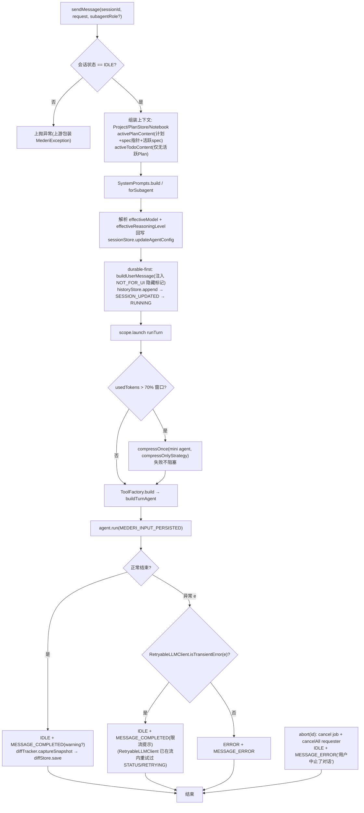
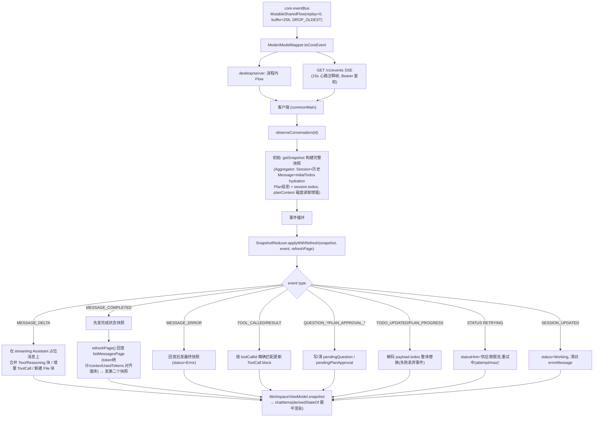
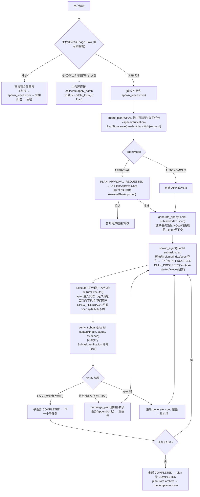
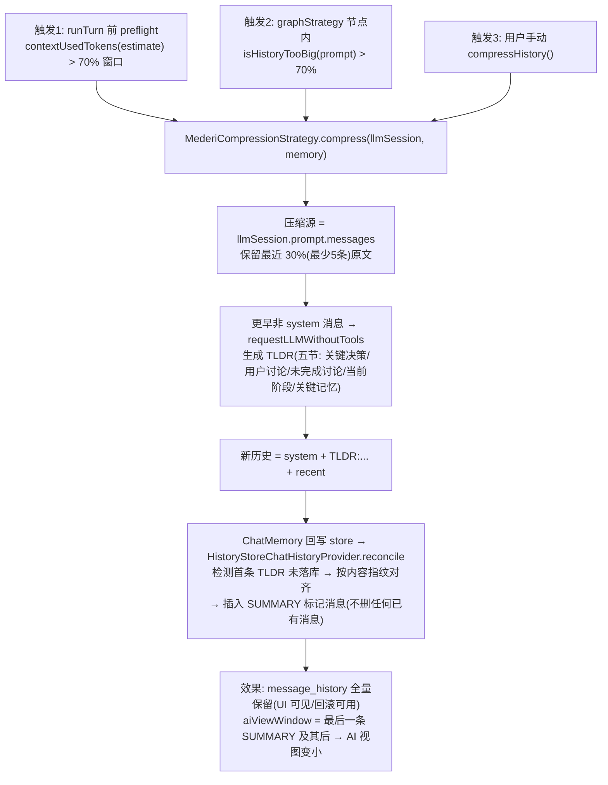
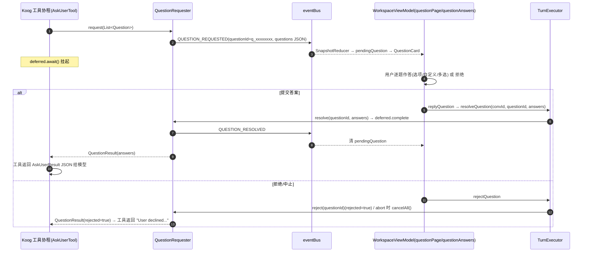
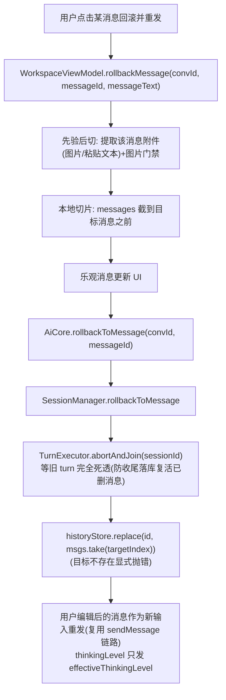
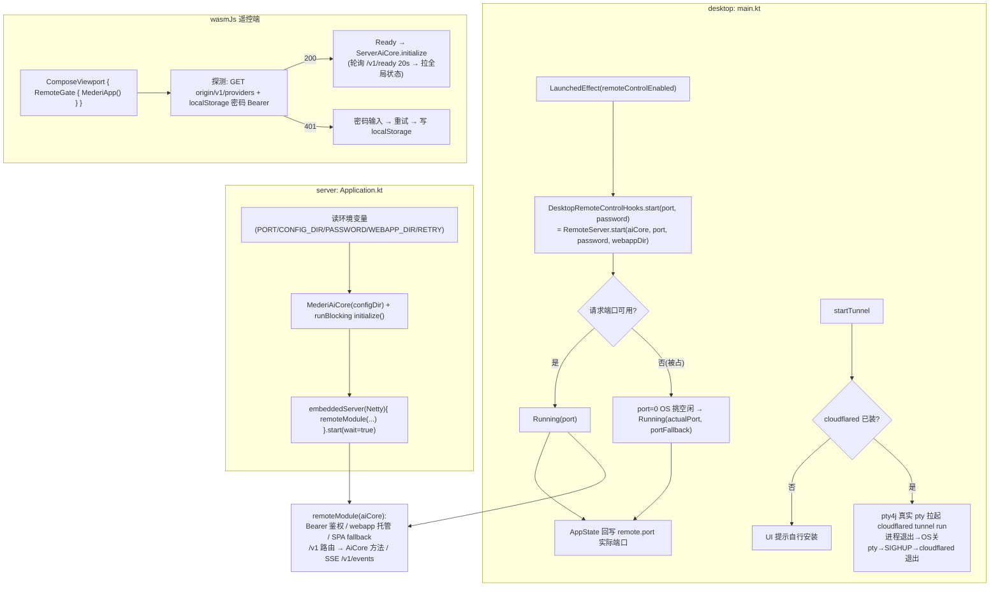
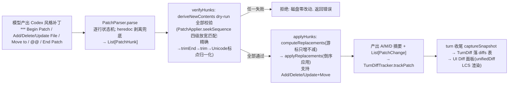
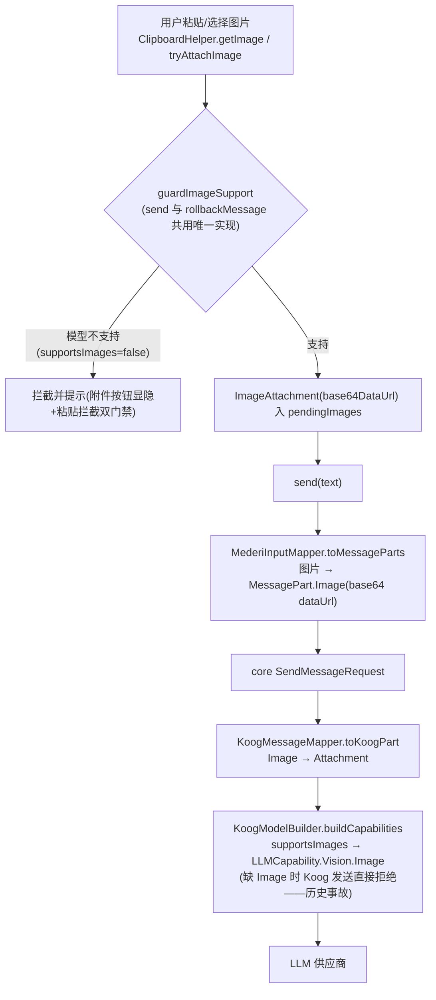
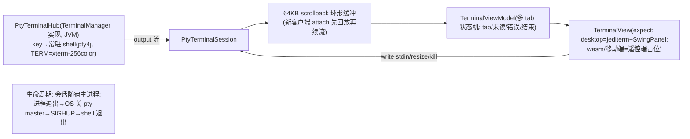

# 04 · 核心流程图与时序图

> 本篇描述运行时行为。类与文件的位置见 01-core.md / 02-app-shared.md。

## 1. 发送消息全链路（sendMessage 端到端时序图）

```mermaid
sequenceDiagram
    autonumber
    participant UI as WorkspaceViewModel<br/>(app/shared commonMain)
    participant AC as AiCore<br/>(MederiAiCore 直调 / ServerAiCore REST)
    participant SM as SessionManagerImpl
    participant TE as TurnExecutor
    participant HS as HistoryStore (data.db)
    participant K as Koog AIAgent (turn 内)
    participant LLM as LLM 供应商
    participant EB as eventBus (SharedFlow)

    UI->>UI: guardImageSupport 图片门禁<br/>PromptComposer.compose(主指令+粘贴文本)<br/>乐观消息入 pendingUserMessages
    UI->>AC: sendMessage(conversationId, ChatPromptInput{text, model, agent, thinkingLevel=effectiveThinkingLevel})
    AC->>AC: MederiInputMapper.toMessageParts / toAgentConfig
    AC->>SM: SessionManager.sendMessage(id, SendMessageRequest)
    SM->>TE: TurnExecutor.sendMessage(sessionId, request)
    TE->>TE: 校验 IDLE → 读 Project → PlanStore.loadBySession<br/>组装 activePlanContent/spec指针/activeTodoContent(互斥)
    TE->>TE: SystemPrompts.build(agentMode, workType, activePlan, activeTodo)
    TE->>TE: effectiveModel/effectiveReasoningLevel → sessionStore.updateAgentConfig
    TE->>HS: append(用户消息+durable环境块) 【durable-first】
    TE->>EB: SESSION_UPDATED
    TE->>TE: sessionStore.updateStatus(RUNNING)
    TE->>TE: scope.launch { runTurn() }
    AC-->>UI: (立即返回)

    rect rgb(235, 244, 255)
        note over TE,LLM: runTurn（后台协程）
        TE->>TE: preflightCompressionIfNeeded<br/>(contextUsedTokens > 70% 窗口 → compressOnce)
        TE->>TE: ToolFactory.build(工具集, agentMode/role裁剪)
        TE->>TE: buildTurnAgent: KoogClientFactory(+RetryableLLMClient)<br/>+ KoogModelBuilder + KoogParamsBuilder<br/>+ ChatMemory(HistoryStoreChatHistoryProvider)<br/>+ graphStrategy(+Compression) + EventHandler
        K->>HS: load → aiViewWindow(最后 SUMMARY 之后) → KoogMessageMapper
        K->>LLM: requestLLMStreaming(系统提示+AI视图窗口+哨兵输入)
        loop 流式帧
            LLM-->>K: StreamFrame (text/reasoning/tool_call/tool result/end)
            K-->>EB: MESSAGE_DELTA (launchStreamConsumer)
            EB-->>UI: SSE 或进程内 → SnapshotReducer 更新快照
        end
        loop 工具循环 (maxAgentIterations=50)
            K->>K: toAssistantMessageSafe(args 坏 JSON 降级 "{}")
            K->>HS: TurnIncrementalPersister.persistAssistant（增量落库防崩丢）
            K->>K: nodeExecuteTools: 执行工具<br/>(文件写白名单/沙盒命令/Plan/Verify/ask_user...)
            K-->>EB: TOOL_CALLED / TOOL_RESULT 事件
            alt ask_user / create_plan(APPROVAL)
                K-->>EB: QUESTION_REQUESTED / PLAN_APPROVAL_REQUESTED (工具协程挂起)
                UI-->>AC: resolveQuestion / resolvePlanApproval
                AC->>TE: resolveQuestion/resolvePlanApproval → deferred.complete
                K->>HS: persistToolResults
            end
            K->>LLM: send_tool_results → requestLLMStreaming
        end
        K->>HS: ChatMemory store → HistoryStoreChatHistoryProvider.reconcile<br/>(指纹对齐/插 SUMMARY/补诊断; 失败退回 replace)
        TE->>HS: (压缩触发时) 插入 SUMMARY 标记消息
        TE->>EB: MESSAGE_COMPLETED (可选 warning)
        TE->>TE: diffTracker.captureSnapshot → diffStore.save(TurnDiff)
        TE->>TE: sessionStore.updateStatus(IDLE)
    end
    UI->>UI: SnapshotReducer.applyWithRefresh + refreshPage 回查落库对齐
```

## 2. Turn 执行流程图（含错误分类）



**事件流消费侧**：`eventBus` → 三路消费：① `MederiAiCore.events()`（进程内）/ `GET /v1/events`（SSE 遥控端）→ 客户端 `SnapshotReducer` 聚合快照；② `launchStreamConsumer` 把 StreamFrame 转 MESSAGE_DELTA；③ UI 层特性（SessionTitleService 等）订阅。

## 3. 事件 → UI 快照聚合流程



## 4. Plan Loop（复杂改动主流程）



**Plan 审批时序（APPROVAL 模式）**：

```mermaid
sequenceDiagram
    autonumber
    participant M as 主代理(工具协程)
    participant PAR as PlanApprovalRequester
    participant EB as eventBus
    participant UI as WorkspaceViewModel(SnapshotReducer)
    participant TE as TurnExecutor
    participant PS as PlanStore(.mederi/plans/)

    M->>PS: PlanStore.save(plan)
    M->>PAR: request(planId, planPath, title, summary, planContent, subtaskCount)
    PAR->>PAR: 取消当前 pending(superseded)
    PAR->>EB: PLAN_APPROVAL_REQUESTED(payload 含 planContent)
    EB-->>UI: SnapshotReducer → pendingPlanApproval + planApprovals
    Note over M: CompletableDeferred.await() 挂起<br/>(turn 保持 RUNNING)
    UI->>TE: resolvePlanApproval(convId, planId, approved)
    TE->>PAR: resolve(planId, approved) → deferred.complete
    PAR->>EB: PLAN_APPROVAL_RESOLVED
    EB-->>UI: 清 pendingPlanApproval, 对应项 status=APPROVED/REJECTED
    PAR-->>M: PlanApprovalResult(approved, superseded=false)
    alt approved=true
        M->>M: notebook.append → 继续生成 spec/spawn
    else approved=false
        M->>M: 向用户说明, 不执行计划
    end
```

## 5. 上下文压缩流程（自动 + 手动）



## 6. ask_user 问询时序



## 7. 子代理（spawn_agent / spawn_researcher）时序

```mermaid
sequenceDiagram
    autonumber
    participant M as 主代理工具协程(SpawnAgentTool)
    participant PS as PlanStore
    participant SR as SubagentRunnerImpl
    participant ITE as 独立 TurnExecutor<br/>(InMemory store + 独立 eventBus)
    participant EB as 主 eventBus

    M->>PS: load(planId) 硬校验 planId/subtaskIndex/spec 非空
    alt 校验失败
        M-->>M: 返回拒绝文本(spec 不存在即拒)
    end
    M->>PS: subtask 置 IN_PROGRESS
    M->>EB: PLAN_PROGRESS('subtask-started' + todos 投影)
    M->>SR: run(task, briefing(含 planDetail), plan=st.spec, role=EXECUTOR, ...)
    SR->>SR: 内存建临时 Session(sub_xxxxxxxx, AUTONOMOUS)
    SR->>ITE: sendMessage(inputText=spec清单自顶向下+SPEC_FEEDBACK约定, subagentRole=EXECUTOR)
    Note over ITE: RESEARCHER 则 inputText=只读调研任务<br/>工具裁剪=read_file+list_directory
    loop 子 turn 内
        ITE->>ITE: 正常 TurnExecutor 流程(事件走独立 eventBus)
    end
    SR->>SR: 等 MESSAGE_COMPLETED/MESSAGE_ERROR 终态事件
    SR->>SR: 取最后一条 ASSISTANT 消息文本
    SR-->>M: 返回报告字符串(异常转 "[subagent error] ...")
    M->>EB: (主代理继续) verify_subtask / converge_plan / 下一个 spawn
    Note over ITE: 子代理一次任务即死; 无会话残留
```

## 8. 回滚（rollbackMessage）流程



## 9. 会话自动改名（SessionTitleService）

```mermaid
sequenceDiagram
    autonumber
    participant TE as TurnExecutor(durable-first 落库)
    participant EB as eventBus
    participant ST as SessionTitleService(jvmMain, 挂 MederiAiCore.initialize)
    participant MC as ModelCatalog(models.dev 价格目录)
    participant OC as OneShotCompletion(复用用户供应商 Koog 链路, 不发推理参数)
    participant SM as SessionManager.rename

    TE->>EB: SESSION_UPDATED(用户消息已落库)
    EB-->>ST: 事件
    ST->>ST: 首次处理该会话?<br/>标题=="New Session" 且恰好一条 user 消息?
    alt 条件满足
        ST->>ST: 选模型(当前供应商优先→其他已连接; 全量模型不过滤 isEnabled)<br/>① 免费(input==0&&output==0)<br/>② 小模型(flash/lite, 排除 mini)
        Note over ST: 有候选 → 逐个请求, 报错换下一个
        ST->>MC: getFor(providerKey, baseUrl, modelId) 查免费/价格
        ST->>OC: execute(provider, model, key): 候选之一
        OC-->>ST: ≤40 字标题
        alt 全部候选失败
            ST->>OC: execute(用户发信息用的模型): 兜底
            alt 兜底也失败
                ST->>ST: session_yyyy-MM-ddTHH:mm:ss
            end
        end
        ST->>SM: rename(id, title)
    end
    Note over ST: 全程静默不重试; 每会话只处理一次
```

## 10. 遥控链路启动（desktop 内嵌 / 独立 server / wasm 密码门）



## 11. 初始化时序（desktop 冷启动全链）

```mermaid
sequenceDiagram
    autonumber
    participant M as main.kt(desktop)
    participant APP as MederiApp/App/MainScreen
    participant ST as AppState
    participant MAC as MederiAiCore
    participant MED as Mederi.create()
    participant SVC as 子服务

    M->>M: PtyTerminalHub() → terminalManager
    M->>APP: setContent { App() }
    APP->>ST: 创建 AppState(AiCoreProvider.default(), preferences)
    APP->>MAC: initialize()
    MAC->>MED: Mederi.local(configDir)
    MED->>MED: MederiPaths.ensureDirectories + handleLegacyFiles(旧文件须批准)
    MED->>MED: 双库 driver + Schema.create + 7 Store 装配
    MED->>MED: Manager 层 + API 层装配
    MAC->>MAC: cleanupLegacyBuiltinProviders / cleanupStaleRunningSessions / syncBuiltinProviders
    MAC->>MAC: refreshGlobalState(4 个 StateFlow) → isReady=true
    MAC->>SVC: modelCatalog.start()(models.dev 每小时刷新)
    MAC->>SVC: autoRefreshBuiltinGoogleModels(后台)
    MAC->>SVC: autotitleService.start()(自动改名)
    APP->>ST: hydrate()(恢复偏好, 列表就绪后 3s 内回填选中态)
    APP->>APP: MainScreen 组合 Sidebar+Workspace; WorkspaceViewModel.attach(选中会话)
    M->>M: 观察 remoteControlEnabled → 自动启停内嵌 RemoteServer
```

## 12. apply_patch 工具三阶段



## 13. 图片发送链路（能力门禁）



## 14. 终端（Terminal）数据流



## 15. 状态机汇总

**Session 状态机**：`IDLE → (sendMessage) RUNNING → (正常) IDLE`；`RUNNING → (可重试错误) IDLE(限流提示)`；`RUNNING → (致命错误) ERROR → (下次 sendMessage 前校验失败)`；`RUNNING → (abort) IDLE`。

**Message 状态机**：`PROCESSING(streaming 占位) → COMPLETED / ERROR`；快照里 isStreaming 对应 PROCESSING。

**Plan 状态机**：`PENDING_APPROVAL → (批准) APPROVED → (spawn 首子任务) IN_PROGRESS → (全子任务 COMPLETED) COMPLETED → archive(plans-done/)`；`PENDING_APPROVAL → (拒绝) 停留/用户重试`。

**Subtask 状态机**：`PENDING → (spawn) IN_PROGRESS → (verify PASS) COMPLETED`；`IN_PROGRESS → (verify FAIL/PARTIAL) FAILED → (converge_plan 追加补救 或 regenerate spec) 重执行`。

**ToolCallState（契约层）**：`Pending → Running → Completed / Failed`。

**RemoteServerUiState**：`Idle → Starting → Running(port, portFallback?) / Failed`；**TunnelUiState**：`Idle → Starting → Running(url) / Failed(notInstalled)`。
